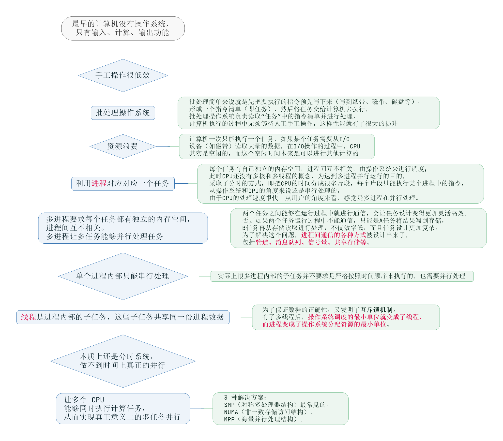

架构设计的主要目的是为了解决软件系统复杂度带来的问题！

复杂度的六个来源

# 高性能

软件系统中高性能带来的复杂度主要体现在两方面：**单台计算机内部、以及多台计算机集群为了高性能带来的复杂度**。

## 性能指标

以下图片来自极客时间[《性能测试实战 30 讲》](https://time.geekbang.org/column/intro/264)，单独的性能指标部分[卖桃者说-170 期](https://time.geekbang.org/column/article/182772)

**QPS**(Queries Per Second，每秒查询数)：每秒能够响应的查询次数。

QPS是对一个特定的查询服务器在规定时间内所处理流量多少的衡量标准，在因特网上，作为域名系统服务器的机器的性能经常用每秒查询率来衡量。每秒的响应请求数，也即是最大吞吐能力。

------

**TPS**(Transactions Per Second)：每秒处理的事务数目。

一个事务是指一个客户机向服务器发送请求然后服务器做出反应的过程。客户机在发送请求时开始计时，收到服务器响应后结束计时，以此来计算使用的时间和完成的事务个数，最终利用这些信息作出的评估分。

TPS 的过程包括：客户端请求服务端、服务端内部处理、服务端返回客户端。

例如，访问一个 Index 页面会请求服务器 3 次，包括一次 html，一次 css，一次 js，那么访问这一个页面就会产生一个“T”，产生三个“Q”。

------

**PV**(page view，页面浏览量)

通常是衡量一个网络新闻频道或网站甚至一条网络新闻的主要指标。户每一次对网站中的每个页面访问均被记录 1 次。用户对同一页面的多次刷新，访问量累计。

与 PV 相关的还有 **RV**，即重复访问者数量（repeat visitors）。

------

**UV** (Unique Visitor，独立访客访问数)

统计1天内访问某站点的用户数(以 cookie 为依据)，一台电脑终端为一个访客。

------

**IP**(Internet Protocol)独立 IP 数，是指 1 天内多少个独立的 IP 浏览了页面，即统计不同的 IP 浏览用户数量。同一 IP 不管访问了几个页面，独立 IP 数均为 1；不同的 IP 浏览页面，计数会加 1。IP 是基于用户广域网 IP 地址来区分不同的访问者的，所以，多个用户（多个局域网 IP）在同一个路由器（同一个广域网 IP）内上网，可能被记录为一个独立 IP 访问者。如果用户不断更换 IP，则有可能被多次统计。

------

**GMV**(Gross Merchandise Volume)

只要是订单，不管消费者是否付款、卖家是否发货、是否退货，都可放进 GMV 。

------

**RPS**(Requests Per Second) 代表吞吐率。

吞吐率是服务器并发处理能力的量化描述，单位是 reqs/s，指的是某个并发用户数下单位时间内处理的请求数。
某个并发用户数下单位时间内能处理的最大的请求数，称之为最大吞吐率。

## 单机复杂度

计算机内部复杂度最关键的地方就是操作系统。操作系统中与性能最相关的就是**进程**和**线程**。

 

在做架构设计的时候，需要花费很大的精力来结合业务进行分析、判断、选择、组合，这个过程同样很复杂。举一个最简单的例子：Nginx 可以用多进程也可以用多线程，JBoss 采用的是多线程；Redis 采用的是单进程，Memcache 采用的是多线程，这些系统都实现了高性能，但内部实现差异却很大。

## 集群复杂度

单机的性能无论如何是无法支撑的，必须采用机器集群的方式来达到高性能。例如，支付宝和微信这种规模的业务系统，后台系统的机器数量都是万台级别的。

任务分配：指每台机器都可以处理完整的业务任务，不同的任务分配到不同的机器上执行。

- 例如：一台服务器变为两台，架构上就会复杂一些，主要体现在：
  - 需要增加一个任务分配器。可能是硬件网络设备(如 F5、交换机等)，可能是软件网络设备(如 LVS)，也可能是负载均衡软件(如 Nginx、HAProxy)，还可能是自己开发的系统
  - 任务分配器和真正的业务服务器之间有连接和交互，需要选择合适的连接方式，并且对连接进行管理。例如，连接建立、连接检测、连接中断后如何处理等
  - 任务分配器需要增加分配算法(如轮询、按权重分配、按照负载分配)。如果按照负载进行分配，则业务服务器还要能够上报自己的状态给任务分配器
- 如果继续提高性能，不仅要增加服务器，任务分配器也需要增加，此时架构又更复杂了，主要体现在：
  - 需要将不同的用户分配到不同的任务分配器上，常见的方法包括 DNS 轮询、智能 DNS、CDN(Content Delivery Network，内容分发网络)、GSLB 设备(Global Server Load Balance，全局负载均衡)等
  - 任务分配器和业务服务器的连接从简单的“1 对多”变成了“多对多的网状结构
  - 机器(含任务分配器)数量多了以后，状态管理、故障处理复杂度也大大增加

通过任务分配的方式，能够突破单台机器处理性能的瓶颈，通过增加更多的机器来满足业务的性能需求，但如果业务本身也越来越复杂，单纯只通过任务分配的方式来扩展性能，收益会越来越低。为了能够继续提升性能，需要采取第二种方式：任务分解。

- 任务分解，如微信后台架构从逻辑上将各个子业务进行了拆分，包括：接入、注册登录、消息、LBS、摇一摇、漂流瓶、其他业务(聊天、视频、朋友圈等)
  - 从业务的角度来看，任务分解既不会减少功能，也不会减少代码量(代码量可能还会增加，因为从代码内部调用改为通过服务器之间的接口调用)
  - 为何通过任务分解就能够提升性能呢？
    - 系统的功能越简单，影响性能的点就越少，就更加容易进行有针对性的优化
    - 可以针对单个任务进行扩展

注意，并不是划分的越细越好，如果系统拆分的太细，为了完成某个业务，系统间的调用次数会呈指数级别上升，而系统间的调用通道目前都是通过网络传输得方式，性能远比系统内的函数调用低得多。

## 常见方案

- 浏览器端：可通过浏览器缓存、使用页面压缩、合理布局页面、减少 Cookie 传输等手段改善性能；
- 使用 CDN 让不同地区用户通过最短访问路径获取数据、在网站机房部署反向代理服务器缓存热点文件，加快请求响应速度，减轻应用服务器负载压力；
- 应用服务器端：使用服务器本地缓存和分布式缓存，加快请求处理过程，减轻数据库负载压力；
- 通过异步操作将用户请求发送至消息队列等待后续任务处理，而当前请求直接返回响应给用户；
- 高并发请求下，可通过应用服务器集群来提高整体处理额能力，改善性能；
- 代码层面：通过使用多线程、改善内存管理等手段优化性能
- 数据库服务器端：索引、缓存、SQL 优化等性能优化手段；NoSQL 数据库通过优化数据模型、存储结构、伸缩特性也可优化性能。

# 高可用

高可用：系统**无中断**地执行其功能的能力，代表系统的可用性程度。

系统得高可用方案很多，但本质上都是通过”**冗余**“实现。从形式上看和高性能一样是通过增加更多机器来达到目的，但本质有根本区别：高性能增加机器的目的在于扩展处理性能；高可用增加机器在于”冗余“处理单元。

- 应用服务器：多台应用服务器通过负载均衡服务器组成一个集群共同对外提供服务，任何一台服务器宕机，只需把请求切换到其他服务器就可实现应用的高可用。
  - 前提：应用服务器上不能保存请求的会话信息！！！否则服务器宕机，会话丢失，即使将用户请求转发到其他服务器也无法完成业务处理。
- 存储服务器：需要对数据进行实时备份，当服务器宕机时需要将数据访问转移到可用的服务器上，并进行数据恢复以保证继续有服务器宕机的时候数据依然可用。

冗余增强了可用性，但也带来了复杂性。

## 计算高可用

”计算“指的是业务的逻辑处理。特点是无论在哪台机器上计算，同样的算法和输入数据，产出结果相同。所以将计算迁移到另一台机器对业务没什么影响。那么计算高可用的复杂度体现在哪里呢？

如一台机器变为两台，和高性能部分得复杂度类似，表现为：

- 增加一个任务分配器
- 任务分配器和真正的业务服务器之间有连接和交互，需要选择合适的连接方式，并且对连接进行管理。例如，连接建立、连接检测、连接中断后如何处理等
- 任务分配器需要增加分配算法，如常见得双机算法有主备、主主，主备方案又可细分为冷备、温备、热备。

如果是高可用集群架构，分配算法更加复杂(1 主 3 备、2 主 2 备、3 主 1 备、4 主 0 备等)，具体需结合实际业务需求来分析。如 ZooKeeper 采用 1 主多备，Memcached 采用全主 0 备。

## 存储高可用

对于需要存储数据的系统而言，整个系统的高可用设计重点在于”存储高可用“。相比于计算，存储与其本质区别在于：**将数据从一台机器到另一台机器，需要经过线路进行传输**。线路传输速度是毫秒级别，同机房内可以是几毫秒，分布在不同地方的机房，传输耗时需要几十甚至上百毫秒。

对于高可用系统来说，耗时较长就意味着整个系统在某个时间点上，数据肯定是不一致的。而”**数据+逻辑=业务**“，数据不一致，即使逻辑一致，最后的业务表现也不一样。

除了物理上的传输速度限制，传输线路也存在可用性问题(可能中断、拥塞、异常-错包、丢包)，且传输线路的故障时间一般都特别长。

所以**存储高可用的难点不在于如何备份数据，而在于如何减少或者规避数据不一致对业务造成的影响**。

## 高可用状态决策

计算和存储高可用的基础都是**状态决策**，即系统需要能判断当前状态是正常还是异常，如果出现异常就采取行动保证高可用。但在实践过程中却存在一个本质的矛盾：**通过冗余实现的高可用系统，状态决策本质上就不可能做到完全正确**。

- 独裁式

存在一个独立的决策主体负责收集信息然后进行决策，而所有冗余的个体都需要将状态信息发送给决策者。

不会出现决策混乱的问题，但当决策者本身故障时，整个系统就无法实现准确的状态决策。

- 协商式

两个独立的个体通过交流规则然后根据规则进行决策，常用的协商式决策就是主备决策。

协商式决策的架构不复杂，规则也不复杂，其难点在于如果两者的信息交换出现问题(如主备连接中断)，此时的状态决策怎么做？

如果备机在连接中断时认为主机故障，则备机需要升级为主机，但实际上主机并未故障，那么系统就出现两个主机了，这与设计初衷(1 主 1 备)不符。

如果备机在连接中断时不认为主机故障，而此时主机真的故障了，那么系统就没有主机了，也与设计初衷不符。

如果为了规避连接中断对状态决策带来的影响，可以增加更多连接。虽然可以降低连接中断对状态带来的影响，但同时又引入了这几条连接间信息取舍的问题，如果不同连接传递的信息不同，以哪个链接为准？

所以协商式状态决策在某些场景总是存在问题的。

- 民主式

多个独立的个体通过投票方式进行状态决策，如 ZooKeeper 集群在选举 leader 时就是这种方式。

与协商式类似，民主式的基础也是独立的个体交换信息，每个个体做出自己的决策，然后按多数取胜的规则决定最终状态。

民主式的固有缺陷：脑裂。原本统一的集群因连接中断造成两个独立分隔的子集群，每个子集群单独进行选举，于是选举出两个主机，相当于人体有两个大脑了。

为解决脑裂问题，民主式决策的系统一般采用”投票节点数必须超过系统总节点数一半“规则来处理。虽然解决了脑裂问题，但同时降低了系统整体的可用性。系统如果不是因脑裂问题导致投票节点数过少，而真的是由于节点故障，此时系统也不会选出主节点，整个系统相当于宕机了。

# 可扩展性

可扩展性：系统为应对将来需求变化而提供的一种扩展能力，当有新的需求出现时，系统不需要或者仅需要少量修改就可以支持，无须整个系统重构或者重建。

- 网站可伸缩架构的主要手段是事件驱动架构和分布式服务：
  - 事件驱动架构：网站通常利用消息队列实现。将用户请求和其他业务事件构造成消息发布到消息队列，消息的消费者从消息队列中获取消息进行处理。
    - 通过这种方式将消息产生和处理分离，可透明地增加新的消息生产者任务或新的消息消费者任务。
  - 分布式服务：将业务和可复用服务分离，通过分布式服务框架调用。
    - 新增产品可通过调用可复用的服务实现自身的业务逻辑，而对现有产品无任何影响；可复用服务升级变更时，也可通过提供多版本服务对应用实现透明处理，不需要强制应用同步变更。

设计具备良好可扩展性的系统，有两个基本条件：**正确预测变化**、**完美封装变化**。

- 正确预测变化：软件系统在发布后还可以不断地修改和演进，这就意味着不断有新的需求需要实现。其复杂性在于
  - 不能每个设计点都考虑可扩展性。
  - 不能完全不考虑可扩展性。
  - 所有的预测都存在出错的可能性。
- 应对变化
  - 方案一：将“变化”封装在一个“变化层”，将不变的部分封装在一个独立的“稳定层”。
    - 依赖关系：
      - 变化层(XML、JSON、ProtocolBuffer) --> 稳定层(业务实现层)
      - 稳定层(业务实现层) --> 变化层(MySQL、Oracle、DB2 等存储)
  - 方案二：提炼出一个“抽象层”和一个“实现层”
    - 抽象层是稳定的，实现层可以根据具体业务需要定制开发，当加入新的功能时，只需要增加新的实现，无须修改抽象层。
    - 典型的实践就是设计模式和规则引擎

# 伸缩性

- 伸缩性：通过不断向集群中加入服务器的手段来缓解不断上升的用户并发访问压力和不断增长的数据存储需求
  - 衡量标准：是否可以用多台服务器构建集群，是否容易向集群中添加新的服务器；加入新的服务器后是否可以提供和原来的服务器无差别的服务；集群中可容纳的总的服务器数量是否有限制。
  - 应用服务器集群：只要服务器上不保存数据，所有服务器都是对等的，通过使用合适的负载均衡设备就可以向集群中不断加入服务器；
  - 缓存服务器集群：加入新的服务器可能会导致缓存路由失效，进而导致集群中大部分缓存数据都无法访问，虽然缓存的数据可通过数据库重新加载，但如果应用已经严重依赖缓存，可能会导致整个网站崩溃，需要改进缓存路由算法保证缓存数据可访问性；
  - 关系型数据库很难做到大规模集群的可伸缩性，其集群伸缩性方案必须在数据库之外实现，通过路由分区等手段讲部署有多个数据库的服务器组成一个集群；
  - 大部分 NoSQL 数据库产品对伸缩性支持都很好，可做到在较少运维参与的情况下实现集群规模的线性伸缩。

# 低成本、安全、规模

低成本给架构设计带来的主要复杂度体现在，往往只有“创新”才能达到低成本目标。这里的“创新”既包括开创一个全新的技术领域，也包括引入新技术。

安全性的衡量标准：针对现存和潜在的各种攻击与窃密手段，是否有可靠的应用策略

规模带来复杂度的主要原因就是“量变引起质变”，当数量超过一定的阈值后，复杂度会发生质的变化。
