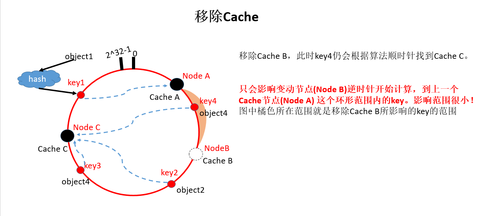
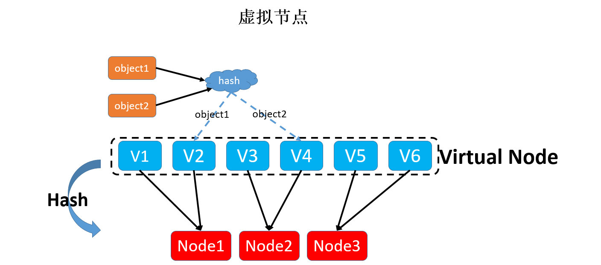

随着并发的增加，存储数据量的增多，数据库的磁盘 IO 逐渐成了系统的瓶颈，需要一种访问更快的组件来降低请求响应时间，提升整体系统性能，可以使用缓存。

# 缓存

缓存，是一种存储数据的组件，其作用是让对数据的请求更快地返回。实际上，凡是位于速度相差较大的两种硬件之间，用于协调两者数据传输速度差异的结构，均可称之为缓存。

内存是一种最常见的缓存数据的介质。

以 HTTP 协议的缓存机制为例：

1. 第一次请求静态资源(如图片)时，服务端返回图片信息，并在响应头中携带了一个 etag 字段；
2. 浏览器缓存图片信息及 etag 字段的值；
3. 第二次请求该图片时，浏览器发起的请求头中携带有 if-none-match 的字段、值为之前保存的 etag 的值，将其发给服务端；
4. 服务端对比图片信息是否有变化，无变化则返回 304 的状态码，浏览器就可以继续使用缓存的图片信息。

缓存的不足：

- 缓存比较适合于读多写少的业务场景，且数据最好带有一定的热点属性
- 缓存会给整体系统带来复杂度，并且会有数据不一致的风险
  - 当更新数据库成功，更新缓存失败的场景下，缓存中就会存在脏数据。可以考虑使用较短的过期时间或者手动清理的方式来解决。
- 缓存通常使用内存作为存储介质，但是内存并不是无限的
- 缓存会给运维也带来一定的成本，运维需要对缓存组件有一定的了解，在排查问题的时候也多了一个组件需要考虑在内。

## 缓存与缓冲区

缓存可以提高低速设备的访问速度，或者减少复杂耗时的计算带来的性能问题。理论上可以通过缓存解决所有关于“慢”的问题，比如从磁盘随机读取数据慢，从数据库查询数据慢，只是不同的场景消耗的存储成本不同。

缓冲区则是一块临时存储数据的区域，这些数据后面会被传输到其他设备上。缓冲区更像消息队列，用以弥补高速设备和低速设备通信时的速度差。如将数据写入磁盘时并不是直接刷盘，而是写到一块缓冲区里面，内核会标识这个缓冲区为脏。当经过一定时间或者脏缓冲区比例到达一定阈值时，由单独的线程把脏块刷新到硬盘上。这样避免了每次写数据都要刷盘带来的性能问题。

## 分类

- 静态缓存
  - 只针对静态数据来缓存
  - 一般通过生成 Velocity 模板或者静态 HTML 文件来实现静态缓存
  - 在 Nginx 上部署静态缓存可以减少对于后台应用服务器的压力

内容管理系统中，后台会录入很多文章，前台在网站展示内容。

如果将文章录入到数据库中，前端展示时查询数据库来获取数据，这会对数据库造成很大压力。可以在每篇文章录入时，将其渲染成静态页面，放置在所有的前端 Web 服务器上，这样用户在访问的时候会优先访问 Web 服务器上的静态页面，在对旧的文章执行一定的清理策略后，依然可以保证 99% 以上的缓存命中率。

- 分布式缓存
  - 针对动态请求做缓存

Memcached、Redis 就是分布式缓存，通过一些分布式的方案组成集群可以突破单机的限制。

- 热点本地缓存
  - 遇到极端的热点数据查询时使用
  - 主要部署在应用服务器的代码中，用于阻挡热点查询对于分布式缓存节点或者数据库的压力
  - 和应用程序部署在同一个进程中，优势是不需要跨网络调度，速度极快

如微博的某位明星新闻，就会引发这个用户信息的热点查询。这些查询通常会命中某一个缓存节点或者某一个数据库分区，短时间内会形成极高的热点查询。

由于本地缓存是部署在应用服务器中，而应用服务器通常会部署多台，当数据更新时，无法确定哪台服务器本地中了缓存，更新或删除所有服务器的缓存不是一个好的选择，所以我们通常会等待缓存过期。因此，这种缓存的有效期很短，通常为分钟或者秒级别，以避免返回前端脏数据。

缓存可以有多层，如**静态缓存处在负载均衡层，分布式缓存处在应用层和数据库层之间，本地缓存处在应用层。我们需要将请求尽量挡在上层，因为越往下层，对于并发的承受能力越差**。

# 读写策略

针对不同的业务场景，缓存的读写策略也是不同的。

## Cache Aside(旁路缓存)策略

场景：用户表有 ID、age 两个字段，缓存中以 ID 为 Key 存储用户的年龄信息。如何将 ID=1 用户的 age 从 19 修改为 20？

思路：先更新数据库中 ID=1 的记录，再更新缓存中 Key=1 的数据

由于变更数据库和变更缓存是两个独立的操作，所以会导致缓存和数据库的数据不一致。类似与多进程中的原子操作，以下表格从上往下、从左往右按时间排序：

| 请求 | 对数据库的操作 | 对缓存的操作    |
| ---- | -------------- | --------------- |
| A    | 更新 age 为 20 | 无              |
| B    | 更新 age 为 21 | 更新缓存值为 21 |
| A    | 无             | 更新缓存值为 20 |

操作完成后数据库中 age=21，但缓存中 age=20。

如何克服以上问题呢？**采用 Cache Aside(旁路缓存) 策略：在更新数据时，不再是更新缓存，而是删除缓存**！该策略以数据库中数据为准，缓存中的数据按需加载。

- 读策略：
  - 从缓存中读取数据
    - 如果命中缓存，直接返回数据；
    - 如果未命中，就从数据库中查询数据，查询到数据后，将数据写入缓存，并返回给用户。
- 写策略：更新数据库中的记录，并删除缓存中的记录。

如果写策略是先删除缓存再更新数据库记录的话，也会导致缓存数据不一致。

| 请求                           | 对数据库的操作      | 对缓存的操作    |
| ------------------------------ | ------------------- | --------------- |
| A (要更新 age 为 21)           | 无                  | 删除            |
| B (要读取用户年龄，缓存未命中) | 读取得到 age=20     | age=20 写入缓存 |
| A (要更新 age 为 21)           | 更新数据库的 age=21 | 无              |

操作完成后数据库中 age=21，缓存中 age=20。

有些场景不适合 Cache Aside 缓存策略。如用户注册时，信息写入数据库后立刻读取用户信息，当数据库主从分离时，由于复制延迟就会出现读取不到用户信息的情况，此时就需要插入新数据到数据库后写入缓存，而不再是删除缓存了。

缺点：当写入很频繁时，缓存中的数据会被频繁地清理，这样会对缓存的命中率有一些影响。有两种解决方案：

- 更新数据时也更新缓存，但在更新缓存前先加一个分布式锁
  - 在同一时间只允许一个线程更新缓存，就不会产生并发问题了。但对写入性能有影响
- 更新数据时也更新缓存，但给缓存加一个较短的过期时间
  - 即使出现缓存不一致的情况，缓存的数据也会很快过期，对业务的影响也是可以接受

## Read/Write Through 策略

Read/Write Through(读穿/写穿)策略的核心原则：用户只与缓存打交道，由缓存和数据库通信，写入或者读取数据。

- Write Through
  - 查询要写入的数据在缓存中是否已经存在
    - 存在，则更新缓存中的数据，并且由缓存组件同步更新到数据库中
    - 不存在，即为 Write Miss(写失效)
      - 方式一：Write Allocate（按写分配），写入缓存相应位置，再由缓存组件同步更新到数据库中
      - 方式二：No-write allocate（不按写分配），不写入缓存中，而是直接更新到数据库中
      - 方式二更常用，比方式一少了一次写缓存操作
- Read Through
  - 查询缓存中数据是否存在
    - 存在则直接返回
    - 不存在，则由缓存组件负责从数据库中同步加载数据

Read/Write Through 策略不常见，因为经常使用的分布式缓存组件，无论是 Memcached 还是 Redis 都不提供写入数据库，或者自动加载数据库中的数据的功能。**在使用本地缓存的时候可以考虑使用这种策略**。

## Write Back 策略

Write Through 中，写数据库是同步的，对应性能影响较大，而 Write Back(写回) 策略则是异步更新数据库的。

核心思想：在写入数据时只写入缓存，并把缓存块儿标记为“脏”的。而脏块儿只有被再次使用时才会将其中的数据写入到后端存储中。

注意：如果遇到 Write Miss，是采用的 Write Allocate 方式。写入后端存储的同时要写入缓存，这样在之后的写请求中都只需要更新缓存即可，而无需更新后端存储了。

读取数据：

- 缓存命中则直接返回缓存数据
- 缓存不命中则寻找一个可用的缓存块儿
  - 如果这个缓存块儿是“脏”的，就把缓存块儿中之前的数据写入到后端存储中，并且从后端存储加载数据到缓存块儿
  - 如果不是脏的，则由缓存组件将后端存储中的数据加载到缓存中，最后我们将缓存设置为不是脏的，返回数据就好了

这一策略无法应用在数据库和缓存场景中！而是计算机体系结构中的设计，如向磁盘中写数据时采用的就是这种策略。

无论是操作系统层面的 Page Cache，还是日志的异步刷盘，亦或是消息队列中消息的异步写入磁盘，大多采用了这种策略。因为这个策略在性能上的优势毋庸置疑，它避免了直接写磁盘造成的随机写问题。

# 分布式缓存的高可用

$缓存命中率 = 命中缓存的请求数 / 总请求数$，一般来说，在电商系统中，核心缓存的命中率需要维持在 99% 甚至是 99.9%，哪怕下降 1%，系统都会遭受毁灭性的打击，非核心缓存的命中率也要尽量保证在 90%，如果低于这个标准可能就需要优化缓存的使用方式了。

假设系统的 QPS 是 10000/s，每次调用会访问 10 次缓存或者数据库中的数据，那么当缓存命中率仅仅减少 1%，数据库每秒就会增加 10000 _ 10 _ 1% = 1000 次请求。而一般来说单个 MySQL 节点的读请求量峰值就在 1500/s 左右，增加的这 1000 次请求很可能会给数据库造成极大的冲击。

## 客户端方案

在客户端配置多个缓存的节点，通过缓存写入和读取算法策略来实现分布式，从而提高缓存的可用性。

- 写入数据时，要把被写入缓存的数据分散到多个节点中，即进行数据分片
- 读数据时，利用多组的缓存来做容错，提升缓存系统的可用性

### 数据分片(一致性 Hash 算法)

常见的分片算法有：Hash 算法、一致性 Hash 算法。

- Hash 分片的算法就是对缓存的 Key 做哈希计算，然后对总的缓存节点个数取余。
  - 缺点：当增加或者减少缓存节点时，缓存总的节点个数变化造成计算出来的节点发生变化，从而造成缓存失效不可用
  - 如果业务对某些缓存命中率下降不敏感(如在下面还有另一层缓存兜底)，可以使用这种算法

一致性 Hash 算法可以很好地解决增加和删减节点时，命中率下降的问题！

一致性哈希算法，最初在论文《Consistent hashing and random trees:distributed caching protocols for relieving hot spots on the World Wide Web》中提出。将整个哈希值设计成一个闭合的环状，并将服务器节点用哈希函数映射在这个环上，当有一个 key 过来了，利用相同的算法也映射在环上。

- 环形 hash 空间：通常 hash 算法是将 value 映射到一个 32 位的 key 中。下面圆环的范围：0 到 2^32-1

当增加或删除节点时，会有部分 key “漂移”到其他节点，而大部分的 Key 命中的节点还是会保持不变，从而保证命中率不会大幅下降：

缺点：

- 缓存节点在圆环上分布不平均，会造成部分缓存节点的压力较大；
  - 当某个节点故障时，这个节点所要承担的所有访问都会被顺移到另一个节点上，会对后面这个节点造成压力
- 一致性 Hash 算法的脏数据问题
  - 客户端向缓存节点 A 写入 k=3 的数据，客户端要将 k 更新为 4，但中途客户端与缓存的连接出现问题，导致 k=4 写入 缓存节点 B 中，后来客户端与缓存的连接恢复，读取缓存时从缓存节点 A 读取到 k=3
  - 在**使用一致性 Hash 算法时一定要设置缓存的过期时间**，这样当发生漂移时，之前存储的脏数据可能已经过期，就可以减少存在脏数据的几率

而为了克服缓存节点分布不均的缺点，可以引入虚拟节点：

虚拟节点的作用：

可以看出，增加了虚拟节点后，key 分布到每个节点相对均匀了很多。

### 主从机制

主从机制：为每一组 Master 配置一组 Slave，

- 更新数据时主从同步更新
- 读取时，优先从 Slave 中读数据
  - 如果读取不到数据就穿透到 Master 读取，并将数据回种到 Slave 中以保持 Slave 数据的热度。

最大的优点就是当某一个 Slave 宕机时，还会有 Master 作为兜底，不会有大量请求穿透到数据库的情况发生，提升了缓存系统的高可用性。Redis 支持主从部署。

## 中间代理层方案

客户端方案只能在单一语言系统中使用，很难服用。

中间代理层方案：在应用代码和缓存节点之间增加代理层，客户端所有的写入和读取的请求都通过代理层，而代理层中会内置高可用策略，帮助提升缓存系统的高可用。

所有缓存的读写请求都是经过代理层完成的。代理层是无状态的，主要负责读写请求的路由功能，并且在其中内置了一些高可用的逻辑。

## 服务端方案

Redis Sentinel 方案可以解决主从 Redis 部署时的高可用问题，主节点挂了以后自动将从节点提升为主节点，保证整体集群的可用性。

Redis Sentinel 不属于代理层模式，因为对于缓存的写入和读取请求不会经过 Sentinel 节点。Sentinel 节点在架构上和主从是平级的，是作为管理者存在的，所以可以认为是在服务端提供的一种高可用方案。

# 缓存穿透

缓存穿透是指从缓存中没有查到数据，而不得不从后端系统（如数据库）中查询的情况。

少量的缓存穿透是不可避免的，但对系统没有损害，而大量的穿透请求超过了后端系统的承受范围会造成后端系统的崩溃。

数据库是一个脆弱的资源，它无论是在扩展性、性能还是承担并发的能力上，相比缓存都处于绝对的劣势，所以解决缓存穿透问题的核心目标在于**减少对于数据库的并发请求**。

- 解决缓存穿透常用的两种方案：回中空值、布隆过滤器。

场景：通过用户 ID 查询用户信息，缓存策略为 Cache Aside 策略。

如果读取一个用户表中未注册的用户，会发生什么情况呢？读缓存 -> 未命中 -> 读数据库 -> 无数据

再次请求这个用户数据时，还是会穿透到数据库，这时，缓存不能有效地阻挡请求穿透到数据库上。

## 回中空值

上面场景中的主要问题在于在于数据库中并不存在用户的数据，这就造成无论查询多少次数据库中永远都不会存在这个用户的数据，穿透永远都会发生。

同样的，由于代码的 bug 导致查询数据库的时候抛出了异常，这样可以认为从数据库查询出来的数据为空，同样不会回种缓存。

所以，当我们从数据库中查询到空值或者发生异常时，可以向缓存中回种一个空值。但是因为空值并不是准确的业务数据，并且会占用缓存的空间，所以会给这个空值加一个比较短的过期时间，让空值在短时间之内能够快速过期淘汰。

回种空值虽然能够阻挡大量穿透的请求，但如果有大量获取未注册用户信息的请求，缓存内就会有有大量的空值缓存，也就会浪费缓存的存储空间，如果缓存空间被占满了，还会剔除掉一些已经被缓存的用户信息反而会造成缓存命中率的下降。

## 布隆过滤器

[布隆过滤器](../../Base/06-DataStructure&Algorithm/14A-Advance.md#布隆过滤器)判断元素不在集合中时，它就一定不在集合中！

以存储用户信息的表为例：

1. 初始化一个很大的数组，假设长度为 20 亿的数组
2. 选择一个 Hash 算法，将现有的所有用户的 ID 计算出 Hash 值并且映射到这个数组中，映射位置的值设置为 1，其它值设置为 0
3. 新注册的用户除了要写入到数据库中之外，还要依照同样的算法更新布隆过滤器的数组中相应位置的值
4. 查询某一个用户的信息时，先查询这个 ID 在布隆过滤器中是否存在，如果不存在就直接返回空值，而不需要继续查询数据库和缓存，这样就可以极大地减少异常查询带来的缓存穿透。

缺陷：存在误判、不支持删除元素。

选择多个 Hash 函数计算多个 Hash 值，这样可以减少误判的几率。

注册用户的场景下，因为用户删除的情况基本不存在，所以还是可以使用布隆过滤器来解决缓存穿透的问题的。

## 狗桩效应

回种空值和布隆过滤器是解决缓存穿透问题的两种最主要的解决方案，但是它们也有各自的适用场景，并不能解决所有问题。

极热点的缓存项一旦失效会有大量请求穿透到数据库，对数据库造成瞬时极大的压力，这个场景叫做“dog-pile effect”（狗桩效应）。

这种缓存穿透如何解决呢？有以下两种方案

1. 在代码中控制在某一个热点缓存项失效之后启动一个后台线程，穿透到数据库，将数据加载到缓存中，在缓存未加载之前，所有访问这个缓存的请求都不再穿透而直接返回。
2. 通过在 Memcached 或者 Redis 中设置分布式锁，只有获取到锁的请求才能够穿透到数据库。

# CDN

通常系统中会存在大量静态资源：

- 对于移动 APP 来说，这些静态资源主要是图片、视频和流媒体信息；
- 对于 Web 网站来说，则包括了 JavaScript 文件、CSS 文件、静态 HTML 文件等等

使用分布式缓存可以对动态请求数据的读取加速，那么该如何对这些静态资源进行读加速呢？

使用分布式缓存无法解决这一问题，图片和视频的大小在几兆到几百兆之间不等，如果应用服务器和分布式缓存部署在北京，而上海的用户要访问缓存中的某个视频，就需要将视频从北京传输到上海，期间会经过多个公网骨干网络，延迟很高，会让用户感觉视频打开很慢，严重影响到用户的使用体验。

静态资源访问的关键点是**就近访问**！在每个地域都自建机房的话，成本太高，而且单个视频和图片等静态资源很大，并且访问量又极高，如果使用业务服务器和分布式缓存来承担这些流量，无论是对于内网还是外网的带宽都会是很大的考验。

**可以在业务服务器的上层增加一层特殊的缓存，用来承担绝大部分对于静态资源的访问，这一层特殊缓存的节点需要遍布在全国各地，这样可以让用户选择最近的节点访问。缓存的命中率也需要一定的保证，尽量减少访问资源存储源站的请求数量（回源请求）。这一层缓存就是 CDN(Content Delivery Network/Content Distribution Network，内容分发网络)。**

CDN 就是将静态的资源分发到位于多个地理位置机房中的服务器上，因此能很好地解决数据就近访问的问题，加快静态资源的访问速度。

## 映射请求

该如何将用户的请求映射到 CDN 节点呢？

思路：告诉用户 CDN 节点的 IP 地址，然后请求这个 IP 地址上面部署的 CDN 服务即可。

通常大部分公司基于成本考虑，会选择专业的 CDN 厂商，CDN 节点的 IP 地址是厂商提供的，如果这个 IP 改变了或更换了 CDN 厂商怎么办？就需要修改所有静态资源的 url 域名了，工作量很大。

所以，我们需要**将第三方厂商提供的 IP 隐藏起来**，给到用户的最好是一个本公司域名的子域名！这又如何做呢？借助 DNS 解决域名映射问题。

域名解析的结果一般有两种：

- “A 记录”：返回域名对应的 IP
- “CNAME 记录”：返回另一个域名，即前域名的解析要跳转到另一个域名的解析上
  - www.baidu.com 域名的解析结果就是一个 CNAME 记录，域名的解析被跳转到 www.a.shifen.com 上

利用 CNAME 记录，就可以解决上面的域名映射问题。

如一级域名为 example.com，可以把图片服务的域名定义为 img.example.com，然后将这个域名的解析结果的 CNAME 配置到 CDN 提供的域名上。

用户请求 "http://img.example.com/1.jpg" 的图片地址，DNS 服务器会将域名解析到 CDN 提供的域名上，然后再将这个域名解析为 CDN 的节点 IP，这样就可以得到 CDN 上面的资源数据了。

域名解析过程是分级的，每一级有专门的域名服务器承担解析的职责，所以域名的解析过程可能会跨越公网做多次 DNS 查询，在性能上比较差。如何解决这个问题呢？

在 APP 启动时对需要解析的域名做预先解析，然后把解析的结果缓存到本地的一个 LRU 缓存里面。

这样当我们要使用这个域名的时候，只需要从缓存中直接拿到所需要的 IP 地址就好了，如果缓存中不存在才会走整个 DNS 查询的过程。同时为了避免 DNS 解析结果的变更造成缓存内数据失效，可以启动一个定时器定期地更新缓存中的数据。

## 找到最近的 CDN 节点

GSLB(Global Server Load Balance，全局负载均衡)的含义是对于部署在不同地域的服务器之间做负载均衡，下面可能管理了很多的本地负载均衡组件。其作用如下：

- 让流量平均分配使得下面管理的服务器的负载更平均；
- 保证流量流经的服务器与流量源头在地缘上是比较接近的。

GSLB 可以通过多种策略来保证返回的 CDN 节点和用户尽量保证在同一地缘区域。

如，将用户的 IP 地址按照地理位置划分为若干个区域，然后将 CDN 节点对应到一个区域上，根据用户所在区域来返回合适的节点；也可以通过发送数据包测量 RTT 的方式来决定返回哪一个节点。

**是否能够从 CDN 节点上获取到资源还取决于 CDN 的同步延时**。

一般而言，我们会通过 CDN 厂商的接口将静态的资源写入到某一个 CDN 节点上，再由 CDN 内部的同步机制将资源分散同步到每个 CDN 节点。而这个同步的过程是有延迟的，一旦无法从选定的 CDN 节点上获取到数据，就不得不从源站获取数据，而用户网络到源站的网络可能会跨越多个主干网，这样不仅性能上有损耗也会消耗源站的带宽，带来更高的研发成本。

所以在使用 CDN 的时候需要关注 CDN 的命中率和源站的带宽情况。
