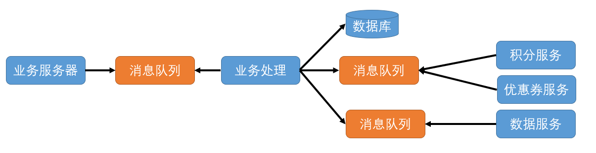

以秒杀场景为例。

秒杀即将开始时，用户会疯狂刷新浏览器来保证自己尽早看到商品，此时面对的是**读请求过高**。

由于用户查询的是少量商品数据，属于查询的热点数据，可以采用缓存策略将请求尽量挡在上层的缓存，能被静态化的数据尽量做到静态化，这样就可以命中 CDN 节点缓存减少 Web 服务器的查询量和带宽负担。如 Nginx 这样的 Web 服务器可以直接访问分布式缓存节点，从而避免请求到达 Tomcat 等业务服务器。还可以加上限流策略，如对短时间内来自某一用户、某一 IP 或设备的重复请求做丢弃处理。 

当这些读请求缓解后，秒杀活动准时开始，用户瞬间向系统请求生成订单、扣减库存，这些写操作都是不经过缓存直达数据库的，可能 1s 内有上万个数据库连接同时到达，系统来不及同步处理用户发送的请求，则会导致请求发生阻塞。如：大量的insert、update等请求同时到达数据库，导致无数的行锁、表锁，甚至会导致请求堆积很多，从而触发 too many connections 错误。

理论上使用分库分表、继续扩展更多数据库来应对更高的写流量可以解决问题，但分库分表和扩展数据库都比较复杂，选哟对数据库中的数据做迁移，这个时间就需要按天甚至按周计算了，秒杀场景下高并发写请求是短时间发生的，如果为了这十几秒的时间来花费几天时间扩容数据库，并在秒杀结束后缩容，这就得不偿失了。

使用消息队列可以应对这一高并发的写流量。

# 消息队列

消息队列是一个暂时存储数据的容器，用于平衡低速系统与高速系统处理任务时间差的工具。

秒杀场景中，使用消息队列后的系统如下：

## 削峰(排队)

- 消息队列会把秒杀请求暂存，同时业务服务器响应用户“秒杀结果计算中”，释放系统资源后再处理其他用户的请求；
- 后台启动若干队列处理程序来消费消息队列中消息，再执行校验库存、下单等逻辑
- 当库存被消耗完之后，消息队列中堆积的请求就可以被丢弃了。
  - 削平短暂的流量高峰，让业务逻辑的处理更加缓和
  - 注意，会导致请求被**短暂**地延迟处理，为了防止延迟的时间太长，需要对队列处理的时间、前端写入流量的大小、数据库处理能力做好评估，然后根据不同的量级来决定部署多少台队列处理程序。

比如秒杀商品有 1000 件，处理一次购买请求的时间是 500ms，那么总共就需要 500s 的时间。这时你部署 10 个队列处理程序，那么秒杀请求的处理时间就是 50s，也就是说用户需要等待 50s 才可以看到秒杀的结果，这是可以接受的。这时会并发 10 个请求到达数据库，并不会对数据库造成很大的压力。

## 异步化处理

整个购买流程中，生成订单、扣减库存是主要的业务流程，而类似下单后返优惠券、增加积分等流程就属于次要的业务逻辑，可以通过消息队列进行异步化处理，简化秒杀请求中的业务流程，提升系统性能。

## 解耦和

假设数据团队需要统计活动数据，以此分析活动商品的购买人群特点等，就需要将大量数据发送给他们，如何做呢？

使用 HTTP 或 RPC 方式同步调用数据团队的接口，实时将数据推送给他，但这样会有两个问题：

- 体系统的耦合性比较强，当数据团队的接口发生故障时，会影响到秒杀系统的可用性
- 当数据系统需要新的字段，就要变更接口的参数，那么秒杀系统也要随着一起变更。

可以考虑使用消息队列来降低业务系统与数据系统的直接耦合度。

每次产生购买数据后，先把全部数据发送给消息队列，然后数据团队订阅这个消息队列的话题，这样他们就可以收到数据，再做过滤和处理了。通过这样解耦后，数据系统的故障就不会影响到秒杀系统了，同时当数据系统需要新的字段时，只需要解析消息队列中的消息，拿到需要的数据就好了。

# 缺点

- 系统可用性降低：系统引入的外部依赖越多，越容易挂掉。MQ 挂掉后，整个系统崩溃
- 系统复杂性提高：怎么保证消息没有重复消费？怎么处理消息丢失的情况？怎么保证消息传递的顺序性？
- 一致性问题：A系统通过MQ来调用B、C、D，A处理完直接返回，用户以为请求成功了，但如果B、C写库成功而D失败了，数据就不一致了。

# 消息投递

随着业务逻辑越来越复杂，会引入更多的外部系统和服务来解决业务上的问题。比如引入 Elasticsearch 来解决商品和店铺搜索的问题，也会引入审核系统对售卖的商品、用户的评论做自动的和人工的审核，同时也会越来越多地使用消息队列与外部系统解耦合以及提升系统性能。

例如增加一个红包功能，用户达到某一条件后给用户发一个现金红包鼓励用户消费。这一功能也属于购物的次要流程，故采用消息队列异步处理。这就存在一个问题：如果消息在投递过程中发生丢失，用户会因没有得到红包而投诉，相反如果消息在投递过程中发生重复，系统会因发了两个红包而损失。

## 消息丢失

消息从被写入到消息队列到被消费者消费完成的整个过程中主要有三个抵挡会发生消息丢失：

- 在消息生产过程中丢失消息

消息生产者一般是业务服务器，消息队列则独立部署在单独的服务器上，两者间的网络虽然是内网，但也存在抖动的可能，一旦发生抖动，消息就会因网络错误而丢失。

针对上述情况，可以采用消息重传。当发现发送超时后就将消息重发一次，但也不能无限制地重传。一般来说，如果不是消息队列发生故障或者是到消息队列的网络断开了，重试 2～3 次就可以了。

不过这种方案可能会造成消息重复，如消息生产时由于消息队列处理慢或网络抖动，导致最终写入消息队列成功，但在生产端超时了，生产者会重传导致消息重复，用户收到两个现金红包。

- 在消息队列中丢失消息

以 Kafka 为例，消息在 Kafka 中是存储在本地磁盘上的，而为了减少消息存储时对磁盘的随机 I/O，一般会将消息先写入到操作系统的 Page Cache 中，然后再找合适的时机刷新到磁盘上。如当达到某一时间间隔或者累积一定的消息数量的时候再刷盘，也就是所说的异步刷盘。

如果发生机器掉电或机器异常重启，Page Cache 中还没来得及刷盘地消息就会丢失。

思路一：把刷盘间隔设置很短，或累积一条消息就刷盘。但频繁刷盘会对性能有较大影响，而且实际出现机器宕机或掉电的几率并不高。

思路二：如果系统对消息丢失的容忍度很低，可以考虑以集群方式部署 Kafka 服务，通过部署多个副本备份数据保证消息尽量不丢失。

- 消费过程中丢失消息

一个消费者消费消息的进度是记录在消息队列集群中的，而消费的过程分为三步：接收消息、处理消息、更新消费进度。

在消费消息时也可能丢失消息，如消息接收时网络发生抖动，导致消息并没有被正确地接收到；处理消息时可能发生一些业务的异常导致处理流程未执行完成，这时如果更新消费进度，这条失败的消息就永远不会被处理了，也可以认为是丢失了。

所以，一定要等到消息接收和处理完成后才更新消费进度，但这也会造成消息重复的问题。如某一条消息在处理之后消费者恰好宕机了，那么因为没有更新消费进度，所以当这个消费者重启之后还会重复地消费这条消息。

## 仅消费一次

为了避免消息丢失需要付出两方面代价：性能损耗、可能发生消息重复消费。

一般业务系统只有在写请求时才会有发送消息队列的操作，而一般系统的写请求的量级并不高，所以性能损耗可以承受，但是消息一旦被重复消费就会造成业务逻辑处理的错误。如何避免消息的重复呢？

完全避免消息重复很难做到，因此通常会放宽要求，只要保证即使消费到了重复的消息，从消费的最终结果来看和只消费一次是等同的即可，也即保证消息的生产和消费的过程是幂等的。

**消息在生产和消费过程中都可能产生重复，所以需要在生产和消费过程中增加消息幂等性的保证。**

无论是生产端的幂等性保证方式还是消费端通用的幂等性保证方式，它们的共同特点都是为每一个消息生成一个唯一的 ID，然后在使用这个消息的时候，先比对这个 ID 是否已经存在，如果存在则认为消息已经被使用过。所以这种方式是一种标准的实现幂等的方式。

- 生产过程中

Kafka0.11 版本和 Pulsar 中都支持“producer idempotency”的特性，保证消息虽然可能在生产端产生重复，但是最终在消息队列存储时只会存储一份。

做法：每个生产者有一个唯一 ID，并为生产的每一条消息赋予一个唯一 ID，消息队列的服务端会存储 `<生产者ID, 最后一条消息 ID>` 的映射。当某一个生产者产生新的消息时，消息队列服务端会比对消息 ID 是否与存储的最后一条 ID 一致，如果一致就认为是重复的消息，服务端会自动丢弃。

- 消费过程中

可以从通用层和业务层两方面考虑。

**通用层**，在消息被生产的时候使用发好奇给它生成一个全局唯一的消息 ID，消息被处理后把这个 ID 存储在数据库，在处理下一条消息之前先从数据库里面查询这个全局 ID 是否被消费过，如果被消费过就放弃消费。

为了防止“消息被处理后，但在写入数据库之前消费者宕机，重启后由于数据库中没有记录还是会重复消费”，需要引入事务机制，保证保证消息处理和写入数据库必须同时成功或者同时失败，但是这样消息处理的成本就更高了，所以如果对于消息重复没有特别严格的要求，可以直接使用这种通用的方案，而不考虑引入事务。

**业务层**，可以通过增加乐观锁的方式。

给每个人的账号数据中增加一个版本号的字段，在生产消息时先查询这个账户的版本号，并且将版本号连同消息一起发送给消息队列。消费端在拿到消息和版本号后，在执行更新账户金额 SQL 的时候带上版本号

# 消息延迟

假设在用户完成支付后，向消息队列中发送一条消息，消费者消费消息后会增加用户积分或发送优惠券。用户在下单后短期内拿到积分和优惠券可以接受，但是一旦消息队列出现大量堆积，用户消费完成后几小时还没拿到积分和优惠券，用户就会投诉了。

所以消息队列中消息的延迟需要特别关注。这其实是消费性能的问题，那么该如何提成消费性能保证更短的消息延迟呢？

## 监控消息延迟

有了监控数据之后才能知道目前的延迟数据是否满足要求，也可以评估优化之后的效果。有以下两种方式监控消息的延迟：

- 使用消息队列提供的工具，通过监控消息的堆积完成
  - Kafka 提供的 kafka-consumer-groups.s”（Kafka 安装包的 bin 目录下）
  - Kafka 通过 JMX 了消息堆积的数据
- 通过生成监控消息的方式来监控消息的延迟情况
  - 定义一种特殊消息，然后启动一个监控程序将这个消息定时循环写入消息队列
  - 消息的内容可以是生成消息的时间戳并且也会作为队列的消费者消费数据
  - 业务处理程序消费到这个消息时直接丢弃掉，而监控程序在消费到这个消息时就可以和这个消息的生成时间做比较，如果时间差达到某一个阈值就可以向我们报警。

## 减少消息延迟

在消费端和消息队列两个层面来减少消息的处理延迟。

- 在消费端的目标是提升消费者的消息处理能力
  - 优化消费代码提升性能；
  - 增加消费者的数量
- 在消息队列本身的读取性能优化，主要从两方面考虑读取性能问题：
  - 消息存储
  - 零拷贝技术

在读取消息队列的数据的时候，其实是把磁盘中的数据通过网络发送给消费客户端，在实现上会有四次数据拷贝的步骤：

1. 数据从磁盘拷贝到内核缓冲区；
2. 系统调用将内核缓存区的数据拷贝到用户缓冲区；
3. 用户缓冲区的数据被写入到 Socket 缓冲区中；
4. 操作系统再将 Socket 缓冲区的数据拷贝到网卡的缓冲区中。

操作系统提供了 Sendfile 函数可以减少数据被拷贝的次数。使用了 Sendfile 之后，在内核缓冲区的数据不会被拷贝到用户缓冲区而是直接被拷贝到 Socket 缓冲区，节省了一次拷贝的过程提升了消息发送的性能。