项目架构简单说明！参照：[慕课网Geely讲师的手记](https://www.imooc.com/article/17545)、《大型网站技术架构：核心原理与案例分析》。

大型网站核心架构要素：性能、可用性、伸缩性、扩展性、安全性
- 性能
  - 衡量性能的指标：响应时间、TPS、系统性能计数器等。
  - 浏览器端：可通过浏览器缓存、使用页面压缩、合理布局页面、减少Cookie传输等手段改善性能；
  - 使用CDN让不同地区用户通过最短访问路径获取数据、在网站机房部署反向代理服务器缓存热点文件，加快请求响应速度，减轻应用服务器负载压力；
  - 应用服务器端：使用服务器本地缓存和分布式缓存，加快请求处理过程，减轻数据库负载压力；
  - 通过异步操作讲用户请求发送至消息队列等待后续任务处理，而当前请求直接返回响应给用户；
  - 高并发请求下，可通过应用服务器集群来提高整体处理额能力，改善性能；
  - 代码层面：通过使用多线程、改善内存管理等手段优化性能
  - 数据库服务器端：索引、缓存、SQL 优化等性能优化手段；NoSQL数据库通过优化数据模型、存储结构、伸缩特性也可优化性能。

---

- 可用性：当系统中服务一台或多台器宕机、出现不可预期的问题时，服务或应用依然可用
  - 主要手段是冗余：应用部署在多台服务器上同时提供访问，数据存储在多台服务器上互相备份，任何一台服务器宕机都不会影响应用的整体可用，也不会导致数据丢失。
    - 应用服务器：多台应用服务器通过负载均衡服务器组成一个集群共同对外提供服务，任何一台服务器宕机，只需把请求切换到其他服务器就可实现应用的高可用。
      - 前提：应用服务器上不能保存请求的会话信息！！！否则服务器宕机，会话丢失，即使将用户请求转发到其他服务器也无法完成业务处理。
    - 存储服务器：需要对数据进行实时备份，当服务器宕机时需要将数据访问转移到可用的服务器上，并进行数据恢复以保证继续有服务器宕机的时候数据依然可用。

---

- 伸缩性：通过不断向集群中加入服务器的手段来缓解不断上升的用户并发访问压力和不断增长的数据存储需求
  - 衡量标准：是否可以用多台服务器构建集群，是否容易向集群中添加新的服务器；加入新的服务器后是否可以提供和原来的服务器无差别的服务；集群中可容纳的总的服务器数量是否有限制。
  - 应用服务器集群：只要服务器上不保存数据，所有服务器都是对等的，通过使用合适的负载均衡设备就可以向集群中不断加入服务器；
  - 缓存服务器集群：加入新的服务器可能会导致缓存路由失效，进而导致集群中大部分缓存数据都无法访问，虽然缓存的数据可通过数据库重新加载，但如果应用已经严重依赖缓存，可能会导致整个网站崩溃，需要改进缓存路由算法保证缓存数据可访问性；
  - 关系型数据库很难做到大规模集群的可伸缩性，其集群伸缩性方案必须在数据库之外实现，通过路由分区等手段讲部署有多个数据库的服务器组成一个集群；
  - 大部分NoSQL数据库产品对伸缩性支持都很好，可做到在较少运维参与的情况下实现集群规模的线性伸缩。

---

- 扩展性
  - 衡量标准：网站增加新的业务产品时，是否可以实现对现有产品透明无影响，不需任何改动或很少改动既有业务功能就可以上线新产品；不同产品间是否很少耦合，一个产品改动对其他产品无影响，其他产品和功能不需要受牵连进行改动。
  - 网站可伸缩架构的主要手段是事件驱动架构和分布式服务：
    - 事件驱动架构：网站通常利用消息队列实现。将用户请求和其他业务事件构造成消息发布到消息队列，消息的消费者从消息队列中获取消息进行处理。
      - 通过这种方式将消息产生和处理分离，可透明地增加新的消息生产者任务或新的消息消费者任务。
    - 分布式服务：将业务和可复用服务分离，通过分布式服务框架调用。
      - 新增产品可通过调用可复用的服务实现自身的业务逻辑，而对现有产品无任何影响；可复用服务升级变更时，也可通过提供多版本服务对应用实现透明处理，不需要强制应用同步变更。

---

- 安全性
  - 衡量标准：针对现存和潜在的各种攻击与窃密手段，是否有可靠的应用策略。


# 单服务器

文件服务器，数据库，还有应用都部署在一台机器，俗称ALL IN ONE。但是，随着用户的增多，访问越来越大，硬盘，CPU，内存等都开始吃紧。一台服务器已经满足不了。


# 数据与应用分离

将数据服务和应用服务分离，分离后整个网站使用三台服务器：

- 应用服务器(操作文件、数据服务器)需要处理大量业务逻辑，因此需要更快更强大的CPU；
- 数据库服务器需要快速磁盘检索和数据缓存，因此需要更快的硬盘和更大的内存；
- 文件服务器需要存储大量用户上传的文件，因此需要更大的硬盘。

分离之后可以提高一定的可用性，如：文件服务器挂了，但仍可以操作应用和数据库等。


# 使用Cache改善网站性能

随着访问QPS(每秒查询率，常用于衡量域名系统服务器的机器性能)越来越高，降低接口访问时间、提高服务性能和并发成为了下一目标。而网站访问特点和现实世界的财富分配一样遵守二八定律：80%的业务访问集中在20%的数据上。如果将这20%的数据缓存下来，就可以减少数据库的访问压力，提高网站的数据访问速度，改善数据库的写入性能。

网站使用的缓存分为：
- 本地缓存：缓存在应用服务器上
  - 速度更快，当受应用服务器内存限制，其缓存数量有限，且会出现和应用程序争用内存的情况
- 远程缓存：缓存在专门的分布式缓存服务器上
  - 可用集群的方式，部署大内存的服务器作为专门的缓存服务器，在理论上做到不受内存容量限制的缓存服务

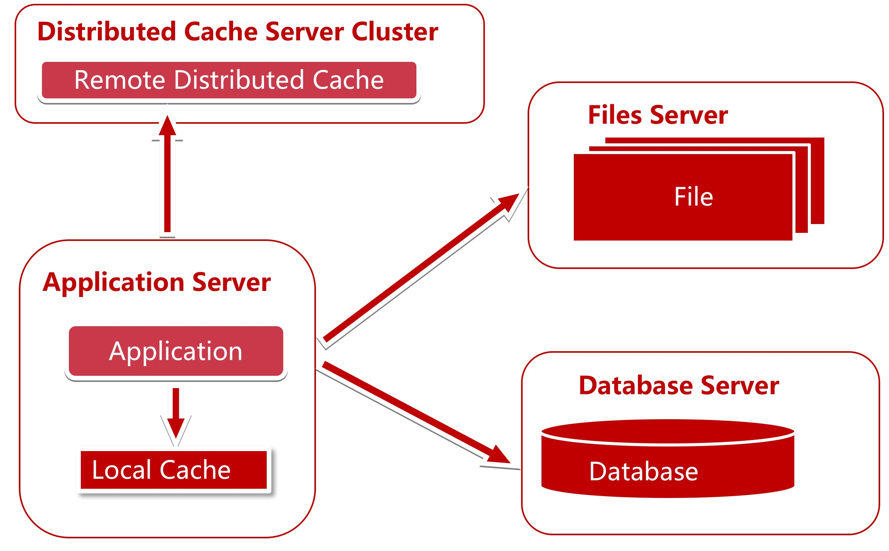

思考：

1. 具有哪种业务特点数据使用缓存？
2. 具有哪种业务特点的数据使用本地缓存？
3. 具有哪种务特点的数据使用远程缓存？
4. 分布式缓存在扩容时候会碰到什么问题？如何解决？分布式缓存的算法都有哪几种？各有什么优缺点？


# 使用应用服务器集群

使用缓存后，数据访问压力得到有效缓解，但单一应用服务器能处理的请求连接有限，在网站访问高峰期，应用服务器成为整个网站的瓶颈，虽然可通过购买更强大的硬件来提升性能，但这是有上限的，且后期成本的增长会是指数级的。

使用集群是网站解决高并发、海量数据问题的常用手段，通过增加服务器来分担原有服务器的访问和存储压力，使服务器可以横向扩展，实现系统的可伸缩性。应用服务器实现集群是网站可伸缩集群架构设计中较为简单成熟的一种。

通过负载均衡调度服务器，可以将来自用户浏览器的访问请求分发到应用服务器集群中的任何一台服务器上。


## 负载均衡

可以做负载均衡的有：

- 软件：
  - Nginx：工作在网络的应用层(七层)
  - HAProxy：既可以工作在网络的传输层(四层)，也可工作在应用层(七层)
  - LVS：工作在网络的传输层(四层)
  - 适用业务场景：
    - 初期，可以选择Nginx、HAProxy作为反向代理负载均衡(流量不大时，可以不选用负载均衡)，因为其配置简单，性能也能满足一般业务场景。如果考虑到负载均衡器是有单点问题，可以采用 Nginx + Keepalived/HAproxy + Keepalived 避免负载均衡器自身的单点问题。
    - 网站并发到达一定程度后，为了提高稳定性和转发效率，可以使用lvs，毕竟lvs比Nginx/HAProxy要更稳定，转发效率也更高。
  - Nginx、HAProxy对比：
    - nginx只支持七层，用户量最大，稳定性比较可靠；
    - Haproxy支持四层和七层，支持更多的负载均衡算法，支持session等。
- 硬件：F5
- DNS 负载均衡


## 调度策略

负载均衡的调度策略（这里以Nginx的配置为例）：

- 轮询：
  - 优点：实现简单

  - 缺点：不考虑每台服务器处理能力

    ```shell
        upstream www.fms5cms.com{
            server www.fms5cms.com:8080;
            server www.fms5cms.com:9080;
        }
    ```
- 权重：

  - 优点：考虑了服务器处理能力的不同

    ```shell
        upstream www.fms5cms.com{
            server www.fms5cms.com:8080 weight=15;
            server www.fms5cms.com:9080 weight=10;
        }
    ```
- IP Hash：
  - 优点：能实现同一个用户访问同一个服务器

  - 缺点：服务器请求(负载)不平均(完全依赖IP hash的结果)

    ```shell
        upstream www.fms5cms.com{
            ip_hash;
            server www.fms5cms.com:8080;
            server www.fms5cms.com:9080;
        }
    ```
- 地址散列(URL Hash)：需要安装Nginx插件
  - 优点：能实现同一个服务访问同一个服务器

  - 缺点：根据URL Hash分配请求会不平均，请求频繁的URL会请求到同一个服务器上

    ```shell
        upstream www.fms5cms.com{
            server www.fms5cms.com:8080;
            server www.fms5cms.com:9080;
            hash $request_uri;
        }
    ```
- fair：需要安装Nginx插件

  - 特点：按后端服务器的响应时间来分配请求，响应时间短的优先分配

    ```shell
        upstream www.fms5cms.com{
             server www.fms5cms.com:8080;
             server www.fms5cms.com:9080;
             fair;
         }
    ```
- 最少连接：

  - 优点：使集群中各个服务器负载更加均匀
- 加权最少连接：

  - 在最少连接的基础上，为每台服务器加上权值。算法为(活动连接数*256+非活动连接数)/权重，计算出来的值小的服务器优先被选择。


## Session共享问题

登录了A服务器，Session 信息存储到A服务器上，

假设使用的负载均衡策略是 IP Hash，则登陆信息还可以从A服务器上访问，但这样可能造成某些服务器压力过大，某些服务器又没什么压力，此时压力过大的机器(包括网卡带宽)可能成为瓶颈，且要求不够分散；

假设使用轮询或最小连接策略，就导致：第一次访问A服务器，第二次可能访问的B服务器，而存储在A服务器上的Session信息在B服务器上读取不到。


## Session问题解决方案

如何解决Session共享问题呢？下面列出了几种方案：


### Session Sticky粘滞会话

对于同一个连接中的数据包，负载均衡会将其转发至后端固定的服务器进行处理。

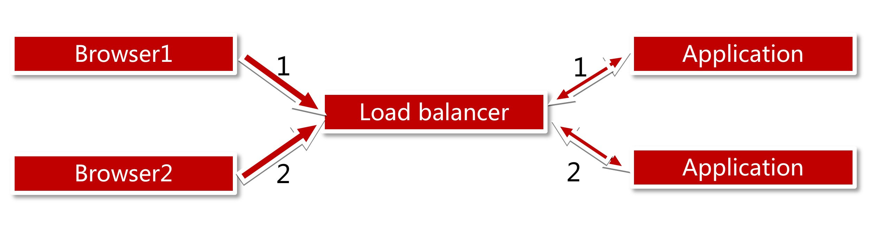

缺点：

1. 一台服务器运行的服务挂掉或重启，上面所有的Session都会消失；
2. 负载均衡器成了有状态的机器，为以后实现容灾造成困难。


### Session复制

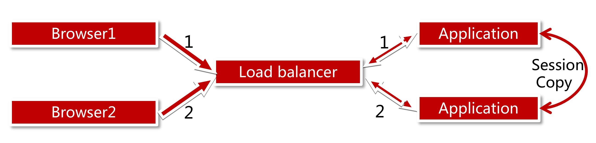

适合机器不多的情况，不适合做大规模集群。

缺点：

1. 应用服务器间带宽问题，因为需要不断同步Session数据；
2. 大量用户在线时，服务器占用内存过多。


### 基于Cookie

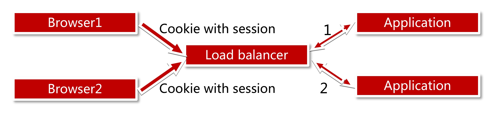

缺点：

1. Cookie有长度限制；
2. Cookie是存放在浏览器中的，有安全性问题。


### Session服务器

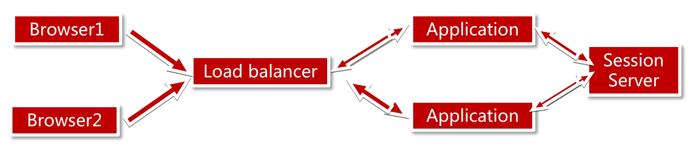


# 数据库读写分离

网站使用缓存后，绝大部分数据读操作访问都可不通过数据库就能完成，但仍有部分读操作(缓存访问不命中、缓存过期)和全部写操作需要访问数据库，当用户量达到一定规模时，数据库因为负载压力过高而成为网站的瓶颈。

大部分主流数据库都提供主从热备功能，通过配置两台数据库主从关系，实现数据读写分离，改善数据库负载压力。

为了便于应用程序访问读写分离后的数据库，通常在应用服务器端使用专门的数据访问模块，使数据库读写分离对应用透明。

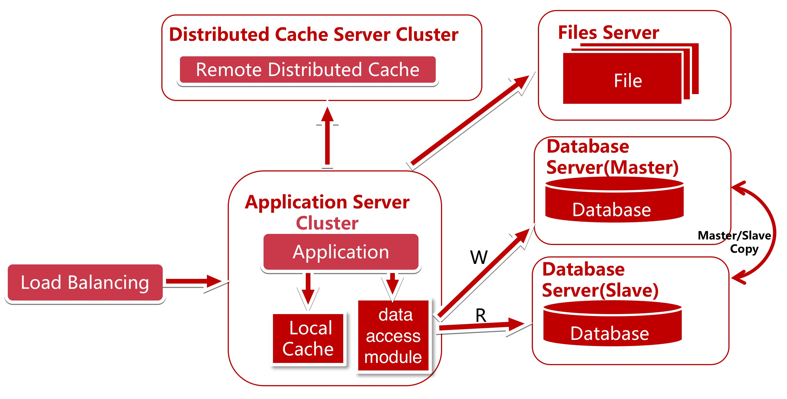


使用数据库提供的**热备功能**，将所有的读操作引入slave 服务器，因为数据库的读写分离了，所以，应用程序也要做相应的变化：

实现一个数据访问模块(图中的data access module)使上层写代码的人不知道读写分离的存在。这样多数据源读写分离就对业务代码没有了侵入。

数据访问模块可以使用：在MyBatis开发插件；mycat；sharding-jdbc

MyCat是一个数据库中间件，具备分库/分表功能，默认MyCat分库。

思考：

1. 如何支持多数据源；
2. 如何封装对业务没有侵入；
3. 如何使用目前业务的ORM框架完成主从读写分离？是否需要更换ORM模型？ORM模型之间各有什么优缺点？


数据库读写分离的问题：

1. master和slave复制时，考虑延时问题、数据库的支持、复制条件的支持；
   - 当为了提高可用性而将数据库分机房后，跨机房传输同步数据的问题；
2. 应对数据源的路由问题。


# 使用反向代理+CDN

使用反向代理和CDN加速网站响应。

使用CDN可以解决不同地区的访问速度问；反向代理则在服务器机房中缓存用户资源，减轻后端服务器的负载压力。

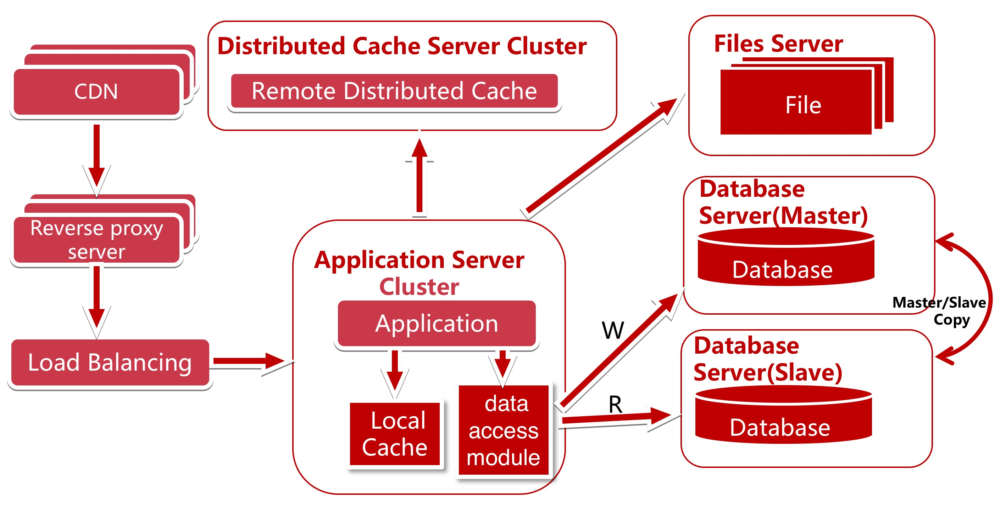

CDN和反向代理的基本原理都是缓存，区别在于：

- CDN部署在网络提供商的机房，使用户在请求网站服务时，可以从距离自己最近的网络提供商机房获取数据；

- 反向代理则部署在网站的中心机房，当用户请求到达中心机房后，首先访问的服务器是反向代理服务器，如果反向代理服务器中缓存着用户请求的资源，就将其直接返回给用户。


# 使用分布式文件系统和分布式数据库系统

任何强大的单一服务器都满足不了大型网站持续增长的业务需求。数据库虽然经过读写分离，但随着网站业务的反战依然不能满足需求，这时就需要使用分布式数据库。文件系统也一样，需要使用分布式文件系统。

分布式数据库是网站数据库拆分的最后手段，只有在单表数据规模非常庞大的时候才使用。不到不得已时，网站更常用的数据库拆分手段是业务分库，讲不同业务的数据库部署在不同的物理服务器上。

适合存储小文件、图片的分布式文件系统：FastDFS、TFS(阿里的)；

此时的数据访问模块选择：mycat(作为独立服务向多个应用提供服务)、sgarding-jdbc(作为jar包集成到应用中)。

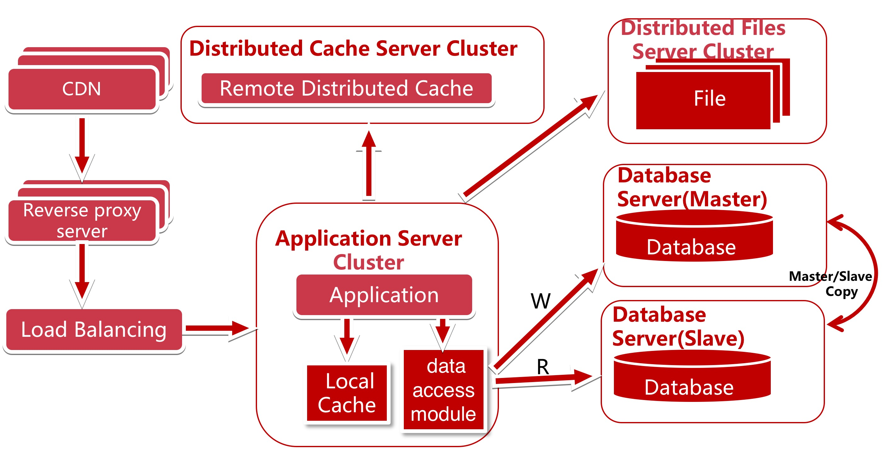


# 使用NoSQL和搜索引擎

随着业务越来越复杂，对数据存储和检索的需求也更复杂了（存储字段差异很大，骷髅表；复杂的文本检索）。网站需要采用一些非关系数据库技术NoSQL和非数据库查询技术如搜索引擎。

使用搜索引擎，解决数据查询问题。部分场景可使用 NoSQL 提高性能，开发数据统一访问模块，解决上层应用开发的数据源问题。如图data access module 可以访问数据库，搜索引擎，NoSQL。

搜索引擎：lucene、solr、elasticsearch

NoSQL：mangoDB、elasticsearch

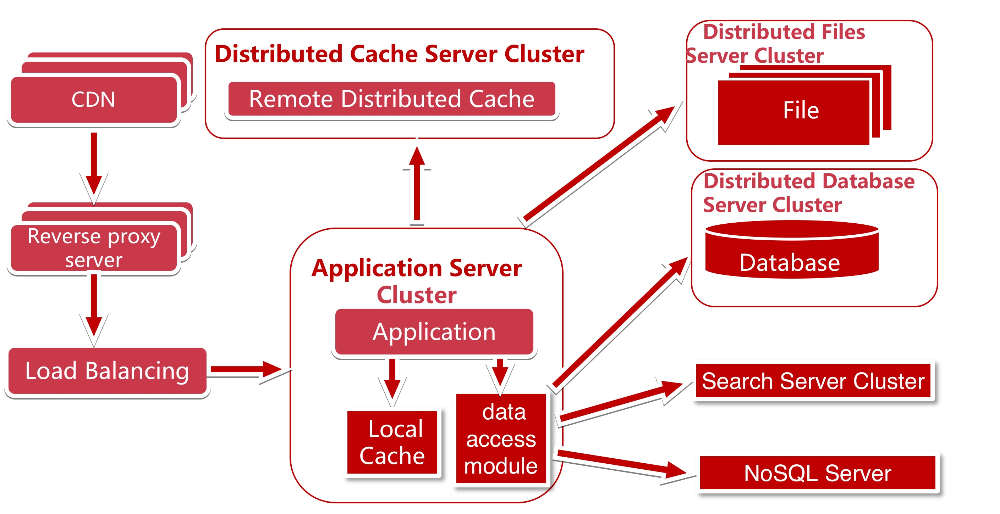


# 业务拆分

网站越做越好，业务不断扩大，越来越复杂，应用程序将变得无比庞大，迭代周期越来越快，牵一发而动全身，怎么应对快速的业务发展需求？

消息队列 MQ：RabbitMQ、ActiveMQ、Kafka

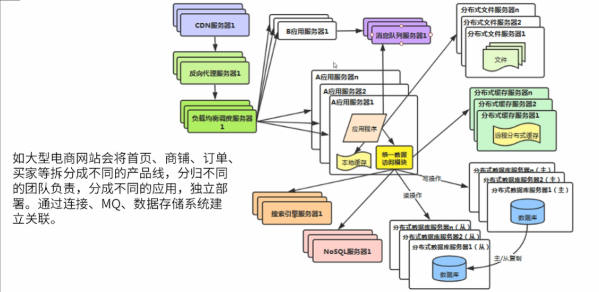


# 服务化

业务规模不断增大，应用拆分越来越小、越来越多。应用间的关系越来越复杂、应用中存在大量相同的业务操作。后端的数据库要被成千上万台应用服务器连接，数据库连接资源不足。解决方案：服务化！

如何做服务化？服务框架：Dubbo、SpringCloud

如何做配置中心？配置中心：Zookeeper、SpringCloud config、disconf(百度使用)、config-toolkit(当当使用)、diamond(阿里使用)、Apollo(携程使用)

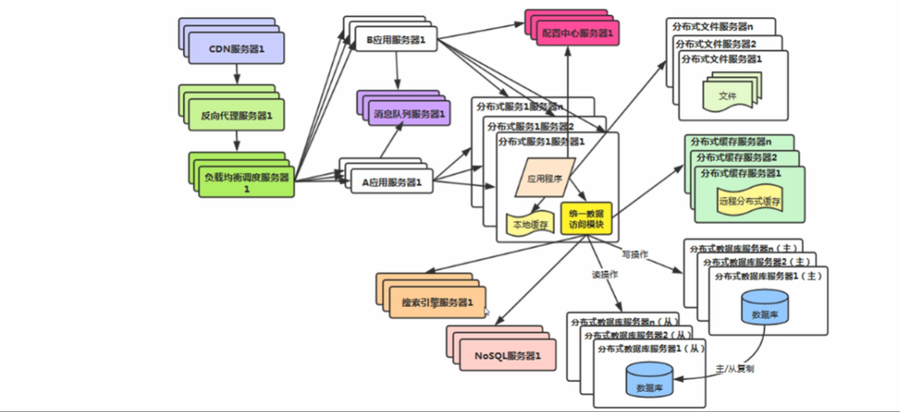

# 大数据技术、监控、日志分析系统

数据挖掘、分析、推荐等业务需求，庞大系统的监控、问题分析等需求。增加大数据技术、监控、日志分析系统，这些和业务关联性不大。

大数据：Hadoop、spark

系统监控：Zabbix、Elasticsearch + bets + Libana

集中式日志分析系统：ELK


# 说明

每个服务的技术架构要根据自己业务的特点进行优化和演进。

负载均衡可能也需要集群，在架构演进的过程中，还要考虑系统的安全性、数据分析、监控、反作弊等等......，同时继续发展呢，SOA架构、服务化、消息队列、任务调度、多机房等等… ...
