项目架构简单说明！参照：[慕课网 Geely 讲师的手记](https://www.imooc.com/article/17545)、《大型网站技术架构：核心原理与案例分析》。

# 单服务器

文件服务器，数据库，还有应用都部署在一台机器，俗称 ALL IN ONE。但是，随着用户的增多，访问越来越大，硬盘，CPU，内存等都开始吃紧。一台服务器已经满足不了。

# 数据与应用分离

将数据服务和应用服务分离，分离后整个网站使用三台服务器：

- 应用服务器(操作文件、数据服务器)需要处理大量业务逻辑，因此需要更快更强大的 CPU；
- 数据库服务器需要快速磁盘检索和数据缓存，因此需要更快的硬盘和更大的内存；
- 文件服务器需要存储大量用户上传的文件，因此需要更大的硬盘。

分离之后可以提高一定的可用性，如：文件服务器挂了，但仍可以操作应用和数据库等。

# 使用 Cache 改善网站性能

随着访问 QPS(每秒查询率，常用于衡量域名系统服务器的机器性能)越来越高，降低接口访问时间、提高服务性能和并发成为了下一目标。而网站访问特点和现实世界的财富分配一样遵守二八定律：80%的业务访问集中在 20%的数据上。如果将这 20%的数据缓存下来，就可以减少数据库的访问压力，提高网站的数据访问速度，改善数据库的写入性能。

网站使用的缓存分为：

- 本地缓存：缓存在应用服务器上
  - 速度更快，当受应用服务器内存限制，其缓存数量有限，且会出现和应用程序争用内存的情况
- 远程缓存：缓存在专门的分布式缓存服务器上
  - 可用集群的方式，部署大内存的服务器作为专门的缓存服务器，在理论上做到不受内存容量限制的缓存服务

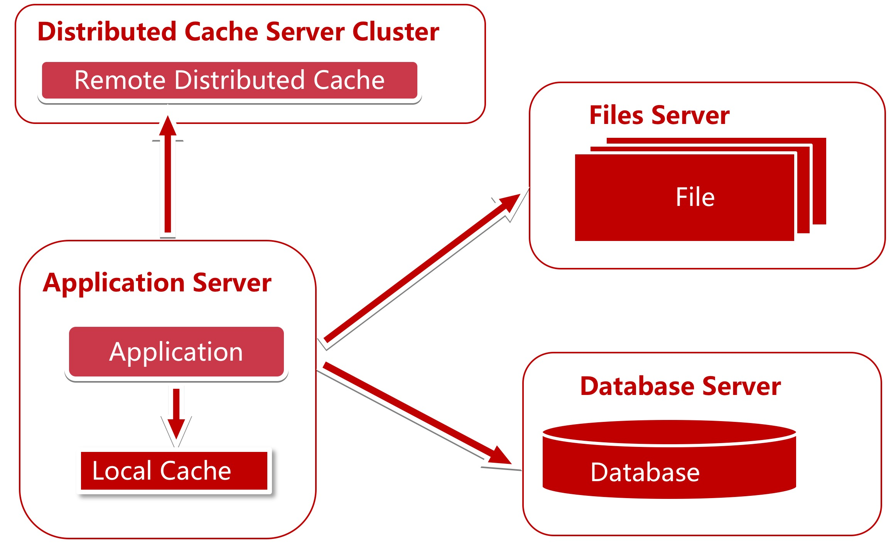

思考：

1. 具有哪种业务特点数据使用缓存？
2. 具有哪种业务特点的数据使用本地缓存？
3. 具有哪种务特点的数据使用远程缓存？
4. 分布式缓存在扩容时候会碰到什么问题？如何解决？分布式缓存的算法都有哪几种？各有什么优缺点？

# 使用应用服务器集群

使用缓存后，数据访问压力得到有效缓解，但单一应用服务器能处理的请求连接有限，在网站访问高峰期，应用服务器成为整个网站的瓶颈，虽然可通过购买更强大的硬件来提升性能，但这是有上限的，且后期成本的增长会是指数级的。

使用集群是网站解决高并发、海量数据问题的常用手段，通过增加服务器来分担原有服务器的访问和存储压力，使服务器可以横向扩展，实现系统的可伸缩性。应用服务器实现集群是网站可伸缩集群架构设计中较为简单成熟的一种。

通过负载均衡调度服务器，可以将来自用户浏览器的访问请求分发到应用服务器集群中的任何一台服务器上。

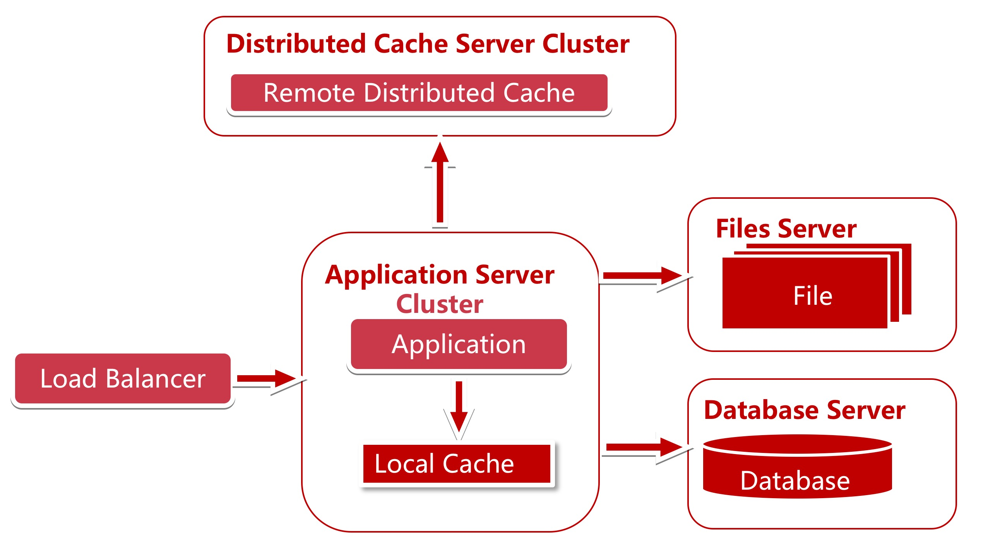

## 负载均衡

可以做负载均衡的有：

- 软件：
  - Nginx：工作在网络的应用层(七层)
  - HAProxy：既可以工作在网络的传输层(四层)，也可工作在应用层(七层)
  - LVS：工作在网络的传输层(四层)
  - 适用业务场景：
    - 初期，可以选择 Nginx、HAProxy 作为反向代理负载均衡(流量不大时，可以不选用负载均衡)，因为其配置简单，性能也能满足一般业务场景。如果考虑到负载均衡器是有单点问题，可以采用 Nginx + Keepalived/HAproxy + Keepalived 避免负载均衡器自身的单点问题。
    - 网站并发到达一定程度后，为了提高稳定性和转发效率，可以使用 lvs，毕竟 lvs 比 Nginx/HAProxy 要更稳定，转发效率也更高。
  - Nginx、HAProxy 对比：
    - nginx 只支持七层，用户量最大，稳定性比较可靠；
    - Haproxy 支持四层和七层，支持更多的负载均衡算法，支持 session 等。
- 硬件：F5
- DNS 负载均衡

## 调度策略

负载均衡的调度策略（这里以 Nginx 的配置为例）：

- 轮询：

  - 优点：实现简单

  - 缺点：不考虑每台服务器处理能力

    ```shell
        upstream www.fms5cms.com{
            server www.fms5cms.com:8080;
            server www.fms5cms.com:9080;
        }
    ```

- 权重：

  - 优点：考虑了服务器处理能力的不同

    ```shell
        upstream www.fms5cms.com{
            server www.fms5cms.com:8080 weight=15;
            server www.fms5cms.com:9080 weight=10;
        }
    ```

- IP Hash：

  - 优点：能实现同一个用户访问同一个服务器

  - 缺点：服务器请求(负载)不平均(完全依赖 IP hash 的结果)

    ```shell
        upstream www.fms5cms.com{
            ip_hash;
            server www.fms5cms.com:8080;
            server www.fms5cms.com:9080;
        }
    ```

- 地址散列(URL Hash)：需要安装 Nginx 插件

  - 优点：能实现同一个服务访问同一个服务器

  - 缺点：根据 URL Hash 分配请求会不平均，请求频繁的 URL 会请求到同一个服务器上

    ```shell
        upstream www.fms5cms.com{
            server www.fms5cms.com:8080;
            server www.fms5cms.com:9080;
            hash $request_uri;
        }
    ```

- fair：需要安装 Nginx 插件

  - 特点：按后端服务器的响应时间来分配请求，响应时间短的优先分配

    ```shell
        upstream www.fms5cms.com{
             server www.fms5cms.com:8080;
             server www.fms5cms.com:9080;
             fair;
         }
    ```

- 最少连接：

  - 优点：使集群中各个服务器负载更加均匀

- 加权最少连接：

  - 在最少连接的基础上，为每台服务器加上权值。算法为(活动连接数\*256+非活动连接数)/权重，计算出来的值小的服务器优先被选择。

## Session 共享问题

登录了 A 服务器，Session 信息存储到 A 服务器上，

假设使用的负载均衡策略是 IP Hash，则登陆信息还可以从 A 服务器上访问，但这样可能造成某些服务器压力过大，某些服务器又没什么压力，此时压力过大的机器(包括网卡带宽)可能成为瓶颈，且要求不够分散；

假设使用轮询或最小连接策略，就导致：第一次访问 A 服务器，第二次可能访问的 B 服务器，而存储在 A 服务器上的 Session 信息在 B 服务器上读取不到。

## Session 问题解决方案

如何解决 Session 共享问题呢？下面列出了几种方案：

### Session Sticky 粘滞会话

对于同一个连接中的数据包，负载均衡会将其转发至后端固定的服务器进行处理。


缺点：

1. 一台服务器运行的服务挂掉或重启，上面所有的 Session 都会消失；
2. 负载均衡器成了有状态的机器，为以后实现容灾造成困难。

### Session 复制

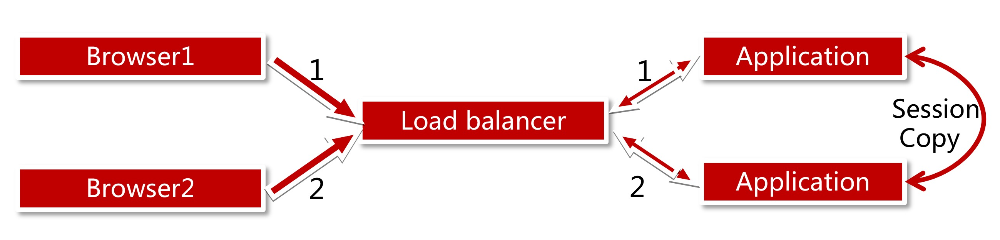

适合机器不多的情况，不适合做大规模集群。

缺点：

1. 应用服务器间带宽问题，因为需要不断同步 Session 数据；
2. 大量用户在线时，服务器占用内存过多。

### 基于 Cookie

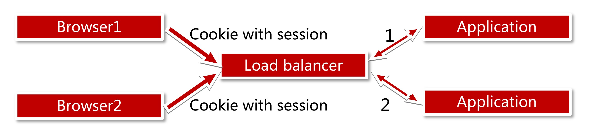

缺点：

1. Cookie 有长度限制；
2. Cookie 是存放在浏览器中的，有安全性问题。

### Session 服务器

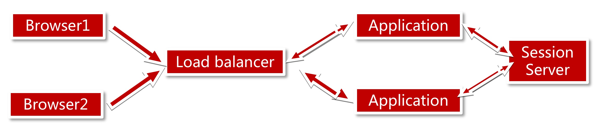

# 数据库读写分离

网站使用缓存后，绝大部分数据读操作访问都可不通过数据库就能完成，但仍有部分读操作(缓存访问不命中、缓存过期)和全部写操作需要访问数据库，当用户量达到一定规模时，数据库因为负载压力过高而成为网站的瓶颈。

大部分主流数据库都提供主从热备功能，通过配置两台数据库主从关系，实现数据读写分离，改善数据库负载压力。

为了便于应用程序访问读写分离后的数据库，通常在应用服务器端使用专门的数据访问模块，使数据库读写分离对应用透明。

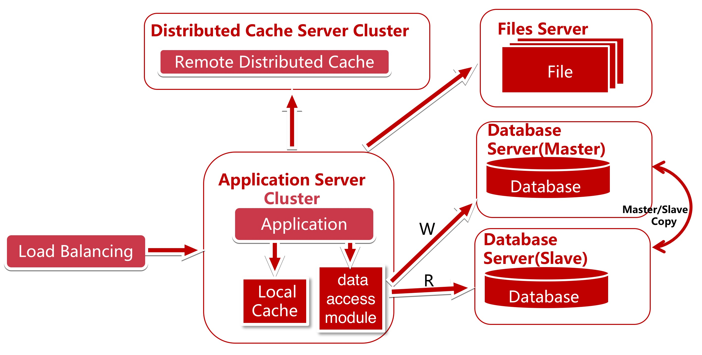

使用数据库提供的**热备功能**，将所有的读操作引入 slave 服务器，因为数据库的读写分离了，所以，应用程序也要做相应的变化：

实现一个数据访问模块(图中的 data access module)使上层写代码的人不知道读写分离的存在。这样多数据源读写分离就对业务代码没有了侵入。

数据访问模块可以使用：在 MyBatis 开发插件；mycat；sharding-jdbc

MyCat 是一个数据库中间件，具备分库/分表功能，默认 MyCat 分库。

思考：

1. 如何支持多数据源；
2. 如何封装对业务没有侵入；
3. 如何使用目前业务的 ORM 框架完成主从读写分离？是否需要更换 ORM 模型？ORM 模型之间各有什么优缺点？

数据库读写分离的问题：

1. master 和 slave 复制时，考虑延时问题、数据库的支持、复制条件的支持；
   - 当为了提高可用性而将数据库分机房后，跨机房传输同步数据的问题；
2. 应对数据源的路由问题。

# 使用反向代理+CDN

使用反向代理和 CDN 加速网站响应。

使用 CDN 可以解决不同地区的访问速度问；反向代理则在服务器机房中缓存用户资源，减轻后端服务器的负载压力。

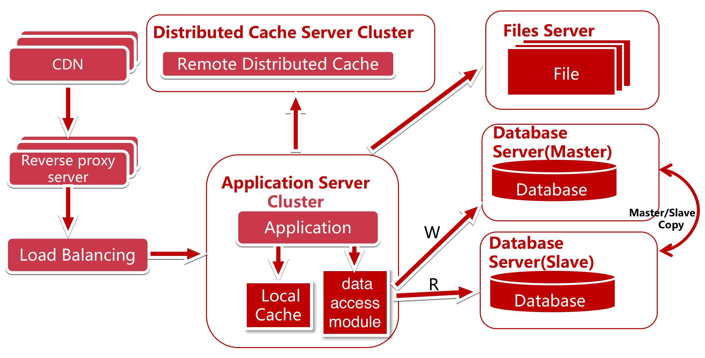

CDN 和反向代理的基本原理都是缓存，区别在于：

- CDN 部署在网络提供商的机房，使用户在请求网站服务时，可以从距离自己最近的网络提供商机房获取数据；

- 反向代理则部署在网站的中心机房，当用户请求到达中心机房后，首先访问的服务器是反向代理服务器，如果反向代理服务器中缓存着用户请求的资源，就将其直接返回给用户。

# 使用分布式文件系统和分布式数据库系统

任何强大的单一服务器都满足不了大型网站持续增长的业务需求。数据库虽然经过读写分离，但随着网站业务的反战依然不能满足需求，这时就需要使用分布式数据库。文件系统也一样，需要使用分布式文件系统。

分布式数据库是网站数据库拆分的最后手段，只有在单表数据规模非常庞大的时候才使用。不到不得已时，网站更常用的数据库拆分手段是业务分库，讲不同业务的数据库部署在不同的物理服务器上。

适合存储小文件、图片的分布式文件系统：FastDFS、TFS(阿里的)；

此时的数据访问模块选择：mycat(作为独立服务向多个应用提供服务)、sgarding-jdbc(作为 jar 包集成到应用中)。

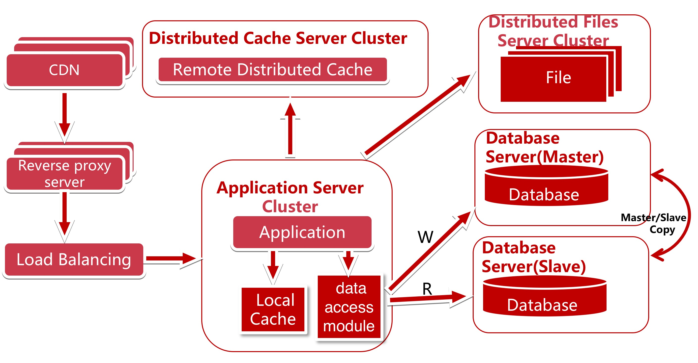

# 使用 NoSQL 和搜索引擎

随着业务越来越复杂，对数据存储和检索的需求也更复杂了（存储字段差异很大，骷髅表；复杂的文本检索）。网站需要采用一些非关系数据库技术 NoSQL 和非数据库查询技术如搜索引擎。

使用搜索引擎，解决数据查询问题。部分场景可使用 NoSQL 提高性能，开发数据统一访问模块，解决上层应用开发的数据源问题。如图 data access module 可以访问数据库，搜索引擎，NoSQL。

搜索引擎：lucene、solr、elasticsearch

NoSQL：mangoDB、elasticsearch

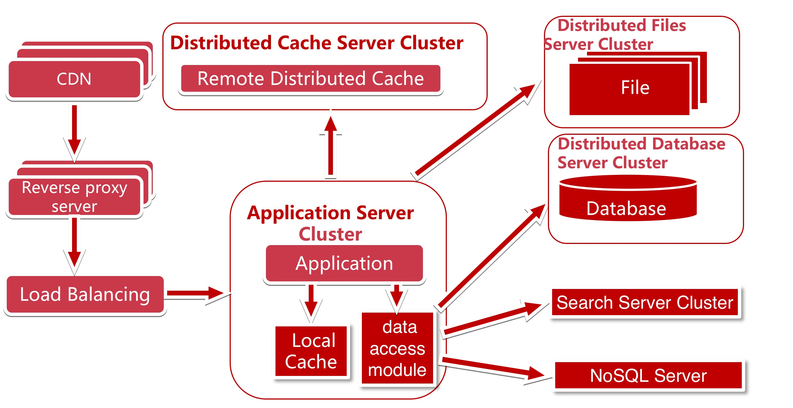

# 业务拆分

网站越做越好，业务不断扩大，越来越复杂，应用程序将变得无比庞大，迭代周期越来越快，牵一发而动全身，怎么应对快速的业务发展需求？

消息队列 MQ：RabbitMQ、ActiveMQ、Kafka

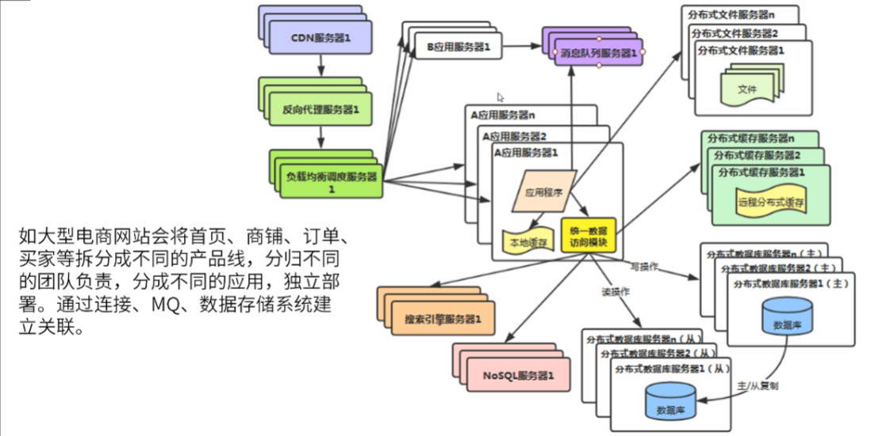

# 服务化

业务规模不断增大，应用拆分越来越小、越来越多。应用间的关系越来越复杂、应用中存在大量相同的业务操作。后端的数据库要被成千上万台应用服务器连接，数据库连接资源不足。解决方案：服务化！

如何做服务化？服务框架：Dubbo、SpringCloud

如何做配置中心？配置中心：Zookeeper、SpringCloud config、disconf(百度使用)、config-toolkit(当当使用)、diamond(阿里使用)、Apollo(携程使用)

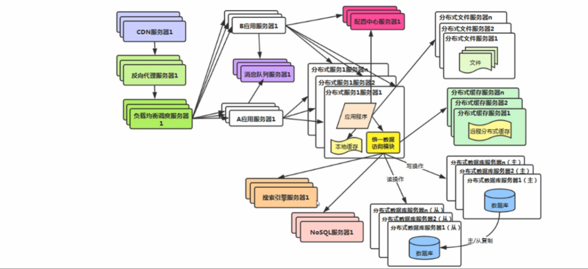

# 大数据技术、监控、日志分析系统

数据挖掘、分析、推荐等业务需求，庞大系统的监控、问题分析等需求。增加大数据技术、监控、日志分析系统，这些和业务关联性不大。

大数据：Hadoop、spark

系统监控：Zabbix、Elasticsearch + bets + Libana

集中式日志分析系统：ELK

# 说明

每个服务的技术架构要根据自己业务的特点进行优化和演进。

负载均衡可能也需要集群，在架构演进的过程中，还要考虑系统的安全性、数据分析、监控、反作弊等等......，同时继续发展呢，SOA 架构、服务化、消息队列、任务调度、多机房等等… ...


# 优化

## 页面优化

- 页面优化技术

1. 页面缓存 + URL 缓存 + 对象缓存
2. 页面静态化，前后端分离
   - 即使做了页面缓存，客户端还是需要从服务端下载页面数据，但是如果做了静态化，浏览器可以把 HTML 缓存在客户端，这样，页面数据就不需要重复下载了，只需要下载动态数据即可。
   - 常用技术：AngularJS、Vue.js
   - 优点：利用浏览器的缓存
3. 静态资源优化
   - JS、CSS压缩，减少流量
   - 多个JS、CSS组合，减少连接数
   - CDN就近访问
4. CDN 优化

---

- 页面缓存

页面缓存：访问页面时不是直接让系统帮忙渲染，而是先从缓存中取，如果取到则直接返回给客户端，如果没有，则手动渲染模板，渲染后再把结果输出给客户端，同时把结果缓存。

1. 去缓存
2. 手动渲染模板
3. 结果输出


## 服务端优化

通过异步处理和排队机制缓解数据库的压力，降低应用接口负载

以秒杀为例：思路（减少数据库访问）

- 秒杀接口优化：
  1. 系统初始化，把商品库存数量加载到Redis中；
  2. 收到请求，Redis预减库存，库存不足，直接返回，否则执行下一步；
  3. 请求入队，立即返回排队中；
  4. 请求出对，生成订单，减少库存；
  5. 客户端轮询，是否秒杀成功。

