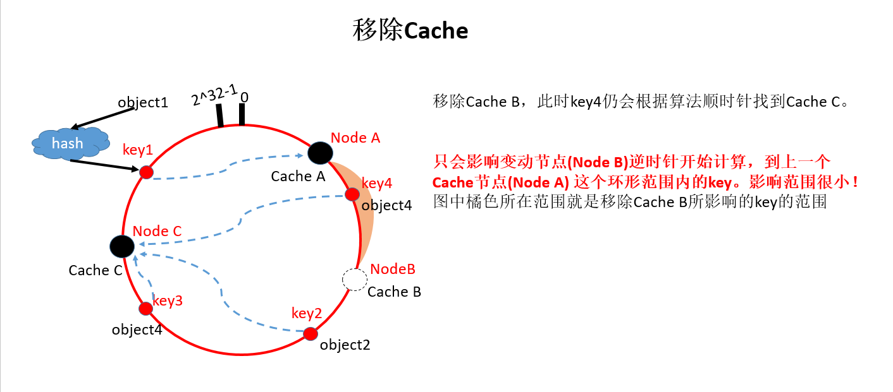
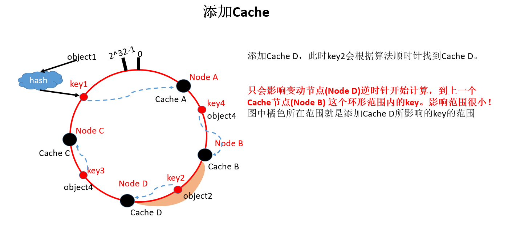
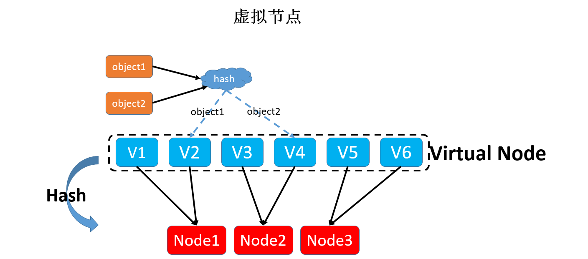
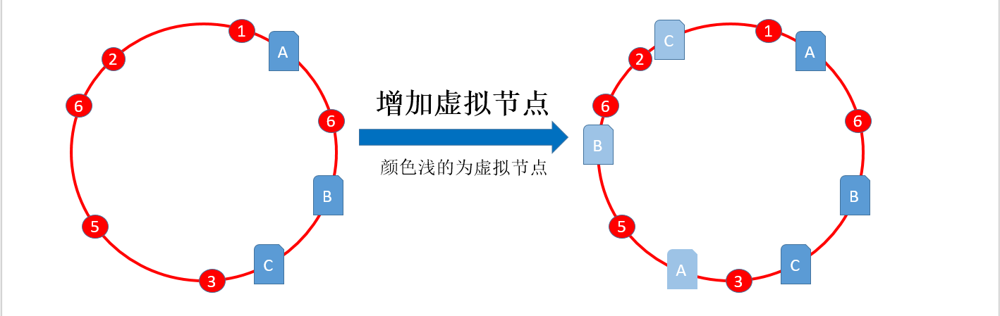

Cache 的主要用途：高并发和高性能。使用缓存可能造成：

- 缓存与数据库双写不一致
- 缓存雪崩
- 缓存穿透
- 缓存并发竞争

Redis 高并发：主从架构，一主多从。单主用来写入数据，单机几万QPS，多从用来查询数据，多个从实例可以提供每秒10万的QPS。如果要容纳大量数据，可以使用 Redis 集群，而且用redis集群之后，可以提供可能每秒几十万的读写并发。

Redis 高可用：如果做主从架构部署，其实就是加上哨兵就可以实现了，任何一个实例宕机，自动会进行主备切换。

# NoSQL

NoSQL(Not Only SQL)：**泛指非关系型的数据库**，NoSQL 不依赖业务逻辑方式存储，而以简单的 key-value 模式存储。大大的增加了数据库的扩展能力。**这种类型的数据存储不需要固定的模式，无需多余操作就可以横向扩展**。

NoSQL：易扩展；大数据量高性能；多样灵活的数据模型。传统 RDBMS VS NoSQL：

| 传统关系型数据库(RDBMS)                                                                                                                  | NosQL                                                                                                                                                                                                     |
| ---------------------------------------------------------------------------------------------------------------------------------------- | --------------------------------------------------------------------------------------------------------------------------------------------------------------------------------------------------------- |
| 高度组织化结构化数据 结构化查询语言SQL 数据和关系都存储在单独的表中 数据操纵语言、数据定义语言 严格的一致性 基础事务 | 不仅仅是SQL 没有声明性查询语言 没有预定义的模式 键值对存储、列存储、文档存储、图形数据库 最终一致性，而非ACID属性 非结构化和不可预知的数据 CAP定理 高性能、高可用性和可伸缩性 |

当下的应用是 SQL + NoSQL 一起使用。

高并发的操作是不建议有关联查询的，会用冗余数据来避免关联查询。

NoSQL数据库的四大分类：

- KV键值： Memcache、Redis
- 文档型数据库(BSON格式较多)：CouchDB、MongoDB (是基于分布式文件存储的数据库)
- 列存储数据库：Cassandra、HBase、分布式文件系统
- 图关系数据库：不是放图形的，放的是关系！如社交网络。Neo4J、InfoGrid

根据CAP原理，NoSQL分为满足CA、满足CP、满足AP原则的三大类：

- CA：单点集群，满足一致性、可用性的系统，通常在可扩展性上不太强大
  - RDBMS(传统关系型数据库)
- CP：满足一致性、分区容错性的系统，通常性能不是很高
  - MongoDB、HBase、Redis
- AP：满足可用性、分区容错性的系统，通常可能对一致性要求低一些
  - CouchDB、Cassandra、DynamoDB

# 一致性哈希算法

一致性哈希算法，最初在论文《Consistent hashing and random trees:distributed caching protocols for relieving hot spots on the World Wide Web》中提出。将整个哈希值设计成一个闭合的环状，并将服务器节点用哈希函数映射在这个环上，当有一个 key 过来了，利用相同的算法也映射在环上。

- 环形 hash 空间：通常 hash 算法是将 value 映射到一个 32 位的 key 中。下面圆环的范围：0 到 2^32-1

## 节点伸缩

下面讨论移除和增加Cache节点的影响:

- 节点伸缩：只影响临近节点，但还是有数据迁移
  - 翻倍伸缩：保证最小迁移数据和负载均衡

Consistent hashing命中率计算公式：$(1-n/(n+m))*100%$。其中，n为服务器台数；m为新增服务器台数。

这个公式说明：随着分布式集群不断扩大，算法的优点也会越来越明显。

## Hash倾斜性

理想的情况下，在环形hash空间上，节点的分布是均匀的，但是实际中，节点可能都分布在圆环的一小段上，这样会导致某个节点负载很高(可画图理解)。这就是Hash倾斜性导致的。

那么，如何解决Hash倾斜性带来的问题呢？引入了**虚拟节点**。

虚拟节点的作用：

可以看出，增加了虚拟节点后，key分布到每个节点相对均匀了很多。

当然，即使增加了虚拟节点，也还是会存在Hash倾斜性的，但是可以通过虚拟节点的数量把虚拟节点、真实节点分配一个良好的比例，随着节点的越来越多、数据越来越多，这个分布会越来越均匀，且删除、增加节点时，影响也会越来越小。

# 比较Redis和Memcached

- Redis支持服务器端的数据操作：Redis相比Memcached来说，拥有更多的数据结构和并支持更丰富的数据操作，通常在Memcached里，你需要将数据拿到客户端来进行类似的修改再set回去。这大大增加了网络IO的次数和数据体积。在Redis中，这些复杂的操作通常和一般的GET/SET一样高效。
- 内存使用效率对比：使用简单的key-value存储的话，Memcached的内存利用率更高，而如果Redis采用hash结构来做key-value存储，由于其组合式的压缩，其内存利用率会高于Memcached。
- 性能对比：由于Redis只使用单核，而Memcached可以使用多核，所以平均每一个核上Redis在存储小数据时比Memcached性能更高。而在100k以上的数据中，Memcached性能要高于Redis，虽然Redis最近也在存储大数据的性能上进行优化，但是比起Memcached，还是稍有逊色。
- 集群模式：memcached没有原生的集群模式，需要依靠客户端来实现往集群中分片写入数据；但是redis目前是原生支持cluster模式的，redis官方就是支持redis cluster集群模式的，比memcached来说要更好

