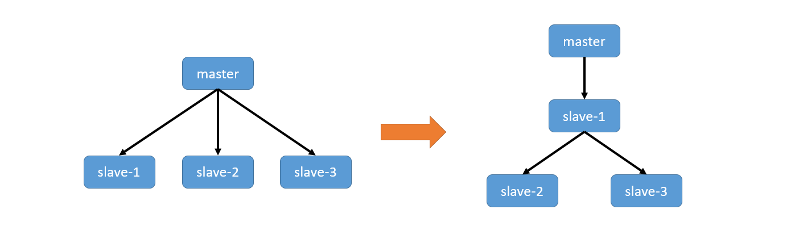
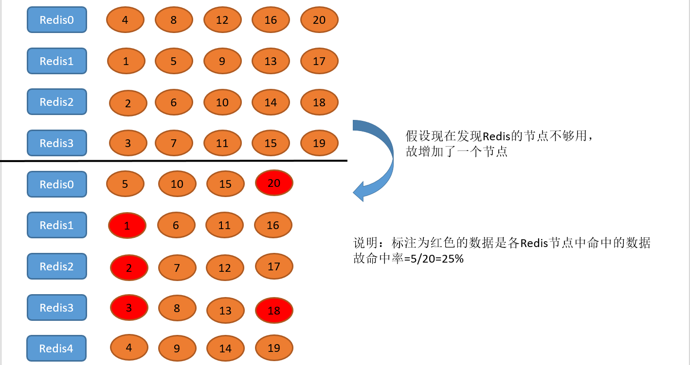

# 主从复制

复制(Replication)就是我们所说的主从复制：主机数据更新后根据配置和策略，自动同步到备机。**Master 以写为主，Slave 以读为主**。

可以完成：读写分离；容灾恢复。

缺点：复制延时(由于所有的写操作都是先在 Master 上操作，然后同步更新到 Slave 上，所以从Master 同步到 Slave 机器有一定的延迟，当系统很繁忙的时候，延迟问题会更加严重，Slave 机器数量的增加也会使这个问题更加严重。)


## 实现

注意：配从(库)不配主(库)，以下两种方式都是在从库中配置。

两种方式：

1. `slaveof`命令：`slaveof 主库IP 主库端口`

   - 取消操作，使从库成为主库：`slaveof no one`

2. 在配置文件的 REPLICATION 部分进行配置：（配置完成后重启Redis）

   ```shell
   slaveof 主库IP 主库端口
   slave-read-only yes   #从节点只做读操作
   ```


**每次与 master 断开之后，都需要重新连接，除非你配置进 redis.conf 文件**。

`info replication`命令查看当前库的信息。

主从复制使得 slave 和 master 同步，所以每次给 slave 配置 master 后，都会先将 slave 清空。

特点：

- slave 中可以查询到 master 中所有的数据（包括主从关系配置之前的数据）
- 默认 slave 只能读取数据不能更新数据；
- master 出现故障断开连接后，slave 仍然是 slave 而不会成为 master，master 重新连接后，一切照旧；(类似领导出差，回来还是领导)；
- slave 断开连接，重新连接后会成为 master，需要重新配置主从关系，除非配置进配置文件。
- 多层主从关系：
  - A 是 B 的 master，B 也可以是 C 的 master
  - 中途变更转向：会清除之前的数据，重新建立拷贝最新的；
  - 使用`info replication`查询得到 B 是slave，但它下面也有一个 slave 是 C


## 原理

1. slave 启动成功连接到 master 后会发送一个`sync`命令；
2. master 接到命令启动后台进程，同时收集所有接收到的用于修改数据集命令，在后台进程执行完毕之后，master 将传送整个数据文件到 slave，以完成一次完全同步。
3. 全量复制：slave 服务在接收到数据库文件数据后，将其存盘并加载到内存中。
4. 增量复制：master 继续将新的所有收集到的修改命令依次传给slave，完成同步。

只要是重新连接 master，就会自动执行一次完全同步（全量复制)。


## 减少复制开销

全量复制开销：

1. bgsave 时间；
2. RDB 文件网络传输时间；
3. slave 节点清空数据时间；
4. slave 节点加载 RDB 的时间；
5. 可能有 AOF 重写时间

全量复制开销很大，那如何规避呢？

- 第一次全量不可避免，如何降低危害呢？
  - 小主节点：进行数据分片，maxmemory 不要设置过大，这样 bgsave、传输、加载等速度都会较快，开销相对较小
  - 低峰：在访问量比较低、机器负载低的时候来进行复制操作

- 节点 run_id 不匹配：slave 节点会保存其 master 节点的 run_id，而 master 节点重启，其run_id 会变化，slave 认为数据可能是不安全的，所以会进行一次全量复制
  - 使用故障转移，如：哨兵或集群
- 复制积压缓冲区不足
  - 网络中断，部分复制无法满足
  - 增大复制缓冲区配置 rel_backlog_size，网络“增强”

---

- 单主节点复制风暴
  - 问题：主节点重启，多从节点复制
  - 解决：更换复制拓扑



- 单机器复制风暴
  - 一个机器里有多个 master 节点，机器宕机后，大量全量复制
  - 解决：主节点分散多机器；采用高可用架构，master 挂掉后 slave 晋升为 master


# 哨兵 Sentinel

主从复制的问题：手动故障转移、写能力和存储能力受限。

Redis-Sentinel 是 Redis 官方推荐的服务端高可用性(HA)解决方案，其本身是一个独立运行的进程，能够后台监控多个 master-slave 集群的主机是否故障，如果故障了根据投票数自动将从库转换为主库。

客户端从 sentinel 获取 Redis 信息。sentinel 的默认端口是 26379。

sentinel 故障(master 出现问题后，slave 和 master 的连接中断)转移：

1. 多个 sentinel 节点发现并确认 master 有问题；
2. 内部选举出一个 sentinel 作为领导；
3. 该 sentinel 选出一个 slave 作为新的 master，选择条件依次是：
   1. 选择优先级靠前的，优先级在 redis.conf 中`slave-priority 100`；
   2. 选择偏移量最大的，偏移量是指获得原主数据最多的；
   3. 选择 run_id 最小的从服务
4. 通知其余 slave，是它们成为新 master 的 slave；
5. 通知客户端主从变化；
6. 如果老的 master 复活，则其成为新 master 的 slave


## 如何配置

1. 配置开启主从节点
2. 配置开启 sentinel 监控主节点(sentinel 是特殊的Redis)

在 Redis 的目录下有一个 sentinel.conf 的文件是 sentinel 配置模板。

创建一个 sentinel 的配置文件(如：sentinel.conf)，添加 sentinel 的主要配置：

```shell
port ${port}  #指定该sentinel节点的端口
daemonize yes #以守护进程的方式启动
dir /opt/soft/redis/data/   #工作目录
logfile "${port}.log"
# mymaster是被监控主机名字(自定义)
# 数字 2 代表需要 2 个sentinel判断该主机故障时才进行故障转移
sentinel monitor mymaster 127.0.0.1 6379 2 
#故障后多少毫秒内无法 ping 通才认为该主机故障
sentinel down-after-milliseconds mymaster 60000 
sentinel failover-timeout mymaster 180000 #故障转移时间
sentinel parallel-syncs mymaster 1
```

启动：`redis-sentinel 配置文件`

仍然使用`redis-cli -p 端口`来连接，然后通过`info`命令查看信息。

sentinel 启动后会监控 master 的信息，然后对配置进行重写，添加 master 的 slave 节点（还有其他的内容）。


## 客户端连接

sentinel 是服务端高可用的，客户端连接时不能直连。客户端高可用的基本原理：

1. 遍历 sentinel 节点集合，获取一个可用的 sentinel 节点；
   - 客户端需要知道 sentinel 节点集合、masterName
2. 对该可用节点执行`sentinel get-master-adder-by-name masterName`，会返回一个master节点真正的地址和端口；
3. 客户端获取到master节点后，会进行`role`或`role replication`来验证其真的是一个master节点；
4. 如果master节点发生变化，sentinel 是可以感知然后通知客户端
   - sentinel 和客户端采用发布订阅模式，master 订阅 sentinel 的某个 channel，sentinel 会发布 master 的变化，从而客户端订阅获取，再对新的 master 进行连接


Java 使用 Jedis 连接：

```java
String masterName = "mymaster";
Set<String> sentinels = new HashSet<>();
sentinels.add("127.0.0.1:23679");

JedisSentinelPool sentinelPool = new JedisSentinelPool(masterName,sentinels,poolConfig,timeout);
Jedis jedis = null;
try{
  jedis = sentinelPool.getResource();
  //todo jedis命令
} catch (Exception e){
  log.error(e);
} finally {
  if(jedis != null){
    jedis.close();
  }
}
```


# 集群 Cluster

为什么需要集群？

1. 并发量需求。Redis 可以执行 10万/每秒 条命令，如果业务需要100万/每秒呢？
2. 数据量需求。当数据量很大时，可以对 Redis 进行数据分区。

Redis 3.0提供了Redis Cluster，其特点：

- 所有的节点相互连接；
- 集群消息通信通过集群总线通信，集群总线端口大小为客户端服务端口+10000，这个10000是固定值；
- 节点与节点之间通过二进制协议进行通信；
- 客户端和集群节点之间通信和通常一样，通过文本协议进行；
- 集群节点不会代理查询；


数据分区：单机无法满足全量数据时，通过分区规则将数据分给很多子集。

假设需要使用 Redis 存储图片资源，存储格式为键值对，key 是图片名称，value 是图片所在文件服务器的路径。如果对数据进行随机分配，当有多个 Redis 服务器时，我们的数据可能存储在任何一个 Redis 中，所以查询时就需要遍历所有的 Redis 服务器。所以不能使用随机分配的方式。

常用两种分区方式：

- 顺序分区：假设有100个数字，将其分给三个节点，1到33分给第一个、34到66分给第二个、67到100分给第三个
- 哈希分区：主要有三种方式：
  - 节点取余分区
  - 一致性哈希分区(Consistent hashing)
  - 虚拟槽分区

|          | 特点                                                         | 典型产品                                              |
| -------- | ------------------------------------------------------------ | ----------------------------------------------------- |
| 哈希分布 | 数据分散度高<br/>键值分布业务无关<br/>无法顺序访问<br/>支持批量操作 | 一致性哈希Memcache<br/>Redis Cluster<br/>其他缓存产品 |
| 顺序分布 | 数据分散度易倾斜<br/>键值业务相关<br/>可顺序访问<br/>不支持批量操作 | BigTable<br/>HBase                                    |

这里主要介绍哈希分区！


## 哈希分区

### 节点取余

举例：有一个图片 test.jpg 和三个服务器0、1、2，对图片进行如下操作：hash(test.jpg)%3，根据计算结果决定将图片存入哪个服务节点。

命中率说明：假设有4个 Redis节点，要将20个数据(实际中的数据量级要大很多)存储到这些节点中，根据上面的方式来决定放到哪儿，结果：



可以看出，增加节点对数据的影响很大，类似的移除节点也会产生较大影响。

- 方式：客户端分片：哈希 + 取余
  - 在客户端计算哈希值，再进行取余，从而找到节点
  - hash(key) % 节点数
- 节点伸缩：数据节点关系变化，导致数据迁移(上图中除了红色的数据，其余数据都发生了迁移)。
  - 迁移数量和添加节点数量相关，建议翻倍扩容。


### Consistent hashing！

见 Cache 部分。


### 虚拟槽

虚拟槽分区是Redis Cluster的分区方式。

预设虚拟槽：每个槽映射一个数据子集，一般比节点数大。

良好的哈希函数，如CRC16.

**服务端管理**节点、槽、数据。


- 槽 slot

Redis Cluster中有一个16384长度的槽的概念，他们的编号为0、1、2、3……16383。这个槽是一个虚拟的槽，并不是真正存在的。正常工作的时候，Redis Cluster中的每个Master节点都会负责一部分的槽，当有某个key被映射到某个Master负责的槽，那么这个Master负责为这个key提供服务，至于哪个Master节点负责哪个槽，这是可以由用户指定的，也可以在初始化的时候自动生成（redis-trib.rb脚本）。

在Redis Cluster中，只有Master才拥有槽的所有权，如果是某个Master的slave，这个slave只负责槽的使用，但是没有所有权。

