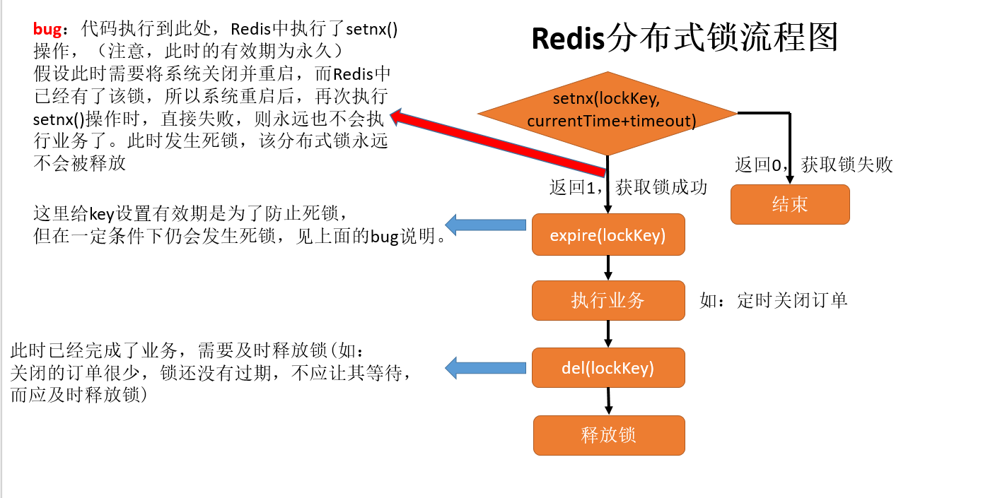
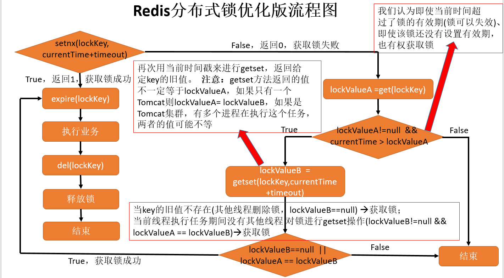

缓存作为提升性能的利器无处不在，小到 CPU 缓存架构，大道分布式应用存储。分布式缓存系统提供了热点数据的随机访问机制，大大了提升了访问时间，但是带来的**问题是如何保证数据的一致性，引入分布式锁来解决这个问题**，主流的分布式存储系统基本就是 Redis。

如定时关闭订单，如果是单机的话，只有一个 Tomcat 执行关闭订单的任务，不会出现问题。但是当 Tomcat 集群时，相同的任务会有多个服务同时执行，这样，浪费了 MySQL 和服务器的性能(因为只有一台机器执行就可以了)，同时也会造成数据错乱(大家都在执行 SQL 语句)。

- 分布式锁，是指在分布式的部署环境下，通过锁机制来让多客户端互斥的对共享资源进行访问。
  - 宏观上有两种场景需要用到分布式锁：
    - 效率：锁可以避免不必要地执行相同地工作两次
      如果锁定失败且多个节点最终完成相同的工作，结果是成本略有增加(浪费内存/CPU)或出现重复数据(如给用户发多次短信) 
    - 正确性：锁可以防止并发进程弄乱系统状态
      如果锁定失败且多个节点同时处理同一条数据，则结果是文件损坏、数据丢失，永久性不一致或其他严重问题
  - 分布式锁要满足：
    - 互斥性：在同一时间只会有一个客户端能获取到锁，其它客户端无法同时获取；
    - 避免死锁：这把锁在一段有限的时间之后，一定会被释放（正常释放或异常释放）；
    - 锁删除：当客户端需要释放资源时，会删除 key
    - 高可用：获取或释放锁的机制必须高可用且性能佳。
  - 实现方式：
    - 基于数据库实现，利用主键唯一规则、MySQL 行锁
    - 基于 Redis 实现，主要是依赖 Redis 自身的原子操作
      - Redis 锁的 Java 开源实现：Redission
    - 基于 ZooKeeper 实现：使用它的临时有序节点来实现
    - 方案比较：
      - 实现复杂性：Zookeeper >= 缓存 > 数据库
      - 性能：缓存 > Zookeeper >= 数据库
      - 可靠性：Zookeeper > 缓存 > 数据库

# Redis 分布式锁

Redis 分布式锁相关的命令：

- `setnx`，实现分布式锁地互斥性
- `getset`，获取旧值设置新值
- `expire`，通过 key 地有效期来避免死锁
- `del`，锁删除

## 版本一



```java
@Scheduled(cron = "0 */1 * * * ?")
public void distributedLock(){
    Long lockTimeout = 5000L;
    Long setnxResult = RedisShardedPoolUtil.setnx("lockKey", String.valueOf(System.currentTimeMillis() + lockTimeout));

    if (setnxResult != null && setnxResult.intValue() == 1) {
        closeOrder("lockKey");
    } else {
        log.info("没有获得分布式锁：{}","lockKey");
    }
    log.info("关闭订单定时任务结束");
}

/**关闭订单。其中会为分布式锁设置有效期！这里是将重复代码抽取出来了*/
private void closeOrder(String lockKey) {
    //设置锁的有效期为5秒，防止死锁。
    RedisShardedPoolUtil.expire(lockKey, 5);
    //打印哪个线程获取了锁
    log.info("获取：{}，ThreadName：{}", lockKey, Thread.currentThread().getName());
    int hour = 2;
    orderService.closeOrder(hour); // 2小时内未付款的订单被关闭
    //此时已经关闭了订单，要及时释放锁(如：关闭的订单很少，锁还没有过期，不应让其等待，而应及时释放锁)
    RedisShardedPoolUtil.del(lockKey);
    log.info("释放：{}，ThreadName：{}", lockKey, Thread.currentThread().getName());
}
```

## 版本二

如图所示，上面的 Redis 分布式锁有一定的 bug：setnx 和 expire 是两个命令，不具有原子性，如果 setnx 执行完成后服务器宕机导致锁没有设置过期时间，那么将会发生死锁。为了解决这一问题，对其进行了优化：



```java
/**定时关闭订单*/
@Component
@Slf4j
public class CloseOrderTask {
    @Autowired
    private OrderService orderService;

    @Scheduled(cron = "0 */1 * * * ?")
    public void closeOrderTaskV3(){
        log.info("关闭订单定时任务启动");
        Long lockTimeout = 5000L; //5000ms
        //这里将值设置为过期时的系统时间，RedisShardedPoolUtil是自己封装的Redis工具类
        Long setnxResult = RedisShardedPoolUtil.setnx("lockKey", String.valueOf(System.currentTimeMillis() + lockTimeout));

        if (setnxResult != null && setnxResult.intValue() == 1) {
            //如果返回值为1，代表设置成功，获取锁
            closeOrder("lockKey");
        } else {
            //未获取到锁，继续判断时间戳，看是否可以重置并获取到锁
            String lockValueStr = RedisShardedPoolUtil.get("lockKey");
         	//这里可能是由于刚setnx操作还没有expire之前，服务器以外宕机，导致该锁没有设置有效期
            if (lockValueStr != null && System.currentTimeMillis() > Long.parseLong(lockValueStr)) {
                String getSetResult = RedisShardedPoolUtil.getSet("lockKey", String.valueOf(System.currentTimeMillis() + lockTimeout));
                //使用给定key的旧值进行判断，是否可以获得锁
                //当key没有旧值时，即key不存在时，返回nil（使用Jedis得到的就是null）-->获取锁
                //没有其他线程对锁进行getset操作-->获取锁
                if (getSetResult == null || (getSetResult != null && StringUtils.equals(lockValueStr, getSetResult))) {
                    //真正获取到锁
                    closeOrder("lockKey");
                } else {
                    log.info("没有获得分布式锁：lockKey");
                }
            }else {
                log.info("没有获得分布式锁：lockKey");
            }
        }
        log.info("关闭订单定时任务结束");
    }

    /**关闭订单。其中会为分布式锁设置有效期！这里是将重复代码抽取出来了*/
    private void closeOrder(String lockKey) {
        //设置锁的有效期为5秒，防止死锁。
        RedisShardedPoolUtil.expire(lockKey, 5);
        //打印哪个线程获取了锁
        log.info("获取：{}，ThreadName：{}", lockKey, Thread.currentThread().getName());
        int hour = 2;
        orderService.closeOrder(hour); // 2小时内未付款的订单被关闭
        //此时已经关闭了订单，要及时释放锁(如：关闭的订单很少，锁还没有过期，不应让其等待，而应及时释放锁)
        RedisShardedPoolUtil.del(lockKey);
        log.info("释放：{}，ThreadName：{}", lockKey, Thread.currentThread().getName());
    }
}
```

## 版本三！

版本二的问题：

1. 由于是客户端自己生成过期时间，所以需要强制要求分布式下每个客户端的时间必须同步。
2. 当锁过期的时候，如果多个客户端同时执行 getSet()方法，那么虽然最终只有一个客户端可以加锁，但是这个客户端的锁的过期时间可能被其他客户端覆盖；
3. 锁不具备拥有者标识，即任何客户端都可以解锁。

**加锁**：

- set()加入 NX 参数，保证如果已有 key 存在，则函数不会调用成功，即只有一个客户端能持有锁，满足互斥性；
- 对锁设置了过期时间，即使锁的持有者后续发生崩溃而没有解锁，锁也会因为到了过期时间而自动解锁（即 key 被删除），不会发生死锁
- 将 value 赋值为 requestId，代表加锁的客户端请求标识，那么在客户端在解锁的时候就可以进行校验是否是同一个客户端

```java
public class RedisTool {
    private static final String LOCK_SUCCESS = "OK";
    private static final String SET_IF_NOT_EXIST = "NX";
    private static final String SET_WITH_EXPIRE_TIME = "PX";

    /**
     * 尝试获取分布式锁
     * @param jedis Redis客户端
     * @param lockKey 锁,使用key当锁，因为key是唯一的
     * @param requestId 请求标识，通过给value赋值为requestId，我们就知道这把锁是哪个请求加的了，在解锁的时候就可以有依据。requestId可以使用UUID.randomUUID().toString()方法生成
     * @param expireTime 超期时间
     * @return 是否获取成功
     */
    public static boolean tryGetLock(Jedis jedis, String lockKey, String requestId, int expireTime) {
        String result = jedis.set(lockKey, requestId, SET_IF_NOT_EXIST, SET_WITH_EXPIRE_TIME, expireTime);
        if (LOCK_SUCCESS.equals(result)) {
            return true;
        }
        return false;
    }
}
```

**解锁**：

```java
public class RedisTool {
    private static final Long RELEASE_SUCCESS = 1L;

    /**
     * 释放分布式锁
     * @param jedis Redis客户端
     * @param lockKey 锁
     * @param requestId 请求标识
     * @return 是否释放成功
     */
    public static boolean releaseLock(Jedis jedis, String lockKey, String requestId) {
		// Lua脚本:首先获取锁对应的value值，检查是否与requestId相等，如果相等则删除锁（解锁）
        String script = "if redis.call('get', KEYS[1]) == ARGV[1] then return redis.call('del', KEYS[1]) else return 0 end";
        Object result = jedis.eval(script, Collections.singletonList(lockKey), Collections.singletonList(requestId));

        if (RELEASE_SUCCESS.equals(result)) {
            return true;
        }
        return false;
    }
}
```

## Redission 实现

[Redission](https://redisson.org/)是架设在 Redis 基础上的一个 Java 驻内存数据网格(In-Memory Data Grid)，在基于 NIO 的 Netty 框架上，充分利用了 Redis 键值数据库提供的一系列优势，在 Java 使用工具包中常用接口的基础上，为使用者提供了一系列具有分布式特性的常用工具类。

使得原本作为协调单机多线程并发程序的工具包获得了协调分布式多机多线程并发系统的能力，大大降低了设计和研发大规模分布式系统的难度，同时结合各富特色的分布式服务，更进一步简化了分布式环境中程序相互之间的协作。

引入：

```xml
<dependency>
    <groupId>org.redisson</groupId>
    <artifactId>redisson</artifactId>
    <version>3.10.1</version>
</dependency>

<dependency>
    <groupId>com.fasterxml.jackson.dataformat</groupId>
    <artifactId>jackson-dataformat-avro</artifactId>
    <version>2.9.8</version>
</dependency>
```

Redission 初始化：

```java
/**
 * Redission的初始化类
 * @author +1day
 */
@Component
@Slf4j
public class RedissionManager {
    private Config config = new Config(); //redission包的config

    private Redisson redisson = null;

    private static String redis1Ip = PropertiesUtil.getProperty("redis1.ip");
    private static Integer redis1Port = Integer.parseInt(PropertiesUtil.getProperty("redis1.port"));
    private static String redis2Ip = PropertiesUtil.getProperty("redis2.ip");
    private static Integer redis2Port = Integer.parseInt(PropertiesUtil.getProperty("redis2.port"));

    /**注解@PostConstruct：构造器完成后执行该init方法*/
    @PostConstruct
    private void init() {
        try {
            config.useSingleServer().setAddress(new StringBuilder().append("redis://").append(redis1Ip).append(":").append(redis1Port).toString());
            redisson = (Redisson) Redisson.create(config);
            log.info("初始化Redission结束");
        } catch (Exception e) {
            log.error("Redission init error",e);
        }
    }

    public Redisson getRedisson() {
        return redisson;
    }
}
```

构建分布式锁：Redission 保存的锁 key 是一个 UUID、value=1，主要是通过 ttl 来控制的

```java
/**定时关闭订单*/
@Component
@Slf4j
public class CloseOrderTask {
    @Autowired
    private OrderService orderService;
	@Autowired
    private RedissionManager redissionManager;

    /**使用Redission框架完成分布式锁功能*/
    @Scheduled(cron = "0 */1 * * * ?")
    public void closeOrderTaskV4(){
        RLock lock = redissionManager.getRedisson().getLock("lockKey");
        boolean getLock = false;
        try {
            //尝试获取锁时最多等待0秒，该锁最多50秒就会被释放。返回值为是否获取锁成功
            //第一个Tomcat尝试获取锁并成功，开始执行定时任务，
            //而第二个Tomcat尝试获取锁并开始等待，
            //如果定时任务执行的非常快，第一个Tomcat在waitTime内完成定时任务，则第二个Tomcat也会成功获取锁，所以如果无法预估waitTime的话，最好将其设置为0s
            if (getLock = lock.tryLock(0, 50, TimeUnit.SECONDS)) {
                log.info("Redission获取到分布式锁:{},ThreadName:{}", "lockKey", Thread.currentThread().getName());
                int hour = 2;
                // 2小时内未付款的订单被关闭
                orderService.closeOrder(hour);
            } else {
                log.info("Redission未获取到分布式锁:{},ThreadName:{}","lockKey",Thread.currentThread().getName());
            }
        } catch (InterruptedException e) {
            log.error("Redission获取分布式锁异常", e);
        } finally {
            if (!getLock) {
                return;
            }
            lock.unlock();
            log.info("Redission释放分布式锁");
        }
    }
}
```
