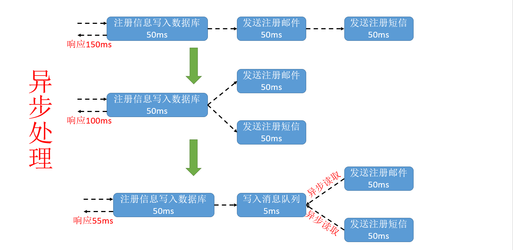

# 消息队列

背景：在分布式系统中如何处理高并发？

由于在高并发环境下，来不及同步处理用户发送的请求，则会导致请求发生阻塞。如：大量的insert、update等请求同时到达数据库，导致无数的行锁、表锁，甚至会导致请求堆积很多，从而触发 too many connections 错误。使用消息队列可以解决异步通信。

消息队列可以做：

- 异步：

- 并行：
  - 请求——>写数据库并发送消息队列——>
    - 发送消息队列——>发送通知
    - 发送消息队列——>发送通知
    - ...
- 排队

消息队列的弊端：消息的不确定性。（延迟队列、轮询技术可解决）