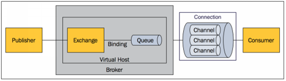

# RabbitMQ简介

RabbitMQ是一个由Erlang开发的AMQP的开源实现。用于在分布式系统中存储转发消息，在易用性、扩展性、高可用性等方面表现不俗。==核心概念==：

- Message：消息是不具名的，由消息头和消息体组成。
  - 消息体是不透明的，由一系列的可选属性组成，这些属性包括：
    - routing-key（路由键）
    - priority（相对于其他消息的优先权）
    - delivery-mode（指出该消息可能需要持久性存储）等；
- Publisher：消息的生产者，也是一个向交换器发布消息的客户端应用程序；
- Exchange：交换器，用来接收生产者发送的消息并将消息路由给服务器中的队列。有四种类型：
  - direct：**消息中的路由键(routing key)如果和Binding中的binding key完全一致**，交换器就将消息发到对应队列中。点对点；
  - fanout：每个发到 fanout 类型交换器的消息都会**分到所有绑定的队列上**。fanout 交换器不处理路由键，只是简单的将队列绑定到交换器上，每个发送到交换器的消息都会被转发到与该交换器绑定的所有队列上。转发消息最快。发布订阅；
  - topic：通过**模式匹配**分配消息的路由键属性，将路由键和某个模式进行匹配，此时队列需要绑定到一个模式上。它将**路由键和绑定键的字符串切分成单词**，这些**单词之间用`.`隔开**。它同样也会识别**两个通配符：`#`和`*`。 `#`匹配 0 个或多个单词， `*`匹配一个单词。发布订阅**；
  - headers：匹配 AMQP 消息的 header而不是路由键， headers 交换器和 direct 交换器完全一致，但性能差很多，目前几乎用不到了。
- Queue：消息队列，用来保存消息直到发送给消费者。它是消息的容器，也是消息的终点。一个消息可投入一个或多个队列。消息一直在队列里面，等待消费者连接到这个队列将其取走；
- Binding：绑定，基于路由键将 Exchange 和 Queue 按路由规则绑定起来。Exchange 和Queue的绑定可以是多对多的关系；
- Connection：网络连接，比如一个TCP连接；
- Channel：信道，多路复用连接中的一条独立的双向数据流通道。信道是建立在真实的TCP连接内的虚拟连接，AMQP 命令都是通过信道发出去的，不管是发布消息、订阅队列还是接收消息，这些动作都是通过信道完成。因为对于操作系统来说建立和销毁 TCP 都是非常昂贵的开销，所以引入了信道的概念，以复用一条 TCP 连接；
- Consumer：消息的消费者，表示一个从消息队列中取得消息的客户端应用程序；
- Virtual Host：虚拟主机，表示一批交换器、消息队列和相关对象。虚拟主机是共享相同的身份认证和加密环境的独立服务器域。每个 vhost 本质上就是一个 mini 版的 RabbitMQ 服务器，拥有自己的队列、交换器、绑定和权限机制。vhost 是 AMQP 概念的基础，必须在连接时指定，RabbitMQ 默认的 vhost 是 / ；
- Broker：表示消息队列服务器实体。

# RabbitMQ运行机制

AMQP中的消息路由：AMQP 中消息的路由过程和JMS 有一些差别，AMQP 中增加了 Exchange 和 Binding 的角色。生产者把消息发布到 Exchange 上，消息最终到达队列并被消费者接收，而 Binding 决定交换器的消息应该发送到那个队列。

# RabbitMQ的高可用

基于主从做高可用性的。RabbitMQ 有三种模式：
- 单机
- 普通集群：在多台机器上启动多个RabbitMQ实例，每个机器启动一个。但是你、创建的queue，只会放在一个RabbitMQ实例上，每个实例都同步queue的元数据。消费时，如果连接到了另外一个实例，那么那个实例会从queue所在实例上拉取数据过来。获取数据的两种方式：
  - 消费者每次随机连接一个实例然后拉取数据==>数据拉取的开销
  - 固定连接那个queue所在实例消费数据==>导致单实例性能瓶颈
- 镜像集群：创建的queue，无论元数据还是queue里的消息都会存在于多个实例上，然后每次写消息到queue的时候，都会自动把消息到多个实例的queue里进行消息同步。
  - 性能开销大，消息同步所有机器，导致网络带宽压力和消耗很重；
  - 开启：在管理控制台新增一个镜像集群模式的策略。指定的时候可以要求数据同步到所有节点的，也可以要求就同步到指定数量的节点，然后你再次创建queue的时候，应用这个策略，就会自动将数据同步到其他的节点上去了。

# 保证消息顺序性

RabbitMQ：拆分多个queue，每个queue一个consumer，就是多一些queue而已，确实是麻烦点；或者就一个queue但是对应一个consumer，然后这个consumer内部用内存队列做排队，然后分发给底层不同的worker来处理

