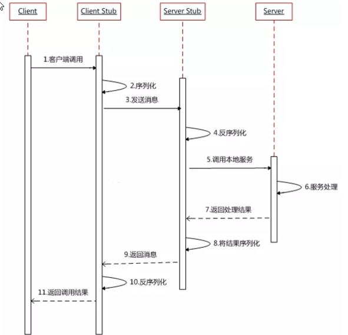

# 分布式

通常的消息传递方式：

- 对外：REST
- 模块内部：RPC
- 模块之间：消息中间件、REST

分布式架构 vs 微服务架构：

- 分布式：指导节点间如何通信
- 微服务：鼓励按业务划分模块
- 微服务架构通过分布式架构来实现

多层架构 vs 微服务架构：

- 微服务架构有更多的“服务”
- 微服务通常需要配合自动化测试、部署、发现等
- 目前我们倾向于微服务架构

# 一致性理论

## 强一致性ACID

单机环境下，对传统关系型数据库要求严格，由于存在网络的延迟和消息丢失，ACID 是保证事务的原则。详见 SQL 的事务部分

- 原子性（Atomicity）
- 一致性（Consistency）
- 隔离性（Isolation）
- 持久性（Durability）

## 分布式一致性CAP

分布式环境下，我们无法保证网络的正常连接和信息的传送，于是发展出了CAP/FLP/DLS这三个重要的理论。

- CAP 理论：一个分布式系统不可能同时满足以上三个需求，==最多只能同时较好的满足两个==！而**由于当前的网络硬件肯定会出现延迟丢包等问题，所以分区容错性是必须需要实现的**
  - 强一致性（Consistency）：在分布式系统中的所有数据备份，在同一时刻是否同样的值。（等同于所有节点访问同一份最新的数据副本）；
  - 可用性（Availability）：在集群中一部分节点故障后，集群整体是否还能响应客户端的读写请求。（对数据更新具备高可用性）；
  - 分区容错性（Partition tolerance）： 以实际效果而言，分区相当于对通信的时限要求。系统如果不能在时限内达成数据一致性，就意味着发生了分区的情况。
- FLP 理论：在异步环境中，如果节点间的网络延迟没有上限，只要有一个恶意的节点存在，就没有算法能在有限的时间内达成共识。
- DLS 理论：
  - 在一个部分同步网络的模型（也就是说：网络延时有界限但是我们并不知道在哪里）下运行的协议可以容忍1/3任意（换句话说，拜占庭）错误；
  - 在一个异步模型中的确定性的协议（没有网络延时上限）不能容错（不过这个论文没有提起随机化算法可以容忍1/3的错误）；
  - 同步模型中的协议（网络延时可以保证小于已知d时间）可以，令人吃惊的，达到100%容错，虽然对1/2的节点出错可以发生的情况有所限制。

## 弱一致性BASE

多数情况下，其实我们也并非一定要求强一致性，部分业务可以容忍一定程度的延迟一致，所以为了兼顾效率，发展出来了最终一致性理论 BASE。

- 基本可用（Basically Available）：分布式系统在出现故障的时候，允许损失部分可用性，即保证核心可用；
- 软状态（Soft state）：允许系统存在中间状态，而该中间状态不会影响系统整体可用性；
  - 分布式存储中一般一份数据至少会有三个副本，允许不同节点间副本同步的延时就是软状态的体现。
- 最终一致性（Eventually consistent）：系统中的所有数据副本经过一定时间后，最终能够达到一致的状态。

分布式架构的核心就在一致性的实现和妥协，那么如何设计一套算法来保证不同节点之间的通信和数据达到无限趋向一致性，就非常重要了。保证不同节点在充满不确定性网络环境下能达成相同副本的一致性是非常困难的。

# RPC

RPC(Remote Procedure Call)：远程过程调用，是一种进程间通信方式，它是一种技术的思想而不是规范。运训程序调用另一个地址空间(通常是共享网络的另一台机器上)的过程或函数，而不用程序员显式编码这个远程调用的细节。原理见Dubbo笔记。

RPC 两个核心模块：通讯、序列化。

RPC 框架：Dubbo、gRPC、Thrift、HSF(High Speed Service Framework)

RPC流程：

# 熔断&隔离&限流

多个微服务之间调用的时候，假设微服务A调用微服务B和微服务C，微服务B和微服务C又调用其它的微服务，这就是所谓的“扇出”。如果扇出的链路上某个微服务的调用响应时间过长或者不可用，对微服务A的调用就会占用越来越多的系统资源，进而引起系统崩溃，所谓的**“雪崩效应”**。

对于高流量的应用来说，单一的后端依赖可能会导致所有服务器上的所有资源都在几秒钟内饱和。比失败更糟糕的是，这些应用程序还可能导致服务之间的延迟增加，备份队列，线程和其他系统资源紧张，导致整个系统发生更多的级联故障。这些都表示需要对故障和延迟进行隔离和管理，以便单个依赖关系的失败，不能取消整个应用程序或系统。

一般情况对于服务依赖的保护主要有3中解决方案：

- **熔断模式**：这种模式主要是参考电路熔断，如果一条线路电压过高，保险丝会熔断，防止火灾。放到我们的系统中，**如果某个目标服务调用慢或者有大量超时，此时，熔断该服务的调用，对于后续调用请求，不在继续调用目标服务，直接返回，快速释放资源。如果目标服务情况好转则恢复调用**。
- **隔离模式**：这种模式就像对系统请求按类型划分成一个个小岛的一样，当某个小岛被火烧光了，不会影响到其他的小岛。**例如可以对不同类型的请求使用线程池来资源隔离，每种类型的请求互不影响，如果一种类型的请求线程资源耗尽，则对后续的该类型请求直接返回，不再调用后续资源**。
  - 使用场景非常多，例如将一个服务拆开，对于重要的服务使用单独服务器来部署。
- **限流模式**：上述的**熔断模式和隔离模式都属于出错后的容错处理机制，而限流模式则可以称为预防模式**。限流模式主要是**提前对各个类型的请求设置最高的QPS阈值，若高于设置的阈值则对该请求直接返回，不再调用后续资源**。这种模式**不能解决服务依赖的问题，只能解决系统整体资源分配问题**，因为没有被限流的请求依然有可能造成雪崩效应。

# 常见缩写

**QPS**(Queries Per Second，每秒查询数)：每秒能够响应的查询次数。

QPS是对一个特定的查询服务器在规定时间内所处理流量多少的衡量标准，在因特网上，作为域名系统服务器的机器的性能经常用每秒查询率来衡量。每秒的响应请求数，也即是最大吞吐能力。

---

**TPS**(Transactions Per Second)：每秒处理的事务数目。

一个事务是指一个客户机向服务器发送请求然后服务器做出反应的过程。客户机在发送请求时开始计时，收到服务器响应后结束计时，以此来计算使用的时间和完成的事务个数，最终利用这些信息作出的评估分。

TPS 的过程包括：客户端请求服务端、服务端内部处理、服务端返回客户端。

例如，访问一个 Index 页面会请求服务器 3 次，包括一次 html，一次 css，一次 js，那么访问这一个页面就会产生一个“T”，产生三个“Q”。

---

**PV**(page view，页面浏览量)

通常是衡量一个网络新闻频道或网站甚至一条网络新闻的主要指标。户每一次对网站中的每个页面访问均被记录 1 次。用户对同一页面的多次刷新，访问量累计。

与 PV 相关的还有 **RV**，即重复访问者数量（repeat visitors）。

---

**UV** (Unique Visitor，独立访客访问数)

统计1天内访问某站点的用户数(以 cookie 为依据)，一台电脑终端为一个访客。

---

**IP**(Internet Protocol)独立 IP 数，是指 1 天内多少个独立的 IP 浏览了页面，即统计不同的 IP 浏览用户数量。同一 IP 不管访问了几个页面，独立 IP 数均为 1；不同的 IP 浏览页面，计数会加 1。IP 是基于用户广域网 IP 地址来区分不同的访问者的，所以，多个用户（多个局域网 IP）在同一个路由器（同一个广域网 IP）内上网，可能被记录为一个独立 IP 访问者。如果用户不断更换 IP，则有可能被多次统计。

---

**GMV**(Gross Merchandise Volume)

只要是订单，不管消费者是否付款、卖家是否发货、是否退货，都可放进 GMV 。

---

**RPS**(Requests Per Second) 代表吞吐率。

吞吐率是服务器并发处理能力的量化描述，单位是 reqs/s，指的是某个并发用户数下单位时间内处理的请求数。
某个并发用户数下单位时间内能处理的最大的请求数，称之为最大吞吐率。