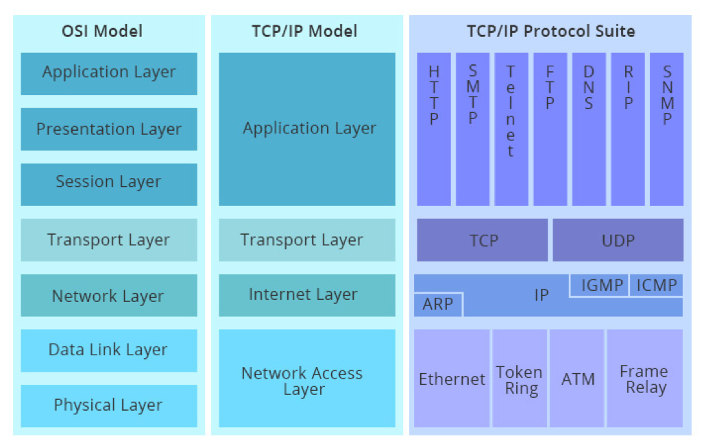

前面带 `$` 的为输入，不带的为输出

# 基础

基于 [ABNF](https://www.ietf.org/rfc/rfc5234.txt) 描述的 HTTP 协议格式：

```

```

示例：通过Xshell 自带 telnet 工具：

```shell
$ telnet www.taohui.pub 80
Host 'www.taohui.pub' resolved to 116.62.160.193.
Connecting to 116.62.160.193:80...
Connection established.
To escape to local shell, press 'Ctrl+Alt+]'.
$ GET /wp-content/plugins/Pure-Highlightjs_1.0/assets/pure-highlight.css?ver=0.1.0 HTTP/1.1
$ Host:www.taohui.pub  # 然后按两次回车

HTTP/1.1 200 OK
Server: openresty/1.15.8.3
Date: Tue, 02 Jun 2020 13:38:25 GMT
Content-Type: text/css
Content-Length: 108
Last-Modified: Thu, 27 Dec 2018 07:35:33 GMT
Connection: keep-alive
ETag: "5c2480c5-6c"
Expires: Tue, 09 Jun 2020 13:38:25 GMT
Cache-Control: max-age=604800
Accept-Ranges: bytes

pre.pure-highlightjs {
    background-color: transparent;!important;
    border: none;
    padding: 0;
}
```

以上方式得到的 HTTP 响应是看不见不可见字符(如空格、换行)的，可以使用 Wireshark 抓包工具，通过查看十六进制信息来查看这些不可见字符。

- OS(Open System Interconnect) 七层概念模型
  - 应用层，用于解决业务问题
  - 表示层，负责把网络中的消息转换成应用层可以读取的消息
  - 会话层
  - 传输层，解决进程与进程间的通信、TCP 协议还做了报文的可达性、流量控制
  - 网络层，IP 协议确保在广域网中可以将报文从一个主机发送到另一个主机
  - 数据链路层，局域网中通过 MAC 地址连接到相应的交换机、路由器等，然后就可以把报文发送到另一个主机了
  - 物理层，物理介质

每一层都利用其下层的服务，为其上层提供服务。第一层直接为第二层服务，第七层为模型外的用户服务。


对比 OSI 七层模型和 TCP/IP 模型：




Chrome 抓包：

