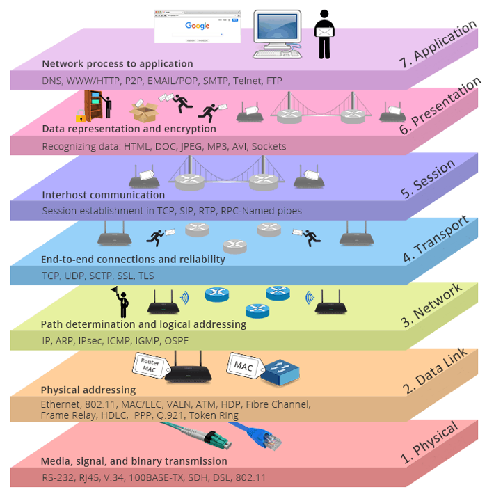

https://gitee.com/geektime-geekbang/geektime-webprotocol
https://github.com/geektime-geekbang/geektime-webprotocol

HTTP 协议是一种**无状态的**、**应用层的**、**以请求/应答方式运行**的协议，它使用可扩展的语义和自描述消息格式，与基于网络的超文本信息系统灵活的互动。

HTTP 请求的状态：

- 有状态的请求，服务器端保存请求的相关信息，每个请求可以使用以前保留的请求相关信息
  - 服务器 session 机制使服务器保存请求的相关信息
  - cookie 使请求可以携带查询信息，与 session 配合完成有状态的请求
- 无状态的请求，服务器能够处理的所有信息都来自当前请求所携带的信息
  - 服务器不会保存 session 信息
  - 请求可以通过 cookie 携带

# 网络分层

- OSI(Open System Interconnect) 七层**概念模型**（从未被真正实现过！）
  - 应用层，用于解决业务问题
  - 表示层，负责把网络中的消息转换成应用层可以读取的消息
  - 会话层，负责建立会话、握手、维持连接关闭。只是一个概念，帮助理解 session 的概念
  - 传输层，解决进程与进程间的通信，TCP 协议还做了报文的可达性、流量控制
  - 网络层，IP 协议确保在广域网中可以将报文从一个主机发送到另一个主机
  - 数据链路层，局域网中通过 MAC 地址连接到相应的交换机、路由器等，然后就可以把报文发送到另一个主机了
  - 物理层，物理介质

每一层都利用其下层的服务，为其上层提供服务。第一层直接为第二层服务，第七层为模型外的用户服务。



对比 OSI 七层模型和 TCP/IP 模型：


工作在 OSI 二层（数据链路层）的网络设备为交换机，工作在 OSI 三层（网络层）的设备为路由器。

工作在 OSI 四层（传输层）的负载均衡器（如 LVS）可以将 Client 传过来的 TCP 报文以第二条 TCP 连接的方式转发给 Server，对于 UDP 会话也可以这样。四层负载均衡不会解析 TCP、UDP 上承载的应用层协议。

工作在 OSI 七层（应用层）的负载均衡器可以进行协议转换，示例：
1. Client 通过 HTTP/1.1 发送请求，假设 Server 不支持 HTTP/1.1，负载均衡器可以将请求转换为 HTTP/1.0 来连接 Server；
2. Client 通过 HTTP/1.1 + TLS 发送请求，假设 负载均衡到 Server 是基于企业内网的，其本身就是安全的，负载均衡器会剥离 TLS 协议，还可以将 HTTP/1.1 转换为更为高效的协议，如 uwsgi
3. Client 通过 HTTP/2 发送请求，假设 Server 不支持 HTTP/2，负载均衡器可以将请求转为 HTTP/1.1，如果 Server 是在外网部署的，还会加上 TLS

七层负载均衡可以解析出 header、body 等 message 中的各种信息，所以 WAF（Web Application Firewall）防火墙是可以天然放在七层负载均衡中的。

七层负载均衡通常还有缓存功能，因为它解析出了 header、body 等内容，就可以在七层负载均衡做一层缓存。

# HTTP 消息格式

基于 [ABNF](https://www.ietf.org/rfc/rfc5234.txt) 描述的 HTTP 协议格式：HTTP-message = `start-line *(header-field CRLF)CRLF [message-body]`

- start-line = `request-line / status-line`
  - request-line = `method SP request-target SP HTTP-version CRLF`
  - status-line = `HTTP-version SP status-code SP reason-phase CRLF`
- header-field = `field-name ":" OWS field-value OWS`
  - OWS = `*(SP/HTAB)`
  - field-name = `token`
  - field-value = `*(field-content / obs-fold)`
- message-body = `*OCTET`，0 或多个二进制字节流

示例：

```shell
$ telnet www.taohui.pub 80
Host 'www.taohui.pub' resolved to 116.62.160.193.
Connecting to 116.62.160.193:80...
Connection established.
To escape to local shell, press 'Ctrl+Alt+]'.
$ GET /wp-content/plugins/Pure-Highlightjs_1.0/assets/pure-highlight.css?ver=0.1.0 HTTP/1.1
$ Host:www.taohui.pub  # 然后按两次回车

HTTP/1.1 200 OK
Server: openresty/1.15.8.3
Date: Tue, 02 Jun 2020 13:38:25 GMT
Content-Type: text/css
Content-Length: 108
Last-Modified: Thu, 27 Dec 2018 07:35:33 GMT
Connection: keep-alive
ETag: "5c2480c5-6c"
Expires: Tue, 09 Jun 2020 13:38:25 GMT
Cache-Control: max-age=604800
Accept-Ranges: bytes

pre.pure-highlightjs {
    background-color: transparent;!important;
    border: none;
    padding: 0;
}
```

以上方式得到的 HTTP 响应是看不见不可见字符(如空格、换行)的，可以使用 Wireshark 抓包工具，通过查看十六进制信息来查看这些不可见字符。

> RFC规定，如果请求中没有携带Host头部，一律返回400 Bad Request，目前基本Web服务器都遵循这一规则。

# URI

URL（Uniform Resource Locator），表示资源的位置，期望提供查找资源的方法；

URN（Uniform Resource Name），期望为资源提供持久的、位置无关的标识方式，允许简单地将多个命名空间映射到单个 URN 命名空间；

URI（Uniform Resource Identifier），用以区分资源，是 URL 和 URN 的超集，用以取代 URL 和 URN 概念。

URI 的 ABNF 格式：URI = `scheme ":" hier-part [ "?" query ] [ "#" fragment ]`

- scheme = `ALPHA *( ALPHA / DIGIT / "+" / "-" / "." )`
  - 如：http, https, ftp,mailto,rtsp,file,telnet
- query = `*( pchar / "/" / "?" )`
- fragment = `*( pchar / "/" / "?" )`
- hier-part = `"//" authority path-abempty / path-absolute / path-rootless / path-empty`
  - userinfo = `*( unreserved / pct-encoded / sub-delims / ":" )`
  - host = `IP-literal / IPv4address / reg-name`
  - port = `*DIGIT`
- path = `path-abempty/ path-absolute/ path-noscheme / path-rootless / path-empty`
  - path-abempty = `*( "/" segment )`，以/开头的路径或者空路径
  - path-absolute = `"/" [ segment-nz *( "/" segment ) ]`，以/开头的路径，但不能以//开头
  - path-noscheme = `segment-nz-nc *( "/" segment )`，以非:号开头的路径
  - path-rootless = `segment-nz *( "/" segment )`，相对path-noscheme，增加允许以:号开头的路径
  - path-empty = `0<pchar>`，空路径

相对 URI，URI-reference = `URI/relative-ref`

- relative-ref = `relative-part [ "?" query ] [ "#" fragment ]`
  - relative-part = `"//" authority path-abempty / path-absolute / path-noscheme / path-empty`


## URI 编码

Q：为什么需要对 URI 进行编码？

A：

1. 传递数据的时，可能会使用到那些用作分割符的保留字符，如在 baidu 中搜索 `?#!` 这样的内容，假设不做编码的话，请求会是 `https://www.baidu.com/s?wd=?#!`，而 `?` 是一个保留字符，本来想要搜索 `?#!`，结果其实只能搜索到 `#!`；
2. 需要对可能存在歧义的数据进行编码
   1. 不在 ASCII 码范围内的字符
   2. ASCII 码中不可显示的字符
   3. URI 中规定的保留字符
   4. 不安全字符(传输环节中可能会被不正确处理)，如空格、引号、尖括号等

URI 的编码方式为百分号编码：pct-encoded = `"%" HEXDIG HEXDIG`。

非 ASCII 码字符(例如中文):建议先 UTF8 编码，再 US-ASCII 编码；对 URI 合法字符，编码与不编码是等价的。
