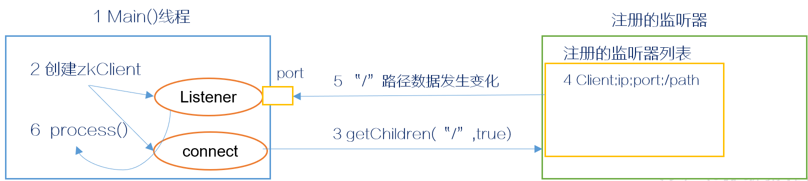

# 选举机制★

- **半数机制：集群中半数以上机器存活，集群可用。所以Zookeeper适合安装奇数台服务器**。

Zookeeper虽然在配置文件中并没有指定 Master 和 Slave。但是，Zookeeper工作时，是有一个节点为Leader，其他则为Follower，Leader是通过内部的选举机制临时产生的。**Leader 既可以为客户端提供写服务又能提供读服务。除了 Leader 外，Follower 和 Observer 都只能提供读服务。Follower 和 Observer 唯一的区别在于 Observer 机器不参与 Leader 的选举过程，也不参与写操作的“过半写成功”策略，因此 Observer 机器可以在不影响写性能的情况下提升集群的读性能。**


## 举例说明

假设有五台服务器组成的Zookeeper集群，它们的id从1-5，同时它们都是最新启动的，也就是没有历史数据，在存放数据量这一点上，都是一样的。假设这些服务器依序启动。


（1）服务器1启动，此时只有它一台服务器启动了，它发出去的报文没有任何响应，所以它的选举状态一直是LOOKING状态。

（2）服务器2启动，它与最开始启动的服务器1进行通信，互相交换自己的选举结果，由于两者都没有历史数据，所以id值较大的服务器2胜出，但是由于没有达到超过半数以上的服务器都同意选举它(这个例子中的半数以上是3)，所以服务器1、2还是继续保持LOOKING状态。

（3）服务器3启动，根据前面的理论分析，服务器3成为服务器1、2、3中的老大，而与上面不同的是，此时有三台服务器选举了它，所以它成为了这次选举的Leader。

（4）服务器4启动，根据前面的分析，理论上服务器4应该是服务器1、2、3、4中最大的，但是由于前面已经有半数以上的服务器选举了服务器3，所以它只能接收当小弟的命了。

（5）服务器5启动，同4一样当小弟。


# watcher机制★

- 针对每个节点的操作，都会有一个监督者——>watcher
- 当监控的某个对象(znode)发生变化，则触发watcher事件
- zk中的watcher是一次性的，触发后立即销毁
- 父子节点的增删改都能触发watcher事件
- 针对不同类型的操作，触发的watcher事件不同：
  - (子)节点创建事件：
    - 创建父节点会触发 NodeCreated 事件
    - ls 为父节点设置watcher，创建子节点触发 NodeChildrenChanged事件
  - (子)节点删除事件：
    - 删除父节点触发 NodeDeleted 事件
    - ls 为父节点设置watcher，删除子节点触发 NodeChildrenChanged事件
  - (子)节点数据变化事件：
    - 修改父节点数据会触发 NodeDataChanged 事件
    - ls 为父节点设置watcher，修改子节点不会触发事件，要使用 get 来设置，修改子节点也会触发 NodeDataChanged 事件



- 监听原理详解：

  - 首先要有一个 main()线程
  - 在 main 线程中创建 Zookeeper 客户端，这时就会创建两个线程，一个负责网络连接
    通信（connet），一个负责监听（listener）。
  - 通过 connect 线程将注册的监听事件发送给 Zookeeper。
  - 在 Zookeeper 的注册监听器列表中将注册的监听事件添加到列表中。
  - Zookeeper 监听到有数据或路径变化，就会将这个消息发送给 listener 线程。
  - listener 线程内部调用了 process（）方法。

- 常见的监听：

  - `stat path [watch]`：针对path设置一个watch事件，当path创建后，就可以查看path有哪些事件被触发。如：

    - `stat /fms5cmS watch`

    - `create /fms5cmS 123`，输出：

      ```shell
      WATCHER::
      
      WatchedEvent state:SyncConnected type:NodeCreated path:/fms5cmS
      Created /fms5cmS
      ```

  - 监听节点数据的变化：`get path [watch]`

  - 监听子节点增减的变化：`ls path [watch]`

- 场景：统一资源配置


# ACL权限控制

ACL(Access Control Lists)权限控制。

- 针对节点可以设置相关读写等权限，目的是为了保障数据安全性
- 权限 permissions 可以指定不同的权限范围及角色
- ACL 构成：ACL 通过`[scheme:id:permissions]`来构成权限列表。默认的权限为`world:anyone:cdrwa`
  - scheme：代表采用的某种权限机制，取值：
    - world：world下只有一个id，即只有一个用户anyone，写法：`world:anyone:[permissions]`
    - auth：代表认证登录，需要注册用户有权限就可以，写法：`auth:user:password:[permissions]`
    - digest：需要对密码加密才能访问，写法：`digest:username:BASE64(SHA1(password)):[permissions]`
    - ip：当设置为ip指定的 ip地址，此时限制ip进行访问，如：`ip:192.168.1.1:[permissions]`
    - super：代表超级管理员，有所有权限
  - id：代表允许访问的用户
  - permissions：权限组合字符串。权限字符串缩写为`crdwa`
    - CREATE：创建子节点
    - READ：获取节点/子节点
    - WRITE：设置节点数据
    - DELETE：删除子节点
    - ADMIN：设置权限
- ACL 命令行：
  - `getAcl path`：获取某个节点的 acl 权限信息。
  - `setAcl path acl`：设置某个节点的 acl 权限信息
  - `addauth scheme auth`：输入认证授权信息，注册时输入明文密码(登录)，但是在zk的系统中，密码是以加密的形式存在的
    - 在`setAcl path auth:zzk:zzk:cdrwa`时，发现并没有zzk用户，所以需要使用 addauth 来注册，如：`addauth digest zzk:zzk`，然后才可以setAcl
    - 注意，当`setAcl path auth:zzk:zzk:cdrwa`以后，再次`setAcl path auth:bx:bx:cdrwa`会发现其 acl 还是原来的 auth:zzk:zzk:cdrwa ，而不会发生改变，所以可以省略写为：`setAcl path auth::cdrwa`

ACL 的常用使用场景：

- 开发/测试环境分离，开发者无权操作数据库的节点，只能看
- 生产环境上控制指定ip的服务可以访问相关节点，防止混乱


# 四字命令

Four Letter Words。

- zk 可通过其自身提供的简写命令与服务器交互
- 需要使用到 nc 命令，安装：`yum install nc`
- `echo [commond] | nc [ip] [port]`


