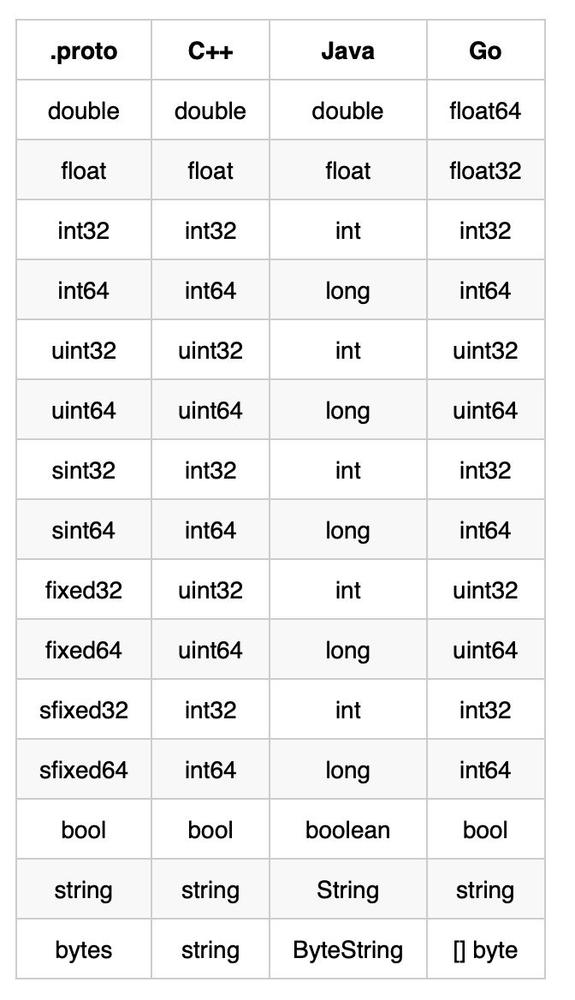

Protobuf 是 [Protocol Buffers](https://developers.google.com/protocol-buffers/) 的简称，是 Google 开发的一种数据描述语言。相比 XML/JSON 等数据描述语言，序列化效率更快、体积更小、更安全，但可读性较差、灵活性较低。可以通过附带工具生成代码并实现将结构化数据序列化的功能。Protobuf 作为接口规范的描述语言，可以作为设计安全的跨语言 PRC 接口的基础工具。

proto3 的语法详见[官网](https://developers.google.com/protocol-buffers/docs/proto3#scalar)！

# protoc

- 安装 Protobuf 编译器，即 [protoc 工具](https://github.com/protocolbuffers/protobuf/releases)，下载后解压，并在 PATH 环境变量中添加其 bin 目录；
- 安装针对 [Go 的 Protobuf 代码生成插件](https://developers.google.com/protocol-buffers/docs/reference/go-generated)：

```shell
go get -u github.com/golang/protobuf/protoc-gen-go
go install github.com/golang/protobuf/protoc-gen-go
```

protoc 编译器是通过插件机制实现对不同语言的支持，如 `protoc` 命令出现了 `--xxx_out` 格式的参数，就会先查询是否有内置的 xxx 插件，如果没有内置的 xxx 插件，就会继续查询当前系统中是否存在 protoc-gen-xxx 命名的可执行程序，最终通过查询到的插件生成代码。

针对 Go 语言的 protoc-gen-go 插件，里面又实现了一层静态插件系统，如内置的 gRPC 插件，可通过 `--go_out=plugins=grpc` 参数生成 gRPC 相关代码，否则只会针对 message 生成相关代码。

运行插件：

```shell
protoc --go_out=. --go_opt=paths=source_relative \
	--go-grpc_out=. --go-grpc_opt=paths=source_relative \
	protos/xxx.proto
```

会自动生成两个文件：

- xxx.pb.go 文件：所有对请求和响应消息类型进行填充、序列化、检索的代码
- xxx_grpc.pb.go 文件：用于客户端调用和用于服务端实现的接口代码

尽管客户端、服务端接口代码自动生成了，但仍需要实现并调用方法。

- 服务端：实现 service 定义的服务接口；运行 gRPC 服务区监听来自客户端的请求，并将其分发到正确的 service 实现上


## 输出文件路径

输出文件名：proto 文件名加上 `.pb.go` 即为生成的 Go 文件，如 hello.proto 生成 hello.pb.go

输出文件的完整路径：`--go_out` 参数指定基本路径 + 子路径

- `--go_out` 告诉 protoc 调用 protoc-gen-go 插件，在指定路径下生成输出文件
- 子路径：依赖于 proto 文件中 `go_package` 选项和 protoc 命令参数
  - 默认子路径放在 proto 文件中 `go_package` 选项指定的路径
    - foo.proto 文件中含 `option go_package = "example.com/foo/bar";`
    - protoc 命令最后的输入文件为 `protos/foo.proto`
    - 生成的子路径及文件：`example.com/foo/bar/foo.pb.proto`
  - protoc 命令包含 `--go_opt=paths=source_relative` 参数，输出文件会放在与输入文件相同的相对路径下
    - protoc 命令最后的输入文件为 `protos/foo.proto`
    - 生成的文件：`protos/foo.proto`

# 数据类型

- scalar numeric types（标量数值类型）



## enum

在定义消息类型时，可能希望它的某个字段只包含预定义的值列表中的一个，就可以使用 `enum`。

下面 message 示例中的 corpus 字段的值只能是 UNIVERSAL、WEB、IMAGES、LOCAL、NEWS、PRODUCTS、VIDEO 七个值的其中一个。

每一个 enum 定义时都必须包含一个**映射到 0 的常量**作为其**第一个**元素！如示例中的 UNIVERSAL。

通过给不同的 enum 常量分配相同的值来定义别名。需要设置 `option allow_alias=true`，否则 protoc 会报错：

```protobuf
message MyMessage1 {
  enum EnumAllowingAlias {
    option allow_alias = true;  // 这里必须设置！
    UNKNOWN = 0;
    STARTED = 1;
    RUNNING = 1;
  }
}
```

enum 常量必须在 32位整型范围内！且负值是无效的！

- 保留值：与下面 message 的保留字段类似，这里专指 enum 的值，同样不可在一个 `reserved` 中混用字段名和数值

```protobuf
enum Foo {
  reserved 2, 15, 9 to 11, 40 to max;
  reserved "FOO", "BAR";
}
```

## map

```protobuf
message PramMap{
	map<string, int32> m = 1;
}
```

- map 数据类型不支持 `repeated` 关键字；
- 键、值类型可以是内置的基本类型，也可以是自定义 message 类型；

# message

```protobuf
// 声明当前使用的语法为 proto3，不写则 protoc 默认使用的 proto2 语法
syntax = "proto3";
// 字段也可以是复合类型，包括 enum 和其他 message 类型
message SearchRequest {
  string query = 1;
  int32 page_number = 2;
  int32 result_per_page = 3;
  enum Corpus {
    UNIVERSAL = 0;
    WEB = 1;
    IMAGES = 2;
    LOCAL = 3;
    NEWS = 4;
    PRODUCTS = 5;
    VIDEO = 6;
  }
  Corpus corpus = 4;
}
```

- 字段编号：message 定义时，每个字段都有一个唯一编号，用于标识 message 二进制格式中的字段，一旦 message 类型被使用了，字段编号就不应再变更。

范围在 1~15 的编号，使用一个字节来编码，包括字段编号和字段类型；16~1024 的编号花费两个字节。最大编号可以是 $2^{29}-1$ 或 `536,870,911`，不允许使用 19000~19999 的编号。

- 字段规则：message 字段可以有两种：单数(singular)、可重复(`repeated`)

sinfular：字段名不能重复，最多只能有一个，可以为 0。这是 proto3 语法的默认字段规则；

`repeated`：该字段可以重复任意次，包括 0，等价于数组。重复值的顺序保持不变

proto3 中，标量数值类型的 `repeated` 字段默认使用 `packed` 编码。

- 保留字段

如果在更新 message 时，彻底移除某个字段或将其注释掉，未来其他人在更新 message 时可能会重用字段编号。如果他之后加载了旧版本的 proto 文件，这样可能会引起严重的问题，如数据损坏、隐私漏洞等。

所以在移除字段时，指定其字段编号 `reserved`（也可以对字段名 `reserved`），这样未来用户尝试使用这些字段编号时，protoc 会警告。

```protobuf
message Foo {
	// 不允许在同一个 reserved 语句中混用字段编号和字段名
  reserved 2, 15, 9 to 11;
  reserved "foo", "bar";
}
```

- message 的生成代码：对于 Go 语言，protoc 生成 `.pb.go` 的文件

该文件中包含了字段值的 get、set 方法、将 message 序列化到一个输出流、从一个输入流解析 message。

## 使用其他 message 类型

```protobuf
message SearchResponse {
  repeated Result results = 1; // 嵌入了 Result
}

message Result {
  string url = 1;
  string title = 2;
  repeated string snippets = 3;
}
```

上例是嵌入同一个 proto 文件中定义的 message，如果想嵌入另一个 proto 文件中定义的 message 呢？

可以在当前 proto 文件顶部增加 `import` 语句来导入另一个 proto 文件的定义。注意：即使是**同一个包下的 proto 文件也需要 import 才能使用**里面的定义。

```protobuf
// 导入时，建议写相对于项目的完整的导入路径
import "util/file.proto";  // 导入其他包下的 proto 文件
// 嵌入的 message 前需要加入包名（proto 文件中 package 声明的）！
```

默认只能使用直接导入的 proto 文件中定义的 message，但是，如果想要将 proto 文件移动到新的路径下，就需要修改掉所有导入该 proto 文件的 import 语句，有没有好的办法呢？

可以在旧路径下放一个 dummy proto 文件，并使用 `import public xxx`，将所有对文件的导入转发到新的路径，这种方式是可传递的！

pkg/article.proto：包含了很多定义，`package pkg;`

article/article_forward.proto：

```protobuf
package article;
import public "pkg/article.proto";
import "tag/tag.proto";
```

user/user.proto：

```protobuf
package user;
import "article/article_forward.proto"

message UserInfo{
	string name = 1;
	// 可以正常嵌入 pkg/article.proto 中的定义。protoc 不报错
	article.Article latestArticle = 2;  
	// tag.proto 仅在 article_forward 中通过 import 导入，而非 import public 导入
	// 所以不可以使用 tag.proto 文件中的定义！否则 protoc 报错
	// tag.Tag latestTag = 3; 
}
```

protoc 会在命令行参数 `-I` 或 `--proto_path` 指定的路径下搜索被导入的文件，如果不指定参数，就会在 protoc 命令调用的目录下查找！通常**建议设置 `--proto_path` 参数为工程根目录，且所有的导入要基于 `--proto_path` 参数！**


# Encoding

[官网](https://developers.google.com/protocol-buffers/docs/encoding#varints)

## Base 128 Varints

varints 是一种利用一个或多个字节来序列化整型数据的方法。数值越小占用越小的字节数。

在 varint 中，**除最后一个字节外的其他每个字节都设置了最高有效位**（most significant bit，msb），用于表示后面会有更多的字节。每个字节的低七位（作为一组）则用于存储数字的二进制补码，最低有效组优先（**least significant group first**）。例：

单字节的 1（因为是最后一个字节，所以未设置 msb）：

```shell
0000 0001
```

300：

```shell
1010 1100 0000 0010
# 上面的内容如何将其识别为 300？
# 1. 首先丢弃每个字节的 msb，得到
 010 1100 0000 0010
# 2. 交换两组（每组七位）补码
 	000 0010 010 1100
# 3. 连接两组补码得到最后的值
        100101100   ==>  对应的十进制数即为 300
```

## message

message 是一系列键值对，而 message 的二进制文件仅仅使用字段编号作为 key，每个字段的字段名和类型是在解码端通过引用 message 类型定义（即 proto 文件）来确定的。

编码 message 时，所有的 key 和 value 会连接成一个字节流。解码 message 时，解析器需要跳过其无法识别的字段。通过这种方式，当向 message 中增加新字段时，不会影响到旧程序（该程序不知道新字段）。为此，线性格式（wire-format）的 message 中每个键值对的 key 实际有两个 value：proto 文件中的字段编号、线类型（wire type），wire type 会提供足够的信息来找到以下值的长度。wire type 如下：

| Type | Meaning          | Used For                                                 |
| :--- | :--------------- | :------------------------------------------------------- |
| 0    | Varint           | int32, int64, uint32, uint64, sint32, sint64, bool, enum |
| 1    | 64-bit           | fixed64, sfixed64, double                                |
| 2    | Length-delimited | string, bytes, embedded messages, packed repeated fields |
| 3    | Start group      | groups (deprecated)                                      |
| 4    | End group        | groups (deprecated)                                      |
| 5    | 32-bit           | fixed32, sfixed32, float                                 |

message 流的每个 key 都是一个带有值的 varint，而 key 的计算方式：`(field_number << 3) | wire_type​`，所以 key 的后三位代表了 wire type。

流中的第一个数字通常是 varint 键，如 08（丢弃了 msb）：`000 1000`，而最后三位可以得到 wire type（0），然后右移三位得到字段编号（1）。


