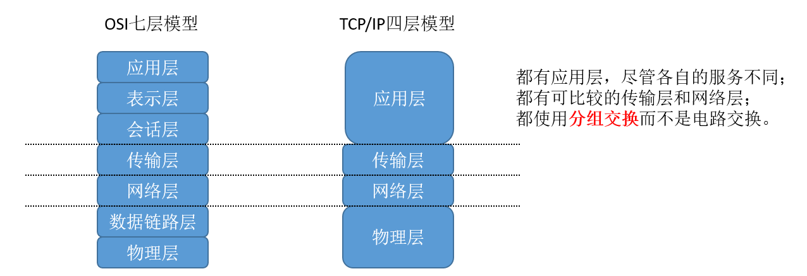
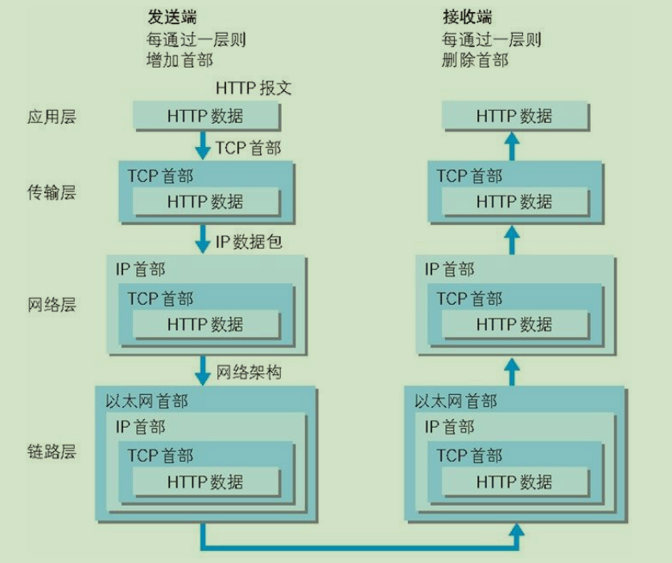
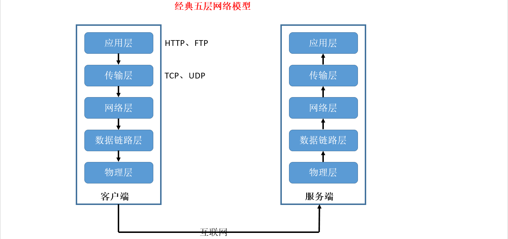

# 0.1 几个概念

拓扑：信道的分布方式。常见的拓扑结构有：总线型、星型、环型、树型、网状。

协议：一系列规则和约定的规范性描述，控制网络中的设备之间如何交换信息。

数字带宽：单位时间内流经的信息总量。单位：比特每秒（bps）。常用 kbps、Mbps、Gbps，注：单位间换算为 1000。

吞吐量：实际的、可测到的带宽。也就是用户实际感觉到的带宽。

点到点：机器间的直接相连。

端到端：信源机和信宿机之间直接通信，好像有一条直接的线路。

- 计算机网络分类（范围从小到大）：
  - 注意：范围不是绝对的，如：判断是否为局域网，主要是判断其是否具备了局域网的技术特征。

| 英文                             | 名称   | 覆盖范围             |
| -------------------------------- | ------ | -------------------- |
| PAN（Personal Area Network）     |        | 约1米左右            |
| LAN（Local Area Network）        | 局域网 | 约1公里左右          |
| MAN（Metropolitan Area Network） | 广域网 | 10公里（约一座城市） |
| Internet                         | 互联网 | 约10000公里（全球）  |

# 0.2 分层模型

- 分层的好处：
  - 各层工作独立，层与层间通过接口联系，降低协议工作的复杂程度；
  - 灵活性好，任何一层的改变不影响其他层；
  - 每层的实现技术可以不同，减少了实现的复杂度；
  - 易于维护，每层可以单独进行调试；
  - 便于标准化。
- OSI（Open System Interconnect ）七层模型，从上往下：
  - 每一层都利用其下层的服务，为其上层提供服务。第一层直接为第二层服务，第七层为模型外的用户服务。

| 层                      | 描述                                                         |
| ----------------------- | ------------------------------------------------------------ |
| 应用层（Application）   | 为网络应用提供网络服务                                       |
| 表示层（Presentation）  | 将信息表示为一定形式和格式的数据流，完成压缩解压、加密解密等任务 |
| 会话层（Session）       | 负责通信主机间会话的建立、管理、拆除，协调通信双方           |
| 传输层（Transport）     | 负责通信主机间的端到端连接。对于TCP来说，还负责提供可靠传输、差错恢复、拥塞控制等额外功能 |
| 网络层（Network）       | 将每个分组从信源机送达信宿机                                 |
| 数据链路层（Data Link） | 提供介质访问服务，通过物理地址标识通信主机，提供可靠的帧传递，并做差错控制、流控等 |
| 物理层（Physical）      | 提供透明的比特流（光、点、无线信号）传输                     |

- TCP/IP四层模型，从上到下：
  - 应用层：决定了向用户提供应用服务时通信的活动。
  - 传输层：提供处于网络连接中的两台计算机间的数据传输。
  - 网络层：处理在网络上流动的数据包（数据包是网络传输的最小数据单位），即规定了数据包的传输路径。
  - 物理层：用来处理连接网络的硬件部分。

发送和接收的过程：（图片来自《图解HTTP》一书）

- 五层模型，上往下依次为：
  - 应用层
  - 传输层
  - 网络层
  - 数据链路层
  - 物理层

互联网的每一层都定义了很多协议。这些协议的总称，就叫做“互联网协议”（Internet Protocol Suite）。它们是互联网的核心。 

# 0.3 模型相关

参考模型上的每一层都为其上层提供服务，以接口的形式供上层调用；

协议作用于对应层之间；

层与层之间有接口，用于服务的调用。

- 信息发送方做什么？
  - 封装/打包：将信息打包，从最高层（应用层）开始逐渐下行到最底层（物理层），经过每一层时，在数据前加上头部信息，用于传递：
    - 在OSI参考模型的上三层，信息被表示为一定格式和形式的**数据流(DataStream)**；
    - 数据流被传到传输层，将其切割为适合传输的**数据段(Segment)**并加上段头，段头中包含定位应用进程的端口号等信息；
    - 数据段传到网络层，添加分组头部形成**分组(Packet)**（也叫IP数据报），分组头部中包含寻址主机的IP地址和其他一些传输需要用到的信息；
    - 分组传到数据链路层，添加帧头形成**帧(Frame)**，帧头中包含寻址主机所需的物理地址、校验等信息；
    - 帧到了物理层，被转成可供传输的**比特流(Bits)**。
  - 解封装/解包：将收到的比特流解包，从最底层（物理层）逐渐上行到最高层（应用层），在每层去掉头部信息，最终还原出应用层的输出信息，如：
    - 在网络层，从下层收到分组，去掉分组头，提取出数据段，送给上层传输层；
- 协议数据单元（PDU：Protocol Data Unit）：对等层次间传递的数据单位：
  - 应用层：数据流
  - 传输层：数据段
  - 网络层：分组
  - 数据链路层：帧
  - 物理层：比特流