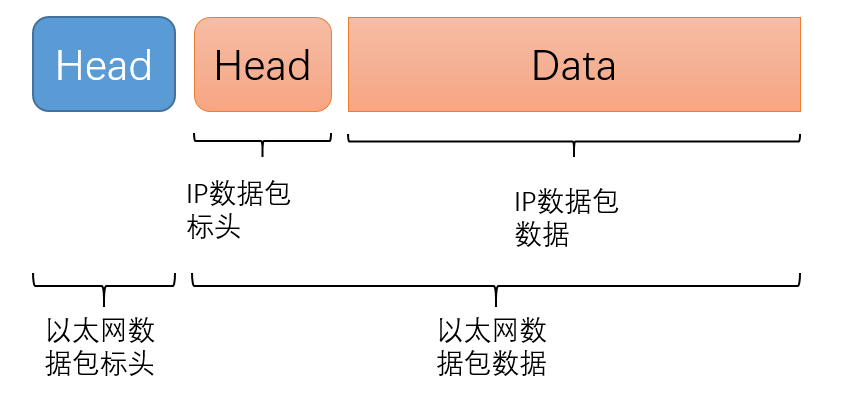
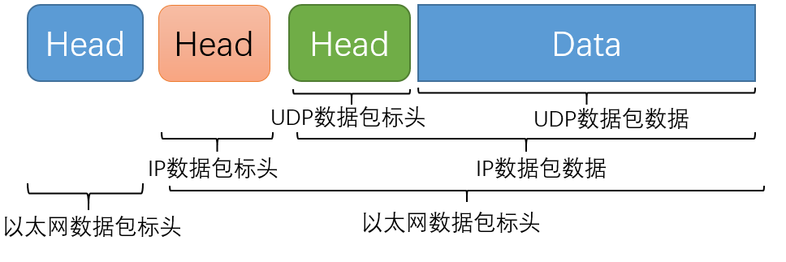
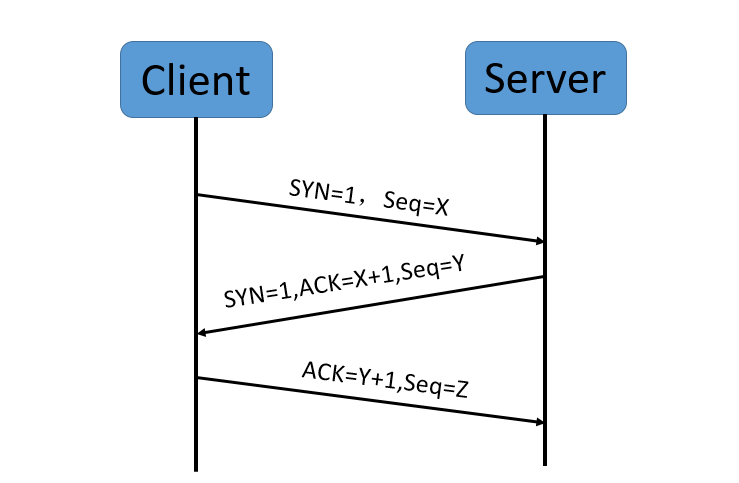
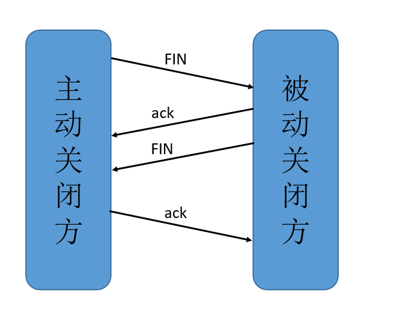
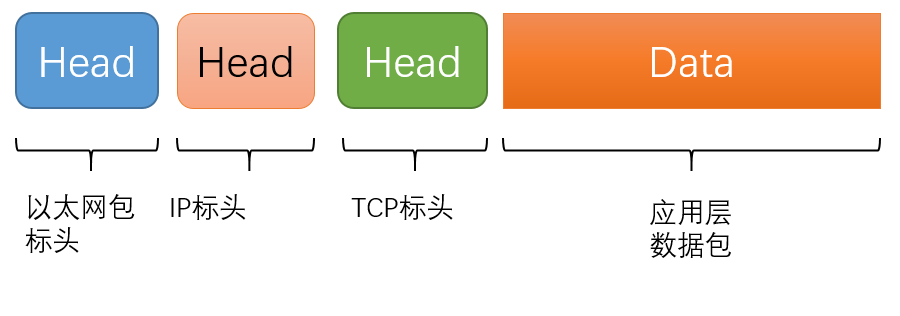
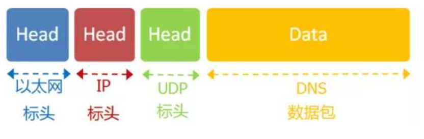
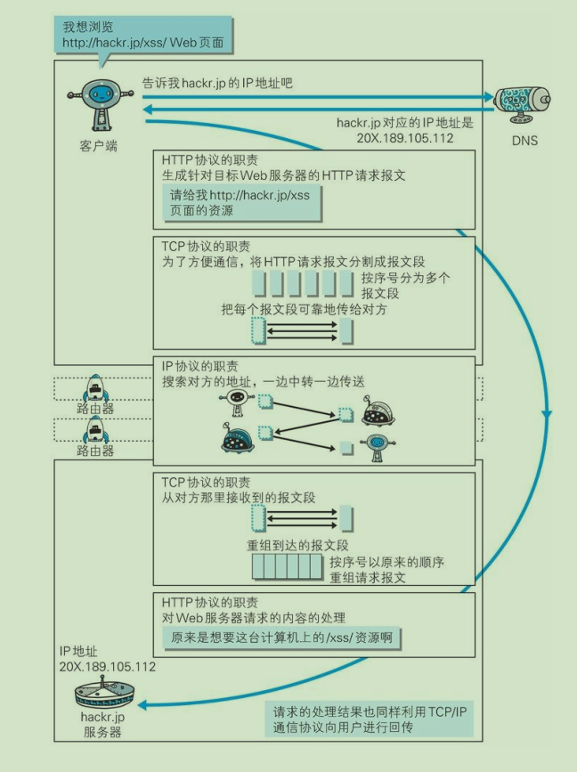

# 1.physical

功能：提供透明的比特流传输。尽可能屏蔽掉具体传输介质和物理设备的差异。

注意：封装好的数据以“0”、“1”比特流的形式传递；物理层的传输只关心比特流的正确传递，而不关心其携带的信息。

- 四大特性：
  - 机械特性（mechanical characteristics）：指明接口所有接线器的形状、尺寸、引脚数等，如RJ45水晶头；
  - 电气特性（electrical characteristics）：指明在接口电缆的各条线上出现的电压范围；
  - 功能特性（functional characteristics）：指明某条线上出现的某一电平的电压表示何种意义；
  - 规程特性（procedural characteristics）：指明对于不同功能的各种可能事件的出现顺序。

物理带宽：传输过程中振幅不会明显衰减的频率范围，单位为Hz。数字带宽和物理带宽的关系可查询奈奎斯特定理（理想信道）、香农定理（有噪声信道）。

通信方式：

- **单工通信：**只能由A主机向B主机发送消息，通信是单向的。
- **半双工通信：**同一时间只能是由A主机向B主机或者是B主机向A主机发送信息，不能同时发送消息。
- **全双工通信：** A主机和B主机可以实现在同一时间内既接收消息，又发送消息，极大的提升了通信效率。

# 2.data link

功能：在通信的实体间建立数据链路连接，保证数据传输的有效、可靠。负责差错检测和控制，还负责流量控制。流量控制的方法：基于速率；基于反馈（常用）。

物理层为数据链路层提供服务，物理层的 PDU 是比特流，而数据链路层是帧，此时就需要成帧（将原始的比特流分散到离散的帧中）。

帧由帧头（有定位所需的物理地址信息）、载荷（上层网络送下来的分组或包）、帧尾（主要是校验核）。

通信方式：

- **点对点通信：**通信方式是点到点的，也就是只能是两个点之间的通信。常见的就是PPP协议
- **广播通信：**广播通讯，也就是可以同时实现一对多的通信。常见的就是CSMA/CD（载波监听多点访问/冲突检测）

## 2.1 以太网协议

以太网规定，一组电信号构成一个数据包，叫做"帧"（Frame）。每一帧分成两个部分：标头（Head）和数据（Data）。整个"帧"最短为64字节，最长为1518字节。如果数据很长，就必须分割成多个帧进行发送。 

- Head（标头）：包含数据包的一些说明项，如发送者、接受者、数据类型等。长度固定为18字节。
- Data（数据）：是数据包的具体内容。    长度最短为46字节，最长为1500字节。

## 2.2 MAC地址

虽然我们知道了信息的内容，不过如果找不到信宿（信息接收者）的话，也无法完成信息的交换。所以，在这一层中有一个 **MAC 地址**来帮助我们定位网卡和数据包的路径了。

以太网规定，连入网络的所有设备，都必须具有"网卡"接口。数据包必须是从一块网卡，传送到另一块网卡。网卡的地址，就是数据包的发送地址和接收地址，这叫做MAC地址（也就是网卡的物理地址）。

每块网卡出厂的时候，都有一个全世界独一无二的MAC地址，长度是48个二进制位，通常用12个十六进制数表示。如网卡地址：00-B0-D0-86-BB-F7，其中，前六个十六进制数是厂商编号，后六个是该厂商的网卡流水号。

## 2.3 广播

既然我们找到了接收设备，也知道了如何阅读信息，那么该如何把信息发送给信宿呢？

广播是一种把数据包准确送到接收方的方式。 它把数据包**向本网络内所有计算机发送**，让每台计算机自己判断，是否为接收方。 接收方读取这个包的"标头"，找到接收方的 MAC 地址，然后与自身的 MAC 地址相比较，如果两者相同，就接受这个包，做进一步处理，否则就丢弃这个包。这种发送方式就叫做"广播"（broadcasting）。

至此，有了数据包的定义、网卡的 MAC 地址、广播的发送方式，"链接层"就可以在多台计算机之间传送数据了。 

# 3.network

也叫网际层或IP层。为数据在节点之间传输创建逻辑链路。

网络层负责为分组交换网上的不同主机提供通信服务。在发送数据时，网络层把运输层产生的报文段或用户数据报封装成分组和包进行传送。在TCP/IP体系结构中，由于网络层使用IP协议，因此分组也叫IP数据报，简称数据报。

网络层的另一个任务就是选择合适的路由，使源主机运输层所传下来的分株，能通过网络层中的路由器找到目的主机。

理论上，仅仅依靠 MAC 地址，我们就可以找到世界上的任何一个网卡，从而与其交换信息。但是，这样做有一个重大的缺点，**以太网采用广播方式发送数据包**，所有成员人手一"包"，不仅**效率低**，而且**局限在发送者所在的子网络**。也就是说，如果两台计算机不在同一个子网络，广播是传不过去的。这种设计是合理的，否则互联网上每一台计算机都会收到所有包，那会引起灾难。 

因此，必须找到一种方法，能够区分哪些MAC地址属于同一个子网络，哪些不是。如果是同一个子网络，就采用广播方式发送，否则就采用“路由”方式发送。而MAC地址本身无法做到这一点。它只与厂商有关，与所处网络无关。这就导致了“网络层”的诞生，它的作用是引进一套新的地址，使得我们能够区分不同的计算机是否属于同一个子网络。这套地址就叫做"**网络地址**"，简称"网址"。 

MAC地址和网址这两种地址之间没有任何联系，<u>MAC地址是绑定在网卡上的，网络地址则是管理员分配的</u>，它们只是随机组合在一起。

 **网络地址帮助我们确定计算机所在的子网络，MAC地址则将数据包送到该子网络中的目标网卡**。因此，从逻辑上可以推断，接收方必定是先处理网络地址，然后再处理MAC地址。

## 3.1 IP协议

IP 协议的作用是把各种数据包传送给对方。而要保证确实传送到对方那里，则需要满足各类条件。其中两个重要的条件是 IP 地址和 MAC地址（Media Access Control Address）。

IP 地址指明了节点被分配到的地址，MAC 地址是指网卡所属的固定地址。IP 地址可以和 MAC 地址进行配对。

### IP地址

规定网络地址的协议，叫做 IP 协议。它所定义的地址，就被称为 IP 地址。 

目前，广泛采用的是IP协议第四版，简称<u>IPv4</u>。这个版本规定，网络地址由<u>32个二进制位</u>组成。不过随着可使用的网址的减少，正在逐渐向 IPv6 过渡。这里主要介绍 IPv4。

补充：IPv6 的地址长度为128位二进制位，由8个地址节组成，每节包含16个地址位，以4个十六进制数书写，节与节之间用`:`分隔。如：`1080::8:800:200C:417A`。

常用分成四段的十进制数表示 IP 地址，从 0.0.0.0 到255.255.255.255。互联网上的每一台计算机，都会分配到一个 IP 地址。这个地址分成两个部分，**前一部分代表网络，后一部分代表主机**。IP 地址规定：网络号不能以 127 开头；第一字节不能全为 0 也不能全为 1；主机号不能全为 0 也不能全为 1。

**处于同一个子网络的电脑，它们IP地址的网络部分必定是相同的。**

- IP地址可以分为5类：
  - A类：第一个字节为网络，范围（`1.0.0.1`~`126.255.255.254）`，共计126个网络，1677214个主机；
  - B类：前两个字节为网络，范围（`128.0.0.1`~`191.255.255.254`），共计16384个网络，65534个主机；
  - C类：前三个字节为网络，范围（`192.0.0.1`~`223.255.255.254`），共计20971152个网络，254个主机；
  - D类：范围（`224.0.0.1`~`239.255.255.254`），是组播地址；
  - E类：范围（`240.0.0.1`~`254.255.255.254`），保留。

### 子网掩码

上面说到IP地址的前一部分代表网络，后一部分代表主机，那么如何从IP地址判断网络部分呢？这就需要用到另一个参数：**子网掩码**（subnet mask）。 

所谓"子网掩码"，就是表示子网络特征的一个参数。它在形式上等同于IP地址，也是一个32位二进制数字，它的**网络部分全部为1，主机部分全部为0**。

如：IP地址 172.16.254.1，如果已知网络部分是前24位，主机部分是后8位，那么子网络掩码就是11111111.11111111.11111111.00000000，写成十进制就是255.255.255.0。 

利用子网掩码，我们就能判断，任意两个IP地址是否处在同一个子网络。<u>方法</u>是将两个IP地址与子网掩码分别进行AND运算（两个数位都为1，运算结果为1，否则为0），然后比较结果是否相同，如果是的话，就表明它们在同一个子网络中，否则就不是。

所以，IP协议的作用主要有两个，一个是为每一台计算机分配IP地址，另一个是确定哪些地址在同一个子网络。 一般，IP地址的最后一位为 1 是网关地址，255 是广播地址。

### IP数据包

根据 IP 协议发送的数据，就叫做IP数据包。不难想象，其中必定包括IP地址信息。

尽管以太网数据包只包含MAC地址，并没有IP地址的栏位。我们可以把IP数据包直接放进以太网数据包的"数据"部分，因此完全不用修改以太网的规格。这就是互联网分层结构的好处：上层的变动完全不涉及下层的结构。

- IP 标头：主要包括版本、长度、IP地址等信息，
- IP 数据：IP数据包的具体内容

### 域名

在网络上识别一台计算机的方式是利用 IP 地址，但是一组数字并不容易记忆，因此人们会使用域名（Domain Name）。域名具有唯一性，即在全世界范围内没有重复的域名。

域名采用层次结构，每一层构成一个子域名，子域名间用`.`分开，自左向右为顶级、二级、三级等。

主机名.机构名.顶层域名。

常见域名：

| 缩写 | 代表意义     | 缩写 | 代表意义     |
| ---- | ------------ | ---- | ------------ |
| com  | 商业组织     | cn   | 中国         |
| edu  | 教育机构     | gov  | 政府机构     |
| int  | 国际性组织   | hk   | 中国香港     |
| mil  | 军队系统机构 | net  | 网络技术组织 |
| org  | 研究或非商业 |      |              |

## 3.2 ARP协议

在网络上，通信的双方很少是在同一个局域网内，几乎所有情况都是要经过多台计算机和网络设备中转才能连接到对方。而在而在进行中转时，会利用下一站中转设备的 MAC 地址来搜索下一个中转目标。这时，会采用 <u>ARP 协议</u>（AddressResolution Protocol）。ARP 是一种用以解析地址的协议，根据通信方的 IP 地址就可以反查出对应的 MAC 地址。

第一种情况，两台主机不在同一个子网络，那么事实上没有办法得到对方的MAC地址，只能把数据包传送到两个子网络连接处的"网关"（gateway），让网关去处理。 

第二种情况，如果两台主机在同一个子网络，那么我们可以用ARP协议，得到对方的MAC地址。ARP协议也是发出一个数据包（包含在以太网数据包中），其中包含它所要查询主机的IP地址，在对方的MAC地址这一栏，填的是FF:FF:FF:FF:FF:FF，表示这是一个"广播"地址。它所在子网络的每一台主机，都会收到这个数据包，从中取出IP地址，与自身的IP地址进行比较。如果两者相同，都做出回复，向对方报告自己的MAC地址，否则就丢弃这个包。

# 4.transport

传输层向高层屏蔽了下层数据通信的细节。

有了 MAC 地址和 IP 地址，我们已经可以在互联网上任意两台主机上建立通信。但是，同一主机上会有许多程序，如何知道此时的数据是哪个程序发出的呢？ 所以我们还需要一个参数，表示这个数据包到底供哪个程序（进程）使用。这个参数就叫做**端口**（port），它其实是每一个使用网卡的程序的编号。每个数据包都发到主机的特定端口，所以不同的程序就能取到自己所需要的数据。

端口是 0 到 65535 之间的一个整数，正好 16 个二进制位。0 到 1023 的端口被系统占用，用户只能选用大于1023的端口。

**传输层的功能，就是建立"端口到端口"的通信**。相比之下，**网络层的功能是建立"主机到主机"的通信**。只要确定主机和端口，我们就能实现程序之间的交流。因此，Unix 系统就把主机+端口，叫做"套接字"（socket）。有了它，就可以进行网络应用程序开发了。 

既然需要端口才能确定数据是来自于那个程序，那么，就必须在数据包中加入端口信息，这就需要新的协议。也就是下面这两种协议.

- 传输控制协议 TCP：提供面向连接的、可靠的数据传输服务
- 用户数据协议 UDP：提供无连接的数据传输服务(不保证数据传输的可靠性)

| 类型 | 面向连接 | 可靠性 | 传输形式   | 传输效率 | 所需资源 | 场景                                       | 首部字节         |
| ---- | -------- | ------ | ---------- | -------- | -------- | ------------------------------------------ | ---------------- |
| TCP  | 是       | 可靠   | 字节流     | 慢       | 多       | 要求通信数据可靠（如：文件传输、邮件传输） | 20-60            |
| UDP  | 否       | 不可靠 | 数据报文段 | 快       | 少       | 要求通信速度高的即时通信（如：域名转换）   | 8（4个字段组成） |

说明：传输层的主要任务是负责向两台主机进程之间的通信提供通用的数据传输服务。由于一台主机可同时运行多个线程，因此传输层有复用（多个应用层进程可同时使用下面运输层的服务）和分用（运输层把收到的信息分别交付给上面应用层中的相应进程）的功能。

## 4.1 UDP协议

- **UDP（User Datagram Protocol用户数据协议）**的特点：

  - 无连接的（类似发短信，不需要和对方建立连接就可以通信）；

  - 不保证数据传输的可靠性；

  - 面向报文的；

  - 支持一对一、一对多、多对一和多对多的交互通信；

  - 没有拥塞控制，因此网络出现阻塞不会使主机的发送速率降低。适合实时应用，如：IP 电话、实时视频会议等。

  - 首部开销小，只有 8 个字节，比 TCP 的 20 个字节的首部短。

    UDP 的格式几乎就是在数据前面，加上端口号。 UDP 数据包，也是由标头和数据两部分组成。总长不超过 65535 字节，正好放进一个 IP 数据包。 

- UDP 标头：主要定义了发出端口和接收端口,只有8个字节
- UDP 数据：具体的内容。

## 4.2 TCP协议

- **TCP（Transmission Control Protocol协议）**的特点：
  - 面向连接的（类似打电话，必须先和对方建立连接才能通信，通话结束后挂机释放连接）；
  - 每条 TCP 连接只能有两个端点，所以每条 TCP连接只能点对点；
  - 通过 TCP 连接传送的数据，无差错、不重复、且按序达到；
  - 提供全双工通信。允许双方应用进程在任何时候都能发送数据。TCP 连接的两端都没有发送缓存和接受缓存，用来临时存放双方的数据；
  - 面向字节流。即：虽然应用程序和 TCP 交互是一次一个数据块（大小不等），但 TCP 把应用程序发送的数据仅看作是一连串无结构的字节流。
  - TCP 协议能够确保数据不会遗失。但过程复杂、实现困难、消耗资源多。
  - TCP 数据包和 UDP 数据包一样，都是内嵌在 IP 数据包的"数据"部分。TCP 数据包没有长度限制，理论上可以无限长，但为了保证网络的效率，通常 TCP 数据包的长度不会超过 IP 数据包的长度，以确保单个 TCP 数据包不必再分割。

### 三次握手★

为了准确无误地把数据送达目标出，TCP协议采用了**三次握手**策略来建立连接，时序图：

- 一次握手：客户端向服务端发送带有 SYN 标志位的数据包；
- 二次握手：服务端向客户端发送带有 SYN 和 ACK 标志位的数据包；
  - 为什么要传回 SYN？
    - 接收端传回发送端所发送的 SYN 是为了告诉发送端，我收到的信息确实是你发送的。
  - 传了 SYN，为什么还要传 ACK？
    - 双方通信无误必须是两者互相发送信息都无误。传了 SYN，证明发送方到接收方的通道没有问题，但是接收方到发送方的通道还需要 ACK 信号来进行验证。
- 三次握手：客户端向服务端发送带有 ACK 标志的数据包。

### 四次挥手★

断开一个 TCP 连接需要“四次挥手”：

- 客户端-发送一个 FIN，用来关闭客户端到服务器的数据传送；
- 服务器-收到这个FIN，它发回一个 ACK，确认序号为收到的序号加1 。和 SYN 一样，一个 FIN 将占用一个序号；
- 服务器-关闭与客户端的连接，发送一个FIN给客户端；
- 客户端-发回 ACK 报文确认，并将确认序号设置为收到序号加1。

# 5.application

应用层构建于TCP协议之上，屏蔽网络传输相关细节。

应用程序收到"传输层"的数据，接下来就要进行解读。由于互联网是开放架构，数据来源五花八门，必须事先规定好格式，否则根本无法解读。

**应用层的作用，就是规定应用程序的数据格式**。通过应用进程间的交互来完成特定网络应用。应用层协议定义的是应用进程（即运行的程序）间的通信和交互的规则。对于不同的网络应用需要不同的应用层协议。常见的应用层协议：域名系统DNS、支持万维网应用的 HTTP 协议、支持电子邮件的 SMTP 协议等。我们把**应用层交互的数据单元称为报文**，放在TCP数据包的“数据”部分。因此，现在的以太网的数据包就变成下面这样：

## DNS协议

DNS（Domain Name System 域名系统）

发送数据包，必须要知道对方的IP地址。但是，我们只知道网址，如www.google.com，却不知道它的IP地址。

DNS 协议可以帮助我们，将这个网址转换成 IP 地址。已知 DNS 服务器为8.8.8.8，于是我们向这个地址发送一个 DNS 数据包（53端口）。

不同的协议在通信过程中扮演了不同的角色，如图：（图片来自《图解HTTP》一书）

