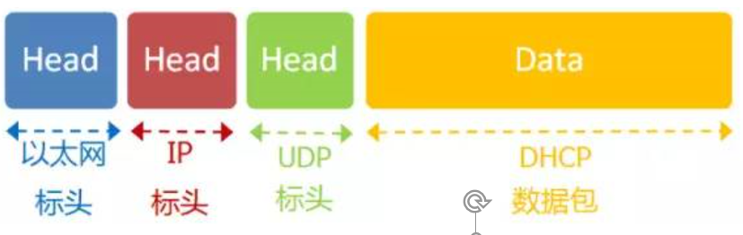
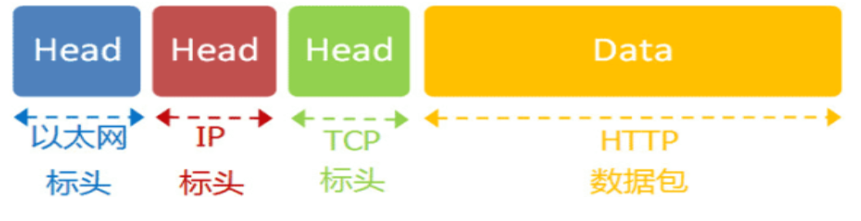

# 上网设置

## 静态IP地址

手动设置以下参数后，计算机每次开机都会分到同样的 IP 地址，这种情况被称作"静态IP地址上网"。

1. 本机的IP地址 
2. 子网掩码
3. 网关的IP地址
4. DNS的IP地址

但如果一台电脑的IP地址保持不变，其他电脑就不能使用这个地址，不够灵活。出于这两个原因，大多数用户使用"动态IP地址上网"。

## 动态IP地址

所谓"动态IP地址"，指计算机开机后，会自动分配到一个 IP 地址，不用人为设定。它使用的协议叫做 **DHCP 协议**。

这个协议规定，每一个子网络中，有一台计算机负责管理本网络的所有 IP 地址，它叫做"DHCP服务器"。新的计算机加入网络，必须向"DHCP服务器"发送一个"DHCP请求"数据包，申请 IP 地址和相关的网络参数。

---

- DHCP协议是一种应用层协议，建立在UDP协议之上，所以整个数据包：

- （1）最前面的"以太网标头"，设置发出方（本机）的 MAC 地址和接收方（DHCP服务器）的 MAC 地址。前者就是本机网卡的 MAC 地址，后者这时不知道，就填入一个广播地址：FF-FF-FF-FF-FF-FF。
- （2）后面的"IP标头"，设置发出方的 IP 地址和接收方的 IP 地址。这时，对于这两者，本机都不知道。于是，发出方的 IP 地址就设为 0.0.0.0，接收方的 IP 地址设为 255.255.255.255。
- （3）最后的"UDP标头"，设置发出方的端口和接收方的端口。这一部分是 DHCP 协议规定好的，发出方是 68 端口，接收方是 67 端口。

这个数据包构造完成后，就可以发出了。以太网是广播发送，同一个子网络的每台计算机都收到了这个包。因为接收方的 MAC 地址是 FF-FF-FF-FF-FF-FF，看不出是发给谁的，所以每台收到这个包的计算机，还必须分析这个包的IP地址，才能确定是不是发给自己的。当看到发出方 IP 地址是0.0.0.0，接收方是255.255.255.255，于是 DHCP 服务器知道"这个包是发给我的"，而其他计算机就可以丢弃这个包。 

接下来，DHCP 服务器读出这个包的数据内容，分配好 IP 地址，发送回去一个"DHCP 响应"数据包。这个响应包的结构也是类似的，以太网标头的 MAC 地址是双方的网卡地址，IP 标头的 IP 地址是 DHCP 服务器的 IP 地址（发出方）和255.255.255.255（接收方），UDP 标头的端口是67（发出方）和68（接收方），分配给请求端的 IP 地址和本网络的具体参数则包含在 Data 部分。

新加入的计算机收到这个响应包，于是就知道了自己的IP地址、子网掩码、网关地址、DNS 服务器等等参数。

# 访问 Google 的过程

1. 设置好网络参数

   1. 本机的IP地址：192.168.1.100
   2. 子网掩码：255.255.255.0
   3. 网关的IP地址：192.168.1.1
   4. DNS的IP地址：8.8.8.8

2. 输入网址，这意味着，浏览器要向Google发送一个网页请求的数据包

   DNS协议帮助获取对方的 IP 地址；

   利用子网掩码，对自己的 IP 地址和 Google 的 IP 地址分别做 AND 运算，判断得到 Google 与本机不在同一个子网络。因此，我们要向 Google 发送数据包，必须通过网关 192.168.1.1转 发，也就是说，接收方的 MAC 地址将是网关的 MAC 地址。

3. 应用层协议

   浏览网页用的是 HTTP 协议，数据包构造如下，假定这个部分的长度为 4960 字节，会被嵌在 TCP 数据包之中。

①TCP数据包需要设置端口，接收方（Google）的HTTP端口默认是80，发送方（本机）的端口是一个随机生成的1024-65535之间的整数，假定为51775。

②TCP数据包的标头长度为20字节，加上嵌入HTTP的数据包，总长度变为4980字节。

③然后，TCP数据包再嵌入IP数据包。IP数据包需要设置双方的IP地址，这是已知的，发送方是192.168.1.100（本机），接收方是172.194.72.105（Google）。 

④IP数据包的标头长度为20字节，加上嵌入的TCP数据包，总长度变为5000字节。

⑤最后，IP数据包嵌入以太网数据包。以太网数据包需要设置双方的MAC地址，发送方为本机的网卡MAC地址，接收方为网关192.168.1.1的MAC地址（通过ARP协议得到）。

以太网数据包的数据部分，最大长度为1500字节，而现在的IP数据包长度为5000字节。因此，IP数据包必须分割成四个包。因为每个包都有自己的IP标头（20字节），所以四个包的IP数据包的长度分别为1500、1500、1500、560。

4. 服务器端响应

经过多个网关的转发，Google的服务器172.194.72.105，收到了这四个以太网数据包。

根据IP标头的序号，Google将四个包拼起来，取出完整的TCP数据包，然后读出里面的"HTTP请求"，接着做出"HTTP响应"，再用TCP协议发回来。

本机收到HTTP响应以后，就可以将网页显示出来，完成一次网络通信。

