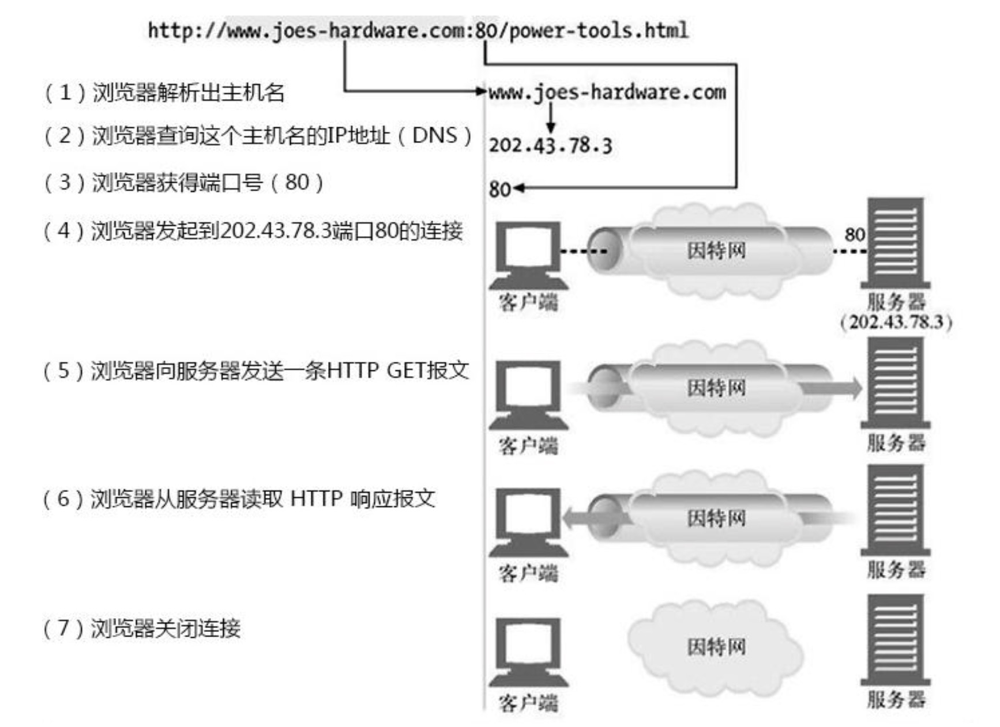
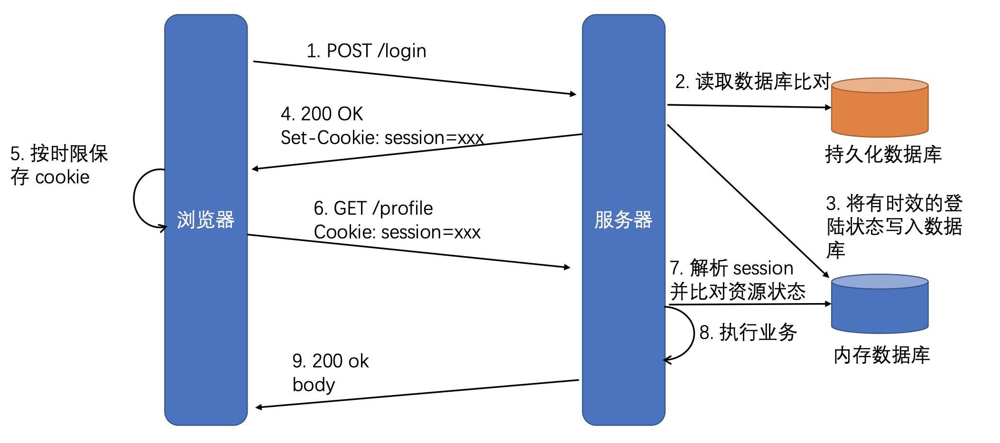

# 常用请求方法

## GET

获取资源，大量的性能优化都针对该方法，幂等方法

`GET`方法用来请求访问已被 URI 识别的资源。指定的资源经服务器端解析后返回响应内容。也就是说，如果请求的资源是文本，那就保持原样返回；如果是像 CGI（Common Gateway Interface，通用网关接口）那样的程序，则返回经过执行后的输出结果。

```http
GET /index.html HTTP/1.1
Host: www.bilibili.com
```

上面请求的响应会返回 index.html 的页面资源

## POST

常用于提交 HTML FORM 表单、新增资源等

`GET` 方法也可用来传输内容主题，但一般不用 `GET` 方法传输，而使用 `POST` 方法。

```http
POST /submit.cgi HTTP/1.1
Host: www.hackr.jp
Content-Length: 1560（1560字节的数据）
```

上面请求的响应会返回 submit.cgi 接收数据的处理结果

## OPTIONS

显示服务器对访问资源支持的方法，幂等方法，主要用于跨域访问时

```shell
curl 网址 -X OPTIONS -I  # 查询该网站允许的方法
```

## PUT

更新资源，带条件时是幂等方法

`PUT`方法用来传输文件。就像 FTP 协议的文件上传一样，要求在请求报文的主体中包含文件内容，然后保存到请求 URI 指定的位置。

由于 HTTP/1.1 的`PUT`方法自身不带验证机制，任何人都可以上传文件，存在安全问题，因此一般 Web 网站不用该方法。若是配合 Web 应用程序的验证机制，或架构设计采用 REST（REpresentational State Transfer，表征状态转移）标准的同类 Web 网站，就可能会开放使用 PUT 方法。

## HEAD

获得报文首部，服务器不发送响应体，幂等方法

`HEAD`方法和`GET`方法一样，只是不返回报文主体部分。用于确认 URI 的有效性及资源更新的日期时间等。

## DELETE

删除资源，幂等方法

`DELETE`方法用来删除文件，是与`PUT`相反的方法。`DELETE`方法按请求 URI 删除指定的资源。
但是，HTTP/1.1 的`DELETE`方法本身和`PUT`方法一样不带验证机制，所以一般的 Web 网站也不使用`DELETE`方法。当配合 Web 应用程序的验证机制，或遵守 REST 标准时还是有可能会开放使用的。

## TRACE

回显服务器收到的请求，用于定位问题。有安全风险，很少使用，Nginx 于 2007 年不再支持该方法

## CONNECT

建立 tunnel 隧道

`CONNECT`方法要求在与代理服务器通信时建立隧道，实现用隧道协议进行 TCP 通信。主要使用 SSL（Secure Sockets Layer，安全套接层）和 TLS（Transport Layer Security，传输层安全）协议把通信内容加 密后经网络隧道传输。

该方法的格式：

```http
CONNECT 代理服务器名:端口号 HTTP版本
```

# 响应状态码

状态码的职责是当客户端向服务器端发送请求时，描述请求的处理结果。借助状态码，用户可以知道服务器端是正常处理了请求，还是出现了错误。

状态码以三位数字和原因短语组成。数字的第一位指明了响应类别，后两位无分类。五种响应类别：

|      | 类别                             | 原因短语                                             |
| ---- | -------------------------------- | ---------------------------------------------------- |
| 1xx  | Informational（信息性状态码）    | 请求已接收到，需要进一步处理才能完成，HTTP1.0 不支持 |
| 2xx  | Success（成功状态码）            | 请求正常处理完毕                                     |
| 3xx  | Redirection（重定向状态码）      | 需要重定向，进行附加操作以完成请求                   |
| 4xx  | Client Error（客户端错误状态码） | 客户端出现错误                                       |
| 5xx  | Server Error（服务器错误状态码） | 服务器处理请求出错                                   |

## 常见正确响应码

### 1xx

请求已接收到，需要进一步处理才能完成，HTTP1.0 不支持

- 100 Continue，上传大文件前使用
  - 由客户端发起请求中携带 `Expect: 100-continue` 头部触发
- 101 Switch Protocols，协议升级使用
  - 由客户端发起请求中携带 Upgrade: 头部触发，如升级 websocket 或者 http/2.0
- 102 Processing，WebDAV 请求可能包含许多涉及文件操作的子请求，需要很长时间 才能完成请求。该代码表示​​服务器已经收到并正在处理请求，但无响应可用。这样可以防止客户端超时，并假设请求丢失

### 2xx

成功处理请求

- 200 OK，成功返回响应。
- 201 Created，有新资源在服务器端被成功创建。
- 202 Accepted，服务器接收并开始处理请求，但请求未处理完成。这样一个模 糊的概念是有意如此设计，可以覆盖更多的场景。例如异步、需要长时间处理 的任务。
- 203 Non-Authoritative Information，当代理服务器修改了 origin server 的 原始响应包体时(例如更换了HTML中的元素值)，代理服务器可以通过修改 200为203的方式告知客户端这一事实，方便客户端为这一行为作出相应的处理。 203响应可以被缓存。
- 204 No Content，成功执行了请求且不携带响应包体，并暗示客户端无需 更新当前的页面视图。
- 205 Reset Content，成功执行了请求且不携带响应包体，同时指明客户端 需要更新当前页面视图。
- 206 Partial Content，使用 range 协议时返回部分响应内容时的响应码
- 207 Multi-Status，在 WEBDAV 协议中以 XML 返回多个资源
的状态。
- 208 Already Reported，为避免相同集合下资源在207响应码 下重复上报，使用 208 可以使用父集合的响应码。

### 3xx

重定向使用 Location 指向的资源或者缓存中的资源。在 RFC2068 中规定客户端重定向次数不应超过 5 次，以防止死循环。

- 300 Multiple Choices，资源有多种表述，通过 300 返回给客户端后由其 自行选择访问哪一种表述。由于缺乏明确的细节，300 很少使用。
- 301 Moved Permanently，资源永久性的重定向到另一个 URI 中。 - 302 Found:资源临时的重定向到另一个 URI 中。
- 303 See Other，重定向到其他资源，常用于 POST/PUT 等方法的响应中。
- 304 Not Modified，当客户端拥有可能过期的缓存时，会携带缓存的标识 etag、时间等信息询问服务器缓存是否仍可复用，而304是告诉客户端可以 复用缓存。
- 307 Temporary Redirect，类似302，但明确重定向后请求方法必须与原 请求方法相同，不得改变。
- 308 Permanent Redirect，类似301，但明确重定向后请求方法必须与原请 求方法相同，不得改变。


## 常见错误响应码

### 4xx

客户端出现错误
- 400 Bad Request，服务器认为客户端出现了错误，但不能明确判断为以下哪种错误时使用此错误码。例如HTTP请求格式错误。
- 401 Unauthorized，用户认证信息缺失或者不正确，导致服务器无法处理请求。
- 407 Proxy Authentication Required，对需要经由代理的请求，认证信息未通过代理 服务器的验证
- 403 Forbidden，服务器理解请求的含义，但没有权限执行此请求
- 404 Not Found，服务器没有找到对应的资源
- 410 Gone，服务器没有找到对应的资源，且明确的知道该位置永久性找不到该资源
- 405 Method Not Allowed，服务器不支持请求行中的 method 方法
- 406 Not Acceptable，对客户端指定的资源表述不存在(例如对语言或者编码有要求)，服务器返回表述列表供客户端选择。
- 408 Request Timeout，服务器接收请求超时
- 409 Conflict，资源冲突，例如上传文件时目标位置已经存在版本更新的资源
- 415 Unsupported Media Type，上传的文件类型不被服务器支持
- 426 Upgrade Required，服务器拒绝基于当前 HTTP 协议提供服务，通过 Upgrade 头部告知客户端必须升级协议才能继续处理
- 429 Too Many Requests，客户端发送请求的速率过快
- 431 Request Header Fields Too Large，请求的 HEADER 头部大小超过限制

### 5xx

服务器端出现错误

- 500 Internal Server Error，服务器内部错误，且不属于以下错误类型 
- 501 Not Implemented，服务器不支持实现请求所需要的功能
- 502 Bad Gateway，代理服务器无法获取到合法响应
- 503 Service Unavailable，服务器资源尚未准备好处理当前请求
- 504 Gateway Timeout，代理服务器无法及时的从上游获得响应

# HTTP 连接



1、长连接只是将 TCP 连接的特性暴露出来（并没有在 TCP 层实现）；
2、客户端和服务器约定好需要在完成 1 次 request/response 事务后，继续保持 TCP 连接不要关闭，留待下次复用。
3、客户端和服务器都有定时器，空闲时间过长后，就会关闭。

浏览器访问页面通常用长连接，因为WEB页面有上百个对象，复用连接减少了TCP握手次数、解决了拥塞控制问题；

agent 通过 HTTP 上报数据可以用短连接，因为间隔时间久，服务器不用浪费内存、CPU 等资源来维护使用率很低的连接。

## Connection 头部

Connection 头部的值用于指定长短连接。

- `Keep-Alive` 长连接
  - 客户端请求长连接 `Connection: Keep-Alive`
  - 服务器表示支持长连接 `Connection: Keep-Alive`
  - 客户端复用连接
  - HTTP/1.1 默认支持长连接，所以传递 `Connection: Keep-Alive` 无意义
- `Close` 短连接

Connection 头部还可以指定对代理服务器的要求，要求不转发 Connection 列出头部，该头部仅与当前连接相关。

假设客户端向代理服务器发出的请求中，Connection 头部的值为 `Cookie`，那么代理服务器在向服务器转发请求的时候不转发 `Cookie` 头部。

Connection 仅针对当前连接有效！！

假设客户端和源服务器之间有两个代理服务器，客户端向代理服务器1 发起的连接携带了 `Connection: Keep-Alive`，仅代表客户端和代理服务器1 之间使用了长连接，而代理服务器1 与代理服务器2、代理服务器2 与源服务器之间是否使用长连接与客户端的 Connection 头部无关。

注：客户端与代理服务器1 是否使用长连接除了需要客户端携带长连接的头部，还需要代理服务器1 能识别 Connection 头部。

## Proxy-Connection 头部

问题：如果代理服务器1 无法识别 Connection 头部，那么就会将 Connection 头部原封不动的转发给后面的代理服务器2，如果客户端和代理服务器2 都能识别 Connection 头部，这种情况下，客户端、代理服务器2 都会认为自己的连接是长连接，而在实际复用长连接的时候由于代理服务器1 不支持长连接导致出错。

如何解决上述问题？引入了 Proxy-Connection 头部。

客户端向代理服务器发送的请求头携带 `Proxy-Connection: Keep-Alive`：
- 旧的代理服务器不识别该头部，会退化为短连接；
- 新的代理服务器可以识别，会与客户端建立长连接，代理服务器与服务器交互时就会用 Connection 替代 Proxy-Connection 头部。

# HTTP 消息在服务端的路由

## Host 头部

Host = `uri-host [ ":" port ]`

HTTP/1.1 规范要求，不传递 Host 头部则返回 400 错误响应码！

仅识别 HTTP/1.0 的代理服务器是不认识 Host 头部的，但是它可以识别到绝对路径 URI 中所包含的域名。

# 代理服务器转发消息的相关头部

X-Forwarded-For 用于传递 IP

Nginx 会使用 X-Real-IP 传递用户 IP

# 请求与响应上下文的相关头部

## 请求的上下文

User-Agent 指明客户端的类型信息，服务器可以据此对资源的表述做抉择

Referer 浏览器对来自某一页面的请求自动添加的头部，服务器端常用于统计分析、缓存优化、防盗链等功能

From 主要用于网络爬虫，告诉服务器如何通过邮件联系到爬虫的负责人

## 响应的上下文

Server 指明服务器上所用软件的信息，用于帮助客户端定位问题或者统计数据

Allow 告诉客户端，服务器上该 URI 对应的资源允许哪些方法的执行

Accept-Ranges 告诉客户端服务器上该资源是否允许 range 请求

# HTTP 包体

message-body = `*OCTET`，0 或多个二进制字节流。

- 以下消息不能含有包体
  - HEAD 方法请求对应的响应
  - 1xx、204、304 对应的响应
  - CONNECT 方法对应的 2xx 响应

## 传输方式

方式一：发送 HTTP 消息时已能够确定包体的全部长度

使用 Content-Length 头部明确指明包体长度（十进制值，指定字节数）。接收端处理起来更简单。

方式二：发送 HTTP 消息时不能确定包体的全部长度

使用 Transfer-Encoding 头部指明使用 Chunk 传输方式（`Transfer-Encoding: chunked`，分块传输编码）。

> 含 Transfer-Encoding 头部后 Content-Length 头部应被忽略
> chunk 中代表每个分块的长度时使用的是十六进制而非十进制
> Transfer-Encoding 可以支持"chunked" / "compress" / "deflate" / "gzip" / transfer-extension

可以基于长连接持续推送动态内容；压缩体积较大的包体时，不必完全压缩完(计算出头部)再发送，可以边发送边压缩；传递必须在包体传输完才能计算出的 Trailer 头部。

## 包体类型 MIME

MIME( Multipurpose Internet Mail Extensions )

content = `"Content-Type" ":" type "/" subtype *(";" parameter)`

- type = `discrete-type / composite-type`
  - discrete-type = `"text" / "image" / "audio" / "video" / "application" / extension-token`
  - composite-type = `"message" / "multipart" / extension-token`
  - extension-token = `ietf-token / x-token`
- subtype = `extension-token / iana-token`
- parameter = `attribute "=" value`

大小写不敏感，通常小写。

## Content-Disposition 头部

值 disposition-type = `"inline" | "attachment" | disp-ext-type`

- inline，指定包体是以 inline 内联的方式，作为页面的一部分展示
- attachment，指定浏览器将包体以附件的方式下载
  - 如 `Content-Disposition: attachment`，`Content-Disposition: attachment; filename=“filename.jpg”`
- 在 multipart/form-data 类型应答中，可以用于子消息体部分
  - 如 `Content-Disposition: form-data; name="fieldName"; filename="filename.jpg"`


# 断点续传&多线程下载&拖动进度条随机点播

场景描述：
1. 客户端明确任务:从哪开始下载
   1. 本地是否已有部分文件
      1. 文件已下载部分在服务器端发生改变?
   2. 使用几个线程并发下载
2. 下载文件的指定部分内容
3. 下载完毕后拼装成统一的文件

## Range 请求

服务器通过 Accept-Range 头部表示是否支持 Range 请求：`Accept-Ranges: bytes` 支持；`Accept-Ranges: none` 不支持。

指定包体范围：通过 Range 头部传递请求范围，如 `Range: bytes=0-499`

- 如果客户端已经得到了 Range 响应的一部分，并想在这部分响应未过期的情况下，获取其他部分的响应
  - 常与 If-Unmodified-Since 或者 If-Match 头部共同使用。
- If-Range = entity-tag / HTTP-date
  - 可以使用 Etag 或者 Last-Modified

```shell
$ curl xxxx -H 'Range: bytes=0-5' -I  # 服务器端会为返回的这部分响应生成一个指纹，放在响应头 ETag 中
$ curl xxxx -H 'Range: bytes=6-10' -H 'If-Match: "ETag 值"' # 如果期间服务器端 0-5 的数据未被修改，则 ETag 是可以匹配的，就能正常返回 6-10 的响应，如果数据被修改，ETag 无法匹配就会返回 412 的状态码
```

这种验证之前内容的方式就是通过 Preconditon 条件请求（见后）来实现的！

Range 可以请求多重范围：`Range: bytes=0-50, 100-150`

## 服务器响应

如果是多重范围的请求，响应 `Content-Type:multipart/byteranges; boundary=...`

- Range 请求返回的正确状态码 206 Partial Content

Content-Range 头部，显示当前片断包体在完整包体中的位置

Content-Range = `byte-content-range / other-content-range` 这是两种表示方式

- byte-content-range = `bytes-unit SP ( byte-range-resp / unsatisfied-range )`
  - byte-range-resp = `byte-range "/" ( complete-length / "*" )`
    - byte-range = `first-byte-pos "-" last-byte-pos`
    - complete-length = `1*DIGIT` 十进制，完整资源大小，未知则使用 `*` 替代

如 `Content-Range: bytes 42-1233/1234`，`Content-Range: bytes 42-1233/*`，都是 byte-content-range 的方式

- Range 请求返回的错误状态码 416 Range Not Satisfiable

请求范围不满足实际资源的大小，其中 Content-Range 中的 complete-length 显示完整响应的长度，如 `Content-Range: bytes */1234`

- 服务器不支持 Range 请求时，则以 200 返回完整的响应包体

# 会话追踪

## Cookie

Cookie 机制采用的是在**客户端保存 HTTP 状态信息**的方案。

服务器生成、保存在客户端、由浏览器维护、表示应用状态的 HTTP 头部。

一个 Cookie 只能标识一种信息，它至少含有一个标识该信息的名称（NAME）和设置值（VALUE）。

服务器端生成 Cookie 在响应中通过 Set-Cookie 头部告知客户端(一次只能传递一个值，允许多个 Set-Cookie 头部传递多个值)。

客户端得到 Cookie 后，后续请求都会自动将 Cookie 头部（可以存放多个）携带至请求中

Cookie 的属性：

- max-age 和 expires 设置过期时间
  - 会话 Cookie 与持久化 Cookie 的区别：
    - 如果不设置过期时间，则表示这个 Cookie 生命周期为浏览器会话期间，只要关闭浏览器窗口，Cookie 就消失了。这种生命期为浏览器会话期的 Cookie 被称为会话 Cookie。==会话 Cookie 一般不保存在硬盘上而是保存在内存里==。
    - 如果设置了过期时间，浏览器就会把 Cookie 保存到硬盘上，关闭后再次打开浏览器，这些 Cookie 依然有效直到超过设定的过期时间。
- domain：可以访问该 Cookie 的域名
- path：访问该 Cookie 的页面路径。如 domain=abc.com，path=/test，则只用 /test 路径下的页面可以访问
  - Cookie 的作用范围：可以作用于当前目录和当前目录的子目录，不能作用于当前目录的上一级目录
- Secure 代表该 Cookie 只在 https 请求时才会带上
- 设置 HttpOnly 后无法通过 JS 的 document.cookie 访问该 Cookie 的内容

问题：
Cookie 会被附加在每个 HTTP 请求中，所以无形中增加了流量；
由于在 HTTP 请求中的 Cookie 是明文传递的，所以安全性成问题(除非用 HTTPS)；
Cookie 的大小不应超过 4KB，故对于复杂的存储需求来说是不够用的。

## session

session 机制采用的是**在服务器端保存 HTTP 状态信息**的方案。

Session 的实现依赖于 Cookie，Session 的唯一标识 sessionId 存放在客户端。



## 第三方 Cookie

浏览器允许对于不安全域下的资源(如广告图片)响应中的 Set-Cookie 保存，并在后续访问该域时自动使用 Cookie。

可以配合 Referer 请求头来确定来源。常用于用户踪迹信息的搜集。

示例：Client 浏览 A 网站时，网站的部分资源如图片是由第三方站点提供的，此时浏览器是允许 Client 下载该图片的，浏览器同时也允许第三方站点在返回图片时携带了一个新的 Cookie，以后 Client 在直接访问第三方站点时可以携带该 Cookie，这样，第三方站点就知道该用户曾经访问过 A 网站的一些页面。

# 同源策略

一级域名(顶级域名)：只有一个`.`，且`.`的左边要有字段，如，`zzk.com`；

二级域名：如，`www.zzk.com`、`news.zzk.com`；

浏览器的**同源策略(Same-origin Policy)**：在一个浏览器中访问的网站不能访问另一个网站中的数据，除非这两个网站具有相同的 Origin，也即是拥有**完全相同的协议、主机地址以及端口**。

Q：为什么需要同源策略？

A：同一个浏览器发出的请求，未必都是用户资源发出的。

场景：假设用户先访问了站点 A，浏览器保存了站点 A 的 Cookie，之后站点 B 的脚本访问站点 A 时浏览器会自动将站点 A 的 Cookie 带上，从而通过站点 A 的鉴权

如果没有同源策略，站点 B 的脚本就能随意修改站点 A 的 DOM 结构，从而使用户发送到站点 A 的请求被修改掉。

## 可用性&安全性

- 可用性：HTML 的创作者决定跨域请求是否对本站点安全。
  - <script><iframe><link><video><audio>带有 src 属性可以跨域访问
  - 允许跨域写操作：如表单提交或者重定向请求
- 安全性：浏览器需要防止站点 A 的脚本向站点 B 发起危险动作
  - Cookie、LocalStorage 和 IndexDB 无法读取
  - DOM 无法获得(防止跨域脚本篡改 DOM 结构)
  - AJAX 请求不能发送

允许跨域写操作可能会导致 CSRF（Cross-Site Request Forgery，跨站请求伪造攻击） 安全性问题。

示例：用户访问了站点 A 且浏览器保存了 A 的 Cookie，之后用户访问了某个木马网站，而该网站将表单提交设置成了访问 A，为了可用性考虑，表单提交通常是不做同源策略限制的，这就导致木马网站可以携带浏览器中 A 的 Cookie 正常访问 A。

防 CSRF 攻击方式一：浏览器增加 recipient 头部来说明请求的来源，而 A 站点发现请求来源不是本站的页面，就进行阻止。

如果浏览器实现不规范，不会携带 recipient 头部，那就没办法了。

防 CSRF 攻击方式二：服务器（站点 A）对用户拉取表单时在 form 表单中添加一个隐藏的有时效性且唯一的 token，当用户提交表单时，token 也会被携带上用于服务器验证。而攻击者是无法伪造这个 token 的，这样它发起请求时，服务器端就可以发现它是一个伪造的请求。

## CORS 跨域

CORS(Cross-Origin Resource Sharing)跨来源资源共享。

浏览器同源策略下的跨域访问解决方案：
如果站点 A 允许站点 B 的脚本访问其资源，必须在 HTTP 响应中显式的告知浏览器:站点 B 是被允许的。
- 访问站点 A 的请求，浏览器应告知该请求来自站点 B
- 站点 A 的响应中，应明确哪些跨域请求是被允许的

### 简单请求

简单请求
- GET/HEAD/POST 方法之一
- 仅能使用 CORS 安全的头部:Accept、Accept-Language、Content-Language、Content-Type
- Content-Type 值只能是: text/plain、multipart/form-data、application/x-www-form-urlencoded 三者其中之一

跨域访问：
1. 用户发起请求，请求中携带 Origin 头部告知来自哪个域
2. 响应中携带 Access-Control-Allow-Origin 头部表示允许哪些域
3. 浏览器发现请求的域是被允许的才进行渲染，否则不会做渲染

其实，限制能否跨域都是在 Client 端，Server 是不做限制的！


### 复杂请求

除了简单请求外的其他请求，跨域访问：
- 访问资源前，需要先发起 prefilght 预检请求(方法为 OPTIONS)询问何种请求是被允许的

一个 OPTIONS 请求一般会携带下面两个与 CORS 相关的头：

- `Access-Control-Request-Method` : 本次预检请求的请求方法。
- `Access-Control-Request-Headers`：本次请求所携带的自定义首部字段。这些字段是导致产生 OPTIONS 请求的一个原因。

服务端收到该预检请求后，会返回与 CORS 相关的响应头。主要会包括下面几个(可能还会有其他的有关 CORS 字段)：

- `Access-Control-Allow-Origin`: 服务器允许的跨域请求源
- `Access-Control-Allow-Methods`: 服务器允许的请求方法
- `Access-Control-Allow-Headers` : 服务器允许的自定义的请求首部字段

服务器通过 CORS 跨域请求后，下览器就会发生正式的数据请求。整个请求过程其实是发生了两次请求：

- 预检请求(预检请求只是一个检查的过程，它不会携带任何请求的参数)；
- 预检请求通过后的实际数据请求(该求才会真正的携带请求参数与服务器进行数据通信)。

# Preconditon 条件请求

其目的是由客户端携带条件判断信息，而服务器预执行条件验证过程成功后，再返回资源的表述。

常见应用场景：
- 使缓存的更新更有效率(如 304 响应码使服务器不用传递包体)
- 断点续传时对之前内容的验证
- 当多个客户端并行修改同一资源时，防止某一客户端的更新被错误丢弃

验证器 validator:根据客户端请求中携带的相关头部，以及服务器资源 的信息，执行两端的资源验证
强验证器:服务器上的资源表述只要有变动(例如版本更新或者元数据更 新)，那么以旧的验证头部访问一定会导致验证不过
弱验证器:服务器上资源变动时，允许一定程度上仍然可以验证通过(如一小段时间内仍然允许缓存有效)

验证器响应头部：
- ETag，给出当前资源表述的标签，`ETag: "xyzzy"` 强验证器；`ETag: W/"xyzzy"` 弱验证器
- Last-Modified，表示对应资源表述的上次修改时间

条件请求头部：
- If-Match = `"*" / 1#entity-tag`
- If-None-Match = `"*" / 1#entity-tag`
- If-Modified-Since = `HTTP-date`
- If-Unmodified-Since = `HTTP-date`
- If-Range = `entity-tag / HTTP-date`

## 缓存更新

HTTP 缓存目标：减少时延；降低带宽消耗

1. Client 第一次访问 Server，响应中除了需要缓存的资源，还包含了 Last-Modified、ETag 两个头部；
2. Client 第二次访问，请求中携带 If-Modified-Since、If-None-Match 两个头部；
3. Server 端
   1. 资源没有更新过，仅返回 304 Not Modified，Client 就会复用之前的资源
   2. 资源更新过，返回（200 OK）新的资源和 Last-Modified、ETag 头部值，Client 会更新缓存

## 增量更新

1. Client 通过 Range 请求访问 Server，响应中除了需要资源的一部分，还包含了 Last-Modified、ETag、Accept-Ranges 头部；
2. 连接意外中断；
3. Client 重新建立连接，请求携带 If-Unmodified-Since、If-Match、Ranges 头部；
4. Server 端
   1. Client 两次下载期间资源未发生变化，响应正常响应后续资源（206 Partial Content）
   2. Client 两次下载期间资源发生变化，响应 412 Precondition Failed 通知客户端重新下载完整包体

上面如果资源发生变化，重新下载资源就会有两次请求：一次重新建立连接请求后续资源但返回了 412，一次是重新请求资源。

Client 在重新请求时可以携带 If-Range 头部（值为之前的 ETag），Server 端就会直接返回资源，就可以避免 2 次请求交互带来的损耗。

## 更新丢失问题

更新资源意味着 2 步操作：先获取资源，再把本地修改后的资源提交。

2 个 Client 并发修改同一资源会导致更新丢失。如果后提交的修改也允许成功的话，就会导致第一个 Client 修改的内容丢失。

乐观锁：提交都携带 Last-Modified、ETag 头部，但仅允许第 1 个提交更新的 Client 更新资源，第二个 Client 提交时 ETag 不一致导致提交失败。


# 重定向

流程：当浏览器接收到重定向响应码时，需要读取响应头部 Location 头部的值，获取到新的 URI 再跳转访问该页面

永久重定向（可以缓存）：表示资源永久性变更到新的 URI
- 301(HTTP/1.0)，重定向请求通常(由于历史原因一些浏览器会把 POST 改为 GET)会**使用 GET 方法**，而不管原请求究竟采用的是什么方法
- 308(HTTP/1.1)，重定向请求必须**使用原请求的方法和包体**发起访问

临时重定向（不可以缓存）：表示资源只是临时的变更 URI
- 302 (HTTP/1.0)，重定向请求通常会**使用 GET 方法**，而不管原请求究竟采用的是什么方法
- 303 (HTTP/1.1)，它并不表示资源变迁，而是用新 URI 的响应表述而为原请求服务，重定向请求会**使用 GET 方法**
  - 如表单提交后向用户返回新内容(亦可防止重复提交)
- 307 (HTTP/1.1)，重定向请求必须**使用原请求的方法和包体**发起访问

特殊重定向
- 300，响应式内容协商中，告知客户端有多种资源表述，要求客户端选择一种自认为合适的表述
- 304，服务器端验证过期缓存有效后，要求客户端使用该缓存

在 RFC2068 中规定客户端重定向次数不应超过 5 次，以防止死循环。


# 基本认证

RFC7235，HTTP 协议的一种基本验证框架，被绝大部分浏览器所支持。

明文传输，如果不使用 TLS/SSL 传输则有安全问题。

## 认证请求

在请求中传递认证信息：Authorization = `credentials`，如：`authorization:Basic ZGQ6ZWU=`， "ZGQ6ZWU=" 是 "dd:ee" 的 base64 编码，表示用户名和密码。

由代理服务器认证:Proxy-Authorization = credentials。

## 认证响应

在响应头部中告知客户端需要认证：WWW-Authenticate = `1#challenge`，如 `www_authenticate:Basic realm="test auth_basic"`。

由代理服务器认证:Proxy-Authenticate = 1#challenge

认证响应码
- 由源服务器告诉客户端需要传递认证信息：401 Unauthorized
- 由代理服务器认证：407 Proxy Authentication Required
- 认证失败：403 Forbidden
