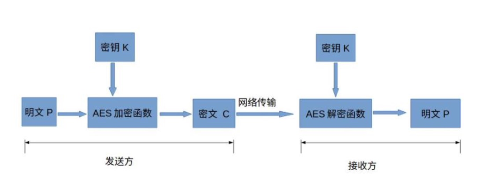
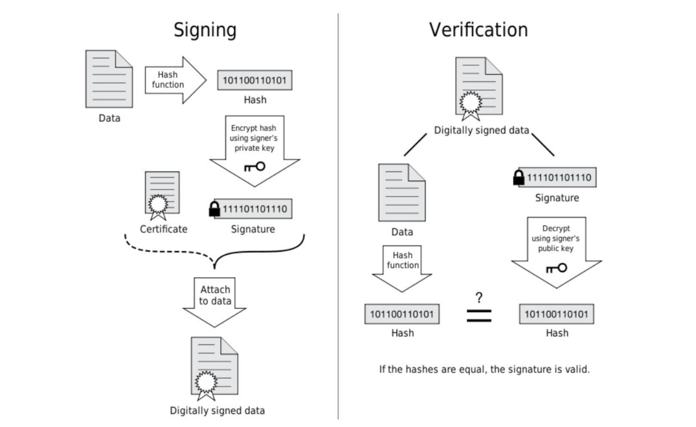

TLS 协议的设计目的：身份验证、保密性、完整性。

TLS 协议位于 OSI 模型的表示层或 TCP/IP 模型的应用层。

TLS 协议主要包含两部分：
- Record 记录协议
  - 对称加密
- Handshake 握手协议，为了完成加密，需要传递密钥，就需要通过握手协议完成
  - 验证通讯双方的身份
  - 交换加解密的安全套件
  - 协商加密参数


密钥交换算法：ECDHE，客户端与服务器通过交换部分信息，各自独立生成最终一致的密钥
身份验证算法：RSA
对称加密算法、强度、工作模式：AES_128_GCM，每次建立连接后，加密密钥都不一样
签名hash算法：SHA256

# 对称加密

AES 对称加密的应用：



## XOR 异或运算

对称加密是基于 XOR 异或运算实现的！

示例：
密钥：1010
明文：0110
密文：1100（密钥和明文做异或运算所得）
密钥：1010
明文：0110（密钥和密文做异或运算所得）

上面示例可知，在做 XOR 运算时，需要密钥和明文的长度必须完全一致！而密钥通常不会很长，但是明文的长度就不一定，此时就需要使用填充了

## 填充 padding

Block cipher 分组加密：将明文分成多个等长的 Block 模块，对每个模块分别加解密。

> 每个模块的长度与密钥长度一致

目的：当最后一个明文 Block 模块长度不足时，需要填充！

填充方式：
- 位填充：以 bit 位为单位来填充
- 字节填充：以字节为单位为填充，又分为四种
  - 补零
  - 根据 ANSI X9.23 填充，前面都填 0，最后一个字节记录前面填充了几个 0，解密的时候需要根据最后一个字节来判断忽略多少填充的字节
  - 根据 ISO 10126 填充，前面填随机字符，最后一个字节记录前面填充了几个字节
  - 根据 PKCS7（RFC5652）填充，在所有需要填充的位置填充完全相同的内容（需要填充几个字节）

## 工作模式

分组工作模式 block cipher mode of operation，允许使用同一个分组密码密钥对多于一块的数据进行加密，并保证其安全性。

ECB（Electronic codebook）模式，直接将明文分解为多个块，对每个块独立加密。但无法隐藏数据特征。

CBC（Cipher-block chaining）模式，每个明文块先与前一个密文块进行异或后，再进行加密。没有上面的问题，但加密过程是串行化的。

CTR（Counter）模式，通过递增一个加密计数器以产生连续的密钥流。没有以上两个问题，但不能提供密文消息完整性校验。

可以通过 hash 函数来对消息的完整性校验！

MAC（Message Authentication Code）可以实现对称加密中的完整性校验，将完整密文与密钥使用 MAC 算法生成一个 MAC 值，传输时将密文和 MAC 值同时传输给接收方，接收方收到后先通过同样的 MAC 算法计算收到后密文的 MAC 值，然后与接受到的 MAC 对比，如果一致再做解密。

GCM（Galois/Counter Mode），其实就是 CTR + GMAC。

## AES 对称加密算法

AES(Advanced Encryption Standard)加密算法，其常用填充算法为 PKCS7，常用分组工作模式为 GCM。

AES 的分组长度固定为 128 位（16字节），有三种不同的加密方式：
- AES-128，密钥长度 16 字节，加密轮数 10
- AES-192，密钥长度 24 字节，加密轮数 12
- AES-256，密钥长度 32 字节，加密轮数 14

加密步骤：
1. 把明文按照 128bit(16 字节)拆分成若干个明文块，每个明文块是 4*4 矩阵
2. 按照选择的填充方式来填充最后一个明文块
3. 每一个明文块利用 AES 加密器和密钥，加密成密文块
4. 拼接所有的密文块，成为最终的密文结果

# 非对称加密

每个参与方都有一对密钥：公钥（向对方公开），私钥（仅自己使用）。

非对称加解密过程：
- 加密，使用对方的公钥加密消息
- 解密，使用自己的私钥解密消息

A 要和 B 通话，两个人各有自己的一对密钥，当 A 要向 B 发送消息时，先使用 B 的公钥对消息加密，然后再将密文发送给 B，而 B 收到密文后，会使用自己的私钥对密文解密。

RSA 算法，通常使用 openssl 库基于 RSA 算法生成 CA 证书。

```shell
$ openssl genrsa -out private.pem # 生成私钥
$ openssl rsa -in private.pem -pubout -out public.pem # 从私钥中提取出公钥

$ openssl asn1parse -i -in private.pem # 查看 ASN.1 格式的私钥
$ openssl asn1parse -i -in public.pem  # 查看 ASN.1 格式的公钥
$ openssl asn1parse -i -in public.pem -strparse 19 # 19 是上一步拿到的 BIT STRING 最前面的数字

$ openssl rsautl -encrypt -in hello.txt -inkey public.pem -pubin -out hello.en # 使用公钥对文件 hello.txt 加密得到 hello.en
$ openssl rsautl -decrypt -in hello.en -inkey private.pem -out hello.de # 使用私钥对加密文件 hello.en 解密的搭配 hello.de
```

## DH 密钥交换协议

由客户端生成对称加密的密钥：
1. Client 向 Server 发送 “Hello”
2. Server 将自己的公钥响应给 Client
3. Client 在自己内部生成一个随机的密码，然后 Client 利用公钥对这个密码加密再向 Server 发送
4. Server 收到后使用自己的私钥解密得到密码，之后两者的对称加密就基于这个密码即可。

问题：没有前向保密性
假设有一个中间人没有破解 Server 的私钥，但是通过网络设备把所有的网络报文都保存了，以后某一天破解了 Server 的私钥后，就可以将第三个报文解密得到对称加密的密钥，就可以解密所有的消息了。

DH 密钥交换，可以让双方在完全没有对方任何预先信息的条件下通过不安全信道创建起一个私钥。每一次的密钥都是随机生成的，即使某一次的密钥被破解，也无法解密所有的历史报文。

1. Client 向 Server 发送 “Hello”
2. Server 自己生成一对公私钥 1，并将公钥发给 Client
3. Client 收到后，自己也生成一对公私钥 2，然后将自己的公钥发给了 Server
4. Client 基于 publicKey1 和 privateKey2 生成一个密钥，Server 基于 publicKey2 和 privateKey1 生成一个密钥
5. 这两个密钥是完全相同的，就可以用于后续的对称加密

DH 密钥交换的问题：中间人伪造攻击
- 中间人向 Server 假装自己是 Client，向 Client 假装自己是 Server，并进行各自两次 DH 密钥交换
- 可以通过身份验证解决中间人伪造攻击

## PKI 证书体系

数字签名，基于私钥加密，只能使用公钥解密，公钥是大家都持有的，所以大家都可以知道消息是那个人发出的，起到身份认证的作用。

公钥的管理：Public Key Infrastructure(PKI)公钥基础设施
- 由 Certificate Authority(CA)数字证书认证机构将用户个人身份与公开密钥关联在一起
- 公钥数字证书组成：CA 信息、公钥用户信息、公钥、权威机构的签字、有效期
- PKI用户：向 CA 注册公钥的用户；希望使用已注册公钥的用户

签发证书流程：
1. A 生成一对公私钥
2. A 将公钥和自己的身份信息向 CA 认证机构发起申请
3. CA 认证机构核实 A 的信息，然后使用 CA 机构自己的私钥对 A 的信息进行加密，加密后的证书就是公钥证书

PS：公钥证书是有有效期的

签名 Sign 流程：
1. 对用户数据使用 hash 函数生成 hash 值
2. 使用 CA 机构自己的私钥对 hash 值加密得到一串密文
3. 把密文、用户数据、用户的公钥放在一起打包成一个数字证书（公钥证书）

验签 Verification 流程：
1. 浏览器拿到公钥证书后提出用户信息和密文
2. 对用户信息按证书中声明的 hash 算法生成 hash 值
3. 使用 CA 机构的公钥对密文解密得到 hash 值，如果解密成功就说明 CA 机构是没有问题的
4. 检查两个 hash 值是否匹配



