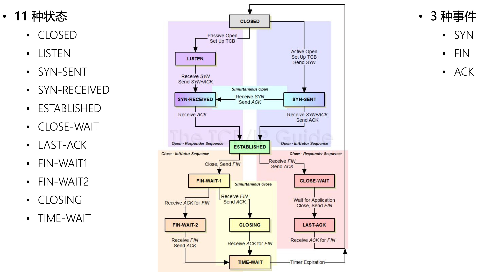
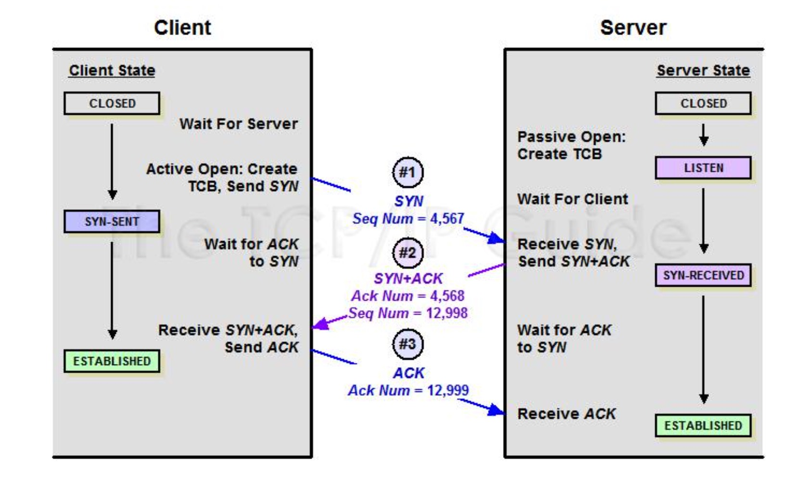
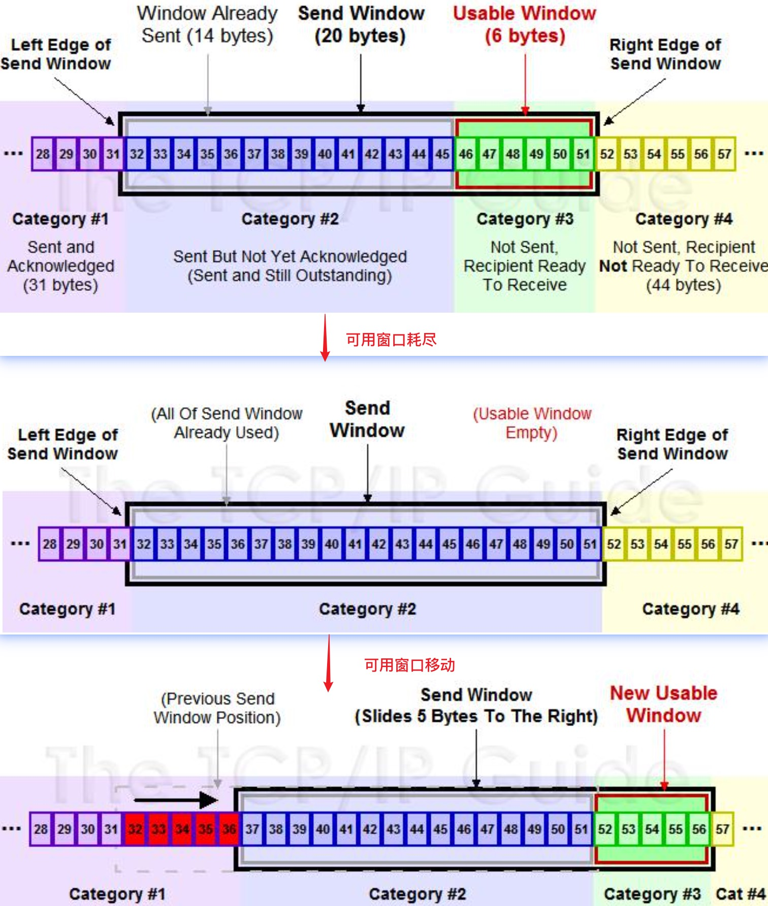
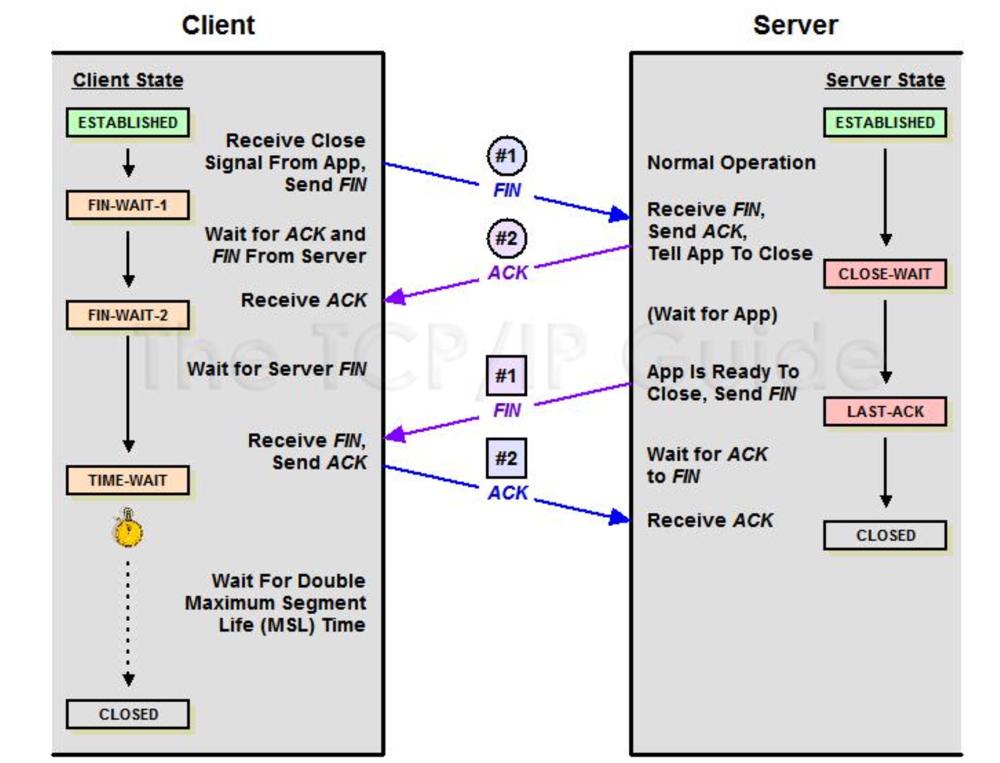

UDP（User Datagram Protocol 用户数据协议）和 TCP（Transmission Control Protocol 协议）是位于第四层传输层的协议。

TCP 协议是面向连接的、可靠的、基于字节流的传输层通信协议。

TCP 连接是没有长短连接概念的！

TCP 协议在 IP 协议之上，解决网络通讯可依赖问题。
- 点对点(不能广播、多播)，面向连接
- 双向传递(全双工)
- 字节流，打包成报文段、保证有序接收、重复报文自动丢弃
  - 缺点：不维护应用报文的边界(对比 HTTP、GRPC)
  - 优点：不强制要求应用必须离散的创建数据块，不限制数据块大小
- 流量缓冲，解决速度不匹配问题
- 可靠的传输服务(保证可达，丢包时通过重发进而增加时延实现可靠性)
- 拥塞控制

TCP 协议的任务
- 主机内的进程寻址
- 创建、管理、终止连接
- 处理并将**字节(8bit)流**打包成报文段(如 IP 报文)
- 传输数据
- 保持可靠性与传输质量
- 流控制与拥塞控制

Q：如何标识一个 TCP 连接？

A：TCP 四元组(源地址，源端口，目的地址，目的端口)可以唯一的定义一个连接

> HTTP/3 的 QUIC 协议是通过连接 ID 来定义一个连接的。

TCP 的所有状态流转（含三次握手、四次挥手）：



# tcpdump 抓包

- `-D` 列举所有网卡设备
- `-i` 选择网卡设备
- `-c` 抓取多少条报文
- `--time-stamp-precision` 指定捕获时的时间精度，默认毫秒 micro，可选纳秒 nano 
- `-s` 指定每条报文的最大字节数，默认 262144 字节

> loopback 是还回地址的网卡设备

tcpdump 命令可以配合 BPF 来对抓包的数据做过滤：

```shell
$ tcpdump -i en0 -c 20 host www.bilibili.com and port 443
```

tcpdump 支持的文件操作：
- -w 输出结果至文件(可被 Wireshark 读取分析)
- -C 限制输入文件的大小，超出后以后缀加 1 等数字的形式递增。 注意单位是 1,000,000 字节
- -W 指定输出文件的最大数量，到达后会重新覆写第 1 个文件
- -G 指定每隔N秒就重新输出至新文件，注意 -w 参数应基于strftime 参数指定文件名
- -r 读取一个抓包文件
- -V 将待读取的多个文件名写入一个文件中，通过读取该文件同时读取多个文件

```shell
# 每个文件最大 1 个单位，最多 3 个文件，文件名称为 abc
# 最后会得到 abc0、abc1、abc2 三个文件
$ tcpdump -C 1 -W 3 -w abc
```

输出时间格式：
- -t 不显示时间戳
- -tt 自1970年1月1日0点至今的秒数 
- -ttt 显示邻近两行报文间经过的秒数
- -tttt 带日期的完整时间
- -ttttt 自第一个抓取的报文起经历的秒数

分析详情：
- -e 显示数据链路层头部
- -q 不显示传输层信息
- -v 显示网络层头部更多的信息，如 TTL、id 等
- -n 显示 IP 地址、数字端口代替 hostname 等
- -S TCP 信息以绝对序列号替代相对序列号
- -A 以 ASCII 方式显示报文内容，适用 HTTP 分析
- -x 以 16 进制方式显示报文内容，不显示数据链路层
- -xx 以 16 进制方式显示报文内容，显示数据链路层
- -X 同时以 16 进制及 ACII 方式显示报文内容，不显示数据链路层
- -XX 同时以 16 进制及 ACII 方式显示报文内容，显示数据链路层

# 三次握手

握手的目标：
- 同步 Sequence 序列号（ISN，Initial Sequence Number，初始序列号）
  - 每个 Number 都会标识一个字节，Server 端和 Client 端所使用的 ISN 都是不同的，所以需要通过握手来交换 ISN
- 交换 TCP 通讯参数，如 MSS、窗口比例因子、选择性确认、指定校验和算法

三次握手：SYN（同步），ACK（确认）


注：图中第三次握手时，Client 不会发送 Seq 的，见下面抓包示例。

在本地 80 端口开启一个服务，然后抓包：

```shell
$ tcpdump -i lo0 port 80 -c 3 -S # 由于是本地访问本地开启的服务，所以这里对还回地址抓包，且仅抓取 3 个包，也就是前面的三次握手
# Client 发送了自己的 ISN 2825236013
21:27:41.240973 IP localhost.57316 > localhost.http: Flags [S], seq 2825236013, win 65535, options [mss 16344,nop,wscale 6,nop,nop,TS val 1702760285 ecr 0,sackOK,eol], length 0
# Server 会 ACK Client，同时发送自己的 ISN 774781734
21:27:41.241086 IP localhost.http > localhost.57316: Flags [S.], seq 774781734, ack 2825236014, win 65535, options [mss 16344,nop,wscale 6,nop,nop,TS val 3907779767 ecr 1702760285,sackOK,eol], length 0
# Client 会 ACK Server
21:27:41.241094 IP localhost.57316 > localhost.http: Flags [.], ack 774781735, win 6379, options [nop,nop,TS val 1702760285 ecr 3907779767], length 0
```

Q：为什么 Client 和 Server 发送的 ISN 都是随机数？

A：由于网络中报文会延迟、重发、丢失，为了防止这些异常情况对不同连接之间产生影响；同时也可以防止 sequence number attacks。

Sequence 序列号/Ack 序列号的设计目的是为了解决应用层字节流的可靠发送
- 跟踪应用层的发送端数据是否送达
- 确定接收端有序的接收到字节流
序列号的值针对的是字节而不是报文，序列号的值是和此报文包含的字节长度有关。
如：一个报文序号是100，字节数是50，那么确认序号只能是151，而不能是121或者131

## 状态变迁

三次握手共计涉及五种状态：CLOSE、LISTEN、SYN-SENT、SYN-RECEIVED、ESTABLISHED。



TCB（Transmission Control Block），保存连接使用的源端口、目的端口、目的 ip、序号、 应答序号、对方窗口大小、己方窗口大小、tcp 状态、tcp 输入/输出队列、应用层输出队 列、tcp 的重传有关变量等

使用 `netstat` 命令可以查看状态，不同 OS 命令参数有所区别。

服务端第一次收到客户端的 SYN 之后，会处于 SYN_RCVD 状态，此时双⽅还没有完全建立起连接，服务端会把这种状态下请求连接放在一个队列里，这种队列称之为半连接队列。
还有一个全连接队列，就是已经完成三次握⼿，建立起连接的就会放在全连接队列中。
如果队列满了了就有可能会出现丢包现象。

## 两次握手可以吗？

Q2：为什么需要三次握手，两次不可以吗？

三次握手是为了确认双方的收发能力是否正常。为什么需要三次才能确认？

1. 第一次握手后，服务端收到客户端的报文，服务端确认了客户端的发送、服务端的接收能力正常；
2. 第二次握手后，客户端收到了服务端的报文，客户端确认了服务端的接收、发送，以及自己的发送、接受能力正常，但此时服务端还无法确认客户端的接收能力是否正常；
3. 第三次握手后，服务端收到了客户端的 ACK，服务端确认了客户端的接收、发送正常，自己的发送、接受也正常。

三次握手不仅可以确认双方的收发能力正常；同时，三次握手的过程中，客户端和服务端会交换 ISN, 以便让对⽅知道接下来接收数据的时候如何按序列号组装数据。

## 可以携带数据吗？

第一、二次握手不可以携带数据，但第三次握手是可以携带数据的。

第三次握手前，客户端已处于 ESTABLISHED 状态，即对于客户端而言已经建立起连接了，而且也知道服务端的收发能力正常，所以可以携带数据。

第一次握手如果可以携带数据的话，假设有人恶意攻击服务器，每次在第一次握手的 SYN 报文中放入大量数据，并疯狂地重复发送，服务端会耗费大量时间和内存来接受这些报文的。

第二次握手是服务端发给客户端的，客户端无法携带数据。


# 重传&确认

TCP 是面向字节流的协议，不限制应用层传输消息的长度，但是在下面的网络层和数据链路层由于发送报文时使用的内存有限，它们会限制报文的长度，因此 TCP 必须把它从应用层收到的任意长度的字节流切分成许多个报文段 Segment。TCP 必须保证每个 Segment 一定会到达对方。TCP 是通过重传、确认来保证这一点的。

需要发送多个 Segment，但期间可能会发生报文丢失，如何解决？

PAR（Positive Acknowledgment with Retransmission）：每个 Segment 发送时会启动一个重传定时器，只有在重传定时器的时间内收到对方 ACK 后才发送下一个 Segment，如果重传定时器的时间内没有收到 ACK，就重发消息（会重置定时器）。效率低。

提升并发能力的 PAR：每个 Segment 发送时带上一个标识，ACK 的时候需要明确告知是对哪个 Segment 做 ACK 的，这样就可以并发发送多个 Segment，如果哪个 Segment 对应的定时器在时间内没有收到 ACK，就重发消息（会重置定时器）；接收方的内存和处理能力是有限的，发送方不能无限制的去并发发送，所以接收方每次 ACK 时还需要告诉发送方还剩下几个缓冲区。

> 上面的标识无法复用序列号，因为序列号是针对字节的，而非报文。

TCP 序列号是有限的，超过以后就会复用，但是复用可能会导致出现 PAWS (Protect Against Wrapped Sequence numbers) 序列号回绕问题：某个序列号被复用发送给接收方，而之前该序列号的消息由于网络问题导致重发，此时接收方就无法识别该序列号对应的实际消息是哪个了。

可以通过添加 TCP-timestamp 来解决，每次发送时携带上时间戳。

# 滑动窗口

滑动窗口机制是 TCP 的一种流量控制方法。如果接收端和发送端对数据包的处理速度不同，如何让双方达成一致。接收端的缓存传输数据给应用层，但这个过程不一定是即时的，如果发送速度太快，会出现接收端数据overflow，流量控制解决的是这个问题。

TCP在进行数据传输的时候都是先将数据放在数据缓冲区中的，TCP维护了两个缓冲区
- 发送方缓冲区：发送方缓冲区用于存储已经准备就绪数据和发送了但是没有被确认的数据
- 接收方缓冲区：接收方缓冲区用于存储已经被接收但是还没有被用户进程消费的数据

发送窗口的四类数据：
1. 已发送并收到 Ack 确认的数据
2. 已发送未收到 Ack 确认的数据
3. 未发送但总大小在接收方处理范围内
4. 未发送但总大小超出接收方处理范围

其中 3 称为可用窗口，2、3 合起来称为为发送窗口。当把发送窗口的数据都发送出去后（未收到 ACK），可用窗口就耗尽了，但是发送窗口并没有变化；

当发送窗口的部分数据收到了 ACK 后，发送窗口移动。



接收窗口的大小约等于对端发送窗口。

滑动机制
1. 发送窗口只有收到发送窗口内字节的ACK确认，才会移动发送窗口的左边界
2. 接收窗口只有在前面所有的段都确认的情况下才会移动左边界。当在前面还有字节未接收但收到后面字节的情况下，窗口不会移动，并不对后续字节确认。以此确保对端会对这些数据重传；
3. 遵循快速重传、累计确认、选择确认等规则；
4. 发送方发的window size = 8192;就是接收端最多发送8192字节，这个8192一般就是发送方接收缓存的大小。

# 如何减少小报文 todo

小报文的传输的网络效率很低，因为每个 TCP Segment 都会有固定 20 字节的 TCP 头部，也会有固定 20 字节的 IP 头部，小报文传输时有效报文的比重很低。所以应在合理范围内避免大量传输小报文。

SWS(Silly Window syndrome)糊涂窗口综合症

TCP delayed acknowledgment 延迟确认
- 当有响应数据要发送时,ack 会随着响应数 据立即发送给对方
- 如果没有响应数据,ack 的发 送将会有一个 延迟,以等待看是否有响应数据可以一起发送
- 如果在等待发送 ack 期间,对方的第二个数 据段又到达了,这时要立即发送 ack

# 拥塞控制 todo

# 四次握手关闭连接

关闭连接的目的：防止数据丢失；与应用层交互

四次握手：FIN（结束），ACK（确认）



MSL(Maximum Segment Lifetime) 报文最大生存时间

TIME_WAIT 会维持 2MSL 时长的 TIME-WAIT 状态，保证至少一次报文的往返时间内端口是不可复用。

TIME_WAIT 有保护作用，不让延迟发过来的数据扰乱新连接。
假设 A 向 B 发送三个报文，其中 1、2 都被正常接收，而 3 由于网络延迟尚未到达 B，此时 B 发起关闭，如果 B 处于 TIME_WAIT 的时间很短或不存在，其他连接就会很快复用了端口并发送了报文，而此时 3 也发送过来了，就会对 B 造成数据错乱的影响。

## TIME_WAIT 优化

主动发起关闭的一方会进入 TIME_WAIT 状态，通常持续该状态 2min 左右，也就是说，有 2min 的时间这个端口是被占用了的。

linux下TIME_WAIT优化：tcp_tw_reuse

`net.ipv4.tcp_tw_reuse = 1` 开启后，作为客户端时新连接可以使用仍然处于 TIME-WAIT 状态的端口

> 由于 timestamp 的存在，操作系统可以拒绝迟到的报文，需要通过 `net.ipv4.tcp_timestamps = 1` 启用

`net.ipv4.tcp_tw_recycle = 0` 开启后，同时作为客户端和服务器都可以使用 TIME-WAIT 状态的端口。但不安全，无法避免报文延迟、重复等给新连接造成混乱。所以该配置通常不应开启！！

`net.ipv4.tcp_max_tw_buckets = 262144` 配置 TIME_WAIT 状态连接的最大数量，超出后直接关闭连接。  

遇到异常状况时，可以通过 RST 复位报文直接关闭连接，绕过四次握手。


