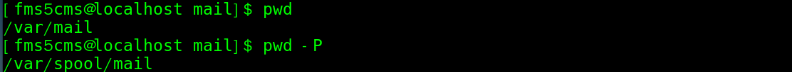

# 目录结构 ★

- Linux 文件系统是采用级层式的树状目录结构，有且只有一个根目录`/`；
- Linux 以文档命名方式处理来决定确定是否隐藏。（**隐藏文件/文件夹的名称开头是小数点**）
- `yun install tree`安装 tree 指令；
  - `tree` 以树状显示当前目录下的结构
  - `tree /` 显示 Linux 系统的目录结构

常见的目录说明：

1. **/bin：** 存放二进制可执行文件(ls,cat,mkdir 等)，常用命令一般都在这里；
2. **/etc：** 存放系统管理和配置文件；
3. **/home：** 存放所有用户文件的根目录，是用户主目录的基点，比如用户 user 的主目录就是/home/user，可以用~user 表示；
4. **/usr：** 用于存放系统应用程序；
   1. /bin、/sbin 存放系统预装的其他命令
5. **/opt：** 额外安装的可选应用程序包所放置的位置。
6. **/proc：** 虚拟文件系统目录，是系统内存的映射。可直接访问这个目录来获取系统信息；
7. **/root：** 超级用户（系统管理员）的主目录；
8. **/sbin:** 存放二进制可执行文件，只有 root 才能访问。存放系统管理员使用的系统级别的管理命令和程序。如 ifconfig 等；
9. **/dev：** 用于存放设备文件；
10. **/mnt：** 临时挂载其他的文件系统；
11. **/boot：** 存放用于系统引导时使用的各种文件；
12. **/lib ：** 存放着和系统运行相关的库文件 ；
13. **/tmp：** 用于存放各种临时文件，是公用的临时文件存储点；
14. **/var：** 存放运行时需改变数据的文件，也是某些大文件的溢出区，如：各种服务的日志文件（系统启动日志等）等。
15. **/media**：U 盘等插入 media 就会多出文件；

- `.`代表当前的目录，也可使用`./` 来表示；
- `..`代表上一层目录，也可`../`来代表。

# 文件系统

典型的 Linux 文件系统：

- bootfs（boot file system）
  - Bootloader - 引导加载 kernel
  - Kernel - 当 kernel 被加载到内存中后 umount bootfs，然后加载 rootfs
- rootfs（root file system）
  - /dev，/proc，/bin，/etc 等标准目录和文件。
  - 对于不同的 linux 发行版, bootfs 基本是一致的，但 rootfs 会有差别。

# 查看、切换、创建

- `pwd`  显示当前工作目录的绝对路径。

  - 参数：`-P` 显示出确实的路径，而非使用链接的路径。

  - 案例：进入 /var/mail 目录下

    

     说明：/var/mail 是链接到 /var/spool/mail 的链接文件。

---

- ls 指令（list）:`ls [选项] [目录或是文件]` 
  - `-a` 显示当前目录所有的文件和目录，包括隐藏的内容
  - `-d` 查看目录的信息
  - `-l` 长格式显示，包含文件的属性和权限等数据
  - `-h` 用便于浏览的方式显示，如原本文件大小以字节为单位，使用该选项后，可以直接显示 xx K 或M
  - `-r`将排序结果反向输出
  - `-R`连同子目录内容一起列出来
  - `-S`以文件容量大小排序
  - `-t`以时间排序
  - `--full-time `：以完整时间模式 (包含年、月、日、时、分) 输出

---

- cd 指令（ change directory ）：`cd [参数]`  切换到指定的目录。    
  - `cd~`或`cd`  回到自己的家目录
  - `cd..`回到当前目录的上一级目录

---

- mkdir 指令（make directory ）：`mkdir [选项] 要创建的目录`

  - `-p` 递归创建多级目录
  - `-m` 直接配置文件的权限，

  - eg：`mkdir /home/dog`在 /home 目录下，创建 dog 目录
  - eg：`mkdir -m 711 test` 在当前目录下建立权限为`rwx--x--x`的目录
  - 如果不指定权限的话，就会是默认权限`rwxrwxr-x`（见2.6预设权限）

---

- touch 指令（创建空文件）：`touch [选项] 文件名称`  
  - 一次性创建多个文件：`touch 文件名称1 文件名称2。。。` eg：`touch a.txt b.txt c.txt`


# 复制、删除、移动

- `cp [选项] 源文件 指定目标目录 `（拷贝文件到指定目录，需要有 `r` 权限）

  - `-a`连同文件的所有特性（权限、建立时间等）一起复制。与`-p`相同？
  - `-d`若源文件为链接文件，则复制链接文件属性而不是文件本身
  - `-f`强制（force），若目标文件存在且无法打开，则移除后再尝试
  - `-i`目标文件已存在时，覆盖会先询问（常用）
  - `-r` 递归复制，用于目录的复制行为（常用）
  - `-p`连同文件的属性(权限、用户、时间)一起复制过去，而非使用默认属性(备份常用)；

  - eg：`cp aaa.txt bbb/`将当前目录的aaa.txt 拷贝到 当前目录中的bbb目录下（拷贝单个文件）
  - eg：`cp -r test/ zwj/` 将当前目录的test 整个目录拷贝到当前目录zwj目录
  - 注意： `cp` 指令在复制时，如果发现目标目录下有相同文件，会提示是否覆盖。如果强制覆盖，不想要提示，可以使用 `\cp`指令，用法同`cp`指令
  - 如果来源文件有两个以上，则最后一个目的文件一定要是『目录』才行！
  - 默认情况下，将别的用户的数据复制过来后，复制文件的User、Group就是自己了。

---

- `rm [选项] 要删除的文件或目录`，为了怕文件被 root 误杀，很多的 Linux 版本中，移除指令都默认加入了`-i`选项

  - `-r`递归删除整个文件夹（不会询问的）
  - `-f`强制（force）删除不提示
  - `-i`互动模式，删除前会询问

  - 通配符`*`，可以使用其来将具有相同开头或结尾的文件全部删除。
    - eg：`rm -i bashrc*`删除当亲目录下文件名开头是 bashrc 的所有文件

---

- `rmdir [选项] 要删除的空目录`       
  - 注意：`rmdir` 删除的是空目录，如果目录下有内容时是无法删除的
  - 如果要删除非空目录，需要使用 `rm -rf 要删除的目录`

---

- mv 指令（移动文件与目录、重命名）

  - `mv [选项] 旧文件名 新文件名`   重命名
    - 还有一个指令`rename`用于进行多个文件的同时重命名
  - `mv [选项] 目标文件1，目标文件2... 目标目录`  移动多个或单个文件到目标目录下

  - 选项：
    - `-f`如果目标文件已经存在，不询问直接覆盖
    - `-i`如果目标文件已经存在，会询问
    - `-u`如果目标文件已经存在，且源文件较新，才会更新
  - eg：`mv a.txt b.txt`将当前目录的 a.txt 重命名为 b.txt
  - eg：`mv a.txt /root/` 将当前目录下的 a.txt 移动到 /root 目录下


# 文件内容查看

- `cat [选项] 文件`：文件所有内容连续显示在屏幕上）Concatenate（连续）
  - `-b` 显示行号（仅针对非空白行）
  - `-n` 显示行号（空白行也有）
  - `-T` 将【Tab】键显示为`^I`
  - `-E` 将结尾的断行字符 `$` 显示出来
  - `-v `列出一些看不出来的特殊字符
  - `-A` 相当于`-vET`的整合，可列出一些特殊字符而不是空白

---

- `more 要查看的文件`：以全屏幕的方式按页显示文本文件的内容。more 指令中内置了若干快捷键

| 快捷键   | 功能                               |
| -------- | ---------------------------------- |
| 空格键   | 向下翻一页                         |
| 回车键   | 向下翻一行                         |
| q        | 立刻离开more，不再显示该文件的内容 |
| Ctrl + F | 向下滚动一屏                       |
| Ctrl + B | 返回上一屏                         |
| =        | 输出当前行的行号                   |
| :f       | 输出文件名和当前行的行号           |
| /字串    | 向下搜寻指定字串                   |

---

- `less 要查看的文件`：用来分屏查看文件内容，在显示文件内容时，并不是一次将整个文件加载之后才显示，而是根据现实需要加载内容，**对于显示大型文件具有较高效率**

| 快捷键       | 功能               |
| ------------ | ------------------ |
| 空格键       | 向下翻一页         |
| 【pageup】   | 向上翻一页         |
| 【pagedowm】 | 向下翻一页         |
| /字串        | 向下搜寻指定字串   |
| ?字串        | 向上搜寻指定字串   |
| q            | 离开 less          |
| n            | 重复前一个搜寻     |
| N            | 反响重复前一个搜寻 |
| g            | 前进到第一行       |
| G            | 前进到最后一行     |

---

- wc 统计文件内容信息
  - `wc -l 文件` 查看文件有多少行


- head 指令（显示文件的开头部分内容，默认显示文件前10行内容）

  - `head 文件` 查看文件前10行内容
  - `head -n 5 文件` 查看文件前5行内容，简写为 `head -5 文件`
  
- tail 指令（输出文件中尾部的内容，默认显示文件后10行内容）

  - `tail 文件`  查看文件后10行内容
  - `tail -n 5 文件`  查看文件后5行内容，简写为 `tail -5 文件`
  - `tail -f 文件` 实时追踪文件的所有更新（工作中经常使用）【Ctrl】+ C 结束

```shell
#如何显示第 11 到 20 行？
head -n 20 文件 | tail -n 10
```

# 文件压缩

Linux 将打包和压缩分为两个过程，`tar` 命令用于打包(将很多文件打包成一个文件)、打包后的文件可以使用 `gzip` 或 `bzip2` 进行压缩。

常见的扩展名为：.tar.gz、.tar.bz2、.tgz

后来的 GNU 计划中，将整个 `tar` 与压缩的功能结合在一起，如此一来提供使用者更方便并且更强大的压缩与打包功能。

- `tar [选项]  XXX.tar.gz  打包内容`：将文件打包为 *.tar.gz 文件

```shell
# tar 的选项不用加 -
# c 进行打包、f 指定最后的文件名
tar cf backup.tar 要打包的目录（也可以是多个文件名）
# z 使用 gzip 压缩方式，j 使用使用 bzip2 压缩方式
tar czf backup.tar.gz 要打包的目录（也可以是多个文件名）
# x 进行解包，-C 指定解包后保存的路径
tar xf backup.tar -C /root
# 解压缩的话可以使用 zxf、jxf，分别针对不同压缩方式进行解压
# v 可以显示进度
```

- gzip 将文件压缩为 *.gz 文件；gunzip 用于解压文件
  - 语法：`gzip [选项] 文件`  选项：
    - `-c`：将压缩的数据输出到屏幕上，可透过数据流重导向来处理；
    - `-d`：解压缩的参数；
    - `-t`：可以用来检验一个压缩文件的一致性～看看文件有无错误；
    - `-v`：可以显示出原文件/压缩文件案的压缩比等信息；
    - `-#`：# 为数字的意思，代表压缩等级，-1 最快，但是压缩比最差、-9 最慢，但是压缩比最好！预设是 -6
  - 当使用 gzip 对文件进行压缩后，不会保留原来的文件。解压后，压缩文件也没有不再保留 
