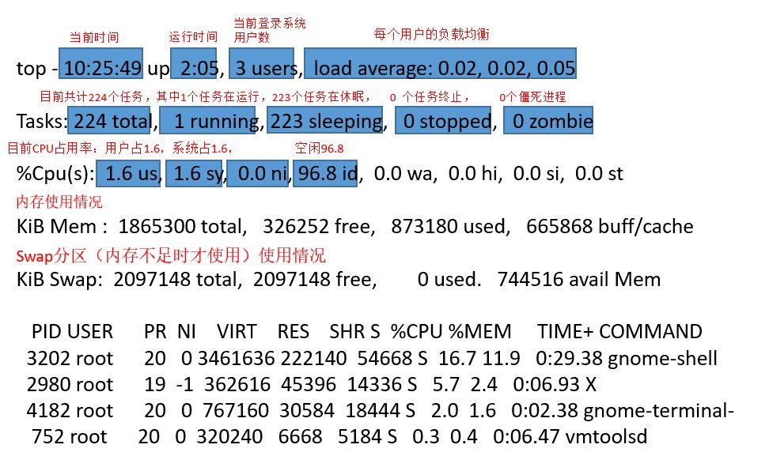
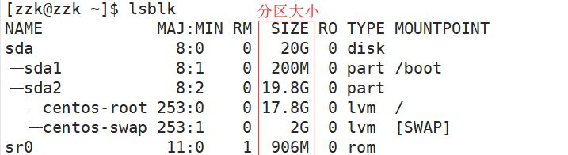
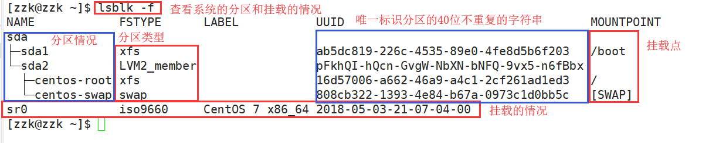

# 网络

工具：CentOS7 之前使用 net-tools，CentOS7 开始主推 iproute

- net-tools：ifconfig、route、netstat
- iproute2：ip、ss

## 网络配置查看

- `ifconfig`
  - eth0 第一块网卡（网络接口），也可能叫做 eno1（板载网卡）、ens33（PCI-E 网卡）、enp0s3（无法获取物理信息的 PCI-E 网卡），如果这些网络设备都不符合，就会使用 eth0
  - 在服务器端，为了批量管理，通常会把所有机器的第一块网络接口命名为 eth0
  - inet 后为网卡 IP 地址，netmask 后为子网掩码，
  - ether 后为网卡的 MAC 地址，RX、TX 为发送和接收数据包的相关信息
- `mii-tool 网卡名(如 eth0)` 查看⽹网卡物理理连接情况，虚拟机有可能不支持
- `route -n` 查看网关，-n 表示不解析主机名

## 网络故障排除

- `ping 目标主机IP或域名` 检测当前主机与目标主机间的网络是否畅通
  - 如果 `ping` 发现网络畅通，但访问还是异常，可能是中间的网络质量出现问题，可以使用以下两个命令辅助排查
  - `traceroute 域名或IP` 追踪当前主机到目标主机的网络状态
    - `traceroute -w 1 www.baidu.com` 其中 `-w 1` 表示如果超时的话只等待 1s
    - 如果中间主机不支持追踪的话，会以 `*` 显示，要看更详细信息，可使用 `mtr` 命令
  - `mtr` 检查中间是否有数据包丢失
- `nslookup 域名` 解析域名对应的 IP
- `telnet 域名或IP 端口` 检查端口连接状态
- `tcpdump` 分析数据包
  - `tcpdump -i any -n port 80 and host 10.0.0.1 -w /tmp/file`
  - `-i any` 抓取所有网卡的数据包
  - `-n` 如果有域名的话将其解析为 IP
  - `port 80` 指定抓取的本地端口
  - `host 10.0.0.1` 捕获到指定主机的数据包，如果主机和本地端口都想指定，需在中间使用 `and`
  - `-w 文件路径` 捕获的数据写入到文件中
- `netstat` 查看对服务监听地址
  - 通常使用四个参数 `-n` 将域名解析为 IP、`-t` 使用 tcp 方式来截取想要显示的内容、`-p` 显示对应的进程、`-l` tcp 状态
- `ss` 使用参数与 `netstat` 基本相同

## 网络管理与配置文件

- ⽹网络服务管理理程序分为两种，分别为 SysV 和 systemd
  - SysV 管理时使用的命令为 `service`
  - CentOS7 开始使用 systemd 来替代 SysV，使用命令为 `systemctl`

```shell
# 查看网络服务
systemctl list-unit-files NetworkManager.service
# CentOS7 有两套控制网络服务的方式，network 和 NetworkManager，建议只使用一种，另一种禁用
# 查看 network 服务当前在不同运行级别中的打开情况
chkconfig --list network
# 关闭 2、3、4、5 运行级别中的 network 服务
chkconfig --level 2345 network off
# 禁用 NetworkManager 服务
systemctl disable NetworkManager
```

- 网络配置文件
  - /etc/sysconfig/network-scripts/ifcfg-网卡名 是网卡配置文件，主要关注
    - BOOTPROTO，值为 dhcp 表示 IP 是动态分配的，static 表示静态
    - NAME、DEVICE 表示网络设置
    - ONBOOT 表示开机时是否启用
  - /etc/hosts
    - `hostname` 查看主机名：主机名.域名
    - `hostname fms5cms.zzk` 修改主机名，如果要永久修改，使用 `hostnamectl set-hostname fms5cms.zzk`
    - 注意，修改完主机名后，一定要同时增加 /etc/hosts 文件中主机名和 IP 地址的对应关系`127.0.0.1 fms5cms.zzk`！


# 软件安装

软件包管理器：

- CentOS、RedHat 使⽤用 yum 包管理理器器，软件安装包格式为 rpm
- Debian、Ubuntu 使⽤用 apt 包管理理器器，软件安装包格式为 deb

## RPM

RPM（Red-Hat Package Manager）

- rpm 包格式：vim-common-7.4.10-5.el7.x86_64.rpm
  - 软件名：vim-common
  - 软件版本号：7.4.10-5
  - 系统版本：el7
  - 平台：x86_64，如果是 i686、i386 表示 32 位系统，noarch 表示通用

查询和卸载时只需要输入软件名即可，安装时则需要输入完整的 rpm 格式

```shell
# rpm 命令：
-q # 查询软件包是否安装
-i # 安装软件包
-e # 卸载软件包，如果其它软件包依赖于要卸载的软件包，卸载时会有错误信息，增加参数`--nodeps` 就可以强制删除了，但不建议
-h # 进度条 hash
-v # 提示 verbose（详细信息）
```

## YUM

rpm 方式安装软件包时，需要手动解决软件包的依赖关系。可以使用 yum，类似于软件管家，可以基于 RPM 包管理，能从指定的服务器自动下载 RPM 包并安装，可以自动处理依赖关系，并一次安装所有依赖的软件包。使用前提：联网、配置软件源(配置成国内镜像)。

官方源：http://mirror.centos.org/centos/7/

```shell
# yum 命令：
install  # 安装软件包
remove   # 卸载软件包
list| grouplist # 查看软件包
update # 升级软件包
```

常用选项：

- `yum list`查询 yum 服务器是否有需要安装的软件
- `yum install xxx`安装指定的 yum 包

## 常用软件安装

```shell
# 关闭 iptables：
iptables -L  #查看是否有iptables规则
iptables -F  #关闭

# 停用 selinux：
getenforce  #查看
setenforce 0 #关闭
sudo sed -i 's/^SELINUX=.*$/SELINUX=disabled/' /etc/selinux/config # 永久关闭 SELINUX

# 安装依赖
# 安装gcc（可输入gcc -v查询版本信息看系统是否自带安装）
yum install gcc
# 安装pcre
yum install pcre-devel
# 安装zlib
yum install zlib zlib-level
# 安装openssl，如需支持ssl才需安装openssl
yum install openssl openssl-devel
# 以上依赖安装可综合写成：
yum -y install gcc zlib zlib-devel pcre-devel openssl openssl-devel

# 安装 httpd 工具
yum -y install wget httpd-tools
```

- 升级到 vim8

```shell
rpm -Uvh http://mirror.ghettoforge.org/distributions/gf/gf-release-latest.gf.el7.noarch.rpm
rpm --import http://mirror.ghettoforge.org/distributions/gf/RPM-GPG-KEY-gf.el7
yum -y remove vim-minimal vim-common vim-enhanced sudo
yum -y --enablerepo=gf-plus install vim-enhanced sudo
```

---

- Git

```shell
cd /tmp
wget https://mirrors.edge.kernel.org/pub/software/scm/git/git-2.30.2.tar.gz
tar -xvzf git-2.30.2.tar.gz
cd git-2.30.2/
./configure
make
sudo make install
git --version          # 输出 git 版本号，说明安装成功
```

注意：如果提示没有该命令，首先`whereis git`，然后在 /etc/profile 的 PATH 中加入 `/usr/local/git/bin`，最后`source /etc/profile`。

初始化 Git：

```shell
git config --global user.name “用户名”
git config --global user.email  "邮箱"
git config --global core.autocrlf false
git config --global core.quotepath off
git config --global gui.encoding utf-8
git config --global credential.helper store # 设置 Git，保存用户名和密码
git config --global core.longpaths true # 解决 Git 中 'Filename too long' 的错误
ssh-keygen -t rsa -C "邮箱"
ssh-add ~/.ssh/id_rsa #然后连续回车
# 如果提示无法打开...，先`eval 'ssh-agent'`，再重新执行上面的命令
cat ~/.ssh/id_rsa.pub
# 将上面查到的公钥粘贴到 GitHub 内 SSH 公钥的部分
- `cat ~/.ssh/id_rsa.pub`将查到的公钥粘贴到GItHub内SSH公钥的部分
```

# 进程管理

在 Linux 中，每个执行的程序都称为一个进程，每个进程都分配一个 PID；每个进程都对应一个父进程，而这个父进程可以复制多个子进程。

系统的服务一般以后台进程的方式存在，且会常驻在系统中，直到关机才结束。

进程也是树形结构！

## 查看进程

### ps

查看进程使用的指令是`ps`

- `-a` 显示当前终端的所有进程信息
- `-u` 以用户的格式显示进程信息
- `-x`显示后台进程运行的参数
- `-e` 显示所有进程
- `-f` 全格式显示

```shell
ps  # 显示当前终端能查询到的进程状态，仅显示四列：
# PID（进程IO）
# TTY（当前程序的终端）
# TIME（进程运行时间，无参考价值）
# CMD（启动进程所用的命令和参数，如果过长会被截断显示）
```

常用的有：

```shell
ps -e    # 显示所有进程
ps -ef   # 全格式显示
ps -eLf  # 会显示线程信息
```

### pstree

查看进程树：`pstree [选项]` 可以更直观的查看进程信息。常用选项：
- `-p` 显示进程的 PID
- `-u` 显示进程的所属用户

### top

- `top`可以动态更新正在运行的进程状况
  - `-d 秒数` 每隔几秒更新。默认 3 秒
  - `-i` 不显示任何闲置或僵死进程
  - `-p` 通过指定监控进程 ID 来仅仅监控该进程的状态
  - 交互操作说明
    - ?：选项帮助
    - P：以 CPU 使用率排序，默认就是该项
    - s：修改更新频率
    - E：调整内存显示的单位
    - M：以内存的使用率排序
    - N：以 PID 排序
    - q：退出 top

输入 `top` 后（每隔 3 秒自动刷新一次）：



---

- 监控每个 CPU 的情况
  - 1.输入 `top`
  - 2.输入 `1` 然后就会显示每个逻辑 CPU 的使用情况
- 监控特定用户：
  - 1.输入 `top`
  - 2.输入 `u` ，再输入用户名即可
- 终止指定进程：
  - 1.输入 `top`
  - 2.输入`k` ，输入要结束的进程 ID

## 进程控制

- 调整优先级
  - `nice` 范围从 -20 到 19，值越小优先级越高，抢占资源越多
    - 默认值为 0（`top` 查看时 NI 列的值）
  - `renice` 重新设置优先级
- 进程的作业控制
  - `命令 &`：后台运行命令
  - `jobs`：查看后台运行/挂起的命令
  - `fg jobs命令查到的编号`将任务转到前台运行
  - Ctrl + Z：前台正在运行的命令转到后台挂起暂停
  - `bg jobs命令查到的编号` 将任务转到后台运行

```shell
#!/bin/bash
echo $$  # 输出当前进程号
while :
do
	:
done
```

```shell
chmod u+x file.sh
nice -n 10 ./file.sh  # 设置优先级为 10 并运行脚本，假设输出进程号为 18746
# 重新打开另一个终端
top -p 18746  # NI 列的值为 10
# 重新打开另一个终端
# 对一个已运行的进程修改优先级，可以看到上一个终端里 top 显示的 NI 列的值变更为 15
renice -n 15 18746
```

## 进程间通信

[信号](../../Common/Concurrent.md)是进程间通信方式之一，典型⽤用法是：终端⽤用户输⼊入中断命令，通过信号机制
停止一个程序的运行。

- `kill [选项] 进程号` 通过进程号杀死进程
  - 常用选项：`-9` 向进程发送 9 号信号强迫进程立即停止
- `killall 进程名称` 通过进程名称杀死进程，也支持通配符（在系统因负载过大变慢时有用）


## nohup&screen工具

- `nohup 命令` 启动的进程会忽略 SIGHUP（挂起）信号，即使终端关闭，进程也还是会运行的
  - 进程不是守护进程（运行在后台的进程，即使不打开终端也会运行，会在用户登录终端之前启动，不需要终端，输出会写入日志文件中）
  - 通常配合 `&` 一起使用
  - 忽略输入，将任务放到后台执行，并把输出追加到 nohup.out 
  - `nohup tail -f /var/log/messages &`

- 窗口管理工具 screen
  - 相当于在已打开的窗口中，创建新的窗口（会话），这些会话可以退出，但任务进程不会因此中断
  - `yum install screen` 安装工具
  - `screen` 进入 screen 环境
  - Ctrl + D 退出 screen 环境
  - `screen -ls` 查看 screen 的会话
  - `screen -r sessionId` 恢复会话

# 服务管理

服务（Service）本质是运行在后台的进程，即使不打开终端也会运行，会在用户登录终端之前启动，不需要终端，输出会写入日志文件中。因此又称为守护进程。

- 系统日志在 /var/log/ 下，关注：
  - messages 文件，系统常规日志
  - dmesg 文件，内核运行的相关信息
  - secure 文件，系统安全日志
  - cron 文件，周期性计划任务的日志

## systemctl

服务管理工具：从 CentOS 7.0 开始不再使用 `service` 命令，而是启用了 `systemctl` 命令，以 nfs 服务为例：

| 命令                                  | 功能                 |
| ------------------------------------- | -------------------- |
| `systemctl start nfs.service`         | 启动 nfs 服务        |
| `systemctl enable nfs.service`        | 设置开机自启动       |
| `systemctl disable nfs.service`       | 停止开机自启动       |
| `systemctl is-enabled nfs.service`    | 查看服务是否自启     |
| `systemctl status nfs.service`        | 查看服务当前状态     |
| `systemctl restart nfs.service`       | 重新启动某服务       |
| `systemctl list-units --type service` | 查看所有已启动的服务 |
| `systemctl stop nfs.service`          | 关闭 nfs 服务        |

参考：https://www.cnblogs.com/ops-sylar/p/8331781.html

## 运行级别

Linux 开机的流程：开机——>BIOS（开机自检）——>读入/boot 目录下的内核文件——>init 进程（系统所有进程的起点，需要读取配置文件 /etc/inittab）——>运行级别——>运行级别对应的服务。

Linux 允许为不同的场合，分配不同的开机启动程序，这就叫做"运行级别"（runlevel）。也就是说，启动时根据"运行级别"，确定要运行哪些程序。

- Linux 系统共有七个运行级别：
  - 0：关机，系统默认运行级别不能设为 0 ，否则不能正常启动
  - 1：单用户，root 权限，用于系统维护，禁止远程登录【可找回丢失密码，因为进入单用户模式，root 不需要密码就可以登录】
  - 2：多用户状态（没有 NFS），不支持网络服务
  - 3：完全的多用户状态（有 NFS），支持网络服务，登录后进入控制台命令行模式
  - 4：系统未使用，保留
  - 5：图形界面
  - 6：系统正常关闭并重启，默认运行级别不能设为 6，否则无法正常启动

常用的运行级别是 3 和 5，CentOS7 以前，默认的运行级别可改文件是 /etc/inittab ，在 CentOS7 中该文件已经没用了。

chkconfig 指令（可以给每个服务的各个运行级别设置自启动/关闭）

- `chkconfig --list` 查看所有的服务
- `chkconfig 服务名 --list` 查看指定的某个服务在各个运行级别的设置
- `chkconfig --level 运行级别 服务名 on/off` 设置某个服务在某个运行级别是关闭还是开启
- 每次设置完成后，需要重启系统才能生效

## 服务级别

服务级别是用英文字符表示的，/lib/systemd/system/ 下 .service 的文件代表服务，.target 的文件代表服务级别。

而 0-6 的运行级别是映射到 runlevel*.target 等六个服务级别上的。

```shell
ls -l runlevel*.target
# 输出：
lrwxrwxrwx. 1 root root 15 7月  26 11:03 runlevel0.target -> poweroff.target
lrwxrwxrwx. 1 root root 13 7月  26 11:03 runlevel1.target -> rescue.target
lrwxrwxrwx. 1 root root 17 7月  26 11:03 runlevel2.target -> multi-user.target
lrwxrwxrwx. 1 root root 17 7月  26 11:03 runlevel3.target -> multi-user.target
lrwxrwxrwx. 1 root root 17 7月  26 11:03 runlevel4.target -> multi-user.target
lrwxrwxrwx. 1 root root 16 7月  26 11:03 runlevel5.target -> graphical.target
lrwxrwxrwx. 1 root root 13 7月  26 11:03 runlevel6.target -> reboot.target
```

```shell
systemctl get-default # 查看当前默认的启动模式
systemctl set-default multi-user.target # 更改启动模式为多用户命令行模式
# 图形模式：graphical.target
```

# SELinux

SELinux 和FACL 可以当做是基本权限的补充，SELinux相当于在 rwx 基本权限上增加了一个标志用于关联用户进程和文件，FACL相当于扩充了属主、属组、其他用户三个位置不够的情况，实际生产环境中较少使用，因为 SELinux 会对服务器性能有较大影响，FACL 是在同一主机有复杂权限的时候使用的，但是 linux 作为服务端是比较少用多用户方式区服权限的，这两个功能在实际应用中都较少使用。 

- 查看 SELinux 的命令
  - `getenforce`：enforcing、permissive、disabled 三种值
  - /usr/sbin/sestatus
  - `ps -Z`、`ls -Z`、`id -Z` 查看进程、文件、用户具体的标签
- 关闭 SELinux
  - `setenforce 0` 临时修改 SELinux 为 permissive，重启后会回到 enforcing
  - 修改 /etc/selinux/config 中 SELinux 的值为 disabled 可关闭 SELinux，需重启系统

# 内存&磁盘管理

## 内存&磁盘使用率查看

- 内存使用率查看
  - `free`
  - `top`

```shell
# Linux 中内存使用原则：如果有空闲内存，就尽可能多的去占用
free -m  # 以 M 为单位，会四舍五入
free -g  # 以 G 为单位，会四舍五入
# available 是可用的、buff/cache 是缓存
# 当发现 Swap 开始被占用，就说明内存不够用了，需要扩展内存
```

- 磁盘使用率查看
  - `fdisk` 既可以查看磁盘，又可以对磁盘分区
  - `df`
  - `du`

```shell
# Linux 中磁盘也是作为文件的，磁盘文件放在 /dev/ 下
# 可插拔磁盘的磁盘名是 sd?，多个可插拔磁盘依次为 /dev/sda、/dev/sdb、/dev/sdc....
# Linux 中以扇区划分分区大小，见设备中 /dev/sda1、/dev/sda2 的 Start、End 列
# Boot 列标志当前系统在哪个分区中启动
fdisk -l
ls -l /dev/sd?
# 磁盘的文件类型是块类型 b
# 8, 0 分别代表主设备号（表示磁盘驱动程序）、从设备号（确定访问地址）
显示如下：
brw-rw----. 1 root disk 8, 0 11月  7 22:16 /dev/sda
# 如果磁盘有分区
ls -l /dev/sd??
显示如下：
brw-rw----. 1 root disk 8, 1 11月  7 22:16 /dev/sda1
brw-rw----. 1 root disk 8, 2 11月  7 22:16 /dev/sda2
```

```shell
df -h  # fdisk 的补充，可以看到分区及其挂载点、容量、已用、可用
# ls -l /etc/passwd 查询到的文件大小不是实际占用空间，而是空洞文件的大小（含空洞）
# 空洞文件：文件的 offset 大于文件当前长度
du /etc/passwd # 查询分区中某一文件实际占用空间（不含空洞）
du -h *  # 查询当前路径下所有文件各自占用空间
```

## 文件系统

Linux 支持的常见文件系统：

- ext4（早期 CentOS 使用的文件系统）基本结构
  - 超级块
  - 超级块副本
  - inode：记录文件（大小、编号、权限、datablock 位置等均会记录）
    - 文件名记录在文件父目录的 inode 中！
  - datablock：记录数据，如文件的实际内容
- xfs（CentOS7 默认使用的文件系统）
- NTFS（需安装额外软件）

```shell
ls -i # 查看每个文件对应的 inode
```

### inode&datablock

部分命令对文件 inode、datablock 的影响：

```shell
[zzk@fms5cms mem]$ touch afile
[zzk@fms5cms mem]$ ls -li afile   # 查看 inode 以及文件大小
# 中间的 1 是链接数，表示有一个文件名和这个 inode 建立了链接
# 大小为 0 意味着只有 inode，没有 datablock，可通过 du -h afile 查看实际空间
1504602 -rw-rw-r--. 1 zzk zzk 0 11月  9 09:57 afile
[zzk@fms5cms mem]$ du -h afile  # 查看实际占用
0	afile
# 与 vi 不同，这种方式写入数据后只有 datablock 发生改变
[zzk@fms5cms mem]$ echo 123 > afile  
[zzk@fms5cms mem]$ ls -li afile  # 文件大小有了变化
1504602 -rw-rw-r--. 1 zzk zzk 4 11月  9 09:59 afile
[zzk@fms5cms mem]$ du -h afile
# 在 xfs、ext4 文件系统中，默认创建的 datablock 大小为 4k
4.0K	afile

[zzk@fms5cms mem]$ cp afile afile2  # cp 命令
[zzk@fms5cms mem]$ ls -li afile*  # 可以看到两个文件的 inode 不同
# datablock 也是不同的，因为对 afile 操作不会影响到 afile2
1504602 -rw-rw-r--. 1 zzk zzk 4 11月  9 09:59 afile
1504603 -rw-rw-r--. 1 zzk zzk 4 11月  9 10:03 afile2

# 重命名，只是修改了文件父目录中记录的 inode 与文件名的对应关系
[zzk@fms5cms mem]$ mv afile2 afile3  
[zzk@fms5cms mem]$ ls -li afile*  # 文件名变化，inode 不变
1504602 -rw-rw-r--. 1 zzk zzk 4 11月  9 09:59 afile
1504603 -rw-rw-r--. 1 zzk zzk 4 11月  9 10:03 afile3

[zzk@fms5cms mem]$ vi afile3  # vi 或 vim 命令
[zzk@fms5cms mem]$ ls -li afile3  # afile3 的 inode、datablock 都会发生改变！
  78023 -rw-rw-r--. 1 zzk zzk 11 11月  9 10:09 afile3
  
 # rm 命令，仅将文件名和 inode 的链接断开！
 # 无论删除多大的文件都可以很快的删除，所以在误删后可以进行数据的找回
[zzk@fms5cms mem]$ rm afile3  
```

在使用 vi 对文件 afile3 编辑时，打开另一个终端查看（`ls -a`）所有文件，会发现有一个 .afile3.swap 的临时文件，vi 其实是对这个文件进行写入的，等到写入完成保存后，会将 afile3 文件名对应的 inode 替换成临时文件的 inode（datablock 也会替换）。

注：不同版本的 vim 行为不同，不要使用 vim 做 inode 和 datablock 的测试

- 链接
  - `ln [原文件或目录] [链接名]` 创建硬链接
  - `ln -s [原文件或目录] [软链接名]` 创建软链接
    - 类似快捷方式，主要存放了链接其他文件的路径

```shell
 # 硬链接：ln 可以将多个文件名指向一个 inode，无法跨文件系统（跨分区）操作
[zzk@fms5cms mem]$ ln afile bfile 
[zzk@fms5cms mem]$ ls -li ?file   # 中间变成了2，即有两个文件链接到了这个 inode
# 此时无论对 afile 还是 bfile 的内容修改，另一个的内容也会同步修改！
# 文件名是记录在父目录中的，所以两个指向相同 inode 的文件不会占用两倍的文件空间
1504602 -rw-rw-r--. 2 zzk zzk 4 11月  9 09:59 afile
1504602 -rw-rw-r--. 2 zzk zzk 4 11月  9 09:59 bfile

# 软(符号)链接：inode 会发生改变，链接记录了目标文件的路径，可以跨文件系统操作
[zzk@fms5cms mem]$ ln -s afile aafile # 给 afile 创建一个软链接(名为 aafile)
[zzk@fms5cms mem]$ ls -li afile aafile
# 软链接的类型是 l
1504552 lrwxrwxrwx. 1 zzk zzk 5 11月  9 10:27 aafile -> afile
1504602 -rw-rw-r--. 1 zzk zzk 4 11月  9 09:59 afile
# 对软链接进行的权限操作都会直接作用到目标文件上，链接文件权限不变
[zzk@fms5cms mem]$ chmod o-r aafile 
[zzk@fms5cms mem]$ ls -li afile aafile
1504552 lrwxrwxrwx. 1 zzk zzk 5 11月  9 10:27 aafile -> afile
1504602 -rw-rw----. 1 zzk zzk 4 11月  9 09:59 afile
```

### 文件访问控制列表 FACL

```shell
# 查询文件的 FACL 权限
[zzk@fms5cms mem]$ getfacl afile
# file: afile
# owner: zzk
# group: zzk
user::rw-
group::rw-
other::---

# setfacl 用于修改文件访问权限
# -m 赋予、-x 回收
# 给用户赋予使用 u:用户名:权限(如 r)    给组赋予使用 g:
[zzk@fms5cms mem]$ setfacl -m u:root:x afile  # 给 root 用户赋予执行权限
[zzk@fms5cms mem]$ ls -l afile
# 多了一个 +，代表在标准权限外还设置了 FACL 的权限
-rw-rwx---+ 1 zzk zzk 4 11月  9 09:59 afile
[zzk@fms5cms mem]$ getfacl afile
# file: afile
# owner: zzk
# group: zzk
user::rw-
user:root:--x
group::rw-
mask::rwx
other::---
```

## 分区&挂载

对分区常见的设置命令：

- `fdisk` 分区
- `mkfs` 格式化磁盘，即设置文件系统
- `parted` 分区大于 2T 时用来分区，分区用法与 `fdisk` 类似，语法有所不同
- `mount` 挂载

常见配置文件：

- /etc/fstab
  - `mount`的挂载操作是在内存中临时保存的，重启后就会消失，如果想要固化挂载操作需要修改配置文件

关闭虚拟机，然后添加硬盘，重新启动虚拟机：

添加硬盘后 Linux 多了磁盘 sdb ——> 对磁盘分区得到 sdb1——>对磁盘格式化 ext4——>挂载

```shell
fdisk -l  # 如果原本只有一个 /dev/sda，现在会多出一个 /dev/sdb
# 1. 分区
fdisk /dev/sdb   # 对 /dev/sdb 进行分区
	n  # 新增分区
	p  # 选择成为主分区，主分区只能有四个；可以输入 e 选择成为扩展分区
	1  # 分区号
	回车 # 使用默认起始扇区
	+50G  # 结尾扇区，也可直接回车使用默认
	p    # 查看当前的分区
	w   # 使分区生效， q 取消上面设置的分区并退出，d 删除上面设置的分区然后可以重新设置
fdisk -l # 可以看到 /dev/sdb 磁盘下有了新增设备 /dev/sdb1

# 2. 格式化磁盘，选择文件系统
mkfs.ext4 /dev/sdb1  # 对分区设置文件操作系统为 ext4，mkfs.xfs 是设置成 xfs
# 也可以使用 mkfs -t ext4 /dev/sdb1 来设置

# 3. 临时挂载，重启后挂载撤销
mkdir /mnt/sdb1  # 创建用于挂载的目录
mount /dev/sdb1 /mnt/sdb1  # 将 dev/sdb1 分区挂载到 /mnt/sdb1 下，会自动检测文件系统
mount # 显示信息的最后一行可以看出挂载成功
# 之后对 /mnt/sdb1 目录进行读写实际会落到 /dev/sdb1 设备上
```

永久挂载：`vim /etc/fstab` 新增以下内容

```shell
# 分区设备 挂载目录 文件系统 权限
# 后面的两项是磁盘配额相关的，写 0 0 即可
/dev/sdb1 /mnt/sdb1 ext4 defaults 0 0
```

- 使用`lsblk` 指令查看当前系统的分区情况



或`lsblk -f`指令查看系统分区及挂载情况



