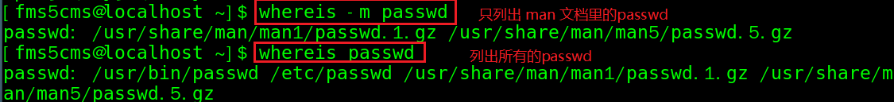

# 正则&文本搜索

文本查找中无法使用通配符（如：`?`、`*`），而要用元字符（正则表达式功能），常用元字符：

```shell
.   # 匹配除换行符外的任意单个字符
*   # 匹配它前一个字符出现0或多次，如 ab* 匹配的内容： a 后面紧跟有零或多个 b
[ ] # 匹配方括号中的字符类中的任意一个
^   # 匹配开头
$   # 匹配结尾
\   # 转义后面的特殊字符
```

扩展元字符：

```shell
+   # 匹配前面的字符至少出现一次
?   # 匹配前面的字符出现 0 或 1 次
|   # 匹配它前面或后面的正则表达式
```


## grep

- 文本查找：`grep [选项] 查找内容 源文件`  
  - `-n` 显示匹配行及行号 
  - `-i`忽略字母大小写
  - `查找内容`  部分使用元字符，`源文件` 部分则是通配符！

```shell
# 在 /root/anaconda-ks.cfg 文本中查找包含关键字 password 的整行的内容
grep password /root/anaconda-ks.cfg # Output: 
# Root password

# 匹配以 pass 起始，后面至少还有四个字符的文本内容
grep pass.... /root/anaconda-ks.cfg # Output: 
auth --enableshadow --passalgo=sha512  # 这里匹配到 passalgo
# Root password

# 匹配以 pass 起始，后面只有四个字符就结尾的文本内容
grep pass....$ /root/anaconda-ks.cfg # Output:
# Root password

# * 通常与 . 配合使用，表示匹配任意长度的任意字符
grep pass.* /root/anaconda-ks.cfg # Output:
auth --enableshadow --passalgo=sha512  # 这里匹配到 passalgo=sha512
# Root password

# 匹配 Hello 或 hello
grep [Hh]ello file.txt

# 匹配以 # 开头的内容
grep ^# /root/anaconda-ks.cfg

# 匹配包含 . 的内容
grep "\." /root/anaconda-ks.cfg

# 匹配当前目录下所有文件中包含 abc 的内容
# 注意：后 * 并不是元字符，而是通配符！
grep abc ./*
```

## cut

- 将同一行里面的数据进行分解：`cut [选项] 文件`
  - `-d`：后接分隔字符，与 `-f` 一起使用
  - `-f`：依据`-d`指定的分隔字符将一段文本分成为多段，用`-f`取出第几段的意思
  - `-c`：以字符为单位取出固定字符区间

```shell
# cut 取出系统中所有用户使用的 shell
cut -d ":" -f 7 /etc/passwd
echo "one;2;third;four;5" | cut -d ";" -f 3,5   #输出 third;5
grep pass /root/anaconda-ks.cfg | cut -d " " -f 1
echo "1;2;3;4;5" | cut -c 2-5      #输出 ;2;3
echo "1;2;3;4;5" | cut -c 2-		#输出 ;2;3;4;5
```

## uniq

- 将重复的资料仅列出一个显示：`uniq`
  - `-i` 忽略大小写
  - `-c` 计数，注意：只会对**相邻的**相同行计数，可以先排序再计数

```shell
# cut 取出系统中所有用户使用的 shell
# uniq 对每个 shell 出现次数进行计数
cut -d ":" -f 7 /etc/passwd | uniq -c # Output：
      1 /bin/bash
      4 /sbin/nologin
      1 /bin/sync
      1 /sbin/shutdown
      1 /sbin/halt
     35 /sbin/nologin
      1 /bin/bash
      1 /sbin/nologin
# 排序后再计数
cut -d ":" -f 7 /etc/passwd | sort | uniq -c
```


## find

- 从起始路径开始，递归遍历子目录来搜索文件或目录：`find [指定起始路径] [选项] 查找内容`
  - `-name`  按指定文件名查找
  - `-user`  按所属用户查找
  - `-size` 按指定文件大小查找
  - `-type 类型` 按文件类型查找
  - 默认 `查找内容` 部分匹配通配符，如果要匹配正则需要使用 `-regex` 选项
    - 使用正则时，匹配的时路径名称，而 `-name` 参数匹配的是文件/文件夹名称！
  - 查询结果输出是全路径

```shell
find /etc/passwd  # 查找 passwd 文件
find /etc -name passwd  # 查找 /etc 及其子目录中名为 passwd 的文件
# 查找整个Linux系统下大于20M的文件（+n大于  -n小于  n等于）
find / -size +20M
find /etc -name pass*   # 查找以 pass 开头的文件
find /etc -regex .*wd$  # 查找任意多个字符开头并以 wd 结尾的文件
find /etc -type f -regex .*wd # 这里指定查找的是文件(f)，目录则是 d
```

- 动作选项，即查找完成后直接对查找结果进行操作（可以 `man find` 查看选项的含义）
  - `-exec` 不进行提示
  - `-ok` 进行提示

如果找到文件后想要直接将其删除掉怎么办？

```shell
touch /tmp/{1..9}.txt # 创建 9 个文件
# rm -v 显示删除的进度
# \; 转义了分号，这里是告诉 find 命令用于结束 -exec 选项的
# {} 代表 find 找到的文件路径
find /tmp *.txt -exec rm -v {} \;
```

## 其他

- `locate [选项] 搜索文件`：可以快速定位文件路径。利用事先建立的系统中所有文件名称及路径的 `locate` 数据库实现快速定位给定文件。`locate` 指令无需遍历整个文件系统，查询速度快。为了保证查询结果的准确性，管理员必须定期更新 `locate` 时刻。
- `-i `：忽略大小写的差异；
  - `-c `：不输出档名，仅计算找到的文件数量
  - `-l `：仅输出几行的意思，例如输出五行则是 `-l 5`
  - `-S `：输出 `locate` 所使用的数据库(/var/lib/mlocate/)文件的相关信息，包括该数据库纪录的文件/目录数量等
  - `-r` ：后面可接正规表示法的显示方式

  - 由于 `locate` 指令基于数据库插叙，所以第一次运行前，必须使用 `updatedb` 指令，会根据 /etc/updatedb.cong 的设定来搜寻系统盘内的文件名，并更新 /var/lib/mlocate 内的数据库文件。

---

- `whereis [选项] 文件或目录名`  选项：

  - `-l` :可以列出 whereis 会去查询的几个主要目录而已
  - `-b `:只找 binary 格式的文件
  - `-m` :只找在说明文件 manual 路径下的文件
  - `-s` :只找 source 来源文件
  - `-u` :搜寻不在上述三个项目当中的其他特殊文件

  

  - `whereis`主要针对 /bin /sbin下的指令以及/usr/share/man 底下的 man page 文件，还有几个比较特定的目录来处理，所以速度会比`find`指令快很多。


# sed&awk

- vim、sed、awk
  - vim 是全文本编辑器，交互式
  - sed、awk 是行编辑器，非交互式


## sed

sed 对文本内容逐行操作并输出结果（每一行的结果都会输出），一般用于对文本内容做**替换**：`sed [选项] 要做的操作 文件1,文件2...`

注意：原来文件中的文本内容并未做修改！

- sed 的基本工作方式是：
  - 1.将文件以行为单位读取到内存（该内存叫模式空间）
  - 2.使用 sed 的每个脚本对该行进行操作
  - 3.处理完成后输出该行
- 选项：
  - `-e` 多个操作，见替换
  - `-i` 操作内容写入源文件，见替换
  - `-r` 匹配时支持扩展元字符，见替换
  - `-n` 指定行进行操作
  - `-f` 根据脚本文件中的操作来对文本操作，见替换加强版

### 替换

- sed 替换命令 s：
  - 以下 old 部分可以使用元字符，即正则！为了防止元字符被解析为通配符，一般会用**单引号**来做完全引用
  - 分隔符 `/` 可以直接替换成其他的如 `!`
  - `sed 's/old/new/' filename`  
  - `sed -e 's/old1/new1/' -e 's/old2/new2' filename`
    - `-e` 对文件的每一行使用多个指令，这里每行要使用两个替换指令
    - 可简写：`sed 's/old1/new1;s/old2/new2' filename`
  - `sed -i 's/old/new/' filename`
    - `-i` 会将**替换完成的结果写入原本的文件**中
  - `sed -r 's/old/new' filename`
    - `-r` 这里的 old 部分支持扩展元字符(`+`、`?`、`|`)
  - **默认只会替换每一行第一次匹配到的文本**

```shell
echo a a a > afile
# 这里只替换了一次，尽管正则找到了所有匹配内容，但替换次数是 sed 工具控制的
sed 's/a/aa' afile # Output: aa a a  注意，afile 的内容还是 a a a

# 如果要替换的是文件中的 / 呢？可以修改 s 命令的分隔符 
# 将 afile 中的 / 替换为 abc 
sed 's!/!abc!' afile  # Output: a a a    未匹配到内容则输出原内容

# 对文本内容执行多个指令
sed -e 's/a/aa/' -e 's/aa/bb/' afile  # Output: bb a a
sed 's/a/aa/;s/aa/bb/' afile  # 同上
sed 's/a/aa/;s/aa/bb/' afile > bfile

# 将文件的内容直接替换掉
sed -i 's/a/aa/;s/aa/bb/' afile  # 无输出，但 afile 的内容已变更为 bb a a

# 正则匹配三个字符，不写替换后的内容也即将旧内容删除
head -5 /etc/passwd | sed 's/...//'
```

bfile：

```txt
b
a
aa
aaa
ab
abb
abbb
```

```shell
sed 's/ab*/!' bfile
# b
# !
# !a
# !aa
# !
# !
# !
sed -r 's/ab+/!/' bfile  # + 是扩展元字符，故需要用 -r
# b
# a
# aa
# aaa
# !
# !
# !
sed -r 's/aa|bb/!/' bfile # 匹配 aa 或 bb
```


### 替换加强版

```shell
# 正则匹配的内容包含了 / 时，修改 sed 替换操作的分隔符为 @，也可以用 ! 或其他
sed 's@old@new/@' filename  
sed 's/old/new/n' filename  # n 为数字，指定替换每行第 n 次匹配到的内容，默认为 1
sed 's/old/new/g' filename  # g 为全局替换，用于替换所有匹配的内容
sed 's/old/new/w targetFile' filename # w 将替换成功的行写入指定文件中
# p 打印模式空间的内容，所以被替换的每一行都会输出两遍结果
# sed 标准输出打印一次，p 打印一次，注：仅被替换的是两遍，未替换的行还是只输出一遍
sed 's/old/new/p' filename 
sed -n 's/old/new/p' filename  # 仅输出被替换行的结果，注意要有 p 
```

寻址：sed 默认对每一行操作，寻址后可以对指定行操作

```shell
sed '/正则/s/old/new/g' filename # 通过正则选择行
sed '行号s/old/new/g' filename # 指定行，最后一行可以用 $ 作为行号
sed '3,$s/old/new/g' filename # 指定 3 到最后一行
sed '/正则/,$s/old/new/g' filename # 指定正则匹配的行到最后一行
# 寻址后执行多条指令
sed '/正则/{s/old1/new1/;s/old2/new2/}' filename
```

脚本：如果对文本内容的操作很多，可以将其写成一个脚本文件

```shell
sed -f sedScript filename  # -f 加载脚本文件 sedScript
```


## awk

awk 的功能一般是作为 sed 功能的补充来使用的，对 sed 处理完成的文本进行一定的格式调整并输出。

- awk用于“比较规范”的文本处理，用于统计数量并输出指定字段
- 使用 sed 将不规范的文本，处理为“比较规范”的文本
- awk 控制流程：
  - 1.输入数据前例程 `BEGIN{ }`
  - 2.主输入循环 `{ }`
  - 3.所有文件读取完成例程 `END{ }`