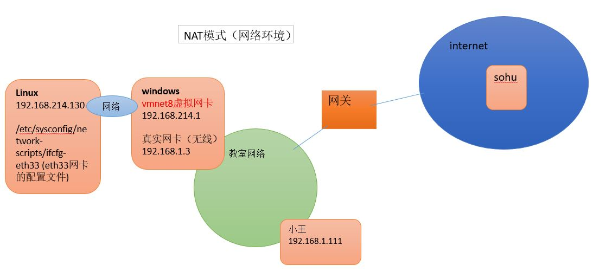
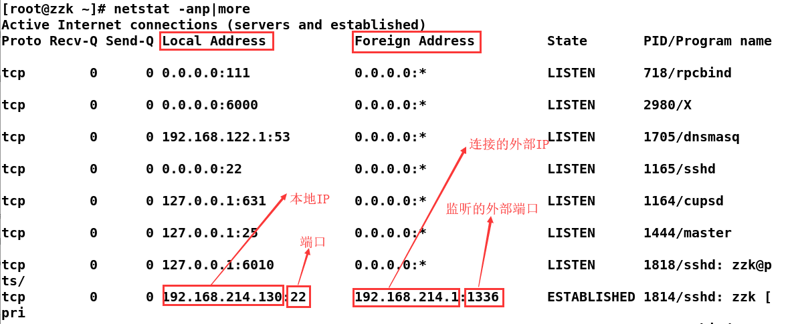

# 安装

安装虚拟机软件 VMware （注意：有时需要先在 BIOS  中设置开启虚拟化设备支持，一般是默认开启的）。

1. 通过 VMware 创建一个虚拟机空间（网络连接选择NAT模式）；
2. 安装 CentOS7 系统：下载见：[阿里云开源镜像](https://opsx.alibaba.com/mirror)。

- 这里安装的是：`CentOS-7-x86_64-DVD-1804.iso`：
  - 选择的是含有 GUI 的服务器，并选择了兼容性程序库；
  - Linux 常见的图形接口是 GNOME 桌面环境、KDE Plasma Workspaces。
- 若选择安装的是：`CentOS-7-x86_64-Minimal-1804.iso`，或上面选择了最小安装，则默认是没有图形化界面的，如何安装图形化界面：
  - 登录后。输入：`yum groupinstall "X Window System"`
  - `yum grouplist`查看已安装和可安装的软件
  - `yun groupinstall "GNOME Desktop"`注意引号中的必须和上一步查到的一样
  - 输入`startx`进入图形用户界面
- 网络设置
  - 使用非root用户登录后，在终端输入`su root`，然后输入root账户密码，切换到root用户
  - 输入`cd /etc/sysconfig/network-scripts/`
  - 输入`ls`查看文件，找到文件 ifcfg-ens33（也可能后面是其他数字）
  - 输入`vi ifcfg-ens33`，再输入`i`进入编辑模式
  - 修改`ONBOOT=no`为`ONBOOT=yes`
  - 按[ ESC ]键退出编辑模式，输入`wq`回车完成保存。
- **配置软件源：执行[阿里云开源镜像](https://opsx.alibaba.com/mirror)的centos的帮助选项内的三步**


## 端口开放！！！

1. 查询对应的端口是否已经开启,以6379端口为例

   ```shell
   firewall-cmd --query-port=6379/tcp
   ```

2. 显示为 no，则开启端口：

   ```shell
   firewall-cmd --zone=public --add-port=6379/tcp --permanent
   ```

3. 如果没有重启防火墙就查询6379端口，则依然显示没有开启，重启防火墙之后显示端口重启成功。重启：

   ```shell
   firewall-cmd --reload
   ```

关闭防火墙：`systemctl stop firewalld`


# 网络连接


虚拟机**网络连接的三种模式**：

- 桥连接, Linux 可以和其它的系统通信。但是可能造成 IP 冲突
- 主机模式：linux是一个独立的主机，不能访问外网
- NAT（ 网络地址转换方式）: linux 可以访问外网，不会造成 IP 冲突



1. 查看虚拟网络编辑器： 选择 VMware 的编辑——>选择虚拟网络编辑器
2. 修改 IP 地址（修改虚拟网络的 IP）：在上一步操作后，修改子网IP
3. 查看网关，在 1 操作后，选择 NAT 设置，修改网关 IP


- 在 Linux 系统中
  - 查看当前系统的网卡信息：`ifconfig`
  - 测试当前服务器是否可以连接到目的主机：`ping 目的主机` 
  - 查看当前系统的端口使用：`netstat -an`

- 查看 Windows 环境中的VMnet8 网络配置（ipconfig指令）
  - 使用`ipconfig` 查看


- **查看网络情况★**：`netstat [选项]`
  - `-an` 按一定顺序排列输出
  - `-p` 显示哪个进程在调用




# 远程连接

通常使用的远程登录软件为 Xshell、远程上传下载文件的软件为 Xftp。MobaXterm是一个集成了多个功能于一身的远程登录软件。

特别说明：如果希望安装好 Xshell 就可以远程访问 Linux 系统的话，需要 Linux 启动 SSHD 服务（在终端输入`setup`，进入System Service 中查看：默认开启sshd.service，在sshd.socket前面点击空格开启），该服务会监听22号端口。

如果无法连接，需要开启ssh服务：`systemctl start sshd.service`。


# 登录&注销&关机

- 登录

不要直接使用 root 用户登录，而**使用一般用户登录**。建议**设置高强度的密码**，学习阶段也养成良好习惯。

若要使用仅root用户才可用的命令，可以利用普通用户登录，再用`su`命令切换成系统管理员身份。
  - 终端机界面如何**判断用户**是否为 root 账号？
    - 提示符为`$`的是一般账户；
    - 提示符为`#`的是 root 账户。
  - 如何**切换 X Window 的窗口管理员环境到纯文本界面**（终端机接口）？
    - Linux 预设六个 Terminal 来让使用者登录，切换方式为：`[Ctrl] + [Alt] + [F1~F6]`。
    - 系统将`[F1]~[F6]`命名为 tty1~tty6 的操作接口环境。
    - 如果默认启动图形界面，则 X 窗口就会出现在 tty1 界面中；如果默认启动纯文本界面，则 tty1~tty6 都会被文字界面占用。
    - 其实开机后，默认系统仅提供一个 tty ，而 tty2~tty6 一开始并不存在，只有切换时，系统才会额外产生。
    - 在纯文本环境中使用`startx`启动个人的图形界面的话，图形界面会出现在当时的 tty 上面。如：在 tty3 登录系统，输入`startx`启动个人图形界面后，该图形界面会产生在 tty3 上面。

---

- 注销

在命令行下输入`logout`即可注销用户。注意：`logout`注销指令在图形运行级别无效，在 运行级别3 下有效（运行级别见后）。

---

- shutdown 指令：

语法：`shutdown [ 选项][时间][警告讯息]`  选项：

  - `-k`  不是真的关机，只是发送警告讯息出去；
  - `-r` 在将系统的服务停掉后就重启
  - `-h` 在将系统的服务停掉后，立即关机
  - `-c` 取消已经在运行的 shutdown 指令内容

```shell
shutdown -h now      # 立即关机
shutdown -r now      # 立即重启
# 十分钟后关机，并发送讯息
shutdown -h 10 'I will shutdown after 10 mins'
# 在今天的 20:35 关机，若在20:35之后的时间输入指令，则隔天才关机
shutdown -h 20:25
# 在三十分钟后重启，并发送讯息
shutdown -r +30 'The system will reboot'
```

- `halt`、`poweroff`效果等价于关机
- `reboot`重启系统
- `sync`把内存的数据同步到磁盘

如果是使用远程登录工具登录的话，那么关机只有 root 有权利！

注意：当我们关机或重启时，都应先执行`sync`指令，防止数据丢失


# 目录结构★

- Linux 文件系统是采用级层式的树状目录结构，有且只有一个根目录`/`；
- Linux 以文件的形式管理设备，因此，**在 Linux 世界里，一切皆文件**；
- Linux 的隐藏文件并不是什么特殊权限，单纯以文档命名方式处理来决定确定是否隐藏。（**隐藏文件/文件夹的名称开头是小数点**，这样就不会在一般观察模式中被显示出来）
- `yun install tree`安装tree指令；
  - `tree` 以树状显示当前目录下的结构
  - `tree /` 显示Linux系统的目录结构


常见的目录说明：

1. **/bin：** 存放二进制可执行文件(ls,cat,mkdir等)，常用命令一般都在这里；
2. **/etc：** 存放系统管理和配置文件；
3. **/home：** 存放所有用户文件的根目录，是用户主目录的基点，比如用户user的主目录就是/home/user，可以用~user表示；
4. **/usr：** 用于存放系统应用程序；
5. **/opt：** 额外安装的可选应用程序包所放置的位置。
6. **/proc：** 虚拟文件系统目录，是系统内存的映射。可直接访问这个目录来获取系统信息；
7. **/root：** 超级用户（系统管理员）的主目录；
8. **/sbin:** 存放二进制可执行文件，只有root才能访问。存放系统管理员使用的系统级别的管理命令和程序。如ifconfig等；
9. **/dev：** 用于存放设备文件；
10. **/mnt：** 临时挂载其他的文件系统；
11. **/boot：** 存放用于系统引导时使用的各种文件；
12. **/lib ：** 存放着和系统运行相关的库文件 ；
13. **/tmp：** 用于存放各种临时文件，是公用的临时文件存储点；
14. **/var：** 存放运行时需改变数据的文件，也是某些大文件的溢出区，如：各种服务的日志文件（系统启动日志等）等。
15. **/media**：U盘等插入media就会多出文件；


- `.`代表当前的目录，也可使用`./` 来表示；
- `..`代表上一层目录，也可`../`来代表。


# 帮助指令

Linux提供了几个帮助指令用于了解不熟悉的指令的用法。软件或指令的说明文档一般放在：/usr/share/doc 这个目录下。

- `指令 --help`：一般用于查询曾经用过的指令所具备的选项和参数


---

- `man [命令或配置文件] `：获得帮助信息，manual（操作说明）
  - 一般用于查询文件的格式或查询的不是指令。


注意：在第一行出现 `DATE(1)` 这里的数字的含义：

| 代号 | 代表内容                                          |
| ---- | ------------------------------------------------- |
| 1 ★  | **用户在 shell 环境中可以操作的指令或可执行文件** |
| 2    | 系统核心可呼叫的函数与工具等                      |
| 3    | 常用的函数与函式库，大部分为 C 的函式库(libc)     |
| 4    | 装置文件的说明，通常在 /dev 下的文件              |
| 5 ★  | **配置文件或者是某些文件的格式**                  |
| 6    | 游戏（games）                                     |
| 7    | 惯例与协议等，如 Linux 文件系统、网络协议等的说明 |
| 8 ★  | **系统管理员可用的管理指令**                      |
| 9    | 跟 kernel 有关的文件                              |

---

- `help 命令 `：获得 shell 内置命令的帮助信息


---

- `info 要查询的内容`
  - 显示结果的 info page 是将文件数据拆成一个一个的段落，每个段落用自己的页面来撰写， 并且在各个页面中还有类似网页的『超链接』来跳到各不同的页面中，每个独立的页面也被称为一个节点(node)。
  - 注意：要查询的目标数据的说明文件必须是以 info 的格式来写成才能够使用 info 的特殊功能(例如超链接)。 而这个支持 info 指令的文件默认是放置在 /usr/share/info/ 这个目录当中的。


# 运行级别

Linux开机的流程：开机——>BIOS（开机自检）——>读入/boot目录下的内核文件——>init进程（系统所有进程的起点，需要读取配置文件 /etc/inittab）——>运行级别——>运行级别对应的服务。

Linux允许为不同的场合，分配不同的开机启动程序，这就叫做"运行级别"（runlevel）。也就是说，启动时根据"运行级别"，确定要运行哪些程序。

- Linux系统共有七个运行级别：
  - 0：关机，系统默认运行级别不能设为 0 ，否则不能正常启动
  - 1：单用户，root权限，用于系统维护，禁止远程登录【可找回丢失密码，因为进入单用户模式，root不需要密码就可以登录】
  - 2：多用户状态（没有NFS），不支持网络服务
  - 3：完全的多用户状态（有NFS），支持网络服务，登录后进入控制台命令行模式
  - 4：系统未使用，保留
  - 5：图形界面
  - 6：系统正常关闭并重启，默认运行级别不能设为6，否则无法正常启动

常用的运行级别是 3和5，CentOS7以前，默认的运行级别可改文件是 /etc/inittab ，在CentOS7中该文件已经没用了。

```shell
systemctl get-default #查看当前默认的启动模式
systemctl set-default multi-user.target #更改启动模式为多用户命令行模式
#图形模式：graphical.target
```


