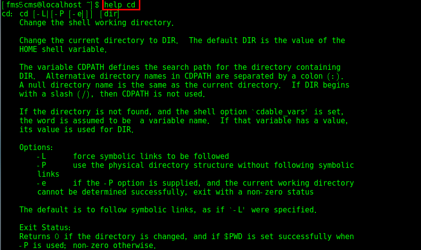

# 安装

- 如果使用 VirtualBox 来安装 Linux 系统的话，需要现在主机网卡上安装 VirtualBox 的服务！
  - 服务文件的路径在 VirtuablBox 安装目录/drivers/network/netlwf 目录下
  - 进入主机的”控制面板\网络和 Internet\网络连接“后，选择网卡来安装。
  - 网络选择桥接模式！
- 使用 VMware 安装的话，创建一个虚拟机空间（网络连接选择 NAT 模式）。

CentOS7 系统下载见：[阿里云开源镜像](<https://developer.aliyun.com/mirror/>)。

- 这里安装的是：`CentOS-7-x86_64-DVD-1804.iso`：
  - 选择的是含有 GUI 的服务器，并选择了兼容性程序库；
  - Linux 常见的图形接口是 GNOME 桌面环境、KDE Plasma Workspaces。
- 若选择安装的是：`CentOS-7-x86_64-Minimal-1804.iso`，或上面选择了最小安装，则默认是没有图形化界面的，如何安装图形化界面：
  - 登录后。输入：`yum groupinstall "X Window System"`
  - `yum grouplist`查看已安装和可安装的软件
  - `yun groupinstall "GNOME Desktop"`注意引号中的必须和上一步查到的一样
  - 输入`startx`进入图形用户界面
- **配置软件源：执行[阿里云开源镜像](https://developer.aliyun.com/mirror/)的 centos 的帮助选项内的三步**

输入 `setup` 命令可以设置自动启动的服务，空格进行选择。

# 网络连接


虚拟机**网络连接的三种模式**：

- 桥连接, Linux 可以和其它的系统通信。但是可能造成 IP 冲突
- 主机模式：linux 是一个独立的主机，不能访问外网
- NAT（ 网络地址转换方式）: linux 可以访问外网，不会造成 IP 冲突

# SSH 服务

SSH 服务端配置文件 /etc/ssh/sshd_config，客户端配置文件 /etc/ssh/ssh_config，SSH 服务的默认端口为 22。

SSH 服务端要提供 SSH 服务到其他主机时：

```shell
# 查询 22 端口是否开放
firewall-cmd --query-port=22/tcp
# 若上面显示为 no，需要开放 22 端口
firewall-cmd --zone=public --add-port=22/tcp --permanent
# 重启防火墙，否则再次查询端口，显示还是 no
firewall-cmd --reload
# 也可以直接关闭防火墙
systemctl stop firewalld
# 查看防火墙是否允许 ssh 服务
firewall-cmd --list-all # 可以看到 services 中有 ssh 服务
# 查看服务端配置文件，不用修改
# 配置文件中第 17 行 Port 指定了 ssh 服务监听的端口，建议不要修改
# 第 38 行 PermitRootLogin 用于设置是否允许 root 用户使用 ssh 登录，默认允许
# ssh 有两种验证方式：密码和密钥。第 47 行 AuthorizedKeysFile 指定密钥方式的公钥存放位置
vim /etc/ssh/sshd_config
```

通常使用的远程登录软件为 Xshell、远程上传下载文件的软件为 Xftp。MobaXterm 是一个集成了多个功能于一身的远程登录软件。

特别说明：如果希望安装好 Xshell 就可以远程访问 Linux 系统的话，需要 Linux 启动 SSHD 服务（在终端输入`setup`，进入 System Service 中查看：默认开启 sshd.service，在 sshd.socket 前面点击空格开启），该服务会监听 22 号端口。

如果无法连接，需要开启 ssh 服务：`systemctl start sshd.service`。

# 登录&注销&关机

- 登录

不要直接使用 root 用户登录，而**使用一般用户登录**。建议**设置高强度的密码**，学习阶段也养成良好习惯。

若要使用仅 root 用户才可用的命令，可以利用普通用户登录，再用`su`命令切换成系统管理员身份。

- 终端机界面如何**判断用户**是否为 root 账号？
  - 提示符为`$`的是一般账户；
  - 提示符为`#`的是 root 账户。
- 如何**切换 X Window 的窗口管理员环境到纯文本界面**（终端机接口）？
  - Linux 预设六个 Terminal 来让使用者登录，切换方式为：`[Ctrl] + [Alt] + [F1~F6]`。
  - 系统将`[F1]~[F6]`命名为 tty1~tty6 的操作接口环境。
  - 如果默认启动图形界面，则 X 窗口就会出现在 tty1 界面中；如果默认启动纯文本界面，则 tty1~tty6 都会被文字界面占用。
  - 其实开机后，默认系统仅提供一个 tty ，而 tty2~tty6 一开始并不存在，只有切换时，系统才会额外产生。
  - 在纯文本环境中使用`startx`启动个人的图形界面的话，图形界面会出现在当时的 tty 上面。如：在 tty3 登录系统，输入`startx`启动个人图形界面后，该图形界面会产生在 tty3 上面。

---

- 注销

在命令行下输入`logout`即可注销用户。注意：`logout`注销指令在图形运行级别无效，在 运行级别 3 下有效（运行级别见系统管理部分）。

---

- shutdown 指令：

语法：`shutdown [ 选项][时间][警告讯息]` 选项：

- `-k` 不是真的关机，只是发送警告讯息出去；
- `-r` 在将系统的服务停掉后就重启
- `-h` 在将系统的服务停掉后，立即关机
- `-c` 取消已经在运行的 shutdown 指令内容

```shell
shutdown -h now      # 立即关机
shutdown -r now      # 立即重启
# 十分钟后关机，并发送讯息
shutdown -h 10 'I will shutdown after 10 mins'
# 在今天的 20:35 关机，若在20:35之后的时间输入指令，则隔天才关机
shutdown -h 20:25
# 在三十分钟后重启，并发送讯息
shutdown -r +30 'The system will reboot'
```

- `halt`、`poweroff`效果等价于关机
- `reboot`重启系统
- `sync`把内存的数据同步到磁盘

如果是使用远程登录工具登录的话，那么关机只有 root 有权利！

注意：当我们关机或重启时，都应先执行`sync`指令，防止数据丢失

# 帮助指令

Linux 提供了几个帮助指令用于了解不熟悉的指令的用法。软件或指令的说明文档一般放在：/usr/share/doc 这个目录下。

- `指令 --help`：一般用于查询曾经用过的指令所具备的选项和参数


---

- `man [命令或配置文件]`：获得帮助信息，manual（操作说明）
  - 一般用于查询文件的格式或查询的不是指令。


注意：在第一行出现 `DATE(1)` 这里的数字的含义：

| 代号 | 代表内容                                          |
| ---- | ------------------------------------------------- |
| 1 ★  | **用户在 shell 环境中可以操作的指令或可执行文件** |
| 2    | 系统核心可呼叫的函数与工具等                      |
| 3    | 常用的函数与函式库，大部分为 C 的函式库(libc)     |
| 4    | 装置文件的说明，通常在 /dev 下的文件              |
| 5 ★  | **配置文件或者是某些文件的格式**                  |
| 6    | 游戏（games）                                     |
| 7    | 惯例与协议等，如 Linux 文件系统、网络协议等的说明 |
| 8 ★  | **系统管理员可用的管理指令**                      |
| 9    | 跟 kernel 有关的文件                              |

---

- `help 命令`：获得 shell 内置命令的帮助信息



---

- `info 要查询的内容`
  - 显示结果的 info page 是将文件数据拆成一个一个的段落，每个段落用自己的页面来撰写， 并且在各个页面中还有类似网页的『超链接』来跳到各不同的页面中，每个独立的页面也被称为一个节点(node)。
  - 注意：要查询的目标数据的说明文件必须是以 info 的格式来写成才能够使用 info 的特殊功能(例如超链接)。 而这个支持 info 指令的文件默认是放置在 /usr/share/info/ 这个目录当中的。

# history

`history`：查看已经执行过的历史指令（会显示指令的编号），也可执行历史指令

- `history`显示所有历史指令
- `history 10` 显示最近的10个指令
- `history !178` 执行编号为178的指令

# 系统调用

- 创建进程的系统调用是 fork
  - Linux 中父进程调用 fork 就可以创建一个子进程(子进程会将父进程的数据结构都拷贝一份)
  - 刚调用 fork 后的父子进程是完全一样的，根据 fork 系统调用的返回值区分父子进程
    - 返回 0，就代表当前进程是子进程，需要请求另一个系统调用 execve 来执行另一个程序
    - 返回子进程的进程号，就代表当前进程是父进程，父进程就继续做原来的事
  - 父进程通过系统调用 waitpid，将子进程的进程号作为参数传递进去，就可以知道子进程运行完成没有、成功与否
- 分配内存的系统调用
  - 分配的内存数量较小时，使用 brk，分配的内存会和原来的堆的数据在一起
  - 分配的内存数量较大时，使用 mmap，会重新划分一块区域
- 文件操作类的系统调用
  - 已有的文件，使用 open 打开、close 关闭
  - 没有的文件，使用 create 创建
  - 打开的文件，使用 lseek 跳到文件的某个位置
  - read 读文件、write 写文件
- 进程间通信
  - 消息队列形式。只是发送一个消息，不需要一段很长的数据
    - 通过 msgget 创建一个新的队列
    - 通过 msgsend 将消息发送到消息队列
    - 通过 msgrcv 从队列中取消息
  - 共享内存形式。交互的信息较大
    - 通过 shmget 创建一个共享内存块
    - 通过 shmat 将共享内存映射到自己的内存空间，然后就可以读写了
    - 可能会存在竞争，此时就需要信号量(Semaphore 机制)
      - 如：只允许一个人访问的需求，可将信号量设置为 1。
      - 某个人访问时，先调用 sem_wait，如果此时无人访问，则占用这个信号量，他就可以开始访问了
      - 这时，另一个人也要访问，同样先调用 sem_wait，因为有人已经在访问了，所以需要等待，等到前一个人通过 sem_post 释放信号量，这个人就可以开始访问了。

Glibc 是 Linux 下使用的开源的标准 C 库，它是 GNU 发布的 libc 库。Glibc 为程序员提供丰富的 API，除了例如字符串处理、数学运算等用户态服务之外，最重要的是封装了操作系统提供的系统服务，即系统调用的封装。

有一个 strace 的命令，常用于跟踪进程执行时系统调用和所接收的信号！

# 程序运行

程序运行的三种方式：

- 通过 shell 在交互命令行中运行，但是命令行关闭后，程序就退出了
- 后台运行：使用交互命令行运行程序时，在命令末尾加上 `&` 就表示后台运行
  - 如何退出呢？杀掉程序进程
  - 如：`ps -ef|grep redis |awk ‘{print $2}’|xargs kill -9`
  - `awk ‘{print $2}’` 指第二列的内容；`xargs kill -9` 通过 `xargs` 将前面得到的进程 ID 传给 `kill -9`
- 以服务的形式运行：`systemctl enable nfs.service`设置开机启动
