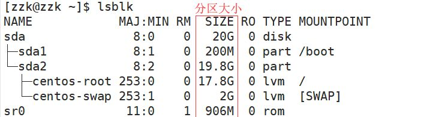

# 任务调度

任务调度是指系统在某个时间执行的特定的命令或程序，任务调度分类：

- 系统工作，有些重要的工作必须周而复始地执行，如病毒扫描等；
- 个别用户工作：个别用户可能希望执行某些程序，如对 mysql 数据库的备份

- `crontab [选项]`
  - `-e` 编辑 crontab 定时任务
  - `-l` 查询 crontab 任务
  - `-r` 终止任务调度，删除当前用户所有者的 crontab 任务
- `service crond restart` 重启任务调度

## Cron 表达式

查看任务调度文件 /etc/crontab 可以看到语法：`* * * * * 待执行的命令`

注意，Linux 中的 Cron 表达式和 Spring 中的 Cron 表达式有区别！

五个占位符：

| 占位符    | 含义         | 范围                                   |
| --------- | ------------ | -------------------------------------- |
| 第一个 \* | minute       | 0 - 59                                 |
| 第二个 \* | hour         | 0 - 23                                 |
| 第三个 \* | day of month | 1 - 31                                 |
| 第四个 \* | month        | 1 - 12                                 |
| 第五个 \* | day of week  | 0 - 6（0 都代表星期日，也可用 7 表示） |

每个占位符可以使用的特殊符号：

| 符号 | 含义                                                                 |
| ---- | -------------------------------------------------------------------- |
| \*   | 匹配所有值，在分钟域就表示每分钟                                     |
| ，   | 指定可选值。如`0 8,12 * * *`代表在每天的 8 点 0 分、12 点 0 分都执行 |
| -    | 指定一个范围。如`0 5 * * 1-6`代表在周一到周六的 5 点 0 分执行        |
| \*/n | 指定增量。如："_/10 _ \* \* \*"代表每 10 分钟就执行一次              |

示例：

| 命令           | 含义                                      |
| -------------- | ----------------------------------------- |
| `45 22 * * *`  | 在 22 点 45 分执行                        |
| `0 17 * * 1`   | 每周一的 17 点 0 分执行                   |
| `0 5 1,15 * *` | 每月 1 号和 15 号的凌晨 5 点 0 分执行一次 |
| `40 4 * * 1-5` | 每周一到周五的凌晨 4 点 40 分执行         |
| `*/10 4 * * *` | 每天的凌晨 4 点开始，每隔 10 分钟执行一次 |
| `0 0 1,15 * 1` | 每月 1、15 号，每周一的 0 点 0 分执行一次 |

## 示例

- 简单任务：直接在 crontab 中加入任务即可

1. 执行 `crontab -e`
2. 输入 `cron表达式 待执行的命令`，保存后即可

```shell
# 每分钟执行 `ls -l /etc/>>/tmp/to.txt` 命令
*/1 * * * * ls -l /etc/>>/tmp/to.txt
```

---

- 复杂任务：写脚本

1. 编写一个脚本文件(文件内容是待执行的命令)
   - 如 /home/zzk/mytask1.sh，内容为 `date >> /tmp/mydate`
2. 给脚本文件一个可执行权限
   - 如：`chmod 744 /home/zzk/mytask1.sh`
3. 执行 `crontab -e`
4. 输入 `cron表达式 脚本文件`，保存即可
   - 如：`*/1 * * * * /home/zzk/mytask1.sh`

# 磁盘分区&挂载

两种分区方式（了解即可）：

|     | 特点                                                                                                                                                  |
| --- | ----------------------------------------------------------------------------------------------------------------------------------------------------- |
| mbr | 最多支持四个主分区;系统只能安装在主分区<br>扩展分区要占一个主分区;最大只支持 2TB，但拥有最好的兼容性                                                  |
| gpt | 支持无限多个主分区（但操作系统可能限制，如 Windows 下最多 128 个分区）;最大支持 18 EB 的大容量（1EB=1024 PB，1PB=1024 TB）;Windows7 64 位以后支持 gpt |

## 磁盘查询

- 查询系统整体磁盘的使用情况：`df -h` `df -l`
- 查询指定目录的磁盘占用情况：`du [选项] 目录`
  - 不写目录的话，默认为当前目录
  - `-s` 指定目录占用大小汇总
  - `-h` 带计量单位
  - `-a` 含文件
  - `--max-depth=1` 子目录深度
  - `-c` 列出明细的同时，增加汇总值

```shell
# 查询 /opt 目录的磁盘占用情况，子目录深度为一
du -ach --max-depth=1 /opt
```

## Linux 分区

Linux 采用 “挂载（mount）” 的方法，整个文件系统中包含了一整套的文件和目录，且将一个分区和一个目录联系起来。这时要载入的一个分区将使它的存储空间在一个目录下获得。


Linux 硬盘分为 IDE 硬盘和 SCSI 硬盘，目前基本上是 SCSI 硬盘

- 对于 IDE 硬盘，驱动器标识符为 “hdx~” ，其中 “hd” 表明分区所在设备的类型，这里是指 IDE 硬盘。“x” 为盘号（a 为基本盘，b 为基本从属盘，c 为辅助主盘， d 为辅助从属盘），“~”代表分区，前四个分区用数字 1 到 4 表示，它们是主分区或扩展分区，从 5 开始就是逻辑分区。

  - eg：hda3 表示为第一个 IDE 硬盘上的第三个主分区或扩展分区
  - eg：hdb2 表示为第二个 IDE 硬盘上的第二个主分区或扩展分区

- 对于 SCSI 硬盘则标识为 “sdx~”，SCSI 硬盘使用 “sd" 来表示分区所在设备的类型的，其余同 IDE 硬盘的 表示方法。

使用`lsblk` 指令查看当前系统的分区情况



或`lsblk -f`指令查看系统分区及挂载情况


## 挂载

通过案例说明如何挂载：新增一个硬盘，并挂载到 /home/newdisk，图示见前

1. **使用虚拟机添加硬盘**：

   1. 在 VMware 中选中 虚拟机——>设置——>添加——>硬盘——>。。。
   2. 重启 Linux 系统后才能识别

2. **分区**：

   1. `fdisk /dev/sdb` 开始对 /sdb 分区

   2. 输入 `n`新增分区，选择 `p` ，分区类型为主分区

   3. 两次回车默认剩余全部空间

   4. 输入`w`写入分区并退出，若不保存退出输入`q`

      | 输入 | 功能                        |
      | ---- | :-------------------------- |
      | m    | 显示命令列表                |
      | p    | 显示磁盘分区，同 `fdisk -l` |
      | n    | 新增分区                    |
      | d    | 删除分区                    |
      | w    | 写入并退出                  |

3. **格式化**：

   1. `mkfs -t ext4 /dev/sdb1` 将/dev/sdb1 这个设备格式化为 ext4 类型

4. **挂载**：

   1. 创建一个 /home/newdisk，再挂载 `mount /dev/sdb1 /home/newdisk`
   2. `mount 设备名称 挂载目录` 挂载：将一个分区与一个目录联系起来
   3. `umount 设备名称或挂载目录` 卸载 eg：`umount /dev/sdb1`

5. 设置可以自动挂载(**永久挂载**)：上面的挂载方式在系统重启后就会撤销

   1. 通过修改 /etc/fstab 文件(记录了分区及挂载点的情况)实现永久挂载
   2. `vim /etc/fstab`
   3. 对齐写入：`/dev/sdb1 /home/newdisk ext4 defaults 0 0`
   4. 执行`mount -a` 即刻生效

# install

## RPM

RPM（Red-Hat Package Manager 即 RedHat 软件包管理工具），一种用于互联网下载包的打包及安装工具，生成具有 .RPM 扩展名的文件。

- `rpm -qa` 查询所有已安装的 rpm 软件包列表

```shell
rpm -qa | grep jdk  # 查看是否有自带的JDK
```

- rpm 包的基本格式：firefox-52.8.0-1.el7.centos.x86_64.rpm

  - 名称：firefox
  - 版本号：52.8.0-1
  - 适合操作系统：el7.centos.x86_64。如果是 i686、i386 表示 32 位系统，noarch 表示通用

- rpm 包的其他查询指令：

  - `rpm -q 软件名` 查询软件包是否安装
  - `rpm -qi 软件名` 查询软件包信息
  - `rpm -ql 软件名` 查询软件包中的文件（即安装到了那里）
  - `rpm -qf 文件全路径名` 查询文件所属的软件包

- 卸载 rpm 包：`rpm -e 软件名`

  - eg：`rpm -e firefox` 删除 firefox 软件包

  - 如果其它软件包依赖于要卸载的软件包，卸载时会有错误信息
  - 增加参数`--nodeps` 就可以强制删除了，但不建议。

- 安装 rpm 包：`rpm -ivh rpm包全路径名`

  - `-i` 安装 install
  - `-v` 提示 verbose（详细信息）
  - `-h` 进度条 hash

## YUM

yum 是一个 Shell 前端软件包管理器。基于 RPM 包管理，能从指定的服务器自动下载 RPM 包并安装，可以自动处理依赖关系，并一次安装所有依赖的软件包。使用前提：联网。

- `yum list`查询 yum 服务器是否有需要安装的软件
- `yum install xxx`安装指定的 yum 包

## 常用软件安装

```shell
# 关闭 iptables：
iptables -L  #查看是否有iptables规则
iptables -F  #关闭

# 停用 selinux：
getenforce  #查看
setenforce 0 #关闭

# 安装依赖
# 安装gcc（可输入gcc -v查询版本信息看系统是否自带安装）
yum install gcc
# 安装pcre
yum install pcre-devel
# 安装zlib
yum install zlib zlib-level
# 安装openssl，如需支持ssl才需安装openssl
yum install openssl openssl-devel
# 以上依赖安装可综合写成：
yum -y install gcc zlib zlib-devel pcre-devel openssl openssl-devel

# 安装 httpd 工具
yum -y install wget httpd-tools
```

- 升级到 vim8

```shell
rpm -Uvh http://mirror.ghettoforge.org/distributions/gf/gf-release-latest.gf.el7.noarch.rpm
rpm --import http://mirror.ghettoforge.org/distributions/gf/RPM-GPG-KEY-gf.el7
yum -y remove vim-minimal vim-common vim-enhanced sudo
yum -y --enablerepo=gf-plus install vim-enhanced sudo
```

---

- JDK

```shell
rpm -qa | grep jdk   # 查看是否有自带的 JDK
yum remove xxx  # 在 root 用户下卸载已有的 JDK，xxx是上面查到的结果
```

方式一：rpm 文件安装，

```shell
wget --no-check-certificate --no-cookies --header "Cookie: oraclelicense=accept-securebackup-cookie" JDK的rpm文件下载地址
chmod 777 jdk..  # 赋予权限
rpm -ivh jdk-8u201-linux-x64.rpm # 默认安装路径是/usr/java/jdk..
```

说明：

- `–no-check-certificate`：表示不校验 SSL 证书，因为中间的两个 302 会访问 https，会涉及到证书的问题，不校验能快一点，影响不大。
- `–no-cookies`：表示不使用 cookies,当然首次在 header 里指定的会带上，后面重定向的就不带了，这个影响也不大，可以不加。

方式二：tar.gz 文件的安装，

```shell
wget JDK的tar.gz文件下载地址
chmod 777 jdk..
tar -zxvf jdk-10.0.1_linux-x64_bin.tar.gz  # 解压
```

两种方式任选其一安装完成后，配置环境变量的配置文件：`vim /etc/profile`

```shell
export JAVA_HOME=/opt/jdk-10.0.1
export PATH=$JAVA_HOME/bin:$PATH
export CLASSPATH=.:$JAVA_HOME/jre/lib/rt.jar:$JAVA_HOME/lib/dt.jar:$JAVA_HOME/lib/tools.jar`
```

重启或输入`source /etc/profile`使配置文件生效

---

- Git

```shell
# 安装依赖
yum -y install zlib-devel openssl-devel cpio expat-devel gettext-devel curl-devel perl-ExtUtils-CBuilder perl-ExtUtils-MakeMaker
# 下载
wget https://mirrors.edge.kernel.org/pub/software/scm/git/git-2.19.2.tar.gz
# 解压
tar -zxvf git-2.19.2.tar.gz
cd git-2.19.2
make prefix=/usr/local/git all
make prefix=/usr/local/git install
# 安装完成后
git --version
```

注意：如果提示没有该命令，首先`whereis git`，然后在 /etc/profile 的 PATH 中加入 `/usr/local/git/bin`，最后`source /etc/profile`。

初始化 Git：

```shell
git config --global user.name “用户名”
git config --global user.email  "邮箱"
git config --global core.autocrlf false
git config --global core.quotepath off
git config --global gui.encoding utf-8
ssh-keygen -t rsa -C "邮箱"
ssh-add ~/.ssh/id_rsa #然后连续回车
# 如果提示无法打开...，先`eval 'ssh-agent'`，再重新执行上面的命令
cat ~/.ssh/id_rsa.pub
# 将上面查到的公钥粘贴到 GitHub 内 SSH 公钥的部分
- `cat ~/.ssh/id_rsa.pub`将查到的公钥粘贴到GItHub内SSH公钥的部分
```

# 程序运行

程序运行的三种方式：

- 通过 shell 在交互命令行中运行，但是命令行关闭后，程序就退出了
- 后台运行：使用交互命令行运行程序时，在命令末尾加上 `&` 就表示后台运行
  - 如何退出呢？杀掉程序进程
  - 如：`ps -ef|grep redis |awk ‘{print $2}’|xargs kill -9`
  - `awk ‘{print $2}’` 指第二列的内容；`xargs kill -9` 通过 `xargs` 将前面得到的进程ID传给 `kill -9`
- 以服务的形式运行：`systemctl enable nfs.service `设置开机启动


# 进程管理

在 Linux 中，每个执行的程序（代码）都称为一个进程，每个进程都分配一个 ID 号；每个进程都对应一个父进程，而这个父进程可以复制多个子进程。

系统的服务一般以后台进程的方式存在，且会常驻在系统中，直到关机才结束。

## 查询进程

- 查看进程使用的指令是`ps`，一般来说使用的参数是`-aux`

  - `-a` 显示当前终端的所有进程信息

  - `-u` 以用户的格式显示进程信息

  - `-x`显示后台进程运行的参数

  - `-e` 显示所有进程

  - `-f` 全格式显示

* **ps 指令详解**

  - `ps -aux | more`显示的信息选项：

    

    | 字段    | 说明                                                                                                                                     |
    | ------- | ---------------------------------------------------------------------------------------------------------------------------------------- |
    | USER    | 用户名                                                                                                                                   |
    | PID     | 进程识别号                                                                                                                               |
    | %CPU    | 进程占用的 CPU 的百分比                                                                                                                  |
    | %MEM    | 进程占用物理内存的百分比                                                                                                                 |
    | VSZ     | 进程占用的虚拟内存大小（单位：KB）                                                                                                       |
    | RSS     | 进程占用的物理内存大小（单位：KB）                                                                                                       |
    | TTY     | 使用的终端机名称                                                                                                                         |
    | STAT    | 进程的状态（S 休眠；s 该进程是会话的先导进程；N 进程拥有比普通优先级更低的优先级；R 正在运行；D 短期等待；Z 僵死进程；T 被跟踪或被停止） |
    | START   | 进程启动时间                                                                                                                             |
    | TIME    | 此进程使用 CPU 的总时间                                                                                                                  |
    | COMMAND | 启动进程所用的命令和参数，如果过长会被截断显示                                                                                           |

  - `ps -aux | grep xxx` 查看有没有特定的服务。如查看有没有 sshd 服务

  - `ps -ef` 以全格式显示当前所有的进程（可以分页显示）

    | 字段  | 说明                                                                                                                                       |
    | ----- | ------------------------------------------------------------------------------------------------------------------------------------------ |
    | UID   | 用户 ID                                                                                                                                    |
    | PID   | 进程 ID                                                                                                                                    |
    | PPID  | 父进程 ID                                                                                                                                  |
    | C     | CPU 用于计算执行优先级的因子。数值越大，表明进程是 CPU 密集型运算，执行优先级会降低；数值较小，表明进程是 I/O 密集型运算，执行优先级会提高 |
    | STIME | 进程启动的时间                                                                                                                             |
    | TTY   | 终端名称                                                                                                                                   |
    | TIME  | CPU 时间                                                                                                                                   |
    | CMD   | 启动进程所用的命令和参数                                                                                                                   |

- 查看进程树：`pstree [选项]` 可以更直观的查看进程信息。常用选项：
  - `-p` 显示进程的 PID
  - `-u` 显示进程的所属用户

## 动态监控进程

- `top`可以动态更新正在运行的进程状况
  - `-d 秒数` 每隔几秒更新。默认 3 秒。在``top`的交互模式中可以执行命令
  - `-i` 不显示任何闲置或僵死进程
  - `-p` 通过指定监控进程 ID 来仅仅监控该进程的状态
  - 交互操作说明
    - P：以 CPU 使用率排序，默认就是该项
    - M：以内存的使用率排序
    - N：以 PID 排序
    - q：退出 top

输入 `top` 后（每隔 3 秒自动刷新一次）：


---

- 监控特定用户：
  - 1.输入 `top` ，回车，查看执行的进程
  - 2.输入 `u` ，再输入用户名即可
- 终止指定进程：
  - 1.输入 `top` ，回车，查看执行的进程
  - 2.输入`k` ，输入要结束的进程 ID

## 终止进程

- `kill [选项] 进程号` 通过进程号杀死进程
  - 常用选项：`-9` 强迫进程立即停止
- `killall 进程名称` 通过进程名称杀死进程，也支持通配符（在系统因负载过大变慢时有用）

---

- 踢掉某个非法登录的用户：
  - 1.`ps -aux | grep sshd` 查询所有远程登录的用户信息
  - 2.`kill 4010` 利用进程号杀死该进程
- 终止远程登录服务 sshd：
  - 1.`ps -aux | grep sshd` 查询服务器远程登录服务的进程（COMMAND 字段内容为 /user/sbin/sshd 的进程才是，其他的是远程登录的用户）
  - 2.利用进程号杀死进程

## 服务管理

服务（Service）本质是运行在后台的进程，通常都会监听某个端口，等待其他程序的请求。因此又称为守护进程。

从 CentOS 7.0 开始不再使用 `service` 命令，而是启用了 `systemctl` 服务器命令，以 nfs 服务为例：

| 命令                                  | 功能                 |
| ------------------------------------- | -------------------- |
| `systemctl start nfs.service`         | 启动 nfs 服务        |
| `systemctl enable nfs.service`        | 设置开机自启动       |
| `systemctl disable nfs.service`       | 停止开机自启动       |
| `systemctl is-enabled nfs.service`    | 查看服务是否自启     |
| `systemctl status nfs.service`        | 查看服务当前状态     |
| `systemctl restart nfs.service`       | 重新启动某服务       |
| `systemctl list-units --type service` | 查看所有已启动的服务 |

参考：https://www.cnblogs.com/ops-sylar/p/8331781.html

- chkconfig 指令（可以给每个服务的各个运行级别设置自启动/关闭）
  - `chkconfig --list` 查看所有的服务
  - `chkconfig 服务名 --list` 查看指定的某个服务在各个运行级别的设置
  - `chkconfig --level 运行级别 服务名 on/off` 设置某个服务在某个运行级别是关闭还是开启
  - 每次设置完成后，需要重启系统才能生效
