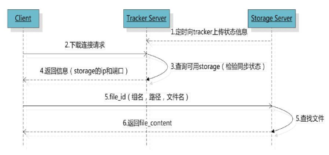

FastDFS 是用 c 语言编写的一款开源的分布式文件系统(DFS)。它的主要功能包括：文件存储，文件同步和文件访问，以及高容量和负载平衡。主要解决了海量数据存储问题，特别适合以中小文件（建议范围：4KB < file_size <500MB）为载体的在线服务。

- FastDFS 架构包括 Tracker server、Storage server、Client
  - 客户端请求 Tracker server 进行文件上传、下载，通过 Tracker server 调度最终由 Storage server 完成文件上传和下载。
  - Tracker server 跟踪服务器，作用是负载均衡和调度；负责管理所有的 Storage Server 和 group，每个 Storage 在启动后会连接 Tracker，告知自己所属 group 等信息，并保持周期性心跳；
  - Storage server 存储服务器，作用是文件存储，以 group 为单位，每个 group 内可以有多台 Storage Server，数据互为备份；
  - Client：客户端，上传下载数据的服务器，也就是我们自己的项目所部署在的服务器。

- 服务端两个角色：
  - Tracker：管理集群，tracker 也可以实现集群。每个 tracker 节点地位平等。收集 Storage 集群的状态。
  - Storage：实际保存文件。Storage 分为多个组，每个组之间保存的文件是不同的。每个组内部可以有多个成员，组成员内部保存的内容是一样的，组成员的地位是一致的，没有主从的概念。

安装见Github上的[fastdfs项目](https://github.com/happyfish100/fastdfs/wiki)

# 文件上传&下载

## 文件上传

FastDFS向使用者提供基本文件访问接口，比如upload、download、append、delete等，以客户端库的方式提供给用户使用。

Storage Server会定期的向Tracker Server发送自己的存储信息。当Tracker Server Cluster中的Tracker Server不止一个时，各个Tracker之间的关系是对等的，所以客户端上传时可以选择任意一个Tracker。

当Tracker收到客户端上传文件的请求时，会为该文件分配一个可以存储文件的group，当选定了group后就要决定给客户端分配group中的哪一个storage server。当分配好storage server后，客户端向storage发送写文件请求，storage将会为文件分配一个数据存储目录。然后为文件分配一个fileid，最后根据以上的信息生成文件名存储文件。

流程：

客户端上传文件后存储服务器将文件 ID 返回给客户端，此文件 ID 用于以后访问该文件的索引信息。文件索引信息包括：组名，虚拟磁盘路径，数据两级目录，文件名。

**组名**：文件上传后所在的 storage 组名称，在文件上传成功后有 storage 服务器返回，需要客户端自行保存。

**虚拟磁盘路径**：storage 配置的虚拟路径，与磁盘选项 store_path*对应。如果配置了store_path0 则是 M00，如果配置了 store_path1 则是 M01，以此类推。

**数据两级目录**：storage 服务器在每个虚拟磁盘路径下创建的两级目录，用于存储数据文件。

**文件名**：与文件上传时不同。是由存储服务器根据特定信息生成，文件名包含：源存储服务器 IP 地址、文件创建时间戳、文件大小、随机数和文件拓展名等信息。

## 文件同步

写文件时，客户端将文件写至group内一个storage server即认为写文件成功，storage server写完文件后，会由后台线程将文件同步至同group内其他的storage server。

每个storage写文件后，同时会写一份binlog，binlog里不包含文件数据，只包含文件名等元信息，这份binlog用于后台同步，storage会记录向group内其他storage同步的进度，以便重启后能接上次的进度继续同步；进度以时间戳的方式进行记录，所以最好能保证集群内所有server的时钟保持同步。

storage的同步进度会作为元数据的一部分汇报到tracker上，tracke在选择读storage的时候会以同步进度作为参考。

## 文件下载

流程：

