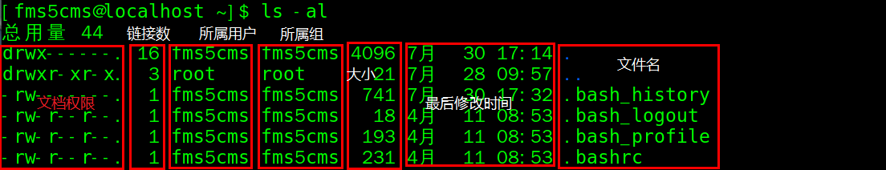
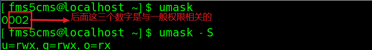
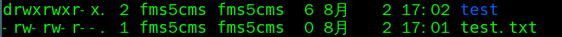

Linux 将文件可存取的身份分为三个类别：User、Group、Others。配置文件：

- **/etc/passwd 文件**
  - 用户的配置文件，记录用户的各种信息。即账号信息。
  - 每行的含义：**用户名：口令（加密的）：用户标识号：组标识号：注释性描述：主(家)目录：登录Shell**
    - `root:x:0:0:root:/root:/bin/bash`
- **/etc/shadow 文件**
  - 口令的配置文件。密码和登录的信息，是加密的。即密码信息。
  - 每行的含义：**登录名：加密口令：最后一次修改时间：最小时间间隔：最大时间间隔：警告时间：不活动时间：失效时间：标志**
    - `root:$6$nszNBBAoX6A8MmK/$T3ObkRZkUSHOkfuOmWP1tf//iOsihFaXW7rOc9uQ9r4W5cRosGCyNHJom.j7nBfIODIGdhctqEr2KQdt4PV9a1::0:99999:7:::`
- **/etc/group 文件**
  - 组的配置文件，记录 Linux 包含的组的信息。即群组信息。
  - 每行的含义：**组名：口令：组标识号：组内用户列表（一般看不到）**
    - `root:x:0:`


# User

/home/ 目录下有已创建的用户对应的家目录，用户登录时，会自动进入到自己的家目录。

- 添加用户：`useradd [-g 用户组] 用户名`

```shell
# 添加一个用户 xm，并创建了家目录
# 如果不指定组，会创建一个和用户名同名的组，并将该用户放入组中
useradd xm
# 添加用户bx，并指定其属于signal组。家目录是/home/bx
useradd -g signal bx
```

可以通过 `useradd -d 家目录 用户名`给新创建的用户指定家目录

```shell
# xq 的家目录是 /home/dog，而不是/home/dog/xq
useradd -d /home/dog xq
```

添加带 sudo 权限的用户：

``` shell
useradd -d /usr/fms5cms -m fms5cms
passwd fms5cms   # 修改密码
# 赋予 sudo 权限
vim /etc/sudoers 
# 在 “root  ALL=(ALL) ALL”的下一行添加“fms5cms  ALL=(ALL) ALL”
```

---

- 修改用户密码：`passwd 用户名`
- 查询用户信息：`id 用户名`
- 删除用户：`userdel 用户名`仅删除用户但保留了家目录，
  - 如果同时想删除家目录：`userdel -r xq`
- 切换用户：`su 切换用户名`
  - 当需要返回到原来用户时，使用`exit`指令。
  - 查看当前用户：`whoami`/`who am i`


# Group

Linux 的 User **至少**属于一个组，可以有多个群组的支持。用户组是系统对有共性的多个用户进行统一管理的方式。

- 增加组：`groupadd 组名`
- 删除组：`groupdel 组名`
- 修改用户的组：`usermod -g 新用户组 用户名`
- 改变用户登录的初始目录：`usermod -d 新目录名 用户名`

# 一切皆文件

- Linux 以文件的形式管理设备，因此，**在 Linux 世界里，一切皆文件**；
  - 启动一个进程，需要一个程序文件，这是一个二进制文件
  - 启动的时候，要加载一些配置文件，例如 yml、properties 等，这是文本文件；
  - 启动之后会打印一些日志，如果写到硬盘上，也是文本文件
  - 但是如果想把日志打印到交互控制台上，在命令行上唰唰地打印出来，这其实也是一个文件，是标准输出 stdout 文件
  - 这个进程的输出可以作为另一个进程的输入，这种方式称为管道，管道也是一个文件
  - 进程可以通过网络和其他进程进行通信，建立的 Socket，也是一个文件
  - 进程需要访问外部设备，设备也是一个文件
  - 文件都被存储在文件夹里面，其实文件夹也是一个文件
  - 进程运行起来，要想看到进程运行的情况，会在 /proc 下面有对应的进程号，还是一系列文件。

每个文件，Linux 都会分配一个文件描述符（File Descriptor），这是一个整数。有了这个文件描述符，我们就可以使用系统调用，查看或者干预进程运行的方方面面。

# 文件属性

使用`ls -al`可以查看当前目录下文件的属性：



- 权限部分（在下一节详细介绍）：
  - 第 0 位确定文件类型(不知下面者三种)
    - `d` 表示目录
    - `-`表示普通文件
    - `l`表示 软链接
  - 第 1~3 位确定文件所有者拥有该文件的权限（见后）。--User
  - 第 4~6 位确定所属组（同用户组）的用户拥有该文件的权限。--Group
  - 第 7~9 位确定其他组用户拥有该文件的权限。--Other
- 链接数部分：如果是文件则表示硬链接的数；如果是目录则表示其子目录的个数
- 文件所属用户
- 文件所属组
- 文件大小，默认单位为字节。
- 最后的修改时间：月 日 时间。如果修改时间距现在太久，那就仅显示年份。
  - 可用`ls -l --full-time`显示完整的时间格式：年月日时间。这里其实是文件的 mtime（见下面）。
- 文件名：图中的文件名是以`.`开头的，属于隐藏文件。

---

补充：

- Linux 下的文件有许多时间参数，主要有三个：
  - modification time (mtime)：当该文件的『内容数据』变更时，就会更新这个时间！内容数据指的是文件的内容，而不是文件的属性或权限！
  - status time (ctime)：当该文件的『状态 (status)』（如：权限与属性）改变时，就会更新这个时间。
  - access time (atime)：当『该文件的内容被取用』时，就会更新这个读取时间 (access)。举例来说，我们使用 cat 去读取 /etc/man_db.conf， 就会更新该文件的 atime 。
- 文件扩展名：在 Linux 下，一个文件是否可执行，仅与权限有关，而与文件名无关。尽管文件名不代表是否可执行，但我们习惯通过扩展名来了解该文件是什么东西。下面列出常见的扩展名：
  - `*.sh`脚本或批处理文件
  - `*Z`，`*.tar`，`*.tar.gz`，`*.zip`，`*.tgz`都是经过打包的压缩文件，不同的压缩软件取相关的扩展名；
  - `*.html`，`*.php` 网页相关文件。
- 文件名长度：
  - 单一文件或目录的最大容许文件名为 255 bytes​，
    - 一个 ASCII 英文占用一个 ​bytes ，则大约可达 255​ 个字符长度。
    - 每个中文字占用 ​2bytes ， 最大就是大约在 128​ 个中文字之间！
- 文件名限制：
  - 设定文件名时，最好避开一些特殊字符，如：`* ? > < ; & ! [ ] | \ ' " ( ) { }`，因为它们在文字接口下是有特殊意义的。


# 权限★

权限的重要性：

- 系统保护的功能：
  - 系统服务的文件通常只有 root 才能读写或者执行，root 基本不受系统权限限制，无论权限为是什么，预设 root 都可以存取。
- 团队开发软件或数据共享的功能：
  - 某些目录下的文件仅对同一群组给予权限。

**权限对于文件和目录的意义是不同的。**

| 权限         | 文件(存储实际数据)       | 目录(记录文件名列表)   |
| ------------ | ------------------------ | ---------------------- |
| `r`(read)    | 可读取、查看             | 可读取目录结构列表     |
| `w`(write)   | 可修改，但不可删除该文件 | 可以修改该目录结构列表 |
| `x`(execute) | 可以被执行               | 可以`cd`进入该目录     |

对于文件而言，权限是针对这些实际数据的，与文件名是否存在无关，故 `w` 权限无法删除文件，删除的前提是对该文件所在的目录有写权限。

**对目录 `r`、`w` 权限的详细说明**：

- `r `：可以读取目录结构列表，即可以查询该目录下的文件名数据。所以可利用`ls`查看目录的内容列表。
  - 如果用户对目录仅有`r`权限，使用`ls -l`查看时虽然可以得到文件名，但权限、容量等都是`?`无法获取。
  - 没有`r`的话，在使用【Tab】时，无法自动帮助补齐文档名了。
- `w`：可以修改该目录结构列表，即：
  - 建立新的文件与目录；
  - 删除已经存在的文件与目录(不论该文件的权限为何！
  - 将已存在的文件或目录进行更名；
  - 搬移该目录内的文件、目录位置。

权限也可以用数字来表示：r=4，w=2，x=1 因此 rwx=4+2+1=7。


## 预设权限

建立一个新的文件或目录时，是有默认权限也就是系统预设权限的。使用`umask`可以进行查询。

1. 直接输入`umask`，看到的是数字形态的权限设定；（第一个权限是特殊权限，只看后三个数字）
2. 输入`umask -S`，加入了`-S`（Symbolic）这个选项，就会显示符号类型的权限了。



后三个数字指的是：**默认值要减掉的权限！**。上面中的数字为`002`（这里仅看对于一般权限的后三个数字），也就是说：创建文件时要用`-rw-rw-rw-`的用户、群组、其他用户分别减去0、0、2(w)的权限，所以当前系统的新建文件权限为：`-rw-rw-r--`；而新建目录则为`drwxrwxr-x`。如图：



如果要修改的话，直接在`umask`指令后面跟上所需的结果。如：不想要同群组的用户也来修改文件，可以：`umask 022`。

说明：

- 一般文件通常是用于数据的记录！所以不需要执行的权限，也就是说若用户新建一个文件，则预设没有可执行权限，即：`-rw-rw-rw-`；而目录的预权限为：`drwxrwxrwx`。
- 在预设情况中，root 的 `umask`会去除比较多的属性，root 的`umask`默认为 022，这是基于安全的考虑；而一般用户的`umask`默认为 002，保留同群组的写入权限。


# 修改操作

- **修改所属群组**：`chgrp [-R] 新组名 文件/目录名`

注意：要被改变的组名必须要在 /etc/group 文件内存在才行，否则显示错误。

可以使用`-R` 来使目录下的所有文件或目录递归(recursive)生效。

---

- **修改文件拥有者**`chown`

注意：用户必须是已经在系统中存在的账号，即在 /etc/password 文件中有记录。
  - 语法一：`chown [-R] 用户名 文件/目录名`修改文件所有者
  - 语法二：`chown [-R] 新用户名:新组名 文件/目录名`  修改用户的所有者和所有组
    - 上面的两个使用 chown 的语句，可以使用`-R` 来使目录下的所有文件或目录递归生效

注意：复制行为（cp）会复制执行者的属性和权限，所以即使将文件复制给了其他使用者，如果它没有权限的话，也无法修改。这时就有必要修改这个文件的拥有者和群组了。

---

**修改权限** `chmod`  （可以修改文件或目录的权限）

- 方式一：`+`增加权限、`-` 去除权限、`=` 赋予权限

  `u`：所属用户；`g`：所属组；`o`：其他用户 ；`a`：所有人（`u`、`g`、`o`的总和）

  - `chmod u=rwx,g=rx,o=x 文件目录名`
  - `chmod o+w 文件目录名`
  - `chmod a-x 文件目录名`

- 方式二：通过数字变更权限

  规则：$r=4，w=2，x=1$ 因此 $rwx=4+2+1=7$。如果要设置无权限`-`，数字为0

  - `chmod u=rwx,g=rx,o=x 文件目录名`  相当于  `chmod 751 文件目录名`

- 也可以使用`-R`来将目录下的所有文件递归变更


