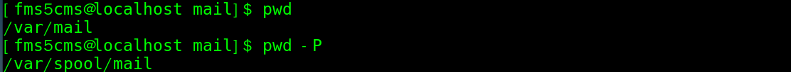
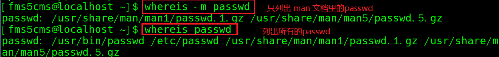

`history`：查看已经执行过的历史指令（会显示指令的编号），也可执行历史指令

- `history`显示所有历史指令
- `history 10` 显示最近的10个指令
- `history !178` 执行编号为178的指令


# 查看、切换、创建

- `pwd`  显示当前工作目录的绝对路径。

  - 参数：`-P` 显示出确实的路径，而非使用链接的路径。

  - 案例：进入 /var/mail 目录下

    

     说明：/var/mail 是链接到 /var/spool/mail 的链接文件。

---

- ls 指令（list）:`ls [选项] [目录或是文件]` 
  - `-a` 显示当前目录所有的文件和目录，包括隐藏的内容
  - `-l` 长数据串行输出，包含文件的属性和权限等数据（常用）
  - `-h` 用便于浏览的方式显示，如原本文件大小以字节为单位，使用该选项后，可以直接显示 xx K 或M
  - `-r`将排序结果反向输出
  - `-R`连同子目录内容一起列出来
  - `-S`以文件容量大小排序
  - `-t`以时间排序
  - 如果要多个选项，可以直接跟在第一个选项后面，不需要再写 -，如：`ls -al`
  - 不写任何选项，则默认显示非隐藏内容的文件名、以文件名进行排序、不同文件名颜色所代表的文件类型。
  - `--full-time `：以完整时间模式 (包含年、月、日、时、分) 输出

---

- cd 指令（ change directory ）：`cd [参数]`  切换到指定的目录。    
  - `cd~`或`cd`  回到自己的家目录
  - `cd..`回到当前目录的上一级目录

---

- mkdir 指令（make directory ）：`mkdir [选项] 要创建的目录`

  - `-p` 递归创建多级目录
  - `-m` 直接配置文件的权限，

  - eg：`mkdir /home/dog`在 /home 目录下，创建 dog 目录
  - eg：`mkdir -m 711 test` 在当前目录下建立权限为`rwx--x--x`的目录
  - 如果不指定权限的话，就会是默认权限`rwxrwxr-x`（见2.6预设权限）

---

- touch 指令（创建空文件）：`touch [选项] 文件名称`  
  - 一次性创建多个文件：`touch 文件名称1 文件名称2。。。` eg：`touch a.txt b.txt c.txt`


# 复制、删除、移动

- `cp [选项] 源文件 指定目标目录 `（拷贝文件到指定目录，需要有 `r` 权限）

  - `-a`连同文件的所有特性（权限、建立时间等）一起复制。与`-p`相同？
  - `-d`若源文件为链接文件，则复制链接文件属性而不是文件本身
  - `-f`强制（force），若目标文件存在且无法打开，则移除后再尝试
  - `-i`目标文件已存在时，覆盖会先询问（常用）
  - `-r` 递归复制，用于目录的复制行为（常用）
  - `-p`连同文件的属性(权限、用户、时间)一起复制过去，而非使用默认属性(备份常用)；

  - eg：`cp aaa.txt bbb/`将当前目录的aaa.txt 拷贝到 当前目录中的bbb目录下（拷贝单个文件）
  - eg：`cp -r test/ zwj/` 将当前目录的test 整个目录拷贝到当前目录zwj目录
  - 注意： `cp` 指令在复制时，如果发现目标目录下有相同文件，会提示是否覆盖。如果强制覆盖，不想要提示，可以使用 `\cp`指令，用法同`cp`指令
  - 如果来源文件有两个以上，则最后一个目的文件一定要是『目录』才行！
  - 默认情况下，将别的用户的数据复制过来后，复制文件的User、Group就是自己了。

---

- `rm [选项] 要删除的文件或目录`，为了怕文件被 root 误杀，很多的 Linux 版本中，移除指令都默认加入了`-i`选项

  - `-r`递归删除整个文件夹（不会询问的）
  - `-f`强制（force）删除不提示
  - `-i`互动模式，删除前会询问

  - 通配符`*`，可以使用其来将具有相同开头或结尾的文件全部删除。
    - eg：`rm -i bashrc*`删除当亲目录下文件名开头是 bashrc 的所有文件

---

- `rmdir [选项] 要删除的空目录`       
  - 注意：rmdir 删除的是空目录，如果目录下有内容时是无法删除的
  - 如果要删除非空目录，需要使用 `rm -rf 要删除的目录`

---

- mv 指令（移动文件与目录 或重命名）

  - `mv [选项] 旧文件名 新文件名`   重命名
    - 还有一个指令`rename`用于进行多个文件的同时重命名
  - `mv [选项] 目标文件1，目标文件2... 目标目录`  移动多个或单个文件到目标目录下

  - 选项：
    - `-f`如果目标文件已经存在，不询问直接覆盖
    - `-i`如果目标文件已经存在，会询问
    - `-u`如果目标文件已经存在，且源文件较新，才会更新
  - eg：`mv a.txt b.txt`将当前目录的 a.txt 重命名为 b.txt
  - eg：`mv a.txt /root/` 将当前目录下的 a.txt 移动到 /root 目录下


# 文件内容操作

- `cat [选项] 文件`：文件所有内容连续显示在屏幕上）Concatenate（连续）
  - `-b` 显示行号（仅针对非空白行）
  - `-n` 显示行号（空白行也有）
  - `-T` 将【Tab】键显示为`^I`
  - `-E` 将结尾的断行字符 `$` 显示出来
  - `-v `列出一些看不出来的特殊字符
  - `-A` 相当于`-vET`的整合，可列出一些特殊字符而不是空白

---

- `more 要查看的文件`：以全屏幕的方式按页显示文本文件的内容。more 指令中内置了若干快捷键

| 快捷键   | 功能                               |
| -------- | ---------------------------------- |
| 空格键   | 向下翻一页                         |
| 回车键   | 向下翻一行                         |
| q        | 立刻离开more，不再显示该文件的内容 |
| Ctrl + F | 向下滚动一屏                       |
| Ctrl + B | 返回上一屏                         |
| =        | 输出当前行的行号                   |
| :f       | 输出文件名和当前行的行号           |
| /字串    | 向下搜寻指定字串                   |

---

- `less 要查看的文件`：用来分屏查看文件内容，在显示文件内容时，并不是一次将整个文件加载之后才显示，而是根据现实需要加载内容，**对于显示大型文件具有较高效率**

| 快捷键       | 功能               |
| ------------ | ------------------ |
| 空格键       | 向下翻一页         |
| 【pageup】   | 向上翻一页         |
| 【pagedowm】 | 向下翻一页         |
| /字串        | 向下搜寻指定字串   |
| ?字串        | 向上搜寻指定字串   |
| q            | 离开 less          |
| n            | 重复前一个搜寻     |
| N            | 反响重复前一个搜寻 |
| g            | 前进到第一行       |
| G            | 前进到最后一行     |

---

- `echo [选项] [输出内容]`：输出内容到控制台


- head 指令（显示文件的开头部分内容，默认显示文件前10行内容）

  - `head 文件` 查看文件前10行内容
  - `head -n 5 文件` 查看文件前5行内容，5可以时任意数字
  
- tail 指令（输出文件中尾部的内容，默认显示文件后10行内容）

  - `tail 文件`  查看文件后10行内容
  - `tail -n 5 文件`  查看文件后5行内容，5可以是任意数字
  - `tail -f 文件` 实时追踪文件的所有更新（工作中经常使用）【Ctrl】+ C 结束

```shell
#如何显示第 11 到 20 行？
head -n 20 文件 | tail -n 10
```

---

- `od [-t TYPE] 文件`：获取非纯文本文档。`-t`后面是各种类型的输出，如：
  - `a` 利用默认字符输出
  - `c` 使用 ASCII 字符输出
  - `d[size]` 利用十进制(decimal)输出，每个整数占 size 个字节
  - `f[size]` 利用浮点数(floating)输出，每个数占 size 个字节
  - `o[size]` 利用八进制(octal)输出，每个整数占 size 个字节
  - `x[size]` 利用十六进制(hexadecimal)来输出，每个整数占 size 个字节

---

- ln  指令（软链接也叫符号链接，类似快捷方式，主要存放了链接其他文件的路径）
  - 语法：`ls -s [原文件或目录][软链接名]`     给原文件创建一个软链接
  - eg：`ln -s /root linkToRoot`创建一个软链接 linkToRoot 到 /root目录
    - 可通过`ls -l`查看
    - `cd linkToRoot/`可以进入 /root 目录
    - 但是`pwd`查看当前目录时，看到的仍为软链接所在目录 linkToRoot
  - 删除软链接：`rm -rf linkToRoot` 注意：最后面不能带 /，不然会提示“设备或资源忙”

---

- `>`输出重定向（将文件的内容覆盖）      `>>`追加
  - `ls -l > 文件`  把`ls -l`显示的列表的内容写入文件（文件不存在则创建文件再覆盖内容）
  - `ls -al >> 文件` 把`ls -al`显示的列表的内容追加到文件末尾
  - `cat 文件1 > 文件2` 将文件1的内容覆盖到文件2
  - `echo "内容">>文件` 把内容追加入文件


# 文件搜索

- `find [搜索范围] [选项]`：从指定目录向下递归地遍历其各个子目录，将满足条件的文件或目录显示在终端。

| 选项           | 功能                             |
| -------------- | -------------------------------- |
| -name 查询方式 | 按照指定的文件名查找模式查找文件 |
| -user 用户名   | 查找属于指定用户名的所有文件     |
| -size 文件大小 | 按照指定的文件大小查找文件       |

```shell
#从目录 /home 下，按照文件名查找 hello.txt
find /home -name hello.txt
# 从目录 /home 下，按照用户查找该用户所有的文件
find /home -user zzk
# 查找整个Linux系统下大于20M的文件（+n大于  -n小于  n等于）
find / -size +20M
# 查询整个 Linux 系统中的所有 .txt文件
find / -name *.txt
```

---

- `locate [选项] 搜索文件`：可以快速定位文件路径。利用事先建立的系统中所有文件名称及路径的 `locate` 数据库实现快速定位给定文件。`locate` 指令无需遍历整个文件系统，查询速度快。为了保证查询结果的准确性，管理员必须定期更新 `locate` 时刻。

  - `-i `：忽略大小写的差异；
  - `-c `：不输出档名，仅计算找到的文件数量
  - `-l `：仅输出几行的意思，例如输出五行则是 `-l 5`
  - `-S `：输出 `locate` 所使用的数据库(/var/lib/mlocate/)文件的相关信息，包括该数据库纪录的文件/目录数量等
  - `-r` ：后面可接正规表示法的显示方式
  
  - 由于 `locate` 指令基于数据库插叙，所以第一次运行前，必须使用 `updatedb` 指令，会根据 /etc/updatedb.cong 的设定来搜寻系统盘内的文件名，并更新 /var/lib/mlocate 内的数据库文件。
  

---

- grep 过滤查找
- 管道符 | 表示将前一个命令的处理结果输出传递给后面的命令处理
- 语法：`grep [选项] 查找内容 源文件`  
    - `-n` 显示匹配行及行号 
    - `-i`忽略字母大小写

---

- `whereis [选项] 文件或目录名`  选项：

  - `-l` :可以列出 whereis 会去查询的几个主要目录而已
- `-b `:只找 binary 格式的文件
  - `-m` :只找在说明文件 manual 路径下的文件
  - `-s` :只找 source 来源文件
  - `-u` :搜寻不在上述三个项目当中的其他特殊文件
  
  

  - `whereis`主要针对 /bin /sbin下的指令以及/usr/share/man 底下的 man page 文件，还有几个比较特定的目录来处理，所以速度会比`find`指令快很多。


# 文件压缩

## 压缩文件扩展名

1. `.zip` zip 程序压缩的文件；
2. `.gz` gzip 程序压缩的文件；
3. `.bz2` bzip2 程序压缩的文件；
4. `.xz` xz 程序压缩的文件；
5. `.tar` tar 程序打包的数据，并没有压缩过；
6. `.tar.gz` tar 程序打包的文件，其中并且经过 gzip 的压缩
7. `.tar.bz2` tar 程序打包的文件，其中并且经过 bzip2 的压缩
8. `.tar.xz` tar 程序打包的文件，其中并且经过 xz 的压缩

tar 只是打包，也就是将很多文件打包成一个文件，并不提供压缩功能。不过后来，GNU 计划中，将整个 tar 与压缩的功能结合在一起，如此一来提供使用者更方便并且更强大的压缩与打包功能。


## 常见的压缩指令

- gzip 将文件压缩为 *.gz 文件；gunzip 用于解压文件
  - 语法：`gzip [选项] 文件`  选项：
    - `-c`：将压缩的数据输出到屏幕上，可透过数据流重导向来处理；
    - `-d`：解压缩的参数；
    - `-t`：可以用来检验一个压缩文件的一致性～看看文件有无错误；
    - `-v`：可以显示出原文件/压缩文件案的压缩比等信息；
    - `-#`：# 为数字的意思，代表压缩等级，-1 最快，但是压缩比最差、-9 最慢，但是压缩比最好！预设是 -6
  - 当使用 gzip 对文件进行压缩后，不会保留原来的文件。解压后，压缩文件也没有不再保留

---

- zip 用于压缩文件；unzip用于解压文件

  - `zip [选项] XXX.zip 将要压缩的内容`  压缩文件和目录的命令
  - `unzip [选项] XXX.zip`  解压缩文件

  - zip 常用选项：
    - `-r` 递归压缩，即压缩目录
  - unzip 常用选项
    - `-d 目录` 指定解压后文件的存放目录
  - 压缩和解压缩后，源文件仍然保留

```shell
# 将当前目录下的test目录进行压缩
zip -r jin.zip test
# 将mypackage.zip 解压到home下的tmp目录中
unzip -d /home/tmp/ mypackage.zip
```

---

- `tar [选项]  XXX.tar.gz  打包内容`：将文件打包为 *.tar.gz 文件
  - `-c` 产生 .tar 打包文件
  - `-v` 显示详细信息
  - `-f`指定压缩后的文件名
  - `-z`压缩
  - `-x`解包 .tar 文件

```shell
# 将 a1.txt 和 a2.txt  打包为 a.tar.gz 
tar -zcvf a.tar.gz al.txt a2.txt  
# 将 /home 文件夹压缩成 myhome.tar.gz
tar -zcvf myhome.tar.gz /home/
# 将 a.tar.gz 解压到当前目录
tar -xvf a.tar.gz
# 将 a.tar.gz 解压到 /opt/ 目录下（该目录必须存在，否则报错）
tar -xvf a.tar.gz  -C /opt/
```

