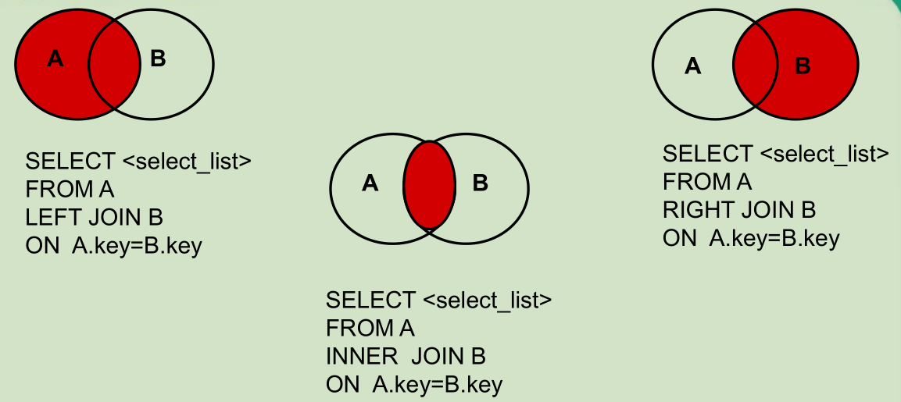
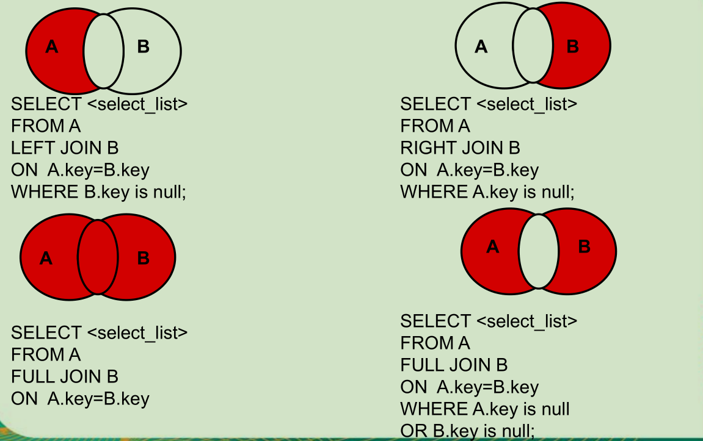

查看表数据：

```sql
select * from table_name;          #查看表的所有数据
select col_name1,col_name2,...from table_name; #查看特定列的数据
```

常数：

```sql
# 查询常数
# 单引号说明引号中的字符串是个常数，如果常数是个数字，就可以直接写数字，不需要单引号
select '王者荣耀' platform, name from heros;
```

去重：

```sql
# 精确查看，去掉重复的查询结果
# DISTINCT 其实是对后面所有列名的组合进行去重，所以必须放到所有列名前面
select distinct col_name1，col_name2,... from table_name;
```

别名（可以不写 as）：

```sql
#查询到的列名显示为name1，但数据库的列名不变
select col_name1 as name1 from table_name;
```

“+”的作用：运算符

```sql
SELECT 100+90；         #两个操作数都是数值型，则做加法运算
-- 其中一个为字符型，会尝试将其转为数值型然后再运算，如果无法转换成功，则将字符型转为0再运算
SELECT '100'+90；
```

查询当前数据库

```sql
select database();
```

# WHERE

语法：`select * from table_name where col_name 运算符 值`

| 运算符              | 说明                                      |
| ---------------- | --------------------------------------- |
| =                | 等于                                      |
| <> 或 !=          | 不等于                                     |
| < 或 <= 或 > 或 >=  |                                         |
| between...and... | 两个值之间                                   |
| is null          | 为 null（is not null 不为空）                 |
| and              | 注意：**SQL 中 and 优先级要比 or 高**             |
| or               |                                         |
| not              | 取非，主要用在 is 或 in 中                       |
| in               | 包含在几个选项之中，相当于多个 or（not in 不在这个范围内）      |
| like             | 模糊查询，支持 %或下划线匹配：`%`匹配任意个字符；一个下划线只匹配一个字符 |

案例：找出工资大于 1800 的员工，要求部门编号为 20 或 30。

```sql
-- and优先级大于or，即 where 条件：(salary>1800 and deptid=20) or deptid=30
select name,email from emp where salary>1800 and deptid=20 or deptid=30

-- 正确写法：
select name,email from emp where salary>1800 and (deptid=20 or deptid=30)
```

- in 操作符：

```sql
-- 列名 in (value1,value2...) 等同于  列名=value1 or 列名=value2
select * from table_name where col_name in (value1,value2...);
-- 示例：筛选出 title 列中值为 sun 或 color 的记录（数据）
select*from book where title in( 'sun ' , 'color');
```

---

- between 操作符：

应用在数字上，是闭区间，等同于 >= and <=。 且前面的值必须小于后面的值

```sql
-- 满足value1<=col_name<=value2的记录
select*from table_name where col_name between value1 and value2；
-- col_name不在value1、value2之间的记录
select*from table_name where col_name not between value1 and value2；

-- 应用在字符上(了解)，是左闭右开区间
select ename from emp where ename between ‘A’and ‘K’;  -- [A,K)
```

---

- like 操作符（进行字符串的匹配）

模糊查询，一个`%`匹配任意个字符；一个`_`只匹配一个字符

```sql
select * from table_name where col_name [not] like pattern;
```

- pattern：匹配模式（必须写单引号），如：
  - 'abc'
  - '%abc'        以 abc 结尾
  - 'abc%'        以 abc 开头
  - '%abc%'    包含 abc
  - '\_A%'          第二个字符是 A

# 排序

将查询结果进行排序：

```sql
-- 按单一列名排序：
select * from table_name [where 子句] order by col_name [asc/desc]
-- 按多列排序（先按 col1 排序，重复的时候按 col2 排序...）：
select * from table_name [where 子句] order by col1 [asc/desc]，col2 [asc/desc]...  
-- 注意：不加 asc 或 desc 时，默认 asc 升序；where子句和order by不能调换顺序
```

可以用 `select` 后面没有的列进行排序。

# 分组

在做统计的时候，可能需要先对数据按照不同的数值进行分组，然后对这些分好的组进行聚集统计。

可以使用`GROUP BY` 子句将表中的数据分成若干组，可以结合函数一起使用。

```sql
SELECT column1, ... ,function(column) FROM table
[WHERE condition1]
[GROUP BY column2]  -- 这里的字段名必须是select后面查询的字段中出现的
[HAVING condition2]
[ORDER BY asc/desc]；
```

- 筛选分为两类：分组前筛选和分组后筛选

|       | 针对的表           | 位置         | 连接的关键字 |
| ----- | -------------- | ---------- | ------ |
| 分组前筛选 | 原始表            | group by 前 | where  |
| 分组后筛选 | group by 后的结果集 | group by 后 | having |

- 能用分组前筛选的，**尽量使用分组前筛选，提高效率**
  - 分组可以按单个字段也可以按多个字段
  - 可以搭配着排序使用

---

示例：

分组前的筛选：

```sql
-- 案例1：查询邮箱中包含a字符的 每个部门的平均工资
SELECT AVG(salary),department_id FROM employees
WHERE email LIKE '%a%'
GROUP BY department_id;
-- 案例2：查询有奖金的每个领导手下员工的最高工资
SELECT MAX(salary),manager_id FROM employees 
WHERE commission_pct IS NOT NULL 
GROUP BY manager_id;
```

添加分组后的筛选：

```sql
-- 案例1：每个工种有奖金的员工的最高工资>12000的工种编号和最高工资
SELECT job_id,MAX(salary) FROM employees 
WHERE commission_pct IS NOT NULL 
GROUP BY job_id 
HAVING MAX(salary)>12000;
-- 案例2：领导编号>102的每个领导手下的最低工资大于5000的领导编号和最低工资
SELECT MIN(salary),manager_id FROM employees 
WHERE manager_id>102 
GROUP BY manager_id 
HAVING MIN(salary)>5000;
```

按表达式或函数分组：

```sql
-- 案例：按员工姓名的长度分组，查询每一组的员工个数，筛选出员工个数>5的员工
SELECT COUNT(*) c,LENGTH(last_name) len_name FROM employees
GROUP BY len_name HAVING c>5;
```

按多个字段分组：

```sql
-- 案例：查询每个工种每个部门的平均工资
SELECT AVG(salary),department_id,job_id FROM employees
GROUP BY department_id,job_id;
```

添加排序：

```sql
-- 案例：每个工种有奖金的员工的最高工资>6000的工种编号和最高工资,按最高工资升序
SELECT employee_id,MAX(salary) m FROM employees WHERE commission_pct IS NOT NULL
GROUP BY employee_id HAVING m>6000
ORDER BY m asc;
```

# 连接

当查询的字段来自于多个表时，就会用到连接查询。 这里仅使用 sql 99 标准的语法：

```sql
select 查询列表
from 表1 别名
[连接类型] join 表2 别名 on 连接条件
[ where 筛选条件 ]
[ group by 分组 ]
[ having 筛选条件 ]
[ order by 排序列表 ]
```

| 分类   | 内连接     | 左外连接         | 右外连接          | 全外连接         | 交叉连接  |
| ---- | ------- | ------------ | ------------- | ------------ | ----- |
| 连接类型 | [inner] | left [outer] | right [outer] | full [outer] | cross |





## 内连接

```sql
select 查询列表 from 表1 别名 [inner] join 表2 别名 on 连接条件;
```

- `inner`可以省略
- 筛选条件放在`where`后面，连接条件放在`on`后面，提高分离性，便于阅读
- 查询多表（可以不只是两个表）的交集

分类：等值：非等值；自连接

- 等值连接

```sql
-- 查询哪个部门的员工个数>3的部门名和员工个数，并按个数降序（添加分组、筛选、排序）
SELECT department_name,COUNT(*) c
FROM departments d
INNER JOIN employees e ON d.department_id=e.department_id
GROUP BY department_name
HAVING c>3
ORDER BY c DESC;
```

等值连接的字段名相同时可以使用 USING 来简化：

```sql
-- 结果与上面相同
SELECT department_name,COUNT(*) c
FROM departments d
INNER JOIN employees e USING(department_id)
GROUP BY department_name
HAVING c>3
ORDER BY c DESC;
```

---

- 非等值连接

```sql
-- 查询工资级别的人数>20的级别和人数，并且按工资级别降序
SELECT COUNT(*),grade_level
FROM employees e
JOIN job_grades g ON e.salary BETWEEN g.lowest_sal AND g.highest_sal
GROUP BY grade_level
HAVING COUNT(*)>20
ORDER BY grade_level DESC;
```

---

- 自连接

```sql
-- 查询姓名中包含字符k的员工的名字、上级的名字
SELECT e.last_name,m.last_name
FROM employees e
JOIN employees m ON e.manager_id= m.employee_id
WHERE e.last_name LIKE '%k%';
```

## 外连接

应用场景：用于查询一个表中有，另一个表没有的记录

- 外连接查询结果 = 内连接结果 + 主表中有而从表没有的记录
- 左外连接，`left join`左边的是主表
- 右外连接，`right join`右边的是主表
- 左外和右外交换两个表的顺序，可以实现同样的效果
- 全外连接 = 内连接的结果 + 表 1 中有但表 2 没有的 + 表 2 中有但表 1 没有的。
  - 注意：MySQL 不支持全外连接

## 交叉连接

```sql
SELECT b.*,bo.* FROM beauty b CROSS JOIN boys bo;
```

# 分页

```sql
select 查询列表 from 表1
[ 连接类型  join 表2 on 连接条件
where 筛选条件
group by 分组字段 having 分组后的筛选
order by 排序的字段 ]
limit [ offset , rowCount ];

--   offset ：要显示条目的起始索引.起始索引从0开始
--   rowCount ：要显示的条目个数
```

**公式**：

```sql
-- 要显示的页数 page，每页的条目数size
select 查询列表  from 表  limit  (page-1)*size , size;
```

示例：

```sql
-- 案例1：查询前五条员工信息
SELECT * FROM  employees LIMIT 0,5;
SELECT * FROM  employees LIMIT 5;

-- 案例2：查询第11条——第25条
SELECT * FROM  employees LIMIT 10,15;

-- 案例3：有奖金的员工信息，并且工资较高的前10名显示出来
SELECT * FROM employees
WHERE commission_pct IS NOT NULL
ORDER BY salary DESC
LIMIT 10 ;
```

# 联合查询

应用场景：要查询的结果来自于多个表，且多个表没有直接的连接关系，但查询的信息一致（如查询中外的男性，都有 id、name、gender）时 。

```sql
-- 使用 union 将多条查询语句的结果合并成一个结果
查询语句1 union 查询语句2 union ...
```

注意：

- 多条查询语句的查询列数是一致的！
- 多条查询语句的查询的每一列的类型和顺序最好一致
- `union` 关键字默认去重，如果使用 `union all` 可以包含重复项

```sql
-- 案例：查询部门编号>90或邮箱包含a的员工信息
SELECT * FROM employees WHERE email LIKE '%a%' OR department_id>90;;

SELECT * FROM employees  WHERE email LIKE '%a%'
UNION
SELECT * FROM employees  WHERE department_id>90;

-- 案例：查询中国用户中男性的信息以及外国用户中年男性的用户信息
SELECT id,cname FROM t_ca WHERE csex='男'
UNION ALL
SELECT t_id,tname FROM t_ua WHERE tGender='male';
```

# 子查询

出现在其他语句（不一定是`select`语句）中的`select`语句，称为子查询或内查询，而外部的查询语句，称为主查询或外查询。 子查询按结果集的行列数不同：

- 标量子查询（结果集只有一行一列）
- 列子查询（结果集只有一列多行）
- 行子查询（结果集有一行多列）
- 表子查询（结果集一般为多行多列）

## WHERE / HAVING 的子查询

不支持表子查询，其中：

- 标量子查询，一般搭配着单行操作符（`>`、`<`、`>=`、`<=`、`=`、`<>` ）使用
- 列子查询，一般搭配着多行操作符（`in`、`any`/`some`、`all` ）使用

子查询的执行优先于主查询执行，主查询的条件用到了子查询的结果。

| 操作符             | 含义                                                                 |
| --------------- | ------------------------------------------------------------------ |
| `IN` / `NOT IN` | 等于列表中的任意一个                                                         |
| `ANY` / `SOME`  | 和子查询返回的某一个值比较。常用其他替代<br>如：`A>ANY(10,20,30)` 可替换为 `A>MIN(10,20,30)` |
| `ALL`           | 和子查询返回的所有值比较                                                       |

- 标量子查询：必须保证子查询的结果是一行一列的，又名单行子查询

WHERE 后面

```sql
#案例：返回 job_id 与141号员工相同，salary 比143号员工多的员工 姓名，job_id 和工资
SELECT last_name,job_id,salary FROM employees
WHERE salary>(
    SELECT salary FROM employees WHERE employee_id=143
) AND job_id=(
    SELECT job_id FROM employees WHERE employee_id=141
);
```

HAVING 后面

```sql
#案例：查询最低工资大于50号部门最低工资的部门id和其最低工资
-- 1.查询50号部门的最低工资
-- 2.查询每个部门的最低工资
-- 3.在2的基础上筛选，满足MIN(salary)> （1的结果）
SELECT department_id,MIN(salary) FROM employees
GROUP BY department_id
HAVING MIN(salary)>(
    SELECT MIN(salary) FROM employees WHERE department_id=50
);
```

---

- 列子查询：子查询的结果是一列多行，又名多行子查询

```sql
#案例：返回location_id是1400或1700的部门中的所有员工姓名
-- ①查询location_id是1400或1700的部门编号
-- ②查询员工姓名，要求部门号是①列表中的某一个
SELECT last_name FROM employees
WHERE department_id  IN(             #可以替换成 =ANY()
    SELECT DISTINCT department_id
    FROM departments
    WHERE location_id IN(1400,1700)
);
```

---

- 行子查询：子查询的结果为一行多列或多行多列。**使用较少，了解即可**

```sql
#案例：查询员工编号最小并且工资最高的员工信息
SELECT *
FROM employees
WHERE (employee_id,salary)=(
    SELECT MIN(employee_id),MAX(salary)
    FROM employees
);
```

## SELECT、FROM、EXISRS 的子查询

- SELECT 后面仅仅支持标量子查询

```sql
#案例：查询每个部门的员工个数
SELECT d.*,(
    SELECT COUNT(*)
    FROM employees e
    WHERE e.department_id = d.department_id
) 个数 FROM departments d;
```

---

- FROM 后面的子查询：将子查询结果充当一张表，要求**必须起别名**

```sql
#案例：查询每个部门的平均工资的工资等级
-- ①查询每个部门的平均工资
-- ②连接①的结果集和job_grades表，筛选条件平均工资 between lowest_sal and highest_sal
SELECT  ag_dep.*,g.grade_level
FROM (
    SELECT AVG(salary) ag,department_id
    FROM employees
    GROUP BY department_id
) ag_dep
INNER JOIN job_grades g
ON ag_dep.ag BETWEEN lowest_sal AND highest_sal;
```

---

- EXISTS 后面（相关子查询）

```sql
#案例：查询有员工的部门名
-- in
SELECT department_name
FROM departments d
WHERE d.department_id IN(
    SELECT department_id
    FROM employees
)

-- exists
SELECT department_name
FROM departments d
WHERE EXISTS(   -- EXISTS 的结果为 0 或 1
    SELECT *
    FROM employees e
    WHERE d.department_id=e.department_id
);
```
