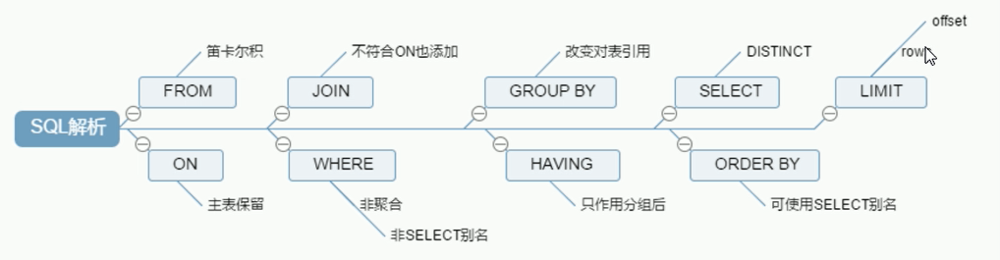

以 MySQL 5.7 说明

|                                                    | 关键字                 | 描述                   |
| -------------------------------------------------- | ---------------------- | ---------------------- |
| 数据查询语言（DQL-Data Query Language）            | select                 | 查                     |
| 数据操纵语言（DML-Data Manipulation Language）     | insert、delete、update | 针对表中的数据来增删改 |
| 数据定义语言（DDL-Data Definition Language）       | create、drop、alter    | 针对表的结构来增删改   |
| 事务控制语言（TCL-Transactional Control Language） | commit、rollback       | 提交、回滚             |
| 数据控制语言（DCL-Data Control Language）          | grant、revoke          |                        |

- DB：数据库，保存一组有组织的数据的容器  。
- DBS：数据库系统，指安装和使用了数据库技术的计算机系统，一般由数据库、数据库管理系统（及其开发工具）、应用系统和数据库管理员（DataBase Administrator ，简称 DBA）构成。
- DBMS：数据库管理系统，又称为数据库软件（产品），用于管理 DB 中的数据
- SQL：结构化查询语言，用于和 DBMS 通信的语言。

---

**MySQL 在 Linux 的环境下，数据库名、表名、变量名是严格区分大小写的，而字段名是忽略大小写的。而在 Windows 的环境下全部不区分大小写。**

连接客户端：`mysql -h localhost -P 3306 -uroot -p`

- -h 主机名
- -P 端口号（P 大写）
- -u 用户名
- -p 密码(p 小写)
- 如果密码跟在`-p`后面，之间不能有空格，而前面的三项之间有无空格都可以；如果连接本机的 3306 端口，`-h`和`-P`可以不写

查看服务器版本：

- ① 登陆到 MySQL 服务器：`select version()`;
- ② 没有登陆到 MySQL 服务器：`mysql --version` 或`mysql --V`

三种注释方式：

```sql
# 注释文字
-- 注释文字 `（-- 后面必须有空格）
/*
	多行注释
*/
```

==null 的判断：is/is not==

# SQL 执行顺序

```sql
SELECT DISTINCT player_id, player_name, count(*) as num -- 顺序5
FROM player JOIN team ON player.team_id = team.team_id  -- 顺序1
WHERE height > 1.80                                     -- 顺序2
GROUP BY player.team_id                                 -- 顺序3
HAVING num > 2                                          -- 顺序4
ORDER BY num DESC                                       -- 顺序6
LIMIT 2                                                 -- 顺序7
```



# 数据类型(MySQL)

## 数值型

tinyint：需要 Boolean 型时用 tinyint 的 0 和 1

bigint：表 id（自增）

double：范围更大

---

整型：

| tinyint | smallint | mediumint | int/integer | bigint |
| ------- | -------- | --------- | ----------- | ------ |
| 1 字节  | 2 字节   | 3 字节    | 4 字节      | 8 字节 |

```sql
CREATE TABLE tab_int(
  t1 INT(7) UNSIGNED,      -- 设置为无符号
  t2 INT(7) ZEROFILL       -- 显示的长度为7,如果长度不足,左侧用 0 填充
);
```

- **整型中类型后面`()`中的数字代表了显示的最大宽度(不是范围)，范围由类型来决定。**
- 特点：
  - 默认是有符号，如果想设置无符号，需要添加`unsigned`关键字
  - 若插入的数值超出整型范围,会报 out of range 异常，且插入的数值会更改为临界值
  - 若不设置长度，会用默认的长度代表显示的最大宽度，不够会用 0 在左边填充，但必须搭配 `zerofill` 使用！

---

小数

| 浮点型                 | 定点型                  |
| ---------------------- | ----------------------- |
| float(M,D)   4 字节    | dec(M，D)  M+2 字节     |
| double(M,D)     8 字节 | decimal(M,D)   M+2 字节 |

- 特点：
  - M：整数部位+小数部位；D：小数部位 （如果超过范围，则插入临界值）
  - M 和 D 都可以省略     （如果是 decimal，则 M 默认为 10，D 默认为 0 ；如果是 float 和 double，则会根据插入的数值的精度来决定精度）
  - 定点型的精确度较高，如果要求插入数值的精度较高如货币运算等则考虑使用 。

## 字符型

较短的文本：`char`；`varchar`

较长的文本：`text`；`longtext`；`blob`(较大的二进制)

其他：  `binary`和`varbinary`用于保存较短的二进制；`enum`用于保存枚举 ；`set`用于保存集合

|         | 写法       | M：最大的字符数    | 特点           | 空间的耗费 | 效率 |
| ------- | ---------- | ------------------ | -------------- | ---------- | ---- |
| char    | char(M)    | 可以省略，默认为 1 | 固定长度的字符 | 比较耗费   | 较高 |
| varchar | varchar(M) | 不可以省略         | 可变长度的字符 | 比较节省   | 较低 |

## 日期

date：只保存日期

time：只保存时间

year：只保存年

datetime：保存日期+时间

timestamp：保存日期+时间

常用：

|           | 字节 | 范围             | 特点                                                                   |
| --------- | ---- | ---------------- | ---------------------------------------------------------------------- |
| datetime  | 8    | 1000 年——9999 年 | 只能反映插入时的当地时区                                               |
| timestamp | 4    | 1970 年——2038 年 | 和实际时区有关，更能反应实际的日期。受 MySQL 版本和 SQLMode 的影响很大 |

```sql
CREATE TABLE tab_date(
  t1 DATETIME,
  t2 TIMESTAMP
);

INSERT INTO tab_date VALUES(NOW(),NOW());

SELECT * FROM tab_date;

SHOW VARIABLES LIKE 'time_zone';
SET time_zone='+9:00';                 #设置当前时区为东9区
```

在 Mysql 5.7 及以上版本中，默认是不允许设置日期的值为全 0 值的，使用 `select @@sql_mode` 可以看到有 NO_ZERO_IN_DATE 和 NO_ZERO_DATE 两个值，怎么办呢？

```sql
-- 修改当前 session 和全局的 sql_mode
set @@sql_mode=(select replace(@@sql_mode,'NO_ZERO_IN_DATE,NO_ZERO_DATE',''));
set @@global.sql_mode=(select replace(@@global.sql_mode,'NO_ZERO_IN_DATE,NO_ZERO_DATE',''));
```

重连数据库，然后重新建表即可
