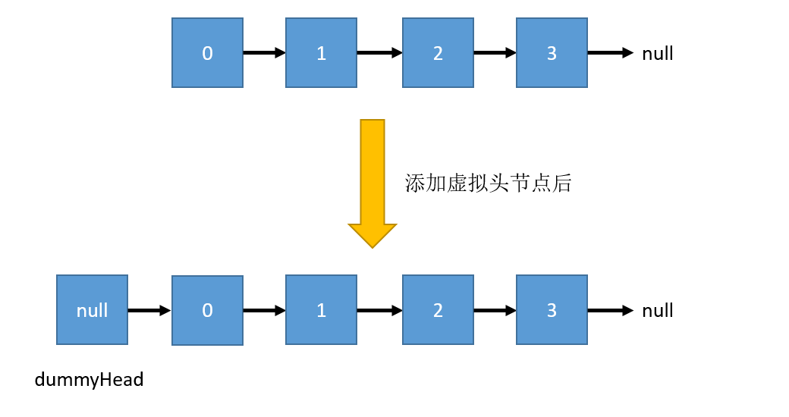

与数组不同，链表的内存空间不需要是连续的，它会通过指针将多个零散的内存块串联起来使用，但丧失了随机访问的能力，通常将内存块称为链表的节点(Node)。

- 数组 VS. 链表

数组的优势在于可快速定位元素，适合读操作多、写操作少的场景；而链表的优势则在于能够灵活地进行插入、删除操作，如果需要在尾部频繁插入、删除元素，用链表更合适。

数组简单易用，在实现上使用的是连续的内存空间，可以借助 CPU 的缓存机制，预读数组中的数据，所以访问效率更高。而链表在内存中并不是连续存储，所以对 CPU 缓存不友好，无法有效预读。

数组的缺点是大小固定，一经声明就要占用整块连续内存空间。如果声明的数组过大，系统可能没有足够的连续内存空间分配给它，导致“内存不足(out of memory)”。如果声明的数组过小，可能会频繁触发扩容操作，且扩容后还需要把原数组拷贝进去，非常费时。而链表本身没有大小的限制，且天然地支持动态扩容。

除此之外，如果代码对内存的使用非常苛刻，那数组就更合适。因为链表中的每个节点都需要消耗额外的存储空间去存储一份指向下一个节点的指针，所以内存消耗会翻倍。而且，对链表进行频繁的插入、删除操作，还会导致频繁的内存申请和释放，容易造成内存碎片，如果是 Java 语言，就有可能会导致频繁的 GC。

# 分类

## 单链表

Node 除了存储数据外，还用一个指针 next 记录了链表下一个节点的地址。

单链表中， head 用于记录链表的基地址；而尾节点的指针指向了一个空地址 `null`，表示这是链表上最后一个节点。

- 插入&删除操作

不考虑节点查找的话，链表的插入和删除不需要为了保持内存连续性而进行搬移节点，只需要考虑相邻节点的指针改变即可，时间复杂度为 $O(1)$。

- 随机访问

链表中的数据并不是连续存储的，无法像数组那样通过寻址公式直接计算出第 k 个元素的内存地址，而是需要从 head 开始遍历，直到找到对应的节点。

所以，链表的随机访问性能不如数组，时间复杂度为 $O(n)$。

## 循环链表

循环链表是一种特殊的单链表，其尾节点指针不再指向`null`，而是指向了 head 。

循环链表的优点是从尾节点到 head 很方便。当要处理的数据具有环形结构特点时，就特别适合使用循环链表，如著名的约瑟夫问题。

## 双向链表

双向链表支持两个方向，每个节点有 next 指针指向下一个节点，previous 指针指向前一个节点。

所以，存储同样多的数据，双向链表比起单向链表会占用更多空间。虽然双向链表更消耗空间，但支持双向遍历，操作时会更灵活。

**支持 $O(1)$ 复杂度下找到前驱节点**，这样的特点使得双向链表在**某些情况下的插入、删除等操作都要比单链表简单高效**。

- 删除操作，有以下两种情况：

1. 删除节点中 “值等于某个给定值” 的节点：

无论是单双链表，为了找到要删除的节点，都要从 head 开始遍历，直到找到该节点然后再删除。

删除操作的时间复杂度是 $O(1)$，但遍历查找的时间是主要的耗时，为 $O(n)$，所以这种情况的删除操作总时间复杂度都是 $O(n)$。

2. 删除给定指针指向的节点

此时已经找到了要删除的节点，但删除该节点还必须知道其前驱节点，为了找到前驱节点还是需要从头节点开始遍历链表，直到找到某个节点的 next 指向要删除的节点，则该节点就是所需的前驱节点。

对于双向链表来说，这种情况就比较有优势了，因为双向链表的节点已经保存了前驱节点的指针，不再需要遍历。所以这种情况，单链表删除操作需要 $O(n)$ 的复杂度，而双向链表仅需 $O(1)$。

同理，如果希望在某个指定节点前面插入一个节点，双向链表也比单向链表具有优势。

除了插入、删除操作有优势之外，对于一个**有序链表，双向链表的按值查询的效率也要比单链表高一些**。因为，我们可以记录上次查找的位置 p，每次查询时，根据要查找的值与 p 的大小关系，决定是往前还是往后查找，所以平均只需要查找一半的数据。

Java 中的 `LinkedHashMap` 就是用了双向循环链表。

Go 的 container 包中的 `list` 就是双向链表：

```go
type Element struct {
	next, prev *Element
	// The list to which this element belongs.
	list *List
	// The value stored with this element.
	Value interface{}
}
```

## 双向循环链表

就是将双向链表和循环链表结合起来。

# dummyhead

链表的操作中，对于**插入第一个节点**、**删除最后一个节点**的操作逻辑和其他节点是不同的。如插入操作(插入 new_node 节点)：

```java
// 向空链表插入节点
if (head == null) {
  head = new_node;
}
// 向非空链表插入节点
new_node.next = pre.next
pre.next = new_node
```

删除操作：

```java
// 当链表只有一个节点时的删除操作
if (head.next == null){
  head = null
}
// 链表中节点不止一个时，删除 pre 的后继节点
pre.next = cur.next
cur.next = null
```

针对链表的插入、删除操作，都有特殊情况需要特殊处理，代码实现较为繁琐，而引入虚拟头节点(dummyhead) 后，索引为 0 的节点就是 `dummyHead.next`，此时所有的节点都有了前一个节点，可以简化插入和删除逻辑(不需要针对特殊情况进行判断了)。

注意：dummyhead 的值为 null，next 指向链表实际头节点。



实际上，这种简化编程难度的技巧，在很多代码实现中都有用到，比如插入排序、归并排序、动态规划等。

# LRU 淘汰算法

缓存是一种提高数据读取性能的技术，在硬件设计、软件开发中都有着非常广泛的应用，比如常见的 CPU 缓存、数据库缓存、浏览器缓存等等。

缓存的大小有限，当缓存被用满时，哪些数据应该被清理出去，哪些数据应该被保留？这就需要缓存淘汰策略来决定。常见的策略有三种：**先进先出策略 FIFO（First In，First Out）**、**最少使用策略 LFU（Least Frequently Used）**、**最近最少使用策略 LRU（Least Recently Used）**。

使用链表可以实现 LRU 缓存淘汰策略，思路：

维护一个单链表，越靠近链表尾部的节点是越早访问的数据节点，当有新的数据被访问时，从链表头开始顺序遍历链表。

1. 如果此数据之前已经被缓存在链表中了，我们遍历得到这个数据对应的节点，并将其从原来的位置删除，然后再插入到链表的头部。
2. 如果此数据没有在缓存链表中，又可以分为两种情况：
   1. 如果此时缓存未满，则将此节点直接插入到链表的头部；
   2. 如果此时缓存已满，则链表尾节点删除，将新的数据节点插入链表的头部。

这种方式实现的 LRU 算法，每次在访问(添加、删除、查找)数据时，无论缓存有没有满，都需要遍历一遍链表，所以缓存访问的时间复杂度为 $O(n)$。

实际上，我们可以继续优化这个实现思路，比如引入**散列表（Hash table）**来记录每个数据的位置，将缓存访问的时间复杂度降到 $O(1)$。见后面。

# 链表常见操作

如不特殊说明，下面的操作都是基于

```go
type Node struct {
	Value interface{}
	next  *Node
}

func (node *Node) String() string {
	return fmt.Sprint(node.Value)
}

type LinkedList struct {
	head *Node
	len  int
}

func (l *LinkedList) String() string {
	cur := l.head
	ret := strings.Builder{}
	for cur != nil {
		ret.WriteString(cur.String())
		if cur.next != nil {
			ret.WriteString(" -> ")
		}
		cur = cur.next
	}
	return ret.String()
}
```

## 反转链表

- 反转单链表

要求：若链表长度为 N，时间复杂度为$O(N)$，额外空间复杂度为$O(1)$。

要点：

- 对节点 A 开始的链表进行反转，需要用一个指针来记录 A 的 next 指向的节点 B，防止链表断开；
- 还需要一个指针来记录节点 B 的前一个节点 A，因为反转后 B 要指向它

```go
// 链表的反转操作，pre 代表了反转后链表的尾节点。O(N) 复杂度
// 如果想直接反转链表，传入 pre 为 nil 即可
func (l *LinkedList) Reverse(pre *Node) {
	if l.len <= 1 {
		return
	}
	for l.head != nil {
		temp := l.head.next
		l.head.next = pre
		pre = l.head
		l.head = temp
	}
	l.head = pre
}
```


如果要从 head 开始反转，可以传入 nil 作为 pre。

---

- 反转双向链表：与反转单链表类似，不过需要对节点的两个指针都反转。

## 链表的中间节点

使用两个指针，一快一慢，快指针每次走两步，慢指针每次走一步，当快指针走完时，慢指针就走到了链表的中间。

```go
// 找到链表的中间节点，共计偶数个节点时返回前一个中间节点。O(N) 时间复杂度
// 1—>2—>3—>4—>5  返回值为 3 的节点
// 1—>2—>3—>4     返回值为 2 的节点
func (l *LinkedList) FindMiddleNode() *Node {
	if l.len < 2 {
		return nil
	}
	slow, fast := l.head, l.head
	// 共计偶数个节点时返回后一个中间节点时，修改条件为
	// fast != nil && fast.next != nil
	for fast.next != nil && fast.next.next != nil {
		slow = slow.next
		fast = fast.next.next
	}
	return slow
}
```

## 删除倒数第 n 个节点

假设链表长度为 N，倒数第 n 个节点的索引其实为 N-n！N 个节点从 head 到 tail 共需要 N-1 步。

双指针法：

1. 快指针从 head 先出发，每次走一步，先走 n 步；
   - PS：此时快指针距离走到尾节点还有 (N-1)-n 步
2. 慢指针从 head 后出发，和快指针一起每次走一步，直到快指针走到最后一个节点；
   - PS：此时慢指针走了 (N-1)-n 步，索引为 (N-1)-n，正好是 N-n 的前一位
3. 此时慢指针所在位置为要删除节点的前一个节点

```go
// 在不遍历链表就无法得到链表长度时，仅通过一次遍历来删除链表的倒数第 n 个节点。O(N)复杂度
// 如果 n 大于链表的长度，返回 nil
func (l *LinkedList) DeleteBottomN(n int) *Node {
	if n <= 0 || l.head == nil {
		return nil
	}
	fast, slow := l.head, l.head
	// 1. 快指针先走 n 步
	for i := 0; i < n; i++ {
		// 删除头节点 head
		if fast.next == nil && i==n-1 {
			temp := l.head
			l.head = temp.next
			temp.next = nil
			return temp
		// 要删除的节点不存在，如链表共 2 个元素，但 n==3
		} else if fast.next==nil && i<n-1{
			return nil
		}
		fast = fast.next
	}
	// 2. 快慢指针同时走，直到快指针到达尾节点
	for fast.next != nil {
		slow = slow.next
		fast = fast.next
	}
	// 这里借助 fast 暂时存储要删除的节点，防止删除后链表断裂
	fast = slow.next
	slow.next = fast.next
	fast.next = nil
	return fast
}
```

# 跳表

二分查找依赖于数组的随机访问特性，那么，如果数据存储在链表中如何使用二分查找呢？

对链表进行改造后的数据结构—跳表(Skip List)就可以支持类似“二分”的查找算法。

对于一个单链表，即使链表中的数据是有序的，查找操作也必须从头节点开始遍历，所以时间复杂度为 $O(n)$，可以通过建立索引来提高查找效率，如图，每两个节点提取一个索引，可有多个索引层，同时索引中包含了一个 down 指针指向下一级中的节点：


每加一层索引，查找一个节点需要遍历的节点个数减少了，也就是说查找效率提高了！这种链表+多级索引的数据结构就是跳表。

假设链表中有 n 个节点，每两个节点抽出一个节点作为索引，共计 h 级索引。

第 k 级索引有 $n/(2^k)$ 个索引节点，由于最高级(h 级)只有 2 个索引节点(因为是每两个节点抽取一个作为索引)，由 $n/(2^h)=2$ 可得 $h=log_2n-1$，算上原始链表这一层，整个跳表的高度就是 $log_2n$

- 时间复杂度分析：

在跳表中进行查询操作时，如果每层需要遍历 m 个节点，那么查询操作的时间复杂度就是 $O(m*logn)$，而现在假设的这种结构，每一级索引最多遍历 3 个节点，所以查询操作的时间复杂度就是 $O(logn)$。

由于查询操作的时间复杂度为 $O(logn)$，而链表单纯的插入操作时间复杂度为 $O(1)$，所以跳表的删除操作总时间复杂度为 $O(logn)$。

那么删除操作呢？和插入操作类似，但是如果这个节点在索引中也有出现，我们除了要删除原始链表中的节点，还要删除索引中的。

- 空间复杂度分析：

假设链表中有 n 个节点，每两个节点抽出一个节点作为索引，那么索引节点共有 $n/2+n/4+n/8+···+8+4+2=n-2$个(共有 $h=log_2n-1$ 个数字求和)，所以跳表的空间复杂度为 $O(n)$。

如何降低索引占用的内存呢？由原来两个节点抽取一个作为索引节点变为多个节点抽取一个即可。跳表的实现非常灵活，可以通过改变索引构建策略，有效平衡执行效率和内存消耗。

- 索引动态更新

当不停地往跳表中插入数据时，如果我们不更新索引，就有可能出现某 2 个索引节点之间数据非常多的情况。极端情况下，跳表还会退化成单链表。所以需要维护索引与原始链表大小之间的平衡，也就是说，如果链表中节点多了，索引节点就相应地增加一些，避免复杂度退化，以及查找、插入、删除操作性能下降。

向链表中插入数据时，可以选择同时将这个数据插入到部分索引层，那怎么选择插入哪些索引层呢？可以通过一个随机函数来决定，随机函数生成 k，就将数据添加到第一到第 k 层这 k 层索引中。

随机函数的选择很有讲究，从概率上来讲，能够保证跳表的索引大小和数据大小平衡性，不至于性能过度退化。

- 使用

Redis 的有序集合 zset 是通过跳表和散列表实现的，主要支持的操作有：插入、删除、查找、迭代输出有序序列、按区间查找数据，前几个操作可通过红黑树实现，且时间复杂度与跳表相同，而按照区间查找数据这一操作，红黑树的效率没有跳表高。

且跳表代码相比于红黑树易于实现、更加灵活，可通过改变索引构建策略有效平衡执行效率和内存消耗。

[Redis 源码学习之跳表](https://cloud.tencent.com/developer/article/1353762)
