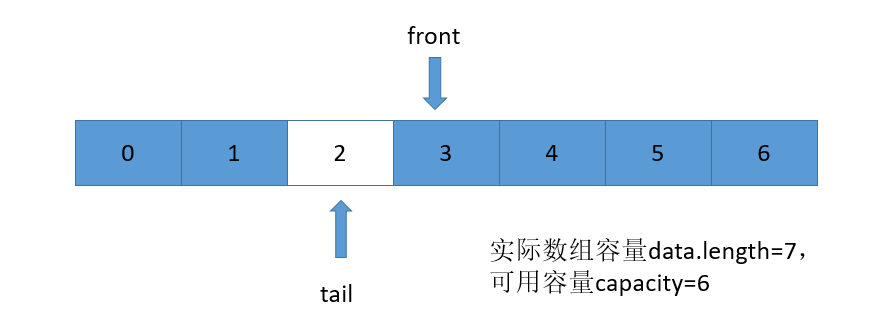

队列也是一种“操作受限”的线性表，其特点：FIFO（First In First Out）即在队尾(tail)插入数据项，在队首(front)移除数据项。

队列 ADT 的操作主要有：

- `Dequeue()` 出队操作，从队首取一个数据
- `Enqueue(E)` 入队操作，放一个数据到队尾

数组实现的队列称为顺序队列，链表实现的队列称为链式队列。

队列的应用：

- 循环队列、阻塞队列、并发队列在很多偏底层系统、框架、中间件的开发中，起着关键性的作用；
- 高性能队列 Disruptor、Linux 环形缓存，都用到了循环并发队列；Java concurrent 并发包利用 ArrayBlockingQueue 来实现公平锁等

---

- 顺序队列：使用两个指针 front、tail，分别指向队首和队尾。

在顺序队列中删除一个数据项后，可以将其他数据项都向前移动，但这样做的效率很差，通常是使用指针的移动来完成。也就是说，通常实现队列时，删除的数据项还会保存在内存中，只是不能被访问了，因为头指针已经移动到下一个位置了。

顺序队列中，随着不断地入队、出队操作，front、tail 都会持续向后移动，当 tail 移动到最后时，即使数组中还有空闲空间，也无法继续向队列中添加元素了。

为了解决这个问题，当队列地 tail 移动到数组最后时，如果有新的数据入队，且此时有空闲空间，可以将 [front, tail] 之间地数据整体搬移到数组 [0, tail-front] 地位置，然后再入队新的数据。

如果要实现一个有界队列，适合用数组来实现。相较于无界队列，有界队列的应用场景更加广泛，机器内存是有限的。而无界队列占用的内存数量是不可控的。对于实际的软件开发来说，这种不可控的因素，就会有潜在的风险。在某些极端情况下，无界队列就有可能因为内存持续增长，而导致 OOM(Out of Memory)错误。

- 链式队列：和顺序队列类似，使用 front 指向头节点(队首)，tail 指向尾节点(队尾)。

如果要实现一个无界队列，即队列大小不确定，适合选用链表来实现队列。因为链表支持快速地动态扩容。

注意：由于仅仅是对链表的一端进行操作，而不会涉及到对于中间节点的操作，所以不需要使用虚拟头节点。但是要小心链表为空的情况。

# 循环队列

上面数组队列中会出现数据搬移地情况，如何避免呢？使用循环队列：

- 当`front == tail` 即指向同一个位置，则表示队列为空;
- 入队操作：`front`不动，每入队一个元素，则`tail`后移一位；
- 出队操作：`tail`不动，将`front`指向的元素出队，然后`front`后移一位。
- 循环：当入队后，数组索引到达最大时，如果之前进行过出队操作，也就意味着在数组的前面还有可用的空间，此时再次进行入队操作，`tail`指向索引为 0 的位置。
- `tail` 的计算方式：`tail = (tail+1) % 实际数组容量`
- 下图中，当循环时，如果继续向索引为 2 的位置添加元素，则 `tail == front`，此时这一条件也表示了队列满，为了防止这一情况的发生，需要在`front`和`tail`之间有一个空间是空的，所以在整个空间中，浪费了一部分。



- `(tail+1)%实际数组容量 == front`表示队列满

大部分用到顺序队列的场景中，我们都选择用顺序队列中的循环队列。

# 实际

- **阻塞队列**就是在队列基础上增加了阻塞操作。

在队列为空的时候，从队头取数据会被阻塞。因为此时还没有数据可取，直到队列中有了数据才能返回；如果队列已经满了，那么插入数据的操作就会被阻塞，直到队列中有空闲位置后再插入数据，然后再返回。

使用阻塞队列可以实现一个“生产者-消费者模型”，有效地协调生产和消费的速度。当“生产者”生产数据的速度过快，“消费者”来不及消费时，存储数据的队列很快就会满了。这个时候，生产者就阻塞等待，直到“消费者”消费了数据，“生产者”才会被唤醒继续“生产；

基于阻塞队列，还可以通过协调“生产者”和“消费者”的个数，来提高数据的处理效率。比如可以多配置几个“消费者”，来应对一个“生产者”。

- **并发队列**就是线程安全的队列

最简单直接的实现方式是直接在 `enqueue()`、`dequeue()` 方法上加锁，但是锁粒度大并发度会比较低，同一时刻仅允许一个存或者取操作。实际上，基于数组的循环队列，利用 CAS 原子操作，可以实现非常高效的并发队列。这也是循环队列比链式队列应用更加广泛的原因。

# 问题

线程池没有空闲线程时，新的任务请求线程资源时，线程池该如何处理？各种处理策略又是如何实现的呢？

两种处理策略：

1. 非阻塞的处理方式，直接拒绝任务请求；
2. 阻塞的处理方式，将请求排队，等到有空闲线程时，取出排队的请求继续处理。

那么，如何存储排队的请求呢？

1. 基于链表的实现方式，可以实现一个支持无限排队的无界队列(unbounded queue)，但是可能会导致过多的请求排队等待，请求处理的响应时间过长。所以，针对响应时间比较敏感的系统，基于链表实现的无限排队的线程池是不合适的。
2. 基于数组实现的有界队列(bounded queue)，队列的大小有限，所以线程池中排队的请求超过队列大小时，接下来的请求就会被拒绝，这种方式对响应时间敏感的系统来说，就相对更加合理。不过，设置一个合理的队列大小，也是非常有讲究的。队列太大导致等待的请求太多，队列太小会导致无法充分利用系统资源、发挥最大性能。

# 自定义队列

```go
type Queue struct {
	data        []int
	front, tail int
}

func (q *Queue) String() string {
	if q.front == q.tail {
		return "nothing"
	}
	return fmt.Sprint("front: ", q.data, " tail")
}

func NewQueue() Queue {
	return Queue{
		data:  make([]int, 0),
		front: 0,
		tail:  0,
	}
}

func (q *Queue) Enqueue(x int) {
	q.data = append(q.data, x)
	q.tail++
}
// 这里实际是有问题的，如果队列中已没有元素，也会返回 0
func (q *Queue) Dequeue() int {
	ret := 0
	if q.front < q.tail {
		ret = q.data[q.front]
		q.front++
	}
	return ret
}

func (q *Queue) Size() int {
	return q.tail - q.front
}

func (q *Queue) Empty() bool {
	return q.front == q.tail
}
```

# 队列实现栈

底层使用两个队列，a 用于存放元素，b 用于辅助

- 每次 `Push()` 操作将元素入队 a 中
- 每次 `Pop()` 操作：
  - 如果 a 中只有一个元素，直接出队即可，否则：
  - 将 a 中除队尾元素外全部出队并逐个入队 b 中
  - 将 a 中剩下的元素出队，之后作为返回值返回
  - 交换 a 和 b 的引用

```go
type MyStack struct {
	a, b queue.Queue   // 这里使用的是上面自定义的队列
}

func (this *MyStack) String() string {
	if this.a.Size() == 0{
		return "nothing"
	}
	ret := this.a.String()
	ret = strings.Replace(ret, "front", "Stack", -1)
	ret = strings.Replace(ret, "tail", "top", -1)
	return ret
}

func Constructor() MyStack {
	return MyStack{
		a: queue.NewQueue(),
		b: queue.NewQueue(),
	}
}

func (this *MyStack) Push(x int) {
	this.a.Enqueue(x)
}

func (this *MyStack) Pop() int {
	if this.a.Size() == 1{
		return this.a.Dequeue()
	}
	for i := 0; i < this.a.Size(); i++ {
		this.b.Enqueue(this.a.Dequeue())
	}
	ret := this.a.Dequeue()
	this.a, this.b = this.b, this.a
	return ret
}

func (this *MyStack) Top() int {
	top := this.Pop()
	this.Push(top)
	return top
}

func (this *MyStack) Empty() bool {
	return this.a.Empty()
}
```

入栈操作的时间复杂度为 $O(1)$；出栈操作的时间复杂度为 $O(n)$。

---

还有一种方法，仅使用一个队列即可实现栈：

- 每次 Push 操作：先进行入队，然后对队列的元素进行反转，时间复杂度为 $O(n)$：

```go
a.Enqueue(x)  // 假设 a 是底层的队列，x 是要入栈的元素
size = a.Size()
for ;size > 1; size-- {
  a.Enqueue(a.Dequeue)  // 反转：从队首出队，再入队到队尾
}
```

- 每次 Pop 操作：直接出队即可，时间复杂度为 $O(1)$
