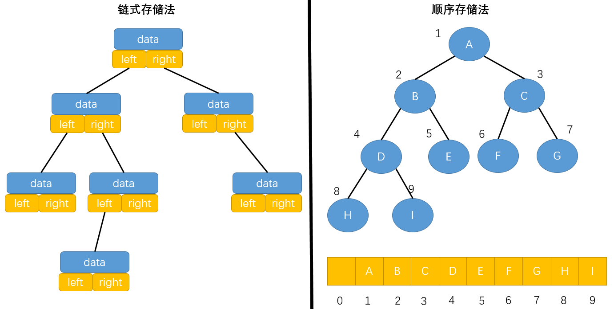

# Tree

关于树，有几个类似的概念：

- 高度(Height)：当前节点到叶子节点的最大路径即为该节点的高度；
  - 高度是从下往上度量的，如 10 层楼的高度
  - 树的高度 = 根节点的高度 = 最大层数 - 1
- 深度(Depth)：根节点到该节点的路径即为该节点的深度；
  - 深度是从下往上度量的，如水中鱼的深度是从水平面开始度量的
- 层(Level)：节点的层数 = 节点深度 + 1
  - 类似深度
  - 从 1 开始，根节点为第 1 层

# Binary Tree

两个较为特殊的二叉树：

- 满二叉树：叶子节点全都在最底层，除了叶子节点之外，每个节点都有左右两个子节点
- 完全二叉树：
  - 除了树的最后一层节点不需要是满的，其他每层从左到右都完全是满的
  - 且最后一层的叶子节点都连续集中在最左边
  - 完全二叉树永远不会退化成链表！

要存储一棵二叉树，有两种方法：

- **基于指针或引用的二叉链式存储法**：
  - 每个节点有三个字段，一个存储数据、其余两个是分别指向左右子节点的指针
  - 只要有根节点就可以通过左右子节点的指针将整棵树串起来
- **基于数组的顺序存储法**：
  - 如果要将索引为 0 的位置空出来不放置元素：
    1. 左子节点的索引 = 2 \* 父节点索引；
    2. 右子节点的索引 = 左子节点索引 + 1；
    3. 父节点的索引 = 子节点索引(无论左右) / 2。这里是整数除法，如：3/2=1。
  - 如果索引为 0 的位置也放置元素：
    1. 左子节点的索引 = 2 \* 父节点的索引 + 1；
    2. 右子节点的索引 = 2 \* 父节点的索引 + 2；
    3. 父节点的索引 = (子节点索引 - 1) / 2。这里无论左右子节点都是该等式。
  - 只要知道根节点存储的位置(根节点一般存储在下标为 1 的位置)，就可以通过下标计算，把整棵树串起来



上图中右侧的是一棵完全二叉树，所以仅“浪费”了下标为 0 的这一个存储位置，而如果是非完全二叉树，会浪费较多的数组存储空间！

所以，如果某棵二叉树是一棵**完全二叉树，那用数组存储无疑是最节省内存的一种方式**！因为链式存储需要额外存储左右子节点的指针，而这也正是完全二叉树单独拎出来的原因。

## 遍历

- 前序遍历：访问当前节点——>遍历左子树——>遍历右子树
- 中序遍历：遍历左子树——>访问当前节点——>遍历右子树
- 后序遍历：遍历左子树——>遍历右子树——>访问当前节点
  - 应用：释放内存(必须先释放子树的内存再释放节点内存)
- 层序遍历：
  1. 将每层节点（从左到右）入队；
  2. 从队首开始访问节点，每访问一个节点就将其左右子节点入队，然后将头节点出队；
  3. 队列中为空，则遍历完成。

以上四种遍历方式，其中前三种属于深度优先的遍历，而最后一种则是广度优先的遍历。

广度优先遍历的意义在于可以更快地找到查询地元素。主要用于搜索策略上，而不是这里的遍历上。常用于算法设计中的最短路径问题。

前三种遍历使用递归很容易实现，这里仅列出前序遍历的非递归实现和层序遍历的实现：

```go
type Node struct {
	data        interface{}
	left, right *Node
}

// 前序遍历的非递归实现
// 相当于用自己的栈模拟递归写法中系统栈的作用
func PreOrderNotRecursion(root *Node) {
	stack := stack.NewStack()
	stack.Push(root)
	for stack.Size() != 0 {
    // 这里需要转换类型
		cur := stack.Pop().(*Node)
		fmt.Print(cur, " ")
		// 由于栈是 LIFO，所以先将右子树压栈，再将左子树压栈
		if cur.right != nil {
			stack.Push(cur.right)
		}
		if cur.left != nil {
			stack.Push(cur.left)
		}
	}
}

// 层序遍历
func LevelOrder(root *Node) {
  // 广度优先算法使用队列来实现
	queue := make([]*Node, 0)
	queue = append(queue, root)
	for len(queue) != 0 {
		cur := queue[0]
		queue = queue[1:]
		fmt.Print(cur, " ")
		if cur.left != nil {
			queue = append(queue, cur.left)
		}
		if cur.right != nil {
			queue = append(queue, cur.right)
		}
	}
}
```

# Binary Search Tree

**二叉树的主要应用还是在进行查找操作和维持相对顺序这两个方面**。二叉查找树可以同时满足这两方面。

二叉查找树最大的特点就是，支持动态数据集合的快速插入、删除、查找操作。

二叉查找树还支持快速查找最大、最小、前驱、后继节点；

- 二叉查找树：
  - 对于树中的每个节点 X，其左子树中所有项的值小于 X 中的项，其右子树中所有项的值大于 X 中的项；
  - 任意节点的左、右子树也分别为二叉查找树；
  - 没有键值相等的节点；
  - 所有项都能够排序。

中序遍历二叉查找树可以输出有序的数据序列！时间复杂度为 $O(n)$，很高效。因此，二叉查找树也叫作二叉排序树。

```go
type BST struct {
	root *Node
}

func NewBST(data interface{}) *BST {
	return &BST{root: NewTreeNode(data)}
}

// 比较函数，这里假设二叉查找树中的值都可以转为 int 类型
// val 表示要比较的值，cur 表示当点节点的值
// 如果要比较的值大，返回 1，小返回 -1，相等返回 0
func (bst BST) compare(val, cur interface{}) int {
	v := val.(int)
	curV := cur.(int)
	if v > curV {
		return 1
	} else if v < curV {
		return -1
	}
	return 0
}
```

## 插入操作

```go
func (bst *BST) Insert(v interface{}) {
	bst.root = bst.insert(bst.root, v)
}

func (bst *BST) insert(node *Node, v interface{}) *Node {
	if node == nil {
		return NewTreeNode(v)
	}
	compareResult := bst.compare(v, node.data)
	if compareResult > 0 {
		node.right = bst.insert(node.right, v)
	} else if compareResult < 0 {
		node.left = bst.insert(node.left, v)
	}
	return node
}
```

## 查找操作

```go
// 查找值为 v 的节点
func (bst *BST) Find(v interface{}) *Node {
	cur := bst.root
	for cur != nil {
		compareResult := bst.compare(v, cur.data)
		if compareResult < 0 {
			cur = cur.left
		} else if compareResult > 0 {
			cur = cur.right
		} else {
			return cur
		}
	}
	return nil
}
// 获取树中最小值对应的节点
func (bst *BST) Minimum() *Node {
	return bst.minimum(bst.root)
}
// 找到以 node 为根节点的树的最小值
func (bst *BST) minimum(node *Node) *Node {
	for node.left != nil {
		node = node.left
	}
	return node
}
```

## 删除操作

删除操作较为复杂，分为三种情况：

- 要删除的节点没有子节点
  - 直接将父节点中，指向要删除节点的指针置为 nil 即可
- 要删除的节点仅有一个子节点(左子树/右子树)
  - 更新父节点中指向要删除节点的指针，让它指向要删除节点的子节点
- 要删除的节点有两个子节点
  - 将待删除节点**右子树的最小值(或左子树的最大值)**对应节点**取代**待删除节点的位置
  - 由于右子树的最小值(或左子树的最大值)对应的节点没有左(或右)子节点，可以用上面的两条规则删除

还有一种取巧的方法，那就是单纯将待删除的节点标记为“已删除”，而不真正删除。这样比较浪费内存，但会简单很多。

### 非递归删除

```go
func (bst *BST) Delete(v interface{}) {
	cur := bst.root
	var curP *Node // cur 的父节点
	// 找到待删除的节点 cur
	compareResult := bst.compare(v, cur.data)
	for cur != nil && compareResult != 0 {
		curP = cur
		if compareResult > 0 {
			cur = cur.right
		} else {
			cur = cur.left
		}
		compareResult = bst.compare(v, cur.data)
	}
	if cur == nil {
		return
	}
	// 此时 cur 即为待删除的节点
	// 待删除的节点有两个子节点
	if cur.left != nil && cur.right != nil {
		// 找到右子树的最小节点
		min := cur.right
		minP := cur  // min 的父节点
		for min.left != nil {
			minP = min
			min = min.left
		}
		// 注意，这里并没有交换节点，而仅替换了值
		cur.data = min.data
		// 此时待删除的节点就是之前右子树的最小节点
		cur = min
		curP = minP
	}

	// 待删除的节点是叶子节点或仅有一个子节点
	var child *Node
	if cur.left != nil {
		child = cur.left
	} else if cur.right != nil {
		child = cur.right
	} else {
		child = nil
	}

	if curP == nil {
		// 这种情况是根节点只有左子树，且删除的是根节点
		bst.root = child
	} else if curP.left == cur {
		curP.left = child
	} else {
		curP.right = child
	}
}
```

### 递归删除

由于可能会删除掉右子树的最小值，这里将删除最小值的逻辑先抽出来：

```go
// 移除并返回树中的最小值对应的节点
func (bst *BST) RemoveMin() *Node {
	min := bst.Minimum()
	bst.root = bst.removeMin(bst.root)
	return min
}

func (bst *BST) removeMin(node *Node) *Node {
	if node.left == nil {
		right := node.right
		node.right = nil
		return right
	}
	node.left = bst.removeMin(node.left)
	return node
}
```

完整的删除逻辑：

```go
func (bst *BST) Remove(v interface{}) {
	bst.root = bst.remove(bst.root, v)
}
// 删除以 node 为根节点的树中值为 v 的节点，并返回删除后该树的根节点
func (bst *BST) remove(node *Node, v interface{}) *Node {
	if node == nil {
		return nil
	}
	compareResult := bst.compare(v, node.data)
	if compareResult < 0 {
		node.left = bst.remove(node.left, v)
		return node
	} else if compareResult > 0 {
		node.right = bst.remove(node.right, v)
		return node
	} else {
		// 如果待删除节点的左子树为 nil，直接删除即可
		if node.left == nil {
			right := node.right
			node.right = nil
			return right
		}
		// 如果待删除节点的右子树为 nil，直接删除即可
		if node.right == nil {
			left := node.left
			node.left = nil
			return left
		}
		// 待删除节点的左右子节点均不为 nil
		// 找到右子树的最小值所在节点
		successor := bst.minimum(node.right)
		successor.right = bst.removeMin(node.right)
		successor.left = node.left
		// 将待删除的节点脱离
		node.left = nil
		node.right = nil
		return successor
	}
}
```

## 支持重复数据

实际的软件开发中，在二叉查找树中存储的，是一个包含很多字段的对象。我们利用对象的某个字段作为键值（key）来构建二叉查找树。我们把对象中的其他字段叫作卫星数据。

前面二叉查找树的操作，针对的都是不存在键值相同的情况。那如果存储的两个对象键值相同，这种情况该怎么处理呢？

- 方法一：

二叉查找树中每一个节点不仅会存储一个数据，可以通过链表和支持动态扩容的数组等数据结构，把值相同的数据都存储在同一个节点上。

- 方法二：

每个节点仍然只存储一个数据。在查找插入位置的过程中，如果碰到一个节点的值，与要插入数据的值相同，我们就将这个要插入的数据放到这个节点的右子树，也就是说，把这个新插入的数据当作大于这个节点的值来处理。

当要查找数据的时候，遇到值相同的节点，并不停止查找操作，而是继续在其右子树中查找，直到遇到叶子节点，才停止。这样就可以把键值等于要查找值的所有节点都找出来。

对于删除操作，也需要先查找到每个要删除的节点，然后再按前面讲的删除操作的方法，依次删除。

## 时间复杂度分析

- 最坏情况：根节点的左右子树极度不平衡时，树会退化为链表，此时查找的时间复杂度为 $O(n)$
- 理想情况：二叉查找树是一棵完全二叉树(或满二叉树)，此时时间复杂度与树的高度成正比，即 $O(height) = O(logn)$

第一层有 1 个节点，第二层 2 个，第三层 4 个 ... 第 k 层有 $2^{k-1}$ 个，对于完全二叉树而言，最后一层(第 L 层)节点的个数在 $[1, 2^{L-1}]$，一棵树的节点总数为 n，可得 L 的范围为 $[log_2{(n+1)}, log_2n + 1]$，所以完全二叉树的层数小于 $log_2n + 1$，而树的高度等于最大层数 - 1，所以完全二叉树的高度小于等于 $log_2n$。

## 对比散列表

散列表也支持插入、查找、删除这些操作，且比二叉查找树更高效，时间复杂度为 $O(1)$。既然有了这么高效的散列表，使用二叉树的地方是不是都可以替换成散列表呢？有没有哪些地方是散列表做不了，必须要用二叉树来做的呢？

1. 散列表中的数据是无序存储的，如果要输出有序的数据，需要先进行排序。而对于二叉查找树来说，我们只需要中序遍历，就可以在 $O(n)$ 的时间复杂度内，输出有序的数据序列；
2. 散列表扩容耗时很多，而且当遇到散列冲突时，性能不稳定，尽管二叉查找树的性能不稳定，但是在工程中，我们最常用的平衡二叉查找树的性能非常稳定，时间复杂度稳定在 $O(logn)$；
3. 笼统地来说，尽管散列表的查找等操作的时间复杂度是常量级的，但因为哈希冲突的存在，这个常量不一定比 $logn$ 小，所以实际的查找速度可能不一定比 $O(logn)$ 快。加上哈希函数的耗时，也不一定就比平衡二叉查找树的效率高；
4. 散列表的构造比二叉查找树要复杂，需要考虑的东西很多。比如散列函数的设计、冲突解决办法、扩容、缩容等。平衡二叉查找树只需要考虑平衡性这一个问题，而且这个问题的解决方案比较成熟、固定；
5. 为了避免过多的散列冲突，散列表装载因子不能太大，特别是基于开放寻址法解决冲突的散列表，不然会浪费一定的存储空间。

综合这几点，平衡二叉查找树在某些方面还是优于散列表的，所以，这两者的存在并不冲突。
