二叉查找树在最坏情况下会退化为链表，时间复杂度会退化到 $O(n)$。为了解决这个问题就涉及到二叉树的自平衡了。

平衡二叉树：二叉树中任意一个节点的左右子树的高度差不能大于 1。所以完全二叉树、满二叉树都属于平衡二叉树。

平衡二叉树的高度和节点数量之间的关系也是 $O(logn)$ 的。

AVL 树是最早的平衡二叉查找树(不仅满足平衡二叉树的定义、还满足二叉查找树的特点)。

# 2-3 树

- 2-3 树的每个节点有两个或三个子节点。满足二叉查找树的基本性质，但并不是二叉查找树；
- 2-3 树有两种节点，一种节点可以存放一个元素，另一种节点可以存放两个元素

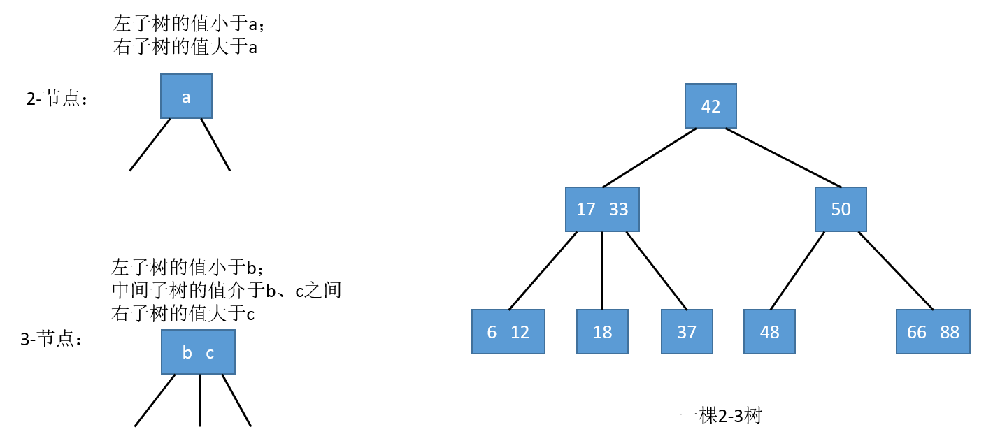

## 绝对平衡性

树的绝对平衡性：从任意一个节点出发到叶子节点所经过的节点数是一样的。

2-3 树是一棵**绝对平衡**（根节点到任意一个叶子节点所经过的节点个数都是相等的）的树。

2-3 树在**添加节点时，永远不会添加到一个空的位置**！！！而是**将新节点融合到之前添加过程中所找到的最后一个叶子节点上**：

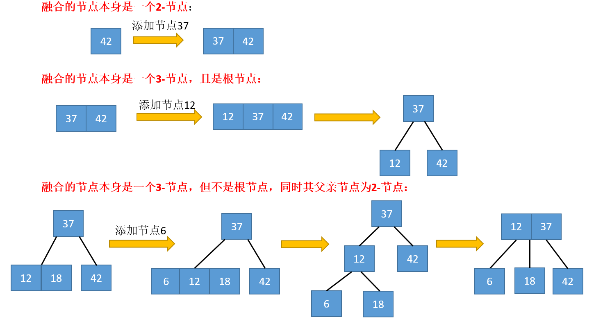

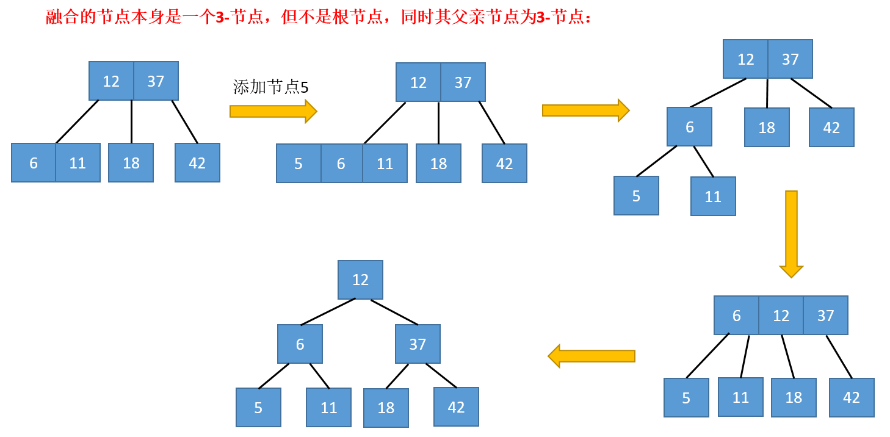

# R-B Tree

红黑树(Red-Black Tree)是一种不严格的平衡二叉查找树，其节点，一类被标记为黑色，一类被标记为红色。还满足以下特点：

- 根节点是黑色的；
- 每个叶子节点都是黑色的空节点(nil)，即叶子节点不存储数据；
  - 这里是为了简化红黑树的代码实现而设置的
- 任何相邻的节点不能同时为红色；
- 从任意一个节点到叶子节点，经过的黑色节点个数相等。
  - 因为 2-3 树是绝对平衡的，所以所有的叶子节点都在同一层，即深度相同，而 2、3 节点对应的红黑树节点一定有一个黑色节点

## 红黑树与 2-3 树

红黑树与 2-3 树节点的等价关系，注意：都满足二分查找树的性质！

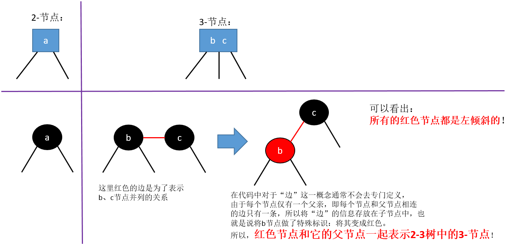

有了以上的等价关系，下面是一个例子：

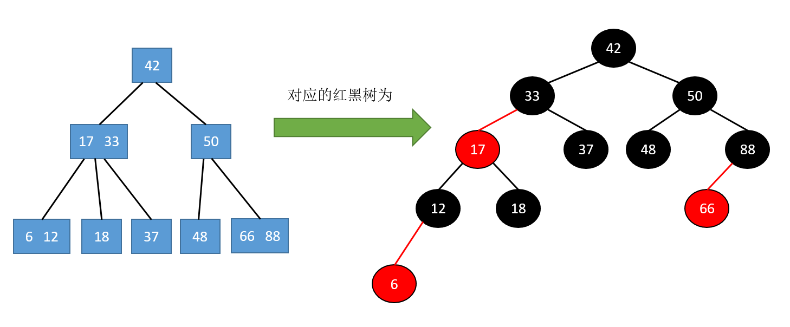

上图可以将红色节点和与之相连的黑色节点放在同一层来理解。

## 近似平衡

平衡二叉树为了解决二叉查找树因动态更新导致的性能退化问题。所以，“平衡”的意思可以等价为性能不退化。“近似平衡”就等价为性能不会退化的太严重。

一棵极其平衡的二叉树(满二叉树或完全二叉树)的高度大约是 $log_2n$，所以如果要证明红黑树是近似平衡的，我只需要分析，红黑树的高度是否比较稳定地趋近 $log_2n$ 就好了。

红黑树是一个保持“黑平衡”的二叉树。严格意义上，不是平衡二叉树。最大高度为 $2logn$(每个节点都是 3-节点)，n 为节点数。增删改查的复杂度均为 $O(logn)$。

所以，红黑树的高度比高度平衡的 AVL 树的高度($logn$)仅仅大了一倍，在性能上，下降得并不多。这样推导出来的结果不够精确，实际上红黑树的性能更好。

AVL 树是一种高度平衡的二叉树，所以查找的效率非常高，但是，有利就有弊，AVL 树为了维持这种高度的平衡，就要付出更多的代价。每次插入、删除都要做调整，比较复杂、耗时。所以，对于有频繁的插入、删除操作的数据集合，使用 AVL 树的代价就有点高了。

红黑树只是做到了近似平衡，并不是严格的平衡，所以在维护平衡的成本上，要比 AVL 树要低。

## 插入操作

红黑树最复杂的添加元素完整过程如下图，而其余的添加均为该复杂过程的子过程。

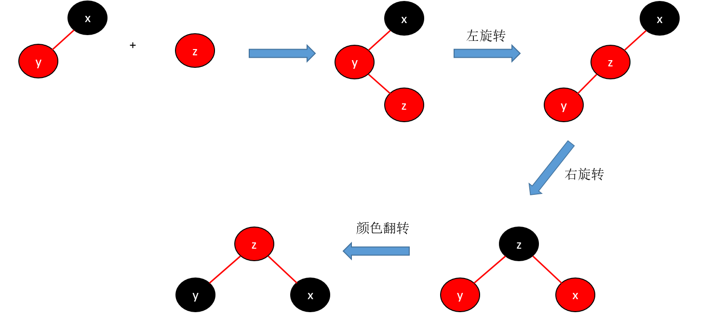

维护的时机：添加节点后回溯向上维护。

---

- 左旋转

红黑树中**永远添加红色节点**，空树添加红色节点后，红色节点变为黑色。注意：红黑树的根节点永远为黑色！

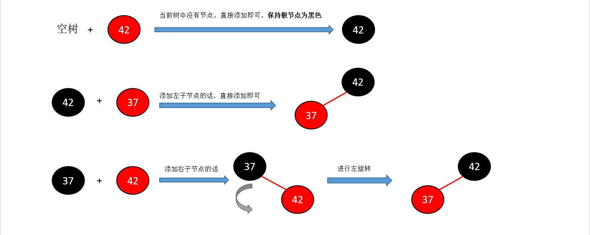

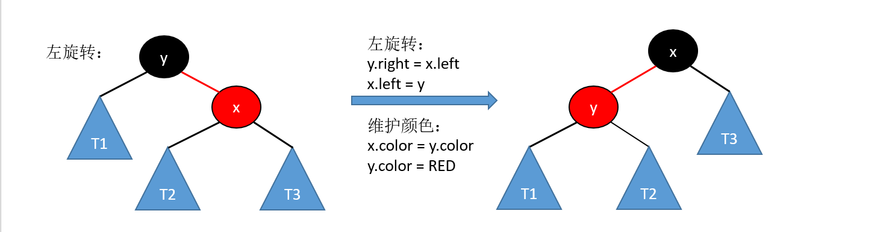

---

- 颜色翻转&右旋转

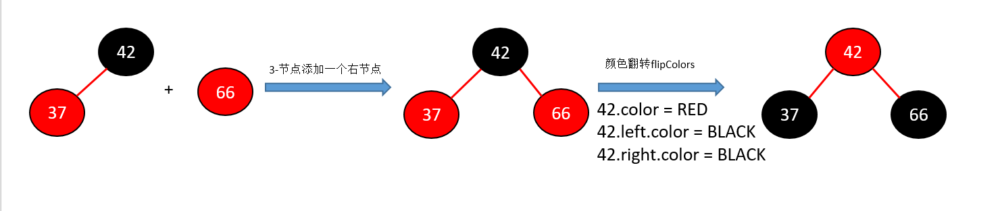

上图所示，**最后 42 所在节点为红色是为了再向上，与父节点融合**。下面的 37 节点也是同样的。

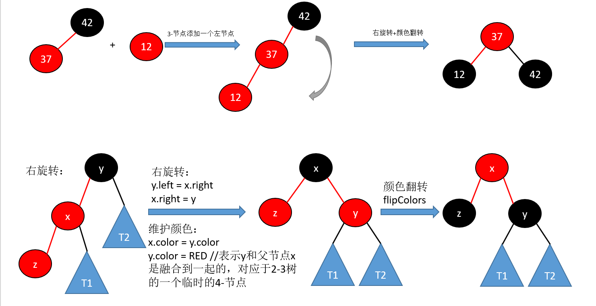

还有一种添加方式：

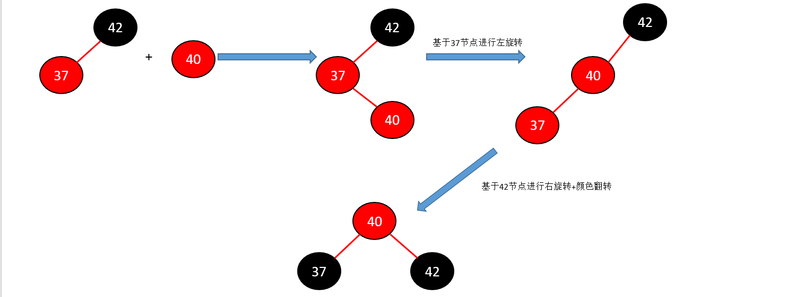
