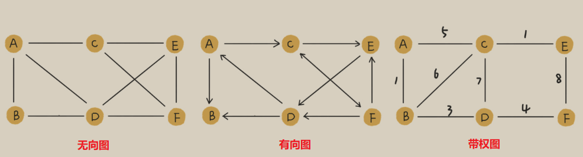

# Graph

社交软件中的好友关系使用图(Graph)来存储。和树相比，图是一种更加复杂的非线性表结构。树中的元素是节点，而图中的元素称为**顶点(vertex)**，图中的一个顶点可以和任意其他顶点建立关系，而这种建立的关系被称为**边(edge)**。

以微信为例，可以将每个用户看作一个顶点，如果两个用户间互加好友，就在两者间建立一条边，而每个用户有多少个好友，对应到图中，就叫做顶点的**度(degree)**，即与顶点相连接的边的条数。

与微信不同，微博的社交关系更复杂，微博允许单向关注，用户 A 关注了 B，但 B 可以不关注 A。那么，该如何表示这种单向的社交关系呢？

对之前的图进行改造，在边(edge)上引入“方向”的概念，如果 A 关注了 B，就画一条 A 指向 B 的带箭头的边。这种**边有方向的图叫做有向图，而边没有方向的则为无向图**。

**无向图中有“度”这个概念，表示一个顶点有多少条边。在有向图中，我们把度分为入度(In-degree)和出度(Out-degree)**。

**顶点的入度，表示有多少条边指向这个顶点；顶点的出度，表示有多少条边是以这个顶点为起点指向其他顶点**。对应到微博的例子，入度就表示有多少粉丝，出度就表示关注了多少人。

QQ 有一个亲密度的功能，如果两个用户经常往来，那亲密度就比较高；如果不经常往来，亲密度就比较低。如何在图中记录这种好友关系的亲密度呢？这就要用到**带权图(weighted graph)**，在带权图中，每条边都有一个权重（weight），可以通过这个权重来表示 QQ 好友间的亲密度。

## 图的存储

### Adjacency Matrix

使用邻接矩阵(Adjacency Matrix)存储：邻接矩阵的底层依赖于一个二维数组。

- 无向图：如果顶点 i 与顶点 j 之间有边，我们就将 A[i][j] 和 A[j][i] 标记为 1
- 有向图：如果顶点 i 到顶点 j 之间，有一条箭头从顶点 i 指向顶点 j 的边，那我们就将 A[i][j] 标记为 1
- 带权图：数组中存储相应的权重

使用邻接矩阵存储，存储方式简单、直接，因为基于数组，在获取两个节点的关系时会很高效；其次，使用邻接矩阵方便计算，可以将很多图的运算转为矩阵间的运算。

使用邻接矩阵存储虽然简单直观，但比较浪费空间。对于无向图而言，底层数组中的数据沿对角线是对称的，只需要存储一半数据即可，所以会浪费掉一半的空间。且如果存储的是稀疏图(Sparse Matrix，顶点很多，但每个顶点的边并不多)，那么就更加浪费空间了。

### Adjacency List

使用邻接表(Adjacency List)存储，下图是一个有向图的邻接表存储方式：

类似于散列表，每个顶点对应一条链表，链表中存储的是与这个顶点相连接的其他顶点。有向图中存储的是当前顶点指向的顶点，而无向图中存储的是与当前节点相连的顶点。

邻接矩阵存储起来比较浪费空间，但是使用起来比较节省时间。相反，邻接表存储起来比较节省空间，但是使用起来就比较耗时间(链表对 CPU 缓存不友好)。

在基于链表法解决冲突的散列表中，如果链过长，为了提高查找效率，我们可以将链表换成其他更加高效的数据结构，比如平衡二叉查找树等。我们刚刚也讲到，邻接表长得很像散列。所以，我们也可以将邻接表同散列表一样进行“改进升级”。

### 示例

那么社交网络中的好友关系如何存储呢？

首先，存储方式选择邻接表，因为社交关系是一张稀疏图，用户有好几亿，但是每个用户的好友或者说关注的人数很少，如果使用邻接矩阵存储会很浪费空间！

其次仅使用一个邻接表存储用户的关注关系也是不够的，只能查找某个用户关注了谁，但是无法查找某个用户有那些粉丝，所以还需要一个额外的逆邻接表存储用户的被关注关系。即邻接表中每个顶点的链表存储的是这个顶点指向的顶点，逆邻接表中每个顶点的链表存储的是指向这个顶点的顶点。

基础的邻接表无法快速判断两个用户间是否是关注或被关注的关系，需要进行改进，将链表替换为支持快速查找的动态数据结构，如红黑树、跳表、有序动态数组还是散列表。

因为我们需要按照用户名称的首字母排序，分页来获取用户的粉丝列表或者关注列表，用跳表这种结构最合适。因为跳表插入、删除、查找都非常高效，时间复杂度是 $O(logn)$，空间复杂度上稍高，是 $O(n)$。最重要的一点，跳表中存储的数据本来就是有序的了，分页获取粉丝列表或关注列表，就非常高效。

最后，如果是小规模的数据，如几万、几十万个用户，可以将整个社交关系存储到内存中，而对于大规模数据，如微博那样几亿个用户，就无法存储在内存中。可以通过哈希算法等数据分片方式，将邻接表存储在不同的机器上。如在机器 1 上存储顶点 1，2，3 的邻接表，在机器 2 上，存储顶点 4，5 的邻接表。逆邻接表的处理方式也一样。当要查询顶点与顶点关系的时候，我们就利用同样的哈希算法，先定位顶点所在的机器，然后再在相应的机器上查找。

当然，也可以利用外部存储(如硬盘)，因为外部存储的存储空间要比内存会宽裕很多。数据库经常用来持久化存储关系数据。

# Search

图上的搜索算法就是，在图中找出从一个顶点出发，到另一个顶点的路径。最简单的有深度优先搜索算法、广度优先搜索算法。这两种搜索算法既可用在无向图上，也可用在有向图上。

BFS、DFS 仅适用于状态空间不大，也就是说图不大的搜索。

## BFS

广度优先搜索(Breadth-First-Search)是一种“地毯式”层层推进的搜索策略，即先查找离起始顶点最近的，然后是次近的，依次往外搜索。**使用队列实现**。

**在无权图中使用 BFS 遍历得到间隔层次最少的路径就是起始顶点到终止顶点的最短路径。**

最坏情况下，从起始顶点到目标顶点的路径，需要遍历完整个图才能找到，此时，每个顶点都会进出一遍队列，每个边也都会被访问一遍，所以时间复杂度为 $O(V+E)$，V 代表顶点的个数，E 代表边的个数。

如果起始顶点和目标顶点是连通的，E 肯定是大于 V 的，所以 BFS 的时间复杂度可以简写为 $O(E)$，而实现 BFS 时所使用的辅助数组，每一个的存储空间都不会超过顶点的个数，所以空间复杂度为 $O(V)$。

## DFS

深度优先算法(Depth-First-Search)用的是回溯思想，这种思想解决问题的过程适合用递归(也就是借助栈)实现。

DFS 中每条边最多被访问两次，一次是遍历，一次是回退，所以 DFS 的时间复杂度为 $O(E)$，而使用的辅助数组的大小与顶点个数 V 成正比，递归调用栈的最大深度不超过顶点个数，所以空间复杂度为 $O(V)$。

## 示例

在社交网络中，有一个六度分割理论，即你与世界上的另一个人间隔的关系不会超过六度，也就是说平均只需要六步就可以联系到任何两个互不相识的人。给一个用户，如何找出这个用户的所有三度（其中包含一度、二度和三度）好友关系？

这个问题就非常适合用图的广度优先搜索算法来解决，因为广度优先搜索是层层往外推进的。首先，遍历与起始顶点最近的一层顶点，也就是用户的一度好友，然后再遍历与用户距离的边数为 2 的顶点，也就是二度好友关系，以及与用户距离的边数为 3 的顶点，也就是三度好友关系。
