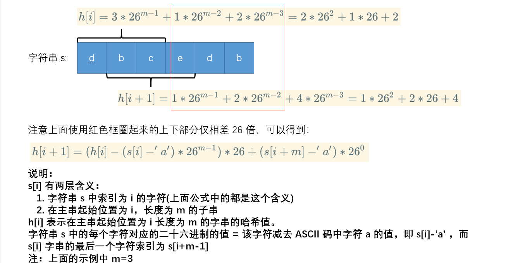
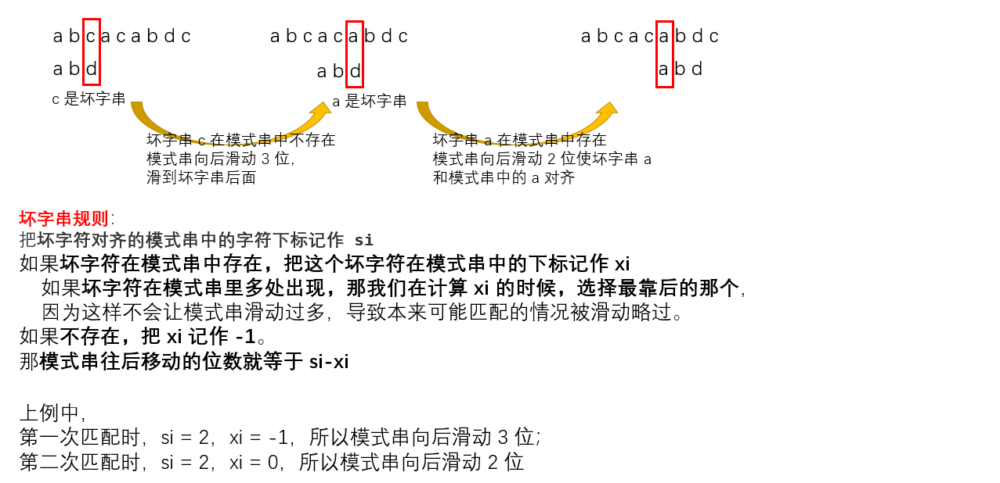
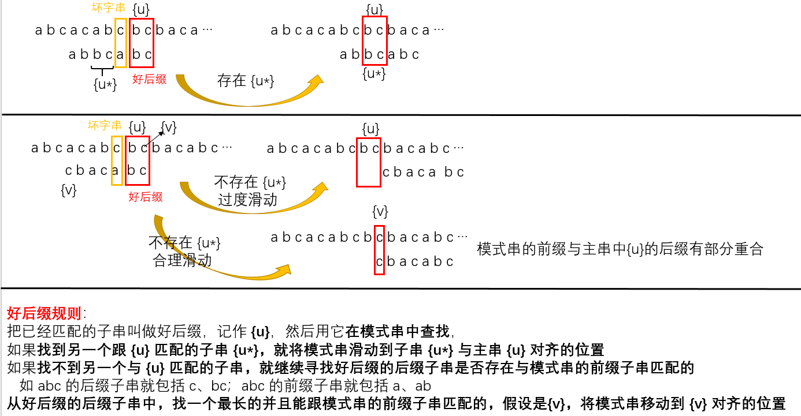

字符串匹配算法：

- 单模式匹配：在一个主串中查找一个模式串
  - BF、RK、BM、KMP
- 多模式匹配：在一个主串中同时查找多个模式串
  - Trie 树、 AC 自动机

假设在字符串 A 中查找字符串 B，那字符串 A 就是主串，字符串 B 就是模式串。把主串的长度记作 n，模式串的长度记作 m。因为我们是在主串中查找模式串，所以 n>m。

敏感词过滤功能基本的原理就是字符串匹配算法，即通过维护一个敏感词的字典，当用户输入一段内容时，通过字符串匹配算法查找用户输入的文字是否包含敏感词。

# BF(Brute Force)

BF(Brute Force，暴力/朴素匹配)算法：在主串中，检查起始位置分别是 0、1、2…n-m 且长度为 m 的 n-m+1 个子串，看有没有跟模式串匹配的。

可以看出，最坏情况下需要对比 n-m+1 次，每次要对比 m 个字符，所以最坏时间复杂度为 $O(n*m)$，尽管 BF 算法的时间复杂度很高，但实际中却很常用：

1. 实际的软件开发中，大部分情况下，模式串和主串的长度都不会太长。且每次模式串与主串中的子串匹配的时候，当中途遇到不能匹配的字符的时候，就可以就停止了，不需要把 m 个字符都比对一下；
2. BF 算法思想简单，代码实现也非常简单，不容易出错，如果有 bug 也容易暴露和修复。工程中，在满足性能要求的前提下，简单是首选。这也是我们常说的 KISS(Keep it Simple and Stupid)设计原则。

```go
func BF(main, pattern string) int {
	if len(main) < len(pattern) || len(main) == 0 || len(pattern) == 0 {
		return -1
	}
	for i := 0; i <= len(main)-len(pattern); i++ {
		str := main[i : i+len(pattern)]
		if pattern == str {
			return i
		}
	}
	return -1
}
```

# RK(Rabin-Karp)

对 BF 算法进行改造，引入哈希算法就可以降低时间复杂度。

RK(Rabin-Karp) 算法：

1. 通过哈希算法对主串中的 n-m+1 个子串分别求哈希值；
2. 逐个与模式串的哈希值比较大小，如果某个子串的哈希值与模式串相等，那就说明对应的子串和模式串匹配了

因为哈希值是一个数字，数字之间比较是否相等是非常快速的，所以模式串和子串比较的效率就提高了。不过，通过哈希算法计算子串的哈希值的时候，我们需要遍历子串中的每个字符。尽管模式串与子串比较的效率提高了，但是，算法整体的效率并没有提高。

为了解决这一问题，需要设计一个特别的哈希算法：假设要匹配的字符串的字符集中只包含 K 个字符，我们可以用一个 K 进制数来表示一个子串，这个 K 进制数转化成十进制数，作为子串的哈希值。示例：

假设要处理的字符串中只有 a-z 这 26 个小写字母，那就用二十六进制表示一个字符串，a 为 0、z 为 26，其对应的哈希值就是二十六进制转为十进制的结果。。如字符串 “cba” 的哈希值就是 $2*26^2+1*26+0*1=1353$。

而这种哈希算法有一个特点，在主串中，相邻两个子串的哈希值的计算公式有一定关系:



其中 $26^{m-1}$ 这部分的计算可以通过查表的方法提高效率，可以事先计算好 $26^0、26^1...26^{m-1}$ 的值并存储在一个长度为 m 的数组中，需要时取出来使用即可。

- 整个 RK 算法包含两部分，计算子串哈希值和模式串哈希值与子串哈希值之间的比较：
  - 第一部分通过设计特殊的哈希算法，只需要扫描一遍主串就能计算出所有子串的哈希值了，所以这部分的时间复杂度是 $O(n)$；
  - 模式串哈希值与每个子串哈希值之间的比较的时间复杂度是 $O(1)$，总共需要比较 n-m+1 个子串的哈希值，所以，这部分的时间复杂度也是 $O(n)$。
  - 所以，RK 算法整体的时间复杂度就是 $O(n)$。

问题：模式串很长，相应的主串中的子串也会很长，通过上面的哈希算法计算得到的哈希值就可能很大，如果超过了计算机中整型数据可以表示的范围，那该如何解决呢？

之前的哈希算法是不存在哈希冲突的，一个字符串与一个二十六进制数一一对应，不同的字符串的哈希值肯定不一样。为了可以将哈希值落在整型数据范围内，可以做出部分牺牲，重新设计一个允许哈希冲突的哈希算法。如：将每个字母从小到大对应一个素数，而不是 1、2、3... 这样的自然数。

之前只需要比较一下模式串和子串的哈希值，如果两个值相等，那这个子串就一定可以匹配模式串。而当存在哈希冲突的时候，有可能存在这样的情况，子串和模式串的哈希值虽然是相同的，但是两者本身并不匹配。解决方法很简单，当发现一个子串的哈希值跟模式串的哈希值相等的时候，只需要再对比一下子串和模式串本身就好了。

哈希算法的冲突概率要相对控制得低一些，如果存在大量冲突，就会导致 RK 算法的时间复杂度退化，效率下降。极端情况下，如果存在大量的冲突，每次都要再对比子串和模式串本身，那时间复杂度就会退化成 $O(n*m)$。但也不要太悲观，一般情况下，冲突不会很多，RK 算法的效率还是比 BF 算法高的。

# BM(Boyer-Moore)

将模式串和主串的匹配过程看作模式串在主串中不断向后滑动，当遇到不匹配的字符时，BF、RK 算法是将模式串向后滑动一位，然后从模式串的第一个字符开始重新匹配。

假设主串为 “a b c a c a b d c”，而模式串为 “a b d”。主串中的 “c” 在模式串中不存在，所以模式串向后滑动时，只要 “c” 与模式串重合，肯定无法匹配，所以可以一次性把模式串往后多滑动几位，把模式串移动到 c 的后面。根据这一现象找出规律的话，匹配效率就会提高很多。

而 BM 算法本质上就是在寻找这种规律，借助这种规律，在模式串与主串匹配的过程中，当模式串和主串某个字符不匹配的时候，能够跳过一些肯定不会匹配的情况，将模式串往后多滑动几位。

## 原理

之前的匹配算法在匹配过程中，都是按照模式串下标从小到大的顺序，依次与主串中的字符串进行匹配的。而 BM 算法的匹配顺序较为特别，是**按照模式串下标从大到小的顺序匹配的**。

BM 算法主要有两部分：坏字符规则(bad character rule)、好后缀规则(good suffix shift)。

- bad character rule

当发现某个字符没法匹配的时候。把这个没有匹配的字符叫作坏字符(主串中的字符)，然后用坏字符在模式串中查找，如果发现模式串中并不存在这个字符，就将模式串直接向后滑动，直到模式串滑到坏字符后面，再继续从模式串的末尾开始匹配。



利用坏字串规则，BM 算法在最好情况下时间复杂度为 $O(n/m)$。如主串是“aaabaaabaaabaaab”，模式串为“aaaa”，每次对比时，模式串直接后移 4 位，所以匹配具有类似特点的模式串和主串的时候，BM 算法非常高效。

但是 si-xi 计算得到的移动位数可能为负数。如主串是“aaaaaaaaaaaaaaaa”，模式串为“baaa”。所以 BM 算法还需要好后缀规则。

- good suffix shift



BM 算法可以分别计算好后缀和坏字符往后滑动的位数，然后取两个数中最大的，作为模式串往后滑动的位数。这种处理方法还可以避免我们前面提到的，根据坏字符规则，计算得到的往后滑动的位数，有可能是负数的情况。

## 实现

- bad character rule

遇到坏字符时，需要计算后移的位数 si-xi，如何求得 xi 即坏字符在模式串中出现的位置？

如果使用坏字符在模式串中顺序遍历查找会很低效，从而影响整个算法的效率。可以借助散列表，将模式串中每个字符及其下标存到散列表中，这样就可以快速找到坏字符在模式串的位置下标了。

# KMP(Knuth Morris Pratt)

BM 算法里，在模式串和主串匹配过程中，如果遇到坏字符就把模式串后移，而移动的过程中，用好前缀的后缀子串和模式串的前缀子串在比较，这个比较的过程如何能更高效呢？

KMP 算法就是在试图寻找一种规律：在模式串和主串匹配的过程中，当遇到坏字符后，对于已经比对过的好前缀，能否找到一种规律，将模式串一次性滑动很多位？

# Trie 树

Trie 树也叫字典树，树形结构，专门处理字符串匹配的数据结构，用来解决在一组字符串集合中快速查找某个字符串的问题。

Trie 树的本质，就是利用字符串之间的公共前缀，将重复的前缀合并在一起。

其中，根节点不包含任何信息。每个节点表示一个字符串中的字符，从根节点到红色节点的一条路径表示一个字符串（注意：红色节点并不都是叶子节点）

Trie 树主要有两个过程：

- 用字符串集合构成 Trie 树，这一过程分解开就是将字符串插入 Trie 树的过程
- 在 Trie 树种查询一个字符串
  - 将字符串分割为单个的字符，然后从 Trie 树的根节点开始逐个匹配字符

Trie 树是一个多叉树，假设字符串的字符集只有 26 个字母，那么每个节点最多有 26 个子节点。那么，该如何存储多叉树中每个节点的子节点呢？

存储方式：借助散列表的思想，将 26 个字母映射到一个长度为 26 的数组中，如在索引为 0 的位置存储指向子节点“a”的指针，而如果某个字符对应的节点不存在，就在对应位置存储 nil。

当在 Trie 树中查询字符串时，可以通过字符的 ASCII 码减去“a”的 ASCII 码得到该字符对应的索引。如 d-a=3，则子节点 d 就保存在数组下标为 3 的位置。

## 分析

如果要在一组字符串中，频繁地查询某些字符串，用 Trie 树会非常高效。构建 Trie 树的过程，需要扫描所有的字符串，时间复杂度是 $O(n)$(n 表示所有字符串的长度和)。但是一旦构建成功之后，后续的查询操作会非常高效。

每次查询时，如果要查询的字符串长度是 k，那我们只需要比对大约 k 个节点，就能完成查询操作。跟原本那组字符串的长度和个数没有任何关系。所以，构建好 Trie 树后，在其中查找字符串的时间复杂度是 $O(k)$，k 表示要查找的字符串的长度。

在重复前缀不多的情况下，Trie 树不仅不节省内存，还会浪费很多内存。以之前最多 26 个字母为例，树的每个节点都要存储一个长度为 26 的数组，且每个数组存储一个 8B 的指针，之前提过，Trie 树的本质是避免重复存储一组字符串的相同前缀子串，而现在每个字符(节点)存储 26\*8=208B，远大于 1B。当字符串中还有特殊字符甚至中文时，所需的存储空间就更多了。

尽管 Trie 树可能会很浪费内存，但却是很高效。为了解决内存问题，可以稍微牺牲一点查询的效率，将每个节点中的数组替换成其他数据结构，如有序数组、跳表、散列表、红黑树等。

假设使用有序数组，数组中的指针按照所指向的子节点中的字符的大小顺序排列。查询的时候，我们可以通过二分查找的方法，快速查找到某个字符应该匹配的子节点的指针。但是，在往 Trie 树中插入一个字符串的时候，我们为了维护数组中数据的有序性，就会稍微慢了点。

## 对比

之前的例子中，在一组字符串中查找字符串，Trie 树实际上对要处理的字符串有严格的要求：

1. 字符串中包含的字符集不能太大。
   - 如果字符集太大，那存储空间可能就会浪费很多。即便可以优化，但也要付出牺牲查询、插入效率的代价。
2. 要求字符串的前缀重合比较多，不然空间消耗会变大很多
3. 如果要用 Trie 树解决问题，就要自己从零开始实现一个 Trie 树，还要保证没有 bug，这个在工程上是将简单问题复杂化，除非必须，一般不建议这样做
4. 通过指针串起来的数据块是不连续的，而 Trie 树中用到了指针，所以，对缓存并不友好，性能上会打个折扣

综合上面几点，针对在一组字符串中查找字符串的问题，工程中更倾向于用散列表或者红黑树。因为这两种数据结构都不需要自己去实现，直接利用编程语言中提供的现成类库就行了。

实际上，Trie 树只是不适合精确匹配查找，这种问题更适合用散列表或者红黑树来解决。**Trie 树比较适合的是查找前缀匹配的字符串**。

## 敏感词过滤

对于访问量很大的网站(如淘宝)而言，用户每天的评论数有几亿、甚至几十亿，网站对敏感词过滤系统的性能要求就要很高。这就需要用到多模式串匹配算法。

单模式串匹配算法可以完成多模式串的匹配，但是，这样的话，每个匹配过程都需要扫描一遍用户输入的内容，整个过程下来需要扫描很多遍，如果敏感词很多，比如几千个，并且用户输入的内容很长，假如有上千个字符，那就需要扫描几千遍这样的输入内容。这种处理思路很低效。

而多模式匹配算法只需要扫描一遍主串，就能在主串中一次性查找多个模式串是否存在，从而大大提高匹配效率。Trie 树就是一种多模式匹配算法，那么该如何用 Trie 树实现敏感词过滤呢？

1. 对敏感词进行预处理，构建成 Trie 树
   - 这个预处理的操作只需要做一次，如果敏感词字典动态更新了，如删除、添加了一个敏感词，那只要动态更新一下 Trie 树就可以了
2. 以用户输入的内容作为主串，从第一个字符(假设是字符 “C”)开始，在 Trie 树中匹配。
   - 当匹配到 Trie 树的叶子节点，或者中途遇到不匹配字符的时候，就将主串的开始匹配位置后移一位，也就是从字符 C 的下一个字符开始，重新在 Trie 树中匹配。

上面的这种处理方式类似 BF 算法，借鉴 KMP 算法对 BF 算法的优化改进方法，可以对 Trie 树进行改进，这就要用到 AC 自动机算法了。

# AC 自动机

AC 自动机算法，全称是 Aho-Corasick 算法。AC 自动机实际上就是在 Trie 树之上，加了类似 KMP 的 next 数组，只不过此处的 next 数组是构建在树上。
