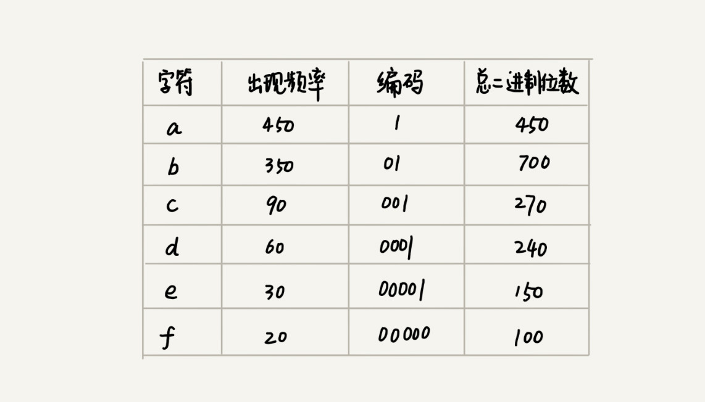
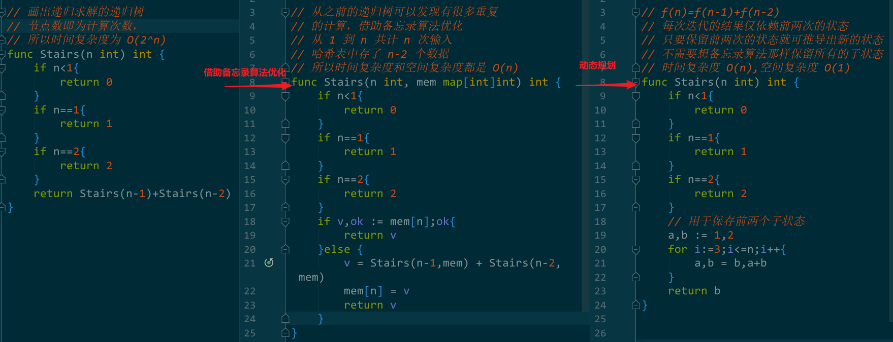

# greedy algorithm

贪心算法(greedy algorithm)有很多经典应用：霍夫曼编码(Huffman Coding)、Prim 和 Kruskal 最小生成树算法、Dijkstra 单源最短路径算法等。

举例：有一个容量 100kg 的背包用于放豆子，现有五种豆子(黄、绿、红、黑、青豆)，每种豆子的总量和价格不同，如何使背包所放物品的总价值最大？计算出单价，按照单价从高到低依次放入背包，直到装不下。

1. 当看到“针对一组数据，定义了限制值和期望值，希望从中选出几个数据，在满足限制值的情况下，期望值最大”这类问题时，首先想到贪心算法
   - 例子中限制值就是容量 100kg，期望值就是总价值
2. 尝试能否用贪心算法解决：每次选择当前情况下，在对限制值同等贡献量的情况下，对期望值贡献最大的数据。
   - 例子中每次从剩下的豆子中选择单价最高，即重量相同的情况下对价值贡献最大的豆子
3. 举例验证贪心算法的结果是否为最优解
   - 大部分情况下，举几个例子验证一下就可以了。严格地证明贪心算法的正确性，是非常复杂的，需要涉及比较多的数学推理。而且，从实践的角度来说，大部分能用贪心算法解决的问题，贪心算法的正确性都是显而易见的，也不需要严格的数学推导证明。

**实际上，用贪心算法解决问题的思路，并不总能给出最优解。**当前面的选择会影响后面的选择时，贪心算法可能就无法得到最优解了。

下面通过题目来学习。

## 分糖果

现在有 m 个大小不同的糖果(s1、s2...sm)，n 个对糖果大小需求不同的孩子(g1、g2... gn)，如何分配糖果来尽可能满足最多数量的孩子？即从 n 个孩子中，抽取一部分孩子分配糖果，让满足的孩子的个数(期望值)是最大的。这个问题的限制值就是糖果个数 m

分析：对于一个孩子，如果小的糖果可以满足，那就不要用大的糖果，而将大糖果留给需求大的孩子。而对糖果大小需求小的孩子更容易满足，所以先从需求小的孩子分配。因为满足一个需求大的孩子跟满足一个需求小的孩子，对我们期望值的贡献是一样的。

每次从剩下的孩子中，找出对糖果大小需求最小的，然后发给他剩下的糖果中能满足他的最小的糖果，这样得到的分配方案，也就是满足的孩子个数最多的方案。


## 钱币找零

现有 1、2、5、10、20、50、100 面额的纸币，分别有 c1、c2、c5、c10、c20、c50、c100 张，如果用这些钱支付 K 元，最少用多少纸币？

生活中肯定是先用面值最大的来支付，如果不够，就继续用更小一点面值的，以此类推，最后剩下的用 1 元来补齐。

在贡献相同期望值(纸币数目)的情况下，我们希望多贡献点金额，这样就可以让纸币数更少，这就是一种贪心算法的解决思路。


## 区间覆盖！

假设有 n 个区间，分别为 [l1, r1]、[l2, r2]、[l3, r3] ... [ln, rn]，从这 n 个区间中选出一部分区间，这部分区间满足两两不相交(端点相交的情况不算相交)，最多能选出多少个区间呢？

```
如：[6,8] [2,4] [3,5] [1,5] [5,9] [8,10]
不相交的区间：[2,4] [6,8] [8,10]
```

思路：假设这 n 个区间中最左端点是 lmin，最右端点是 rmax。就相当于，选择几个不相交的区间，从左到右将 [lmin, rmax] 覆盖上。我们按照起始端点从小到大的顺序对这 n 个区间排序。每次选择的时候，左端点跟前面的已经覆盖的区间不重合的，右端点又尽量小的，这样可以让剩下的未覆盖区间尽可能的大，就可以放置更多的区间。这实际上就是一种贪心的选择方法。

```
 1 2 3 4 5 6 7 8 9 10
[1,      5]
  [2,  4]                  √
    [3.  5]
        [5,      9]
          [6,  8]          √
              [8,  10]     √
```

## 霍夫曼编码

霍夫曼编码是一种十分有效的编码方法，广泛用于数据压缩中，其压缩率通常在 20%～90% 之间。

如何利用贪心算法来实现对数据压缩编码，有效节省数据存储空间的霍夫曼编码？

假设有一个含 1000 个字符的文件，每个字符 1B，存储这 1000 个字符需要 8000bits，有没有更节省空间的存储方式呢？

假设我们通过统计分析发现，这 1000 个字符中只包含 6 种不同字符(a、b、c、d、e、f)。而 3 个二进制位(bit)就可以表示 8 个不同的字符，所以，为了尽量减少存储空间，每个字符我们用 3 个二进制位来表示。那存储这 1000 个字符只需要 3000bits 就可以了，比原来的存储方式节省了很多空间。不过，还有没有更加节省空间的存储方式呢？

PS：上面这种等长的编码在解压缩时很容易，每次从文本中读取等长(上例中的 3 位)的二进制码，然后翻译成对应的字符即可。

**霍夫曼编码不仅会考察文本中有多少个不同字符，还会考察每个字符出现的频率，根据频率的不同，选择不同长度的编码。霍夫曼编码试图用这种不等长的编码方法，来进一步增加压缩的效率。**

**如何给不同频率的字符选择不同长度的编码呢？根据贪心的思想，可以把出现频率比较多的字符，用稍微短一些的编码；出现频率比较少的字符，用稍微长一些的编码。**

这种不等长的编码在解压缩时比较复杂，为了避免解压缩过程中的歧义，**霍夫曼编码要求各个字符的编码之间，不会出现某个编码是另一个编码前缀的情况**，如：



在解压缩的时候，每次读取尽可能长的可解压的二进制串，所以在解压缩的时候也不会歧义。经过这种编码压缩之后，这 1000 个字符只需要 2100bits 就可以了。

那么该如何根据字符出现频率的不同，对其进行不同长度的编码呢？

把每个字符看作一个节点，且附带把频率放到优先级队列中。我们从队列中取出频率最小的两个节点 A、B，然后新建一个节点 C，把频率设置为两个节点的频率之和，并把这个新节点 C 作为节点 A、B 的父节点。最后再把 C 节点放入到优先级队列中。重复这个过程，直到队列中没有数据。


然后给每一条边加上一个权值，指向左子节点的边统统标记为 0，指向右子节点的边统统标记为 1，那从根节点到叶节点的路径就是叶节点对应字符的霍夫曼编码：


# divide and conquer

分治算法(divide and conquer)就是将原问题划分成 n 个规模较小，并且结构与原问题相似的子问题，递归地解决这些子问题，然后再合并其结果，就得到原问题的解。分治算法是一种处理问题的思想，递归是一种编程技巧。

分治算法一般都比较适合用递归实现，每一层递归都涉及：

- 分解：将原问题分解成一系列子问题；
- 解决：递归地求解各个子问题，若子问题足够小，则直接求解；
- 合并：将子问题的结果合并成原问题的结果。

分治算法能解决的问题，一般需要满足下面这几个条件：

- 原问题与分解成的小问题具有相同的模式；
- 原问题分解成的子问题可以独立求解，子问题之间没有相关性！！
- 具有分解终止条件，也就是说，当问题足够小时，可以直接求解；
- 可以将子问题合并成原问题，而这个合并操作的复杂度不能太高，否则就起不到减小算法总体复杂度的效果了。

## 在海量数据处理中的应用

之前的数据结构和算法大部分都是基于内存存储和单机处理。但是，如果要处理的数据量非常大，没法一次性放到内存中，这个时候，这些数据结构和算法就无法工作了。

要解决这种数据量大到内存装不下的问题，可以利用分治的思想。将海量的数据集合根据某种方法，划分为几个小的数据集合，每个小的数据集合单独加载到内存来解决，然后再将小数据集合合并成大数据集合。实际上，利用这种分治的处理思路，不仅仅能克服内存的限制，还能利用多线程或者多机处理，加快处理的速度。

注意：数据的存储与计算所在的机器是同一个或者在网络中靠的很近(如一个局域网内，数据存取速度很快)，否则就会因为数据访问的速度，导致整个处理过程不但不会变快，反而有可能变慢。

## 计算逆序度

Q：如何求出一组数据的有序对个数或者逆序对个数呢？

A：最笨的方法就是拿每个数字跟它后面的数字比较，计算每个数字的逆序度然后求和，这种方法的时间复杂度为 $O(n^2)$；

借用分治算法，可以将数组分为前后两部分，分别计算这两部分各自的逆序度，求和后加上这两部分之间的逆序度即可。

其中前后两部分之间的逆序度可以借助归并算法来解决。归并算法在合并的过程中就可以计算两个部分之间的逆序度。

```go
var num int  // 全局变量记录逆序度

// 借用分治思想来计算数组的逆序度
func ReverseOrderByDivideAndConquer(nums []int) int {
	num = 0
	mergeSortCounting(nums, 0, len(nums)-1)
	return num
}

func mergeSortCounting(nums []int, start, end int) {
	if start >= end {
		return
	}
	middle := start + (end-start)>>1
	mergeSortCounting(nums, start, middle)
	mergeSortCounting(nums, middle+1, end)
	merge(nums, start, middle, end)
}

func merge(nums []int, start, middle, end int) {
	pointA, pointB := start, middle+1
	i := 0
	temp := make([]int, end-start+1)
	for pointA <= middle && pointB <= end {
		if nums[pointA] <= nums[pointB] {
			temp[i] = nums[pointA]
			pointA++
		} else {
			// 计算分开的两部分之间的逆序度
			num += middle - i + 1
			temp[i] = nums[pointB]
			pointB++
		}
		i++
	}
	for pointA <= middle {
		temp[i] = nums[pointA]
		i++
		pointA++
	}
	for pointB <= end {
		temp[i] = nums[pointB]
		i++
		pointB++
	}
	copy(nums[start:end+1], temp)
}
```


# backtracking

回溯的处理思想，类似枚举搜索。枚举所有的解，找到满足期望的解。为了有规律地枚举所有可能的解，避免遗漏和重复，会将问题求解的过程分为多个阶段。每个阶段，我们都会面对一个岔路口，我们先随意选一条路走，当发现这条路走不通的时候(不符合期望的解)，就回退到上一个岔路口，另选一种走法继续走。

大部分情况下，回溯算法都是用来解决广义的搜索问题，也就是，从一组可能的解中，选择出一个满足要求的解。回溯算法非常适合用递归来实现，在实现的过程中，剪枝操作是提高回溯效率的一种技巧。利用剪枝，我们并不需要穷举搜索所有的情况，从而提高搜索效率。

回溯法一般可以用于解决以下问题：

- 组合问题：N个数里面按一定规则找出k个数的集合
- 切割问题：一个字符串按一定规则有几种切割方式
- 子集问题：一个N个数的集合里有多少符合条件的子集
- 排列问题：N个数按一定规则全排列，有几种排列方式
- 棋盘问题：N皇后，解数独等等

## 八皇后问题

有一个 8x8 的棋盘，希望往里放 8 个棋子（皇后），每个棋子所在的行、列、对角线都不能有另一个棋子。八皇后问题就是期望找到所有满足这种要求的放棋子方式。

```go
// 下标表示行, 值表示 queen 存储在哪一列
var result = [8]int{}

func Cal8Queens(row int) {
	if row == 8 {
		// 8 个棋子都放置好了，打印结果
		printQueens(result)
		return
	}
	// 每一行都有 8 种放法
	for column := 0; column < 8; column++ {
		// 有些放法不满足要求
		if isOk(row, column) {
			// 第 row 行的棋子放到了 column 列
			result[row] = column
			// 考察下一行
			Cal8Queens(row + 1)
		}
	}
}

// 判断坐标为 (row, column) 的位置放置棋子是否合适
// 由于是从上往下放置棋子，故只需判断当前坐标的上方(正上方、左上、右上对角线)
func isOk(row, column int) bool {
	leftup, rightup := column-1, column+1
	// 逐行往上考察每一行
	for i := row - 1; i >= 0; i-- {
		// 当前坐标正上方 (row-1, column) 是否有棋子
		if result[i] == column {
			return false
		}
		// 当前坐标左上对角线 (row-1, column-1) 是否有棋子
		if leftup >= 0 {
			if result[i] == leftup {
				return false
			}
		}
		// 当前坐标右上对角线 (row-1, column-1) 是否有棋子
		if rightup < 8 {
			if result[i] == rightup {
				return false
			}
		}
		// 继续向左、右上对角线移动判断
		leftup--
		rightup++
	}
	return true
}

// 打印出一个二维矩阵
func printQueens(result [8]int) {
	for row := 0; row < 8; row++ {
		for column := 0; column < 8; column++ {
			if result[row] == column {
				print("Q ")
			} else {
				print("* ")
			}
		}
		println()
	}
	println()
}
```

## 0-1 背包

0-1 背包问题(基础)：有一个背包，背包总的承载重量是 Wkg。现有 n 个物品，每个物品的重量不等，并且不可分割。现在期望选择几件物品，装载到背包中。在不超过背包所能装载重量的前提下，如何让背包中物品的总重量最大？

之前在贪心算法中也讲过一个背包问题，不过那里讲的物品是可以分割的，可以装某个物品的一部分到背包里面。而这里物品是不可分割的，要么装要么不装，所以叫 0-1 背包问题。这一问题无法通过贪心算法解决。其经典解法是动态规划，这里使用一种简单但没那么高效的解法-回溯算法。在动态规划中会有更好的解法。

对于每个物品而言有两种选择，装进/不装进背包。n 个物品共有 2^n 种装法，采用回溯方法，对物品依次排列，整个问题分为 n 个阶段，每个阶段对应一个物品怎么选择。先对第一个物品进行处理，选择装进去或者不装进去，然后再递归地处理剩下的物品。

```go
// 存储背包中物品总重量的最大值，这里设置其初值为整型的最小值
var maxW = ^int(^uint(0) >> 1)

// i 表示考察到哪个物品了
// cw 代表当前已装进去的物品的重量和
// items 表示每个物品的重量
// n 表示物品个数
// w 背包承受的最大重量
func Knapsack(i, cw int, items []int, n, w int) {
	if cw == w || i == n {
		if cw > maxW {
			maxW = cw
		}
		return
	}
	// 当前物品不装进背包
	Knapsack(i+1, cw, items, n, w)
	// 是否超过了背包承受的重量
	if cw+items[i] <= w {
		// 没超过，将当前物品装进背包
		Knapsack(i+1, cw+items[i], items, n, w)
	}
}
```

画出递归树如下：(由于 items、n、w 是固定的值，故仅列出 i、cw 的不同，并以 K(i,cw) 代替函数)


可以看出递归树中很多子问题的求解是重复的，可以借助备忘录算法，记录子问题的解，当遇到重复的子问题时可以直接取出来用，就不需要再递归计算了。


## 正则表达式匹配

正则表达式中最重要的一种算法思想就是回溯。

依次考察正则表达式中的每个字符，当遇到非通配符时，直接和文本的字符进行匹配，如果相同就继续向下处理；如果不同则回溯。

当遇到通配符时，就会有多种处理方式，可以向随意选择一种匹配方案，然后继续考察剩下的字符，如果中途发现无法继续匹配下去，就回到之前的步骤，重新选择一种匹配方案，再继续匹配剩下的字符。


# Dynamic Programming

一般用动态规划解决最优问题，解决过程需要经历多个决策阶段。每个决策阶段都对应着一组状态。然后我们寻找一组决策序列，经过这组决策序列，能够产生最终期望求解的最优值。

**动态规划有三个特征：最优子结构、无后效性、重复子问题。**

- 最优子结构：问题的最优解包含子问题的最优解，即可以通过子问题的最优解，推导出问题的最优解。
- 无后效性：
  - 1.在推导后面阶段的状态的时候，只关心前面阶段的状态值，不关心这个状态是怎么一步一步推导出来的；
  - 2.某阶段状态一旦确定，就不受之后阶段的决策影响。
- 重复子问题：不同的决策序列，到达某个相同的阶段时，可能会产生重复的状态。
- 状态转移公式：代表了不同阶段之间的关系

## 爬楼梯

Q：有一座高度是10级台阶的楼梯，从下往上走，每跨一步只能向上1级或者2级台阶。用程序来求出一共有多少种走法。

暴力枚举法：时间复杂度是指数级的。

思路：要走到第 10 级，必须先走到 8 或 9 级，假设到 8、9 分别级有 x、 y 种走法，那么从 0 到 10 级有多少种走法呢？

8 到 9 的走法已经在 到 9 的走法种统计过，所以 8 到 10 只有一种走法那就是走 2 级；而 9 到 10 只有一种走法，所以从 0 到 10 级共有 x+y 种走法，所以 f(10)=f(8)+f(9)，以此类推可以将问题分阶段简化，最后得到：

$$
f(1) = 1 \\
f(2) = 2 \\
f(n) = f(n-1) + f(n-2)   (n>=3)
$$

如 f(10)=f(8)+f(9)，f(8)、f(9) 就是 f(10) 的最优子结构，而 f(1)、f(2) 就是边界，f(n) = f(n-1) + f(n-2) 是不同阶段之间的状态转移公式，决定了问题的每个阶段和下一阶段的关系。

以上就是问题建模，接下来则是求解问题：




# 对比

贪心、回溯、动态规划三个算法解决问题的模型，都可以抽象成多阶段决策最优解模型(解决过程需要经历多个决策阶段)，而分治算法解决的问题尽管大部分也是最优解问题，但是，大部分都不能抽象成多阶段决策模型。

回溯算法相当于穷举搜索，穷举所有的结果然后对比得到最优解，不过其时间复杂度较高，是指数级别的，只能用来解决小规模数据的问题。对于大规模数据的问题，用回溯算法解决的执行效率就很低了。

尽管动态规划比回溯算法高效，但是用动态规划来解决的问题都有特征(见动态规划部分)。在重复子问题这一点上，动态规划和分治算法的区分非常明显，分治算法要求分割成的子问题，不能有重复子问题，而动态规划正好相反，动态规划之所以高效，就是因为回溯算法实现中存在大量的重复子问题。

贪心算法实际上是动态规划算法的一种特殊情况。它解决问题起来更加高效，代码实现也更加简洁。不过，它可以解决的问题也更加有限。它能解决的问题需要满足三个条件，最优子结构、无后效性和贪心选择性(通过局部最优的选择，能产生全局的最优选择)。