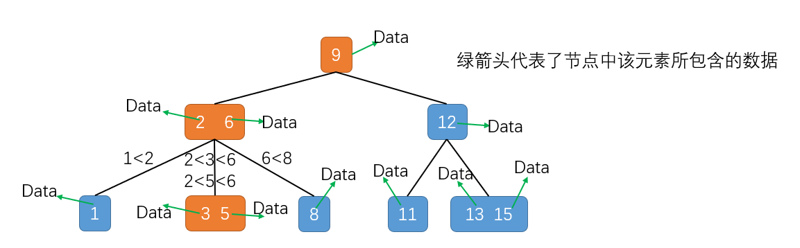
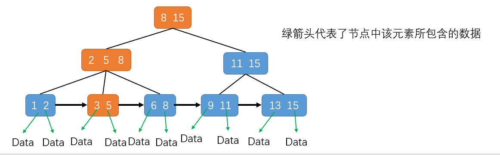

# 拓扑排序

拓扑排序是基于有向无环图的一个算法。以穿衣服为例，穿衣服是有一定顺序的，如先穿袜子再穿鞋、先穿裤子再穿鞋等，衣服与衣服之间是有一定依赖关系的，如何安排一个穿衣序列来满足所有的两两依赖关系就要用到拓扑排序。

Q：一个完整的项目往往会包含很多代码源文件。编译器在编译整个项目的时候，需要按照依赖关系，依次编译每个源文件。比如，A.cpp 依赖 B.cpp，那在编译的时候，编译器需要先编译 B.cpp，才能编译 A.cpp。编译器通过分析源文件或者程序员事先写好的编译配置文件(如 Makefile 文件)，来获取这种局部的依赖关系。

算法是构建在具体的数据结构上的，首先将问题背景抽象为具体的数据结构。

可以把源文件之间的依赖关系，抽象成一个有向图。每个源文件对应图中的一个顶点，源文件之间的依赖关系就是顶点之间的边。注意：这个有向图还必须是一个有向无环图，即不存在 a->b->c->a 这种循环依赖关系。图中一旦出现环，拓扑排序就无法工作了。

拓扑排序有两种实现方式：Kahn 算法、DFS 深度优先搜索算法。

注：这里的 a->b 表示的是 b 依赖于 a，a 先执行，b 才能执行！

```go
type Graph struct {
	v   int          // 顶点个数
	adj []*list.List // 邻接表
}

// s 指向 t
func (graph *Graph) addEdge(s, t int) {
	graph.adj[s].PushBack(t)
}

func NewGraph(v int) *Graph {
	graph := &Graph{v: v, adj: make([]*list.List, v)}
	for i := range graph.adj {
		graph.adj[i] = list.New()
	}
	return graph
}
```

## Kahn 算法

如果某个顶点的入度为 0，即没有任何顶点必须先于这个顶点执行，那么这个顶点就可以执行了。

1. 从图中，找出一个入度为 0 的顶点，将其输出到拓扑排序的结果序列中；
2. 将其从图中删除(也就是把这个顶点可达的顶点的入度都减 1)；
3. 循环执行上面两步，直到所有的顶点都被输出。最后输出的序列，就是满足局部依赖关系的拓扑排序。

```go
// 基于 Kahn 算法实现拓扑排序
func (graph Graph) TopologicalSortByKahn() {
  inDegree := make([]int, graph.v)
  // 统计所有顶点的入度
	for i := 0; i < graph.v; i++ {
		front := graph.adj[i].Front()
		for ; front != nil; front = front.Next() {
			v := front.Value.(int)
			inDegree[v]++
		}
  }
  // 向 queue 中加入所有入度为 0 的顶点
	queue := make([]int, 0)
	for i := 0; i < graph.v; i++ {
		if inDegree[i] == 0 {
			queue = append(queue,i)
		}
	}
	for len(queue) != 0 {
		cur := queue[0]
		queue = queue[1:]
    print("->", cur)  // 打印 cur
    // 将 cur 可到达的顶点入度减一
		front := graph.adj[cur].Front()
		for ; front != nil; front = front.Next() {
			v := front.Value.(int)
			inDegree[v]--
			if inDegree[v] == 0 {
				queue = append(queue, v)
			}
		}
	}
}
```

每个顶点、边都访问一遍，故时间复杂度为 $O(V+E)$，V 表示顶点个数，E 表示边的个数。由于图可能是不连通的，有可能是有好几个不连通的子图构成，所以，E 并不一定大于 V，两者的大小关系不确定。所以，在表示时间复杂度的时候，V、E 都要考虑在内。

## DFS

严格而言，这里是深度优先遍历，遍历图中的所有顶点，而非只是搜索一个顶点到另一个顶点的路径。

```go
// 基于 DFS 算法实现拓扑排序
func (graph Graph) TopologicalSortByDFS() {
	// 通过邻接表构建逆邻接表
	inverseAdj := make([]*list.List, graph.v)
	for i := range inverseAdj {
		inverseAdj[i] = list.New()
	}
	for i := 0; i < graph.v; i++ {
		front := graph.adj[i].Front()
		for ; front != nil; front = front.Next() {
			v := front.Value.(int)    // i->v
			inverseAdj[v].PushBack(i) // v->i
		}
	}
	// 递归处理每个顶点
	visited := make([]bool, graph.v)
	for i := 0; i < graph.v; i++ {
		if visited[i] == false {
			visited[i] = true
			graph.dfs(i, inverseAdj, visited)
		}
	}
}
// 输出逆邻接表中 vertex 可到达的所有顶点，再输出 vertex
// 也即输出邻接表中所有可到达 vertex 的顶点，再输出 vertex
func (graph *Graph) dfs(vertex int, inverseAdj []*list.List, visited []bool) {
	curVertex := inverseAdj[vertex].Front()
	for ; curVertex != nil; curVertex = curVertex.Next() {
		curV := curVertex.Value.(int)
		if visited[curV] == true {
			continue
		}
		visited[curV] = true
		graph.dfs(curV, inverseAdj, visited)
	}
	print("->", vertex)
}
```

每个顶点被访问两次，每条边都被访问一次，所以时间复杂度也是 $O(V+E)$。V、E 都要考虑在内，理由同上。

## 应用

拓扑排序应用非常广泛，解决的问题的模型也非常一致。凡是需要通过局部顺序来推导全局顺序的，一般都能用拓扑排序来解决。除此之外，拓扑排序还能检测图中环的存在。对于 Kahn 算法来说，如果最后输出的顶点个数小于图中顶点的个数，即图中还有入度不为 0 的顶点，说明图中存在环。

# 最短路径

针对有权图，也就是图中的每条边都有一个权重，该如何计算两点之间的最短路径(经过的边的权重和最小)呢？不同于无权图，有权图的最短路径不一定是间隔层次最少的路径，所以无法通过 BFS 得到。

地图软件的路线规划主要有三个问题：最短路线、最少用时和最少红绿灯。

建模：将地图抽象成有权图，每个岔路口看作一个顶点，岔路口与岔路口之间的路看作一条边，路的长度就是边的权重。如果路是单行道，就在两个顶点之间画一条有向边；如果路是双行道，就在两个顶点之间画两条方向不同的边。这样，整个地图就被抽象成一个有向有权图。

最短路径算法(Shortest Path Algorithm)中很经典的算法：[单源(Dijkstra)最短路径算法](https://mp.weixin.qq.com/s?__biz=MzIxMjE5MTE1Nw==&mid=2653197794&idx=1&sn=8286ba52dd8e909197324148ffe6b7d7&chksm=8c99e738bbee6e2e16332dea4c5daef34dc2db6166149244c5406b1042c46d166e83e2e6f2df&scene=21#wechat_redirect)，即一个顶点到另一个顶点。

如果图非常大，那 Dijkstra 最短路径算法的执行耗时会很多。在真实的软件开发中，我们面对的是超级大的地图和海量的寻路请求，算法执行效率太低是无法接受的。所以，一般情况下，我们都不需要非得求最优解（也就是最短路径）。在权衡路线规划质量和执行效率的情况下，我们只需要寻求一个次优解就足够了。此时可以使用 A\*算法。

Dijkstra 算法有点类似 BFS 算法，每次找到跟起点最近的顶点，然后向外扩展。而扩展过程中借助优先队列记录已经过的顶点及起点到该顶点的路径长度，路径长度越小，越早出队列被扩展，所以可能最先遍历的方向是相反的，即跑偏了。

A\*算法中每个顶点有三个属性：

- G：起点到该顶点的路径长度
- H：该顶点到终点的路径长度
  - 启发函数，heuristic function
  - 可以使用顶点到终点的直线距离(欧几里得距离)来充当 H，但这样会涉及开根号的计算，故一般通过曼哈顿距离来作为 H
  - 曼哈顿距离：两个顶点间的横纵坐标之和。以 $(x_1,y_1)$、$(x_2,y_2)$为例，曼哈顿距离 = $|x_1-x_2|+|y_1-y_2|$
- F = G + H：作为该顶点的综合评估
  - 估价函数，evaluation function

与 Dijkstra 算法不同的是，Dijkstra 中优先队列是根据 A\* 算法中的 G 值来构建的，而 A\*算法则是根据 F 值构建优先队列；A\*算法在更新顶点的 G 值时会同步更新 F 值；Dijkstra 算法是在终点出队列时才结束，A\*算法则是一旦遍历到终点就结束。

A\*算法可以更快速找到起点到终点的路线，但无法像 Dijkstra 那样找到最短路线。

要找到起点和终点的最短路径，最简单的办法就是回溯算法穷举所有路径，然后对比找到最短路径，但回溯算法执行效率太低，是指数级别；Dijkstra 算法则是利用动态规划的思想，对回溯算法进行了剪枝，只保留起点到某个顶点的最短路径，然后不断向外扩展搜索，尽管实现思想不同，但实际上也遍历了起点到终点的所有路径；A\*算法利用贪心算法的思想，每次都找 F 值最小的顶点出队列，一旦搜索到终点就不在继续考察其他顶点和路线了，所以，它并没有考察所有的路线，也就不可能找出最短路径了。

A\* 算法属于一种启发式搜索算法(Heuristically Search Algorithm)。实际上，启发式搜索算法并不仅仅只有 A\* 算法，还有很多其他算法，比如 IDA\* 算法、蚁群算法、遗传算法、模拟退火算法等。

启发式搜索算法利用估价函数，避免“跑偏”，贪心地朝着最有可能到达终点的方向前进。这种算法找出的路线，并不是最短路线。但是，实际的软件开发中的路线规划问题，我们往往并不需要非得找最短路线。所以，鉴于启发式搜索算法能很好地平衡路线质量和执行效率，它在实际的软件开发中的应用更加广泛。

# Bitmap

## 简介

Bitmap 是一种用于**对大量整型数据去重和查询**的算法，底层使用**二进制位(bit)**来存储数据。

eg：用户信息的标签化，一个用户可能有很多标签(90 后、单身、动漫、男)，当标签数量越来越多时该如何统计(喜欢动漫的单身男性...用户)呢？可以将用户标签使用 Bitmap 的形式存储，一个用户对应多个标签这样显然不行，换个思路，一个标签对应多个用户 ID，再建立一个用户名和用户 ID 的映射即可，每个标签都是独立的 Bitmap：

```
// 0 既代表了该标签相反的用户，也代表了没有填写该标签的用户
动漫：1 1 1 0 0 0 0 1 1 0
单身：0 1 0 1 1 0 1 0 1 0
男性：1 1 0 1 0 0 0 1 1 1
索引：9 8 7 6 5 4 3 2 1 0  // 对应不同的用户
```

以上存储的信息如果使用散列表，每个用户 ID 存储为 int 型，就是 64bit(以 64 位系统为例)，而在 Bitmap 中占 1bit，所以虽然散列表也可以实现高效的去重和统计，但**在数字范围不大的情况下，Bitmap 会更节省空间(详见布隆过滤器部分的示例)**。

此外，Bitmap 在用户群做**交集、并集运算时也很方便**。如果要查询喜欢动漫的单身男性用户，可以直接对上面的三个标签进行“与”运算，最后就可以得到索引(即 ID)为 8、1 的用户是符合要求的。

但是 **Bitmap 不支持“非”运算**，因为并不是每个用户都有所有的标签。如 10 个用户中有 5 个用户有单身标签，2 个用户是已婚标签，3 个用户并没有填写标签(Bitmap 的值也是 0)，那么如果对单身这个标签的 Bitmap 取反，就会得到有 7 个非单身，这显然是不正确的。

那么该如何**利用 Bitmap 实现对某个标签反向匹配**呢？需要**借助一个该标签的全量的 Bitmap**：

```
全量表示以下 1 对应的索引的用户是填写了该标签的，0 的用户则没有填写该标签
全量：0 1 1 1 1 0 1 1 1 0
单身：0 1 0 1 1 0 1 0 1 0
索引：0 1 1 1 1 0 1 0 1 0
```

然后对全量和单身的 Bitmap 采用**异或(相同位为 0，不同位为 1)**操作即可。

## 代码实现

```go
type Bitmap struct {
	data    []byte // 保存实际的 bit 数据
	bitsize uint   // 指示该 Bitmap 的 bit 容量
}

func NewBitmap(size uint) *Bitmap {
	if size == 0 {
		size = 0x01 << 32 // 这里设置了一个默认容量
	} else if remainder := size % 8; remainder != 0 {
		size += 8 - remainder
	}
	return &Bitmap{
		data:    make([]byte, size>>3),
		bitsize: size,
	}
}

// 将 offset 位置的 bit 置为 value (非 0 即判定为 1)
func (bitmap *Bitmap) SetBit(offset uint, value uint) bool {
	if bitmap.bitsize < offset {
		return false
	}
	index, pos := offset/8, offset%8
	if value == 0 {
		// &^ 是 Go 中的按位置零
		bitmap.data[index] &^= 0x01 << pos
	} else {
		bitmap.data[index] |= 0x01 << pos
	}
	return true
}

// 判断 offset 位置的值是否为 1
func (bitmap *Bitmap) GetBit(offset uint) bool {
	index, pos := offset/8, offset%8
	if bitmap.bitsize < offset {
		return false
	}
	return (bitmap.data[index] & (0x01 << pos)) != 0
}
```

测试代码：

```go
func TestBitma(t *testing.T) {
	bitmap := NewBitmap(19)
	t.Logf("%+v", bitmap)  // &{data:[0 0 0] bitsize:24}
	bitmap.SetBit(13,1)
	t.Logf("%b",bitmap.data)  // [0 100000 0]
	t.Log(bitmap.GetBit(1))  // false
}
```

注意：二进制位是从右往左数的！

## 布隆过滤器

Q1：有 1 千万个整数，整数的范围在 1 到 1 亿之间。如何快速查找某个整数是否在这 1 千万个整数中呢？

使用 Bitmap 时，数据范围在 1 到 1 亿之间，只需 1 亿个二进制位，大约 12MB 的空间，而使用散列表的话，1 千万个 64 位(8 字节)的整型至少需要 80MB，显然 Bitmap 更生内存。

之前说过，数字所在的范围不是很大时使 Bitmap 会省内存，但是当范围很大呢？如 1 到 10 亿，那么 Bitmap 的大小就是 10 亿个二进制位，即 120MB，而散列表仍只需 80MB，此时 Bitmap 使用的内存反而增大了！那么该如何解决这一问题呢？使用布隆过滤器。

仍然使用 1 亿个二进制的位图，然后通过哈希函数对数字进行处理，使其落在这 1 亿的范围内，为了降低哈希冲突，可以**使用多个哈希函数一起定位一个数据**：

1. 使用 K 个哈希函数对同一个数字求哈希值，会得到 K 个不同的哈希值(K1、K2、K3...Kk)；
2. 用上面的 K 个哈希值作为 Bitmap 中的下标，并将其对应的 bit 位置为 1
   - 这里其实是用 K 个二进制位表示一个数字
3. 当查询某个数字是否存在时，也用这 K 个哈希函数求得 K 个哈希值，如果对应 Bitmap 中的值均为 1 则该数字存在

对于两个不同的数字来说，经过一个哈希函数处理之后，可能会产生相同的哈希值。但是经过 K 个哈希函数处理之后，K 个哈希值都相同的概率就非常低了。尽管采用 K 个哈希函数之后，两个数字哈希冲突的概率降低了，但是，这种处理方式又带来了新的问题，那就是容易误判。如果几个数字的部分 bit 位组合起来可能会成为另一个实际不存在数字的 bit 位。

**布隆过滤器的误判**只会对存在的情况有误判。如果某个数字经过布隆过滤器判断不存在，那说明这个数字真的不存在，不会发生误判；如果某个数字经过布隆过滤器判断存在，这个时候才会有可能误判，有可能并不存在。只要调整哈希函数的个数、位图大小跟要存储数字的个数之间的比例，那就可以将这种误判的概率降到非常低。

**布隆过滤器非常适合这种不需要 100% 准确的、允许存在小概率误判的大规模判重场景。**尽管布隆过滤器会存在误判，但并不影响它发挥大作用。很多场景对误判有一定的容忍度。如爬虫判重的问题，，即便一个没有被爬取过的网页，被误判为已经被爬取，对于搜索引擎来说，也并不是什么大事情，是可以容忍的，毕竟网页太多了，搜索引擎也不可能 100% 都爬取到。

Q2：假设需要判重的网页有 10 亿，一个 URL 的平均长度是 64 字节

存储空间方面：

- 使用散列表：单纯存储这 10 亿个 URL，需要大约 60GB 的内存空间。因为散列表必须维持较小的装载因子，才能保证不会出现过多的散列冲突，导致操作的性能下降。而且，用链表法解决冲突的散列表，还会存储链表指针。所以，如果将这 10 亿个 URL 构建成散列表，那需要的内存空间会远大于 60GB，有可能会超过 100GB。
- 使用布隆过滤器：用一个 10 倍大小的位图来存储，也就是 100 亿个二进制位，换算成字节，那就是大约 1.2GB。相比来讲，布隆过滤器在存储空间的消耗上，降低了非常多。

执行效率方面：

- 布隆过滤器用多个哈希函数对同一个网页链接进行处理，CPU 只需要将网页链接从内存中读取一次，进行多次哈希计算，理论上讲这组操作是 CPU 密集型的。
- 在散列表的处理方式中，需要读取散列冲突拉链的多个网页链接，分别跟待判重的网页链接，进行字符串匹配。这个操作涉及很多内存数据的读取，所以是内存密集型的。

CPU 计算可能是要比内存访问更快速的，所以，理论上讲，布隆过滤器的判重方式，更加快速。

**布隆过滤器的误判率，主要跟哈希函数的个数、位图的大小有关**。当我们往布隆过滤器中不停地加入数据之后，位图中不是 1 的位置就越来越少了，误判率就越来越高了。所以，对于无法事先知道要判重的数据个数的情况，我们需要支持自动扩容的功能。

# 朴素贝叶斯算法

Q：实现一个简单的垃圾短信过滤功能以及骚扰电话拦截功能，该用什么样的数据结构和算法实现呢？

## 基于黑名单的过滤器

维护一个骚扰电话号码和垃圾短信发送号码的黑名单，对于被多个用户标记，并且标记个数超过一定阈值的号码，就可以定义为骚扰电话，并将它加入到黑名单中。

如果黑名单中的电话号码不多的话，可以使用散列表、二叉树等动态数据结构来存储，对内存的消耗并不会很大。如果把每个号码看作一个字符串，并假设平均长度是 16 个字节，那存储 50 万个电话号码，大约需要 10MB 的内存空间。即便是对于手机这样的内存有限的设备来说，这点内存的消耗也是可以接受的。

但是，如果黑名单中的电话号码很多呢？比如有 500 万个。这时如果再用散列表存储，就需要大约 100MB 的存储空间。为了实现一个拦截功能，耗费用户如此多的手机内存，这显然有点儿不合理。

如果使用布隆过滤器哦，存储 500 万个手机号码，把位图大小设置为 10 倍数据大小(5000 万)，那也只需要使用 5000 万个二进制位，也就是不到 7MB 的存储空间。比起散列表的解决方案，内存的消耗减少了很多。

还有一种时间换空间的方法，将内存消耗优化到极致。可以把黑名单存储在服务器端上，把过滤和拦截的核心工作，交给服务器端来做，手机端只负责将要检查的号码发送给服务器端，服务器端通过查黑名单，判断这个号码是否应该被拦截，并将结果返回给手机端。用这个解决思路完全不需要占用手机内存。不过，有利就有弊，网络通信是比较慢的，所以，网络延迟就会导致处理速度降低。而且，这个方案还有个硬性要求，那就是只有在联网的情况下，才能正常工作。

布隆过滤器有判错的概率，如果它把一个重要的电话或者短信，当成垃圾短信或者骚扰电话拦截了，对于用户来说，这是无法接受的。

## 基于规则的过滤器

基于黑名单的垃圾短信过滤方法只能拦截黑名单中的号码，不够完善。可以采用基于规则的过滤方法，预先设定一些规则，如果某条短信符合这些规则，就可以判定它是垃圾短信。如以下规则：

- 短信中包含特殊单词(或词语)，比如一些非法、淫秽、反动词语等；
- 短信发送号码是群发号码，非我们正常的手机号码，比如 +60389585；
- 短信中包含回拨的联系方式，比如手机号码、微信、QQ、网页链接等，因为群发短信的号码一般都是无法回拨的；
- 符合已知垃圾短信的模板。垃圾短信一般都是重复群发，对于已经判定为垃圾短信的短信，我们可以抽象成模板，将获取到的短信与模板匹配，一旦匹配，我们就可以判定为垃圾短信。

为了防止误判，可以判断满足多条规则或每条规则对应不同的分数，当总分数超过某个阈值时，才判断为垃圾短信。

在第一条规则中，如何判断哪些词汇是特殊单词呢？自己想出的单词过于主观且容易遗漏，可以基于概率统计的方法，借助计算机强大的计算能力，找出哪些单词最常出现在垃圾短信中，将这些最常出现的单词，作为特殊单词，用来过滤短信。

不过这种方法的前提是，我们有大量的样本数据，也就是说，要有大量的短信(比如 1000 万条短信)，并且我们还要求，每条短信都做好了标记，它是垃圾短信还是非垃圾短信。

对这 1000 万条短信，进行分词处理(借助中文或者英文分词算法)，去掉“的、和、是”等没有意义的停用词(Stop words)，得到 n 个不同的单词。针对每个单词，我们统计有多少个垃圾短信出现了这个单词，有多少个非垃圾短信会出现这个单词，进而求出每个单词出现在垃圾短信中的概率，以及出现在非垃圾短信中的概率。如果某个单词出现在垃圾短信中的概率，远大于出现在非垃圾短信中的概率，那我们就把这个单词作为特殊单词，用来过滤垃圾短信。

## 基于概率统计的过滤器

基于规则的过滤器，其规则受人的思维方式局限，规则未免太过简单；另一方面，垃圾短信发送者可能会针对规则，精心设计短信，绕过这些规则的拦截。有一种更高级的过滤方式——基于概率统计的过滤器。其理论基础是**朴素贝叶斯算法**，贝叶斯公式如下：

$P(A|B)=\frac{P(AB)}{P(B)}=\frac{P(B|A)*P(A)}{P(B)}$

基于概率统计的过滤器是通过短信内容来判定是否为垃圾短信的，而计算机无法像人一样理解短信内容，所以需要把短信抽象成一组计算机可以理解并且方便计算的**特征项**，用这一组特征项代替短信本身，来做垃圾短信过滤。

可以通过分词算法把一个短信分割为 n 个单词，这 n 个单词就是一组特征项，用以代表这个短信。因此，判定一个短信是否是垃圾短信这样一个问题，就变成了，判定同时包含这几个单词的短信是否是垃圾短信。

不同于基于规则的过滤器，基于概率统计的过滤器是使用概率来表征一个短信是垃圾短信的可信程度：

$P(是垃圾短信|W_1,W_2...W_n同时出现)$

尽管我们有很多短信样本，但无法通过样本数据来得到这个概率。样本的数量再大，毕竟也是有限的，样本中不会有太多同时包含 $W_1，W_2，W_3，…，W_n$ 的短信的，甚至很多时候，样本中根本不存在这样的短信，没有样本，也就无法计算概率。这时就可以使用朴素贝叶斯公式了，通过朴素贝叶斯公式，将这个概率的求解，分解为其他三个概率的求解：

$P(是垃圾短信|W_1,W_2...W_n同时出现)=\frac{P(W_1,W_2...W_n同时出现|是垃圾短信)*P(是垃圾短信)}{P(W_1,W_2...W_n同时出现)}$

又如果事件 A 和事件 B 是独立事件，两者的发生没有相关性，则 A、B 同时发生的概率计算公式：$P(A*B) = P(A)*P(B)$，上面的公式可继续分解：

$P(是垃圾短信|W_1,W_2...W_n同时出现)=\frac{P(W_1出现|是垃圾短信)*P(W_2出现|是垃圾短信)*...*P(W_n出现|是垃圾短信)*P(是垃圾短信)}{P(W_1,W_2...W_n同时出现)}$

这样 $P(W_i出现|是垃圾短信)$ 这个概率就可以通过统计样本获得，而$P(是垃圾短信)$则等于样本中垃圾短信数除以总样本短信数。但是 $P(W_1,W_2...W_n同时出现)$ 仍无法通过样本获取，不过却不必计算这个概率值。

可以分别计算同时包含 $W_1，W_2，W_3，…，W_n$ 这 n 个单词的短信是垃圾短信和非垃圾短信的概率($P_1$、$P_2$)，通过比较 $P_1$、$P_2$ 的大小，如果 $P_1$ 是 $P_2$ 的很多倍(如 10 倍)，才确定这条短信是垃圾短信。使用这种方法判断垃圾短信的方法，就可以不用计算上面的哪个概率值了，因为计算 $P_1$、$P_2$ 是也会包含这个概率值的计算：

$$
P_1=P(是垃圾短信|W_1,W_2...W_n同时出现)=\frac{P(W_1,W_2...W_n同时出现|是垃圾短信)*P(是垃圾短信)}{P(W_1,W_2...W_n同时出现)} \\
P_2=P(非垃圾短信|W_1,W_2...W_n同时出现)=\frac{P(W_1,W_2...W_n同时出现|非垃圾短信)*P(非垃圾短信)}{P(W_1,W_2...W_n同时出现)}
$$

# 欧几里得距离

Q：如何实现最简单的音乐推荐系统？

核心思想：找到和你口味偏好相似的用户，把他们爱听的歌曲推荐给你；找出跟你喜爱的歌曲特征相似的歌曲，把这些歌曲推荐给你。

补充：欧几里得距离(Euclidean distance)是用于计算两个向量间的距离的，二维向量 $(x_1, y_1)$ 和 $(x_2, y_2)$ 的距离 $s=\sqrt{(x_1-x_1)^2+(y_2-y_1)^2)}$。

- 基于相似用户的推荐

1. 通过用户的不同行为(单曲循环、收藏、跳过、分享等)来定义用户对歌曲的喜欢程度；
2. 记录用户对不同歌曲的喜欢程度；
3. 针对每个用户，将其对各个歌曲的喜欢程度作为 n 维向量，计算不同用户和你的欧几里得距离，距离小说明两者的偏好相似

- 基于相似歌曲做推荐

如果是一个新用户，还没有收集到足够的行为数据就无法使用上面的方法推荐了。此时可以基于相似歌曲来推荐。

如何量化两个歌曲间的相似程度呢？最简单的就是定义一些特征项(伤感/快乐、摇滚/民谣等)，然后基于这个特征向量来计算两个歌曲的欧几里得距离。但是这样做的前提是我们找到足够多、且能代表歌曲特点的特征项，而且还需要人工标注这些特征项的得分，不仅工程量大，还可能带有主观因素。

基于特征项计算相似度不可行，那就转换思路，对于两首歌，如果喜欢听的人群都是差不多的，那侧面就可以反映出，这两首歌比较相似。

所以这里可以针对每首歌曲，将每个用户对歌曲的分数作为 n 向量，计算不同歌曲的欧几里得距离，距离越小这两首歌越相似。

# B 树

数据库索引为什么使用树结构存储呢？因为树的查询效率高且可以保持有序。

不管是内存中的数据，还是磁盘中的数据，操作系统都是按页(一页大小通常是 4KB)来读取的，一次会读一页的数据。如果要读取的数据量超过一页的大小，就会触发多次 IO 操作，所以要尽量让每个节点的大小等于一个页的大小。读取一个节点，只需要一次磁盘 IO 操作。

数据库索引一般是存储在磁盘中的，数据量很大时，索引可能有几个 G 甚至更多，而在使用索引查询时，是无法将整个索引加载到内存中的，只能逐一加载每个磁盘页(对应索引树的节点)，使用树作为索引结构时，最坏情况下磁盘 IO 数等于索引树的高度。为了减少磁盘 IO 次数就需要降低树的高度，所以，尽管从算法逻辑上讲，二叉查找树的查找、比较次数都是最少的，但却太“高了”。

## B-树(Balance Tree)

B-树就是 B 树，“-” 不是减号！

B 树是一种多路平衡查找树，每个节点最多包含 k 个子节点，k 被称为 B 树的阶，k 的大小取决于磁盘页大小。m 阶的 B 树有以下特征：

- 根节点至少有两个子节点
- 每个中间节点都包含 k-1 个元素和 k 个孩子，其中 m/2 <= k <= m
- 每一个叶子节点都包含 k-1 个元素，其中 m/2 <= k <= m
- 所有的叶子结点都位于同一层
- 每个节点中的元素从小到大排列，节点中 k-1 个元素正好是 k 个孩子包含的元素的值域分划。

下面是一个 3 阶的 B-树，(2,6) 节点可满足上面的几个特征，而如果要查找元素 5，需要经过的磁盘 IO 从上到下用橙色标注了：



B-树中无论是中间节点还是叶子节点都关联有数据！

B-树在查询中的比较次数并不比二叉查找树少，尤其是单一节点中的元素很多时，如 (2,6) 这一个节点中有两个元素。尽管如此，相比起磁盘 IO 的速度，内存中的比较操作耗时几乎可以忽略，所以只要树足够低，IO 次数够少，就可以提升查找性能，而节点内部元素即使较多页只是多几次内存交互，只要不超过磁盘页的大小即可。

B-树是自平衡的，始终维持多路平衡，所以插入、删除操作较为麻烦，这里不列出。

B-树主要应用于文件系统及部分数据库(如 MongoDB)索引，然而大部分关系型数据库(如 MySQL)则使用 B+树作为索引。

## B+树

B+树是 B-树的变体，有更高的查询性能。m 阶 B+ 树的特征：

- m/2 <= 每个节点的子节点数量 <= m，但根节点的子节点数 <= m/2
- **中间节点不保存数据，只用来索引，所有数据都保存在叶子节点**；
- 所有的叶子节点中包含了全部元素的信息，及指向含这些元素记录的指针，且叶子节点本身依关键字的大小自小而大顺序链接，便于按区间查找；
- 所有的中间节点元素都同时存在于子节点，在子节点元素中是最大(或最小)元素；
- **一般情况，根节点会被存储在内存中，其他节点存储在磁盘中**。

注：根节点的最大元素也是整个 B+树的最大元素，以后无论插入、删除多少元素，始终要保持最大元素在根节点！由于父节点的元素都出现在子节点中，因此所有的叶子节点包含了全量元素信息。



不同于 B-树，B+树中只有叶子节点的元素包含数据，而中间节点仅仅作为索引，没有任何数据关联！！

注：在数据库的聚集索引(Clustered Index)中，叶子节点直接包含数据。在非聚集索引(NonClustered Index)中，叶子节点带有指向数据的指针！！

B+树中，将叶子节点串起来的是双向链表，这样在查询时可以方便地 desc 或 asc 了，当然，双向链表会多占用空间，不过索引树本身是存储在磁盘中的，所以这部分消耗不算什么。

## 对比

B+树的好处主要体现在查询上，如上图用橙色标注了查找元素 3 时所需经过的磁盘 IO，尽管这一点和 B-树差不多，但由于 B+树中间节点不含有数据，所以同样大小的磁盘页可以容纳更多节点元素，即数据量相同的情况下，B+树比 B-树更加的“矮胖”，查询时 **IO 次数更少**。

其次，B+树的查询必须最终查找到叶子节点，而 B-树只要找到匹配元素即可，无论该元素在叶子节点还是非叶子节点。所以 B-树的查询性能不稳定(最好情况是只查询根节点，最坏情况是查到叶子节点)，而 B+树**查询性能稳定**。

B-树如果要做范围查询需要依靠中序遍历，如要查询 3 到 11 的元素(以 B-树部分的图示为例)，需要经过 3->6->8->9->11 这个过程，而 B+树在找到起始节点后通过链表遍历即可，**范围查询和排序很简便**。如果使用哈希表的话，对于处理范围查询或者排序性能会非常差，只能进行全表扫描并依次判断是否满足条件。全表扫描对于数据库来说是一个非常糟糕的结果！

高度为 3 的 B+ 树就能够存储千万级别的数据，实践中 B+ 树的高度最多也就 4 或者 5！

# 并行算法

当算法无法再继续优化时，可以通过并行计算来进一步提高执行效率。

## 并行排序

Q：如何给大小为 8GB 的数据进行排序？假设机器的内存可以一次性容纳这么多数据。

通常会使用时间复杂度为 $O(nlogn)$ 的归并、快速、堆排序这三种排序算法，理论上，这个排序问题很难从算法层面上优化了，但借助并行的处理思想，却可以将这个排序问题的执行效率提高很多。

- 对归并排序并行化处理
  - 将这 8GB 的数据划分成 16 个小的数据集合，每个集合包含 500MB 的数据；
  - 用 16 个线程，并行地对这 16 个 500MB 的数据集合进行排序；
  - 这 16 个小集合分别排序完成之后，再将这 16 个有序集合合并
- 对快速排序并行化处理
  - 扫描一遍数据，找到数据所处的范围区间；
  - 把这个区间从小到大划分成 16 个小区间，并将 8GB 的数据划分到对应的区间中；
  - 针对这 16 个小区间的数据，启动 16 个线程，并行地进行排序；
  - 等到 16 个线程都执行结束之后，得到的数据就是有序数据了。

以上两种处理思路都是利用了分治思想，对数据进行分片，然后并行处理。区别在于：第一种是，先随意地对数据分片，排序之后再合并；第二种是，先对数据按照大小划分区间，然后再排序，排完序就不需要再处理了。

注：如果要排序的数据规模不是 8GB，而是 1TB，那问题的重点就不是算法的执行效率了，而是数据的读取效率。因为 1TB 的数据肯定是存在硬盘中，无法一次性读取到内存中，这样在排序的过程中，就会有频繁地磁盘数据的读取和写入。如何减少磁盘的 IO 操作，减少磁盘数据读取和写入的总量，就变成了优化的重点。

## 并行查找

假设使用散列表给动态数据构建索引，在数据不断加入的时候，散列表的装载因子就会越来越大。为了保证散列表性能不下降，就需要对散列表进行动态扩容。对如此大的散列表进行动态扩容，既耗时也耗内存。

如：给一个 2GB 大小的散列表进行扩容，扩展到原来的 1.5 倍，也就是 3GB 大小。这个时候，实际存储在散列表中的数据只有不到 2GB，所以内存的利用率只有 60%，有 1GB 的内存是空闲的。

解决方法：

- 将数据随机分割成 k 份(如 16 份)，每份中的数据只有原来的 1/k;
- 然后针对这 k 个小数据集合分别构建散列表。这样，散列表的维护成本就变低了
  - 当某个小散列表的装载因子过大的时候，可以单独对这个散列表进行扩容，而其他散列表不需要进行扩容。

这样，将 2GB 数据分为 16 份放到不同散列表中，每个散列表中大概 150MB，如果某个散列表需要扩容，只要额外增加 150\*0.5=75MB(仍扩容为原来的 1.5 倍) 内存即可。不管从扩容的执行效率还是内存的利用率上，这种多个小散列表的处理方法，都要比大散列表高效。

当我们要查找某个数据的时候，只需要通过 16 个线程，并行地在这 16 个散列表中查找数据。这样的查找性能，比起一个大散列表的做法，也并不会下降，反倒有可能提高。

当往散列表中添加数据的时候，我们可以选择将这个新数据放入装载因子最小的那个散列表中，这样也有助于减少散列冲突。

## 并行字符串匹配

字符串匹配算法 KMP、BM、RK、BF 等在一个不是很长的文本中查找关键词时，都可以表现得很高效。而如果文本特别大，那处理的时间可能会很长，如何加快匹配速度呢？

可以将大文本分割为 k 个小文本，然后启动 k 个线程，并行地在这 k 个小文本中查找关键词，这样整个查找的性能就提高了 k 倍。

但是需要注意的是，原文在大文本中的关键词倍分割到两个小文本中，就会导致尽管大文本中包含这个关键词，但在所有的小文本中查找不到！针对这一特殊情况需要进行特殊处理。

假设关键词长度为 m，在每个小文本的结尾和开始各取 m 个字符串，前一个小文本的末尾 m 个字符和后一个文本的前 m 个字符组成一个长度为 2m 的字符串，再用关键词在这个长度为 2m 的字符串中重新查找一遍即可，

## 并行搜索

BFS 可以改造为并行算法。BFS 是一种逐层搜索的搜索策略，基于当前这一层的顶点，可以启动多个线程并行搜索下一层顶点。

原本 BFS 的代码是通过一个队列来记录已经遍历到但还没扩展的顶点，改造后则需要用两个队列来扩展顶点。

假设这两个队列分别为 A、B，多线程并行处理 A 中的顶点，并将扩展得到的顶点存储在 B 中，等 A 中顶点都扩展完成后，A 被清空，再并行扩展 B 中的顶点，并将扩展出的顶点存储在 A，这样循环利用两个队列即可实现并行 BFS。
