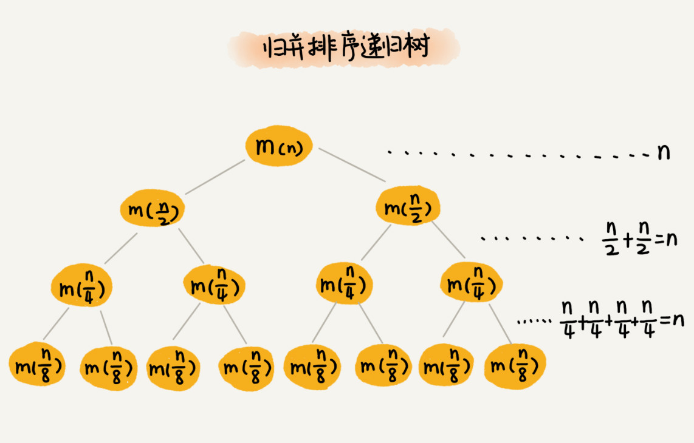

ADT(Abstract Data Type 抽象数据类型) 是一种逻辑描述，描述了我们如何看待数据以及数据所被允许操作。ADT 并不关心数据结构的实现。

特定算法是依赖特定的数据结构的！！常见的数据结构(Data-structure)有很多，但大多数都是以数组或链表作为存储方式的，所以数组、链表可以看作是数据存储的“物理结构”，其他的数据结构可以看作数据存储的“逻辑结构”！！

解决软件开发中的实际问题，最重要的一点就是建模，也就是将复杂的场景抽象成具体的数据结构！！

这部分笔记中的部分图片来自极客时间中的[数据结构与算法之美](https://time.geekbang.org/column/intro/126)课程。

笔记文件的序号后带“A”的是纯算法部分，其余为数据结构部分(会包含部分算法内容)，如 05A-Sort 表示排序算法。

# 复杂度

Why？

直接跑程序来评估算法效率，测试结果非常依赖测试环境、且测试结果受数据规模的影响很大。所以需要一个不用具体测试数据就可以粗略估计算法执行效率的方法

**在规模为 n 的所有输入中选择执行时间最长者作为 $T(n)$，并以 $T(n)$ 度量该算法的时间复杂度。**

补充：

- 在图灵机(Turing Machine, TM)和随机存储器)Random Access Machine, RAM)等计算模型中，指令语句均可分解为若干次基本操作；而在大多数实际的计算环境中，每一次这类基本操作都可在常数时间内完成；
- 将时间复杂度理解为算法中各条指令的执行时间之和。更进一步将**$T(n)$定义为算法所执行基本操作的总次数**。也就是说，$T(n)$取决于组成算法的所有语句各自的执行次数，以及其中所含基本操作的数目。

---

大 O 记号：表示代码执行时间随数据规模增长的变化趋势，代表了最坏情况

- 渐进时间复杂度，表示**算法的执行时间与数据规模之间的增长关系**
- 当 n 足够大，函数 $f(n)$ 是 $T(n)$ 的一个渐近上界，此时，记$T(n) = O(f(n))$
- **在大 O 记号的意义下，函数各项正的常系数可以忽略并等同于 1**
  - 底数均为 2！因为对数之间可以相互转化，如 $O(log_3n)=O(log_32*log_2n)=O(log_2n)$
- **多项式中的低次项均可忽略，只需保留最高次项**

常见的时间复杂度（按数量级递增，最后两种为非多项式量级，十分低效）：

- 常数阶：$O(1)$
- 对数阶：$O(logn)$、$O(nlogn)$
- 线性阶：$O(n)$
- 线性对数阶：$O(nlogn)$
- 平方阶：$O(n^2)$、次方阶：$O(n^3)$ ......
- 指数阶：$O(2^n)$
- 阶乘阶：$O(n!)$

时间复杂度为非多项式量级的算法问题叫做 NP(Non-Deterministic Polynomial，非确定多项式) 问题。

有的代码复杂度由**两个数据的规模**决定，如 $O(m+n)、O(m*n)$。

就渐进复杂度的意义而言，任一算法的任何一次运行过程所用存储空间，都不会多于期间所执行基本操作的累计次数。

**时间复杂度不能完全代表代码的执行时间，只是表示执行时间随数据规模的变化趋势，并不能度量在特定的数据规模下，代码执行时间的多少。如大 O 时间复杂度表示法会忽略掉常数、系数和低阶**，如果时间复杂度中原来的系数是 10，我们现在能够通过优化，将系数降为 1，那在时间复杂度没有变化的情况下，执行效率就提高了 10 倍。

---

时间复杂度的区分：

- 最好情况时间复杂度：在最理想的情况下，执行这段代码的时间复杂度
- 最坏情况时间复杂度：在最糟糕的情况下，执行这段代码的时间复杂度
- 平均时间复杂度
- 均摊时间复杂度：当最坏情况和最好情况的出现频率有规律时，将最坏情况的时间复杂度均摊到到下一次最坏情况出现之间的最好情况上
  - 最坏情况下的操作一旦发生了一次，那么在未来很长一段时间都不会再次发生，这样就会均摊每次操作的代价

举例说明均摊时间复杂度：

数组扩容操作，假设每次数组空间不足时，将其扩容为原来的两倍，摊还分析法：

1. 先进行 n-1 次 $O(1)$ 的添加，
2. 在进行第 n 次添加时，触发 `resize()`，
3. 第 n 次添加操作会先将 n-1 个元素复制到新数组中，再将第 n 个元素添加进去，
4. 共计 n 次的添加，共有 $n -1 次 O(1) 的添加 + n-1 次复制操作 + 1 次添加操作=2n$-1 次基本操作，平均每次添加操作进行 $(2n-1)/2=2$ 次基本操作，所以均摊时间复杂度为 $O(1)$

复杂度震荡：假设现在数组中元素已经满了，执行一次添加操作时，触发`resize()`操作，然后又执行了移除操作，这样的话，每次的添加和移除操作都会触发`resize()`，而不再是多次之后才触发。

解决方案：Lazy。即不再是等到数组中元素为原来一半时就缩容，可以等到减少为原来的 1/4 再缩容。

# 递归

写递归代码的关键就是**找到如何将大问题分解为小问题的规律**，并且基于此**写出递推公式**，然后再推敲**终止条件**，最后将递推公式和终止条件翻译成代码。注意：不用想一层层的调用关系，不要试图用人脑去分解递归的每个步骤。

递归代码要小心**堆栈溢出问题**，如何避免呢？可以通过在代码中限制递归调用的最大深度的方式来解决这个问题。最大深度较小时可以使用该方法，其他情况时该方法不实用。

递归代码还要**警惕重复计算问题**！如：

```go
f(1) = 1;
f(2) = 2;
f(n) = f(n-1)+f(n-2)
```

这种情况下，计算 f(5)，需要计算 f(4) 和 f(3)，而计算 f(4) 要计算 f(3) 和 f(2)，f(3) 被计算了多次。

为了避免重复计算，可以**通过一个数据结构(比如散列表) 来保存已经求解过的 f(k)。当递归调用到 f(k) 时，先看下是否已经求解过了。如果是，则直接从散列表中取值返回，不需要重复计算**。

在空间复杂度上，因为递归调用一次就会在内存栈中保存一次现场数据，所以在分析递归代码空间复杂度时，需要额外考虑这部分的开销。

**递归层次很深的递归代码几乎无法使用 IDE 的单步跟踪功能，那该怎么调试呢？可以通过打印日志、结合条件断点进行调试！**

## 时间复杂度

### 递推公式求解

递归的适用场景：一个问题 a 可以分解为多个子问题 b、c，那求解问题 a 就可以分解为求解问题 b、c。问题 b、c 解决之后，我们再把 b、c 的结果合并成 a 的结果。

如果定义求解问题 a 的时间是 $T(a)$，求解问题 b、c 的时间分别是 $T(b)$ 和 $T(c)$，就可以得到这样的递推关系式：

```
T(a) = T(b) + T(c) + K
// K 等于将两个子问题 b、c 的结果合并成问题 a 的结果所消耗的时间
```

**不仅递归求解的问题可以写成递推公式，递归代码的时间复杂度也可以写成递推公式。**

示例可见归并排序的时间复杂度计算。

### master 公式

- master 公式：$T(N) = a*T(N/b) + O(N^d)$
  - 说明：
    - $T(N/b)$ 是样本量为 N/b 的子过程的的时间复杂度；
    - $a$ 是子过程执行的次数
    - $O(N^d)$ 是除去调用子过程外剩下所消耗的代价
    - 注意：划分的子过程的样本量必须是一样的
  - 如果 $log(b,a) > d$ 则复杂度为 $O(N^{log(b,a)})$;
  - 如果 $log(b,a) = d$ 则复杂度为 $O(N^d * logN)$；
  - 如果 $log(b,a) < d$ 则复杂度为 $O(N^d)$。
  - 这里并没有将所有情况列出，其他见：[算法复杂度与 master 定理](http://www.gocalf.com/blog/algorithm-complexity-and-master-theorem.html)

如：使用二分法求一个数组的最大值，先得到左右两半的最大值，再比较这两个最大值从而得到数组最大值。

该算法的时间复杂度$T(N)=2*T(N/2)+O(N^0)=O(N^{log(2,2)})=O(N)$。

注意：上面例子中将数组分为两份，递归下去每一份又会被分为两份...但是在使用 master 公式时，a 仅为第一次划分的 2 份。

### 递归树

递归的思想是将大问题一层一层分解为小问题，直到问题的数据规模被分解得足够小，不用继续递归分解为止。而这一分解过程画成图就是一棵树，也即递归树。

下面是斐波那契(fibonacci)数列的递归树，节点中的数字表示数据规模，一个节点的求解可以分解为左右子节点两个问题的求解：


那么如何使用递归树求时间复杂度呢？以归并算法为例：



每一层归并操作消耗的时间总和是一样的，跟要排序的数据规模有关，假设每一层归并操作的时间复杂度为 n，那么只要知道树的高度 h，即可得到总的复杂度 $O(h*n)$。

归并排序每次会将数据一分为二，所以最后得到的递归树是一棵满二叉树，而满二叉树的高度约为 $log_2n$，所以归并排序的时间复杂度为 $O(nlogn)$。

这里仅列举了一个简单的例子，详见：[-数据结构与算法之美-递归树](https://time.geekbang.org/column/article/69388)

## 递归与迭代

- 程序结构不同：
  - 递归是重复调用函数自身实现循环
  - 迭代是函数内某段代码实现循环
    - 迭代与普通循环的区别是：循环代码中参与运算的变量同时是保存结果的变量，当前保存的结果作为下一次循环计算的初始值。
- 算法结束方式不同
  - 递归循环中，遇到满足终止条件的情况时逐层返回来结束
  - 迭代则使用计数器结束循环
- 效率不同：循环的次数较大的时候，迭代的效率明显高于递归

# 对数器

对数器是用来测试代码正确性的，在找不到合适的 OJ(Online Judge)系统测试自己的代码时，可以自己写一个对数器对代码进行测试。使用：

1. 有一个你想要测的方法 a；
2. 实现一个绝对正确(复杂度可能很差)的方法 b；
3. 实现一个随机样本产生器；
4. 实现比对的方法；
5. 把方法 a 和方法 b 比对很多次来验证方法 a 是否正确。
6. 如果有一个样本使得比对出错，打印样本分析是哪个方法出错；
7. 当样本数量很多时比对测试依然正确，可以确定方法 a 已经正确。

```go
// 生成随机切片，需给定切片的最大长度和最大值
// 返回元素完全相同的两个切片，分别用于待测方法和完全正确的方法使用
func generateRandomSlice(maxSize, maxValue int) (nums1, nums2 []int) {
	rand.Seed(time.Now().UnixNano())
  // 这里将 +1 写在 Intn() 外面是为了保证切片长度一定大于 1
	nums1 = make([]int, rand.Intn(maxSize)+1)
	for i := 0; i < len(nums1); i++ {
		nums1[i] = rand.Intn(maxValue+1) - rand.Intn(maxValue)
	}
  // 创建一个新的切片，并将 nums1 的值赋给 nums2
	nums2 = make([]int, len(nums1))
	copy(nums2, nums1)
	return
}
// 测试上面生成的切片是否随机
func TestGenerateRandomSlice(t *testing.T) {
	for i:=0;i<10;i++{
		nums1, nums2 := generateRandomSlice(10, 99)
		t.Log(nums1,"\n",nums2)
		time.Sleep(time.Nanosecond) // 这里如果不写的话，会有很多切片是相同的
	}
}
```

以冒泡排序为例，使用对数器

```go
func TestBubbleSort(t *testing.T) {
	for i := 0; i < 1000; i++ {
		nums1,nums2 := generateRandomSlice(15, 99)
    // 要测试的方法
		BubbleSort(nums1, len(nums1))
    // 绝对正确的方法，这里使用了系统自带的函数
		sort.Ints(nums2)
    // 这里借助了 go-cmp 框架进行测试数的比较
		diff := cmp.Diff(nums1, nums2)
		if diff!= "" {
			t.Fatalf(diff)
		}
		time.Sleep(time.Nanosecond)
	}
}
```

# 动态数据结构

动态数据结构是支持动态的更新操作，里面存储的数据是时刻在变化的，通俗一点讲，它不仅仅支持查询，还支持删除、插入数据。而且，这些操作都非常高效。如果不高效，也就算不上是有效的动态数据结构了。

链表、队列、栈实际上算不上动态数据结构，因为操作非常有限，查询效率不高。

# 索引

涉及索引时如何定义清楚需求？根据系统设计需求，可分为功能性需求、非功能性需求：

- 功能性需求要考虑以下几点：
  - 数据是格式化数据还是非格式化数据
    - 格式化数据，如 MySQL 中的数据
    - 非格式化数据，如搜索引擎中网页。非格式化数据一般需要做预处理，提取出查询关键词，对关键词构建索引
  - 数据是静态数据还是动态数据
    - 原始数据为静态数据，不会有数据的增删改，所以构建索引时只需要考虑查询效率即可
    - 动态数据不仅要考察查询效率，在原始数据更新时还要动态更新索引
  - 索引存储在硬盘还是内存
    - 存储在内存中，查询效率肯定比在硬盘中高，但如果原始数据量很大，索引也会很大，这时由于内存有限，就必须将索引存储在硬盘中了
    - 还可以部分存储在内存中，部分存储在磁盘中，就可以兼顾内存消耗和查询效率
  - 单值查找还是区间查找
    - 单值查找就是根据查询关键词等于某个值的数据，最常见
    - 区间查找，就是查找关键词处于某个区间值的所有数据
  - 单关键词查找还是多关键词组合查找
    - 单关键词的查找，索引构建起来相对简单些
    - 对于多关键词查询来说，要分多种情况
      - 像 MySQL 这种结构化数据的查询需求，我们可以实现针对多个关键词的组合，建立索引；
      - 像搜索引擎这样的非结构数据的查询需求，可以针对单个关键词构建索引，然后通过集合操作(并、交集等)，计算出多个关键词组合的查询结果
- 非功能性需求要考虑：
  - 无论存储在内存还是硬盘，索引对存储空间的消耗不能太大
    - 注：存储在硬盘中，那索引对占用存储空间的限制，稍微会放宽一些，但有时候，索引对存储空间的消耗会超过原始数据。这也要小心
  - 在考虑索引查询效率的同时，还要考虑索引的维护成本

构建索引常用的是支持动态数据集合的数据结构，如散列表、红黑树、跳表、B+树，此外，位图、布隆过滤器可以作为辅助索引，有序数组可以用来对静态数据构建索引。

- 散列表增删改查操作的性能非常好，时间复杂度是 $O(1)$
  - 一些键值数据库，比如 Redis、Memcache，就是使用散列表来构建索引的。这类索引，一般都构建在内存中。
- 红黑树的数据插入、删除、查找的时间复杂度是 $O(logn)$，也非常适合用来构建内存索引
  - Ext 文件系统中，对磁盘块的索引，用的就是红黑树。
- B+ 树比起红黑树来说，更加适合构建存储在磁盘中的索引
  - B+ 树是一个多叉树，对相同个数的数据构建索引，B+ 树的高度要低于红黑树。当借助索引查询数据的时候，读取 B+ 树索引，需要的磁盘 IO 次数非常更少。所以，大部分关系型数据库的索引，比如 MySQL、Oracle，都是用 B+ 树来实现的。
- 跳表也支持快速添加、删除、查找数据。而且，通过灵活调整索引结点个数和数据个数之间的比例，可以很好地平衡索引对内存的消耗及其查询效率
  - Redis 中的有序集合，就是用跳表来构建的。
- 位图和布隆过滤器这两个数据结构，也可以用于索引中，辅助存储在磁盘中的索引，加速数据查找的效率
  - 布隆过滤器判定存在的数据有一定的误判率，但是对不判定不存在的数据则一定的是不存在的，且布隆过滤器内存占用非常少
    - 针对数据，构建一个布隆过滤器，并且存储在内存中
    - 当要查询数据的时候，先通过布隆过滤器，判定是否存在
    - 如果通过布隆过滤器判定数据不存在，那就没有必要读取磁盘中的索引了。对于数据不存在的情况，数据查询就更加快速了。
    - 这样就可以有效的发挥其优势了
  - 有序数组也可以被作为索引
    - 如果数据是静态的，也就是不会有增删改操作，可以把数据的关键词(查询用的)抽取出来，组织成有序数组，然后利用二分查找算法来快速查找数据。
