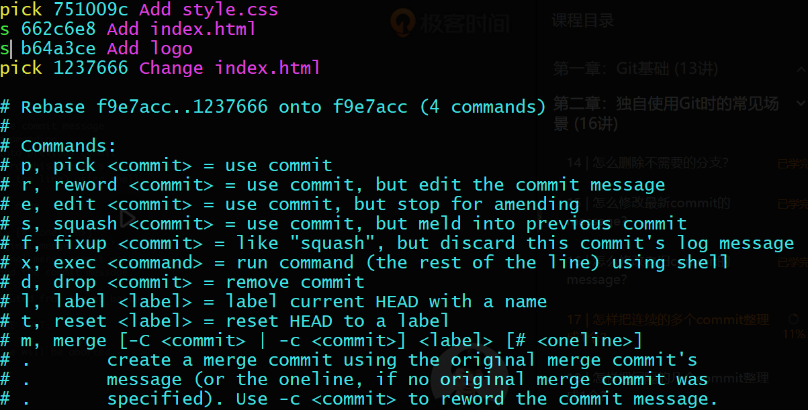
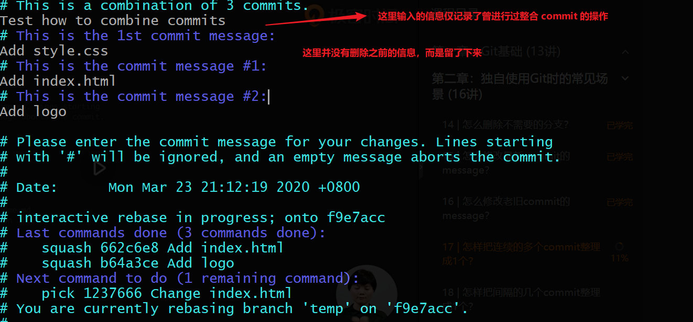
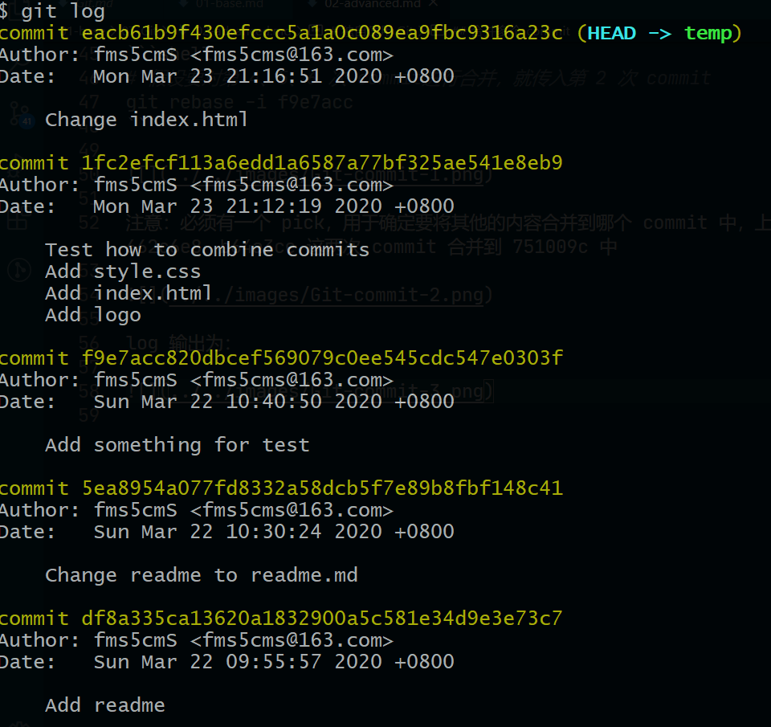
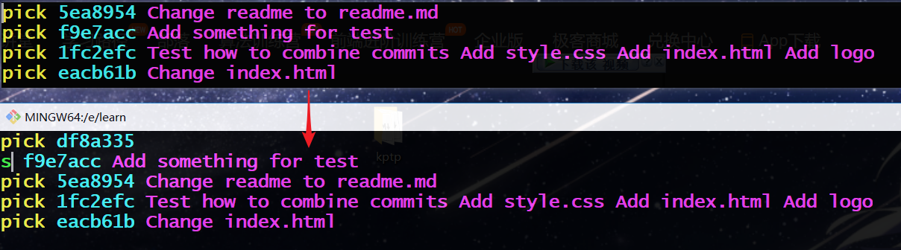

**禁止向集成分支执行 `git push -f` 操作！**

**公共分支严禁拉取到本地后做 rebase 操作去变更历史的！**

# 独自使用 Git

- 删除分支

```shell
# 分支建错、分支的内容已经合并完成不再需要此分支
git branch -d branch_name
# 上面的命令有时会有警告信息 “error：The branch is not fully merged”，也就意味着删除有风险
# 如果确定该分支对项目没有影响的话，使用下面的命令：
git branch -D branch_name
```

## 修改 commit 的 message

```shell
# 修改最近一次 commit 的 message
git commit --amend # 然后就可以修改
# 修改老旧 commit 的 message
# -i 表示是交互式的
# 如果要对第 3 次 commit 的 message 修改，就需要传入第 2 次 commit
git rebase -i parent_commit_of_changed_commit
# 根据交互界面下面的提示，将要修改的 commit 前面的 pick 改为 r，保存退出后会弹出修改 message 的交互界面
# 修改成功后可以看出，这里其实利用了分离头指针
# 先分离头指针；然后在上面做调整；调整完后把指针指向最新的 commit
```

注意：这是在当前 branch 上做变更，还未贡献到团队的集成 branch 上，如果已经贡献上去了，就不能这么轻易的 rebase 了！！

## 合并多个 commit

- 合并连续多个 commit 为一个

```
$ git log --oneline
1237666 (HEAD -> temp) Change index.html
b64a3ce Add logo
662c6e8 Add index.html
751009c Add style.css
f9e7acc Add something for test
5ea8954 Change readme to readme.md
df8a335 Add readme
```

```shell
# 假设要对第 4、5、6 次 commit进行合并，就传入第 2 次 commit
git rebase -i f9e7acc
```



注意：必须有一个 pick，用于确定要将其他的内容合并到哪个 commit 中，上图中表示将 662c6e8、b64a3ce 这两次 commit 合并到 751009c 中



log 输出为：



- 合并非连续的多个 commit

```shell
$ git log --oneline
eacb61b (HEAD -> temp) Change index.html
1fc2efc Test how to combine commits Add style.css Add index.html Add logo
f9e7acc Add something for test
5ea8954 Change readme to readme.md
df8a335 Add readme
```

```shell
# 假设合并第 1、3 个commit，由于第 1 个 commit 没有父 commit，所以只能填入第 1 个
git rebase -i df8a335
```

将原内容(上部分)修改(为下部分)：



注意：这里手动输入了第 1 个 commit，message 可以不输入，将要合并的第 3 个 commit 调整位置与第 1 个相邻，改其 pick 为 s，其他保持不动。**也可以使用 `git rebase -i --root` 就不需要再手动输入第 1 个 commit 了。**

之后可能会需要输入 `git rebase --continue`，之后的操作类似之前合并连续 commit。

## 比较

- 暂存区和 HEAD 的差异：`git diff --cached`
  - 修改后仅 add 而没有 commit
- 工作区和暂存区的差异：`git diff` 默认会对所有文件比较
  - 如果要比较单/多个文件：`git diff -- file_name1 file_name2`
- 比较不同提交的指定文件的差异：
  - 比较两个 commit 所有文件的差异：`git diff commit1 commit2`
  - 比较两个 commit 部分文件的差异：`git diff commit1 commit2 -- file_name1 file_name2`
  - commit 可以替换为 branch 名，就是比较两个 branch 各自最近一次 commit 的差异

## 恢复

- 将暂存区恢复成与 HEAD 一样，即不保留暂存区的所有变更：`git reset HEAD`
  - 如果仅恢复部分文件：`git reset HEAD -- file_name1 file_name2`
- 将工作区恢复成与暂存区一样：`git checkout -- file_name1 file_name2`
- 将工作区和暂存区都恢复到指定的 commit：`git reset --hard 指定的commit`

## stash 暂存任务

场景：正在开发过程中，突然有紧急任务。

先将正在开发的内容保存；等到紧急任务完成且生成新的 commit 后，再把之前开发的内容恢复出来。下面为步骤及输出信息

```shell
$ git stash  # 暂时保存正在进行的工作
Saved working directory and index state WIP on temp: eacb61b Change index.html
$ git stash list  # 查看
stash@{0}: WIP on temp: eacb61b Change index.html
$ git status  # 可以看到此时工作区没有任何需要提交的内容
On branch temp
nothing to commit, working tree clean
# todo 紧急任务完成，add、commit
# 方法一：
$ git stash apply  # 将之前暂存的内容恢复到工作区，显示内容较多不再列出
$ git stash list  # 可以看出 stash list 中的内容仍在
stash@{0}: WIP on temp: eacb61b Change index.html
# 方法二：
$ git stash pop  # 将之前暂存的内容恢复到工作区，显示内容较多不再列出
$ git stash list # stash list 中的内容不在了
```

`git stash apply` ：将原本暂存的内容放回到工作区；`stash list` 里的内容还在，可以重复使用！

`git stash pop` ：将原本暂存的内容放回到工作区；`stash list` 里的内容删除。

## 备份

- 传输协议：

| 常用协议        | 语法格式                                 | 说明                     |
| --------------- | ---------------------------------------- | ------------------------ |
| 本地协议 1      | `/path/to/repo.git`                      | 哑协议                   |
| 本地协议 2      | `file://path/to/repo.git`                | 智能协议                 |
| http/https 协议 | `http://git-server.com/path/to/repo.git` | 平时接触到的都是智能协议 |
| ssh 协议        | `user@git-server.com:path/to/repo.git`   | 工作中最常用的智能协议   |

哑协议在备份时没有进度的显示，而智能协议有，且智能协议传输速度更快！

这里使用 clone 的方式举例在本地备份远端仓库：

```shell
# 不带工作区的裸仓库，后续做变更在 push 时会较为方便
git clone --bare /Users/learn/.git ya.git # 使用哑协议
git clone --bare file:///Users/learn/.git zhineng.git # 使用智能协议
```

将本地做的变更备份到远端仓库：

```shell
git remote -v # 查看本地是否与远端仓库关联
git remote add name url # 添加一个远程仓库与本地仓库关联，远程仓库的名称推荐使用默认的名称 origin
git push # 将本地的变更更新到远端
```

# Github

**注意：clone 完成后，尽管可以看到所有远程分支，但在本地是无法基于远程分支做变更的！只能基于远程分支建本地分支后，才能创建 commit**

```shell
# 基于远端分支创建并切换到本地分支，remote_branch_name 可以通过 git branch -av 获得
# 如得到 remotes/origin/feature/add_git_commonds 这里就使用 origin/feature/add_git_commonds
git branch -b branch_name remote_branch_name
```

- 添加公私钥：[官方文档 connecting-to-github-with-ssh](https://help.github.com/en/github/authenticating-to-github/connecting-to-github-with-ssh)

```shell
ssh-keygen -t rsa -b 4096 -C "your_email@example.com"
# 然后一直回车就好
# 查看是否生成/已有公私钥，其中 id_rsa 是私钥，id_rsa.pub 是公钥
ls -al ~/.ssh
```

需要将公钥中的内容粘贴到 Github 上。

配置好公私钥以后，使用 ssh 协议做 push 操作时，不需要输入用户名密码了。

- 同步个人仓库到 Github

```shell
# 将本地与 Github 上的项目建立关联
# 相当于用 github1 代替后面的远端项目地址
git remote add github1 xxx.git
# 在向远端 push 之前，需要先将远端的内容拉取下来
# git pull 有两步：1. fetch 从远端将内容拉取下来；2. 将远端分支与本地有父子关系的分支进行 merge
# git fetch 仅将远端内容拉取下来
git fetch github1 master  # 指定项目地址和分支
# 将远端 master 分支 merge 到当前的本地分支
git merge github1/master
# 如果不相关的两棵树 merge 会报错：fatal: refusing to merge unrelated histories
# git merge -h 查看 merge 的帮助文档，可以使用 --allow-unrelated-histories 参数
# 向远端仓库 push 本地 master 分支，也可以使用 --all 来 push 所有本地分支
git push github11 master
```

merge 操作最后得到的结果通过 `gitk` 可以看到当前的 commit 有两个 parent，而之前的 rebase 操作得到的 parent 始终是一个！

# 多人单分支

注意：两个用户使用的是不同的本地仓库文件夹。

```shell
# 用户 1 clone 远端内容
git clone 远端地址 # 这里默认的远端地址为 origin ！
# 基于远端分支创建本地分支 user1
git branch -b user1 origin/feature/change_base_info

# 用户 2 与远端仓库建立关联并命名为 github1
git remote add github1 远端地址
# 拉取远端内容
git fetch github1
# 基于远端分支创建本地分支 user2，注意，两个用户要基于相同的远程分支来创建本地分支！
git branch -b user2 github1/feature/change_base_info
```

## 多人修改了不同文件

场景：两个人维护同一个分支，在同一个分支中，两个人修改了不同的文件。

```shell
# 用户 1 修改了 readme.md 并提交
git push
# 用户 2 修改了 index.html 并提交，但还未 push
# 用户 1 又修改了 readme.md 提交并 push
# 此时 用户 2 进行 push 会报错，多人协作时不允许使用 -f 强制 push！
git fetch github1
# 查看分支，当前本地分支部分提示 [ahead 1,behind 1] 说明本地分支有一个 commit 比远端的新，远端有一个 commit比本地新
git branch -av
git merge github1/feature/change_base_info # 和远端分支合并
git push
```

## 多人修改了同一文件的不同区域

```shell
# 用户 1 先修改了 index.html 的一部份内容并提交
# 用户 2 修改了 index.html 的另一部分内容并提交
# 用户 2 先 push
# 用户 1 push 会报错

# 方式一：用户 1 先 pull，再 push
# 方式二：用户 1 先 fetch，再 merge，最后 push
git fetch
git merge origin/feature/change_base_info
```

## 多人修改了同一文件的同一区域

```shell
# 两个用户都修改了 index.html 的同一区域且都提交
# 用户 1 先 push
# 用户 2 push 报错，以下操作为用户 2
# merge 提示 Already up to date，但是 push 是报错的，说明远端发生了改变
git merge github1/feature/change_base_info
# 所以需要先 pull，但是会失败，并提示：CONFLICT(content) 内容冲突
git pull
# 进入文件会发现以下三种提示信息来标志冲突的位置：
# “<<<<<<< HEAD” 是本地的内容
# “============”  作为本地和远端冲突内容的分隔线
# “>>>>>>> 40 位的 commit 字符”  是远端的内容
# 此时 Git 是无法帮助我们合并内容的，只能自己手动修改，删除上面三种信息，并修改为最终结果，保存
vim index.html
# status 提示当前分支，以及当前分支与远程分支 diverged，且 Unmerged path: ...
git status
# 如果我们所作的变更是 ok 的，可以执行 git commit
# 如果不想让这两个分支 merge 了，可以执行 git merge --abort 恢复为之前的状态
# 最后 git push
```

## 一人变更文件名一人变更文件内容

```shell
# 用户 1 修改 index.html 文件名为 index.htm 并提交且 push
# 用户 2 修改了 index.html 的部分内容并提交， push 会报错
git pull # 会发现，Git 自动将文件名修改为 index.html，且文件内容也是修改以后的
git push
```

## 同一文件修改为不同文件名

```shell
# 用户 1 修改 index.html 文件名为 index1.htm 并提交但未 push
# 用户 2 修改 Index.htm 文件名为 index2.htm 并提交且 push
# 用户 1 push 会报错
git pull # 提示信息：CONFLICT(rename/rename) ，且此时本地目录下 index1.htm、index2.htm 两个文件都会出现
diff index1.htm index2.htm # 比较两个文件的内容，发现内容相同
git status # 提示 "both deleted: index.htm; added by us index1.htm; added by them: index2.htm"
git rm index.htm
git add index1.htm # 假设两个用户协商后决定使用 index1.htm 作为文件名
git rm index2.htm
git status # 提示 "All conflict fixed but you are still merging"，
# 提交、push
```

# Git 集成使用禁忌
