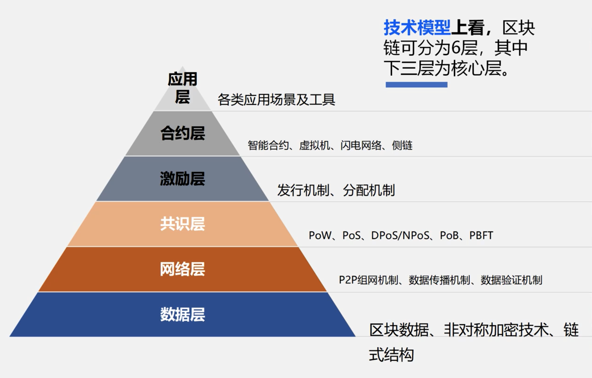
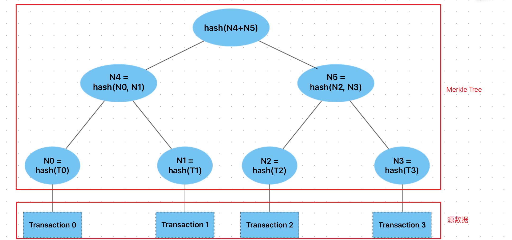

区块链的分层模型：

# 哈希

TODO 补充？

# Merkle tree

Merkle Tree 是一颗哈希树，树的每个节点存储的是 hash 值，可以是二叉树也可以是多叉树。

- 防篡改：树中任意节点发生改变，都会导致根节点的改变
- 存在性证明：可以使用少量数据快速证明一个节点的存在性
  - 如，证明 N1 存在，则只需提供 N0、N5，他人就可以通过计算快速验证 N1 的存在
- 快速比较大量数据
- 快速定位修改

Merkle Tree 常用于分布式系统，可用于验证计算机之间存储，处理和传输的任何类型数据，确保在 P2P 网络中收到的数据块没有被破坏或者篡改，甚至有没有发送假数据块。

如，在 P2P 网络传输中，文件被分割成大量小数据块，客户端会同时从其它 P2P 客户机下载数据块，由于网络中不稳定性和不可信的存在，需要对每个数据块进行完整性验证，当其中某块数据损坏时，只重传某块数据而不用重新下载整个文件。为了完成数据块的验证，在文件下载前先获取所有数据块的 Hash 列表，再将所有 Hash 列表进行 Hash 得到一个根 Hash，将客户端计算的根 Hash 与可信根 Hash 比较来验证 Hash 列表的完整性。

TODO https://zhuanlan.zhihu.com/p/62892887

# 区块链的结构

区块链中的每个区块包含两部分：

- 区块头，主要存储参数信息（上一个区块的区块 hash、版本号、时间戳、Merkle 根、难度值、nonce）
- 区块体，通过 Merkle 树的结构存储交易信息

# 分布式共识

在区块链的 P2P 网络中的每个节点都可以产生区块，那哪个节点产生的区块可以被系统接受，也就是说如何分配记帐权或达成共识？拜占庭将军问题。

[Consistency&Consensus](https://github.com/fms5cmS/arts/blob/master/share/12_consistency%26consensus.md)

# 交易性能

一般情况下，区块链并不适用于高频交易的场景，但由于金融系统的迫切需求，业界目前积极探讨如何提高其交易性能，包括**吞吐量（Throughput）**和**确认延迟（Latency）**两个方面。

# 智能合约

为了支持以同样的方式更新信息，并实现一整套账本功能（交易、查询等），区块链使用智能合约来提供对账本的受控访问。

智能合约不仅是在网络中封装和简化信息的关键机制，它还可以被编写成自动执行参与者的特定交易的合约。

# 顺序执行架构

大多数现有的具有智能合约能力的区块链平台遵循顺序执行架构，其中共识协议：

- 验证并将交易排序，然后将它们传播到所有节点
- 每个节点安顺序执行交易

采用顺序执行架构的区块链，其执行智能合约的结果一定是确定的，否则可能永远无法达成共识。为了解决非确定性问题，许多平台要求智能合约以非标准或特定领域的语言（例如 Solidity）编写，以便消除非确定性操作。

都按顺序执行所有交易，性能和规模被限制。事实上系统要求智能合约代码要在每个节点上都执行，这就需要采取复杂措施来保护整个系统免受恶意合约的影响，以确保整个系统的弹性。
