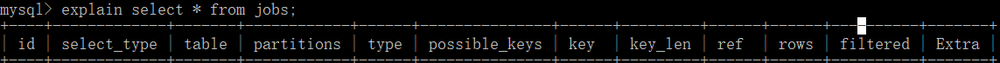
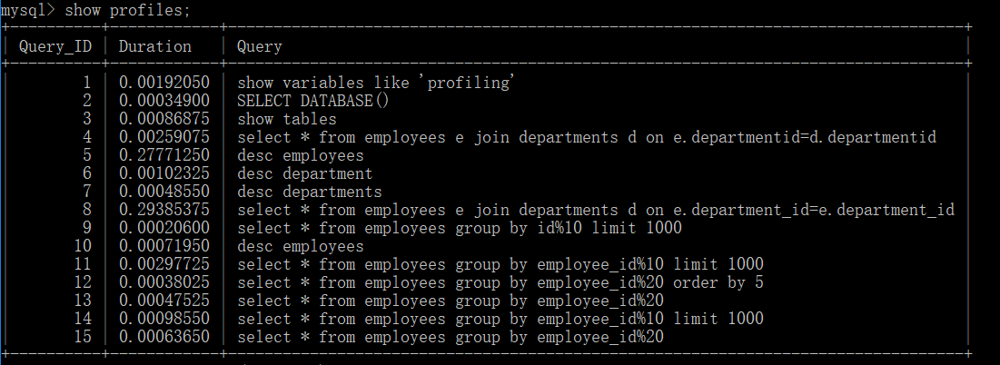
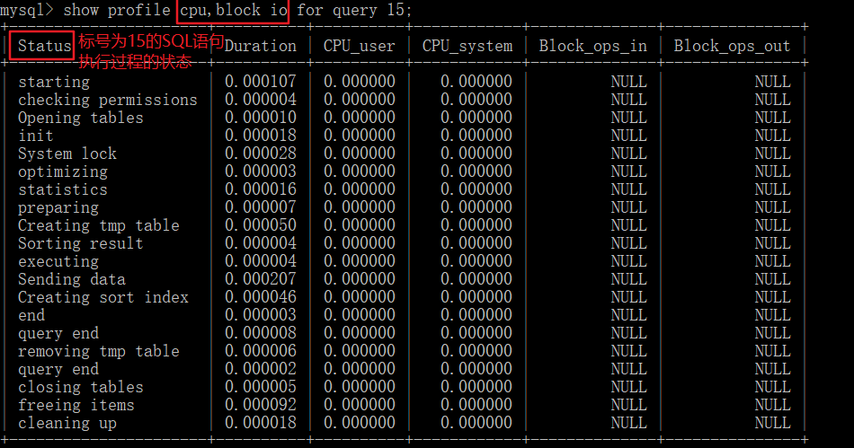

性能下降导致 SQL 慢，其结果：执行时间长 或 等待时间长。主要原因：

- 查询语句写的差；
- 索引失效；
- 关联查询有太多的`join`（设计缺陷或不得已的需求）；
- 服务器调优及各个参数设置（缓冲、线程数等）；


# 数据库调优

数据库调优的目的就是要让数据库运行得更快，也就是说响应的时间更快，吞吐量更大。

数据库调优的选择维度：

- 选择合适的 RDBMS
  - 对事务性处理以及安全性要求高的话，可以选择商业的数据库产品。
- 优化表的设计
- SQL 查询优化
  - 逻辑查询优化：通过改变 SQL 语句让 SQL 执行效率更高效，采用的方式是对 SQL 语句进行等价变换，对查询进行重写。
  - 物理查询优化：将逻辑查询的内容变成可以被执行的物理操作符，从而为后续执行器的执行提供准备。
    - 核心是高效地建立索引，并通过这些索引来做各种优化。
- 使用 Redis 或 Memcached 作为缓存
- 库级优化
  - 控制一个库中的数据表数量、采用主从架构优化读写策略、分库分表

# profiling

通过 profiling 手机 SQL 执行时所使用的资源（时间）情况。

```sql
-- 查询 profiling 是否开启，0 代表关闭
select @@profiling;
-- 开启 profiling
set profiling=1;
-- 执行 SQL，如
select * from heros;
-- 查看当前会话产生的所有 profiles
show profiles;
-- 获取上一次查询的执行时间，得到的信息更详细
-- 会包含权限检查、打开表、初始化、锁系统、优化查询、准备、执行 等多个过程的耗时
show profile;
```


# Explain！

使用`EXPLAIN`关键字可以模拟优化器执行 SQL 查询语句，从而知道 MySQL 是如何处理 SQL 语句的。分析查询语句或是表结构的性能瓶颈。

- `explain` 可以获取以下信息：
  - 表的读取顺序（从`id`可得到）
  - 数据读取操作的操作类型（从`select_type`可得到）
  - 哪些索引可以使用（从`possible_keys`可得到）
  - 哪些索引被实际使用（从`key`、`ref`可得到）
  - 表之间的引用（从`ref`可得到）
  - 每张表有多少行被优化器查询（从`rows`可得到）

---

如何使用？

输入 `explain SQL语句` 即可，返回：



- `id`：`SELECT`查询的序列号，包含一组数字，表示查询中执行`SELECT`子句或操作表的顺序。
  - `id`如果相同，可以认为是一组，从上往下顺序执行；
  - `id`如果不同，`id`值越大，优先级越高，越先执行。`NULL`最后执行。
- `select_type`：查询的类型，主要是用于区别普通查询、联合查询、子查询等的复杂查询。常见的值：
  - `SIMPLE`：简单的`SELECT`查询，查询中不包含子查询或联合查询；
  - `PRIMARY`：查询中若包含任何复杂的子部分，最外层查询则会被标记为`PRIMARY`；
  - `SUBQUERY`：在`SELECT`或`WHERE`列表中包含的子查询；
  - `DERIVED`：在`FROM`列表中包含的子查询会被标记为`DERIVED`（衍生），MySQL 会递归地执行这些子查询，把结果放在临时表里；
  - `UNION`：若第二个`SELECT`出现在`UNION`之后，则会被标记为`UNION`；若`UNION`包含在`FROM`子句的子查询中，外层的`SELECT`将被标记为`DERIVED`；
  - `UNION RESULT`：从`UNION`表获取结果的`SELECT`。
- `table`：显示这一行的数据是关于哪张表的。
- `partitions`
- `type`：访问类型排列。下面**从最差到最好**列出了常见的取值：
  - `ALL`：即 Full Table Scan。将遍历全表以找到匹配的行；
  - `index`：即 Full Index Scan。`index`与 `ALL`的区别为 index 类型只遍历索引树。这通常比`ALL`快，因为索引文件通常比数据文件小。（也就是说虽然`ALL`和`index`都是读全表，但`index`是从索引中读取的，而`ALL`是从硬盘中读的）；
  - `range`：只检索给定范围的行，使用一个索引来选择行。`key`列显示使用了那个索引。一般就是在`where`与剧中出现`between`、`<`、`>`、`in`等的查询。这种范围扫描索引比全表扫描要好，因为它只需要开始于索引的某一点，而结束于另一点，不用扫描全部索引；
  - `ref`：非唯一性索引扫描，返回匹配某个单独值的所有行。本质上也是一种索引访问，它返回所有匹配某个单独值的所有行，然而它可能会找到多个符合条件的行，所以它应该属于查找和扫描的混合体；
  - `eq_ref`：唯一性索引扫描，对于每个索引键，表中只有一条记录与之匹配。常见于主键或唯一索引扫描；
  - `const`：表示通过索引一次就找到了，`const`用于比较`primary key`或`unique`索引。因为只匹配一行数据，所以很快。如将主键置于`where`列表中，MySQL 就能将该查询转换为一个常量；
  - `system`：表只有一行记录（等于系统表），这是`const`类型得特例，平时不会出现。
  - `NULL`
  - 全部取值从最好到最差依次是：`system`>`const`>`eq_ref`>`ref`>`fulltext`>`ref_or_null`>`index_merge`>`unique_subquery`>`index_subquery`>`range`>`index`>`ALL`
  - 一般来说，得保证查询至少达到`range`级别，最好能达到`ref`。
- `possible_keys`：显示可能应用在这张表中的索引，一个或多个；查询涉及到的字段上若存在索引，则该索引将被列出，但不一定被查询实际使用。
- `key`：实际使用的索引。如果为`NULL`，则没有使用索引。查询中若使用了覆盖索引，则该索引仅出现在`key`列表中。
- `key_len`：表示索引中使用的字节数，可通过该列计算查询中使用的索引的长度。在不损失精确性的情况下，长度越短越好。该列显示的值为索引字段的最大可能长度，并非实际使用长度，即`key_len`是根据表定义计算而得，不是通过表内检索出的。
- `ref`：显示索引的哪一列被使用了，如果可能的话，是一个常数。哪些列或常量被用于查找索引列上的值。
- `rows`：根据表统计信息及索引选用情况，大致估算出找到所需的记录需要读取的行数。
- `filtered`
- `Extra`：包含不适合在其他列中显示但十分重要的额外信息。
  - **`Using filesort`**：说明 MySQL 会对数据是用一个外部的索引排序，而不是按照表内的索引顺序进行读取。MySQL 中无法利用索引完成的排序操作称为文件排序。出现该值后，需要进行优化；
  - **`Using temporary`**：使用了临时表保存中间结果，MySQL 在对查询结果排序时使用临时表。常见于排序`order by`和分组查询`group by`。出现该值后，需要进行优化；
  - **`Using index`**：表示相应的`select`操作中使用了覆盖索引（Covering Index），避免访问了表的数据行，效率不错！
    - 如果同时出现`Using where`，表明索引被用来执行索引键值的查找；（利用索引列来查找其他字段的内容）
    - 如果没有同时出现`Using where`，表明索引被用来读取数据而非执行查找动作。（查询的内容就是索引字段的内容）
  - `Using where`
  - `Using join buffer`：使用了连接缓存；
  - `impossible where`：`where`子句的值总是`false`，不能用来获取任何元组；
  - `select tables optimized away`：在没有`group by`子句的情况下，基于索引优化`MIN`/`MAX`操作或对于 MyISAM 存储引擎优化`COUNT(*)`操作，不必等到执行阶段再进行计算，查询执行计划生成的阶段即将完成优化；
  - `distinct`：优化`distinct`操作，在找到第一匹配的元组后即停止找同样值的动作。

说明：

覆盖索引（Covering Index）：即`select`的数据列只用从索引中就能取得，不必读取数据行，MySQL 可以利用索引返回`select`列表中的字段，而不必根据索引再次读取数据文件，换句话说**查询列要被所建的索引覆盖**。

注意如果查询列有多列，则查询列的顺序要和索引的顺序是一致的。

如果要使用覆盖索引，一定要注意`select`列表中只取出需要的列，不可`select *`。因为如果将所有字段一起做索引会导致索引文件过大，查询性能下降。

# 慢查询日志

MySQL 的慢查询日志是 MySQL 提供的一种日志记录，用于记录在 MySQL 中响应时间超过阈值的语句，具体指运行时间超过`long_query_time`的 SQL，会被记录到慢查询日志中。

默认情况下，MySQL 数据库没有开启慢查询日志，**需要手动来设置这个参数**。当然，如果不是调优需要的话，**一般不建议启动该参数**，因为开启慢查询日志或多或少会带来一定的性能影响。

- 开启&设置

```sql
-- 查看慢查询日志是否开启，默认值 slow_query_lod=OFF
show variables like '%slow_query_log%'
-- 开启慢查询日志，但只对当前数据库生效，MySQL 重启后则会失效。
-- 要想永久开启，在 my.ini 配置文件中设置
set global slow_query_log=1
-- 查看时间阈值(默认 10s)，即执行时间大于(没有等于) 10s 的查询都属于慢查询
show variables like 'long_query_time%'
-- 设置时间阈值，设置完后，需要重新连接或新开一个会话才能看见修改值
set global long_query_time=数字
```

- 配置文件中相关的配置

```ini
# 慢查询的开启状况，1为开启，0为禁用
slow-query-log=1
# 慢查询日志输出文件名，如果不设置的话，默认为主机名-slow.log
slow_query_log_file="ZHANGZK-slow.log"
# 慢查询的时间阈值
long_query_time=10
```

---

查询当前系统中有多少条慢查询记录：`show global status like '%Slow_queries%';`

MySQL 提供了日志分析工具 mysqldumpslow，常用：

```sql
-- 得到返回记录集最多的10个SQL
mysqldumpslow -s r -t 10 慢查询日志的目录地址
-- 得到访问次数最多的10个SQL
mysqldumpslow -s c -t 10 慢查询日志的目录地址
-- 得到按照时间排序的前10条里面含有左连接的查询语句
mysqldumpslow -s t -t 10 -g "left join" 慢查询日志的目录地址
-- 建议在使用这些命令时结合 | 和 more 使用，这是在Linux系统中
mysqldumpslow -s r -t 10 慢查询日志的目录地址 | more
```

使用 `mysqldumpslow --help` 可以查看相关命令的帮助信息，其中：

- `s`：表示按照何种方式排序
- `c`：访问次数
- `l`：锁定时间
- `r`：返回记录
- `t`：查询时间
- `al`：平均锁定时间
- `ar`：平均返回记录数
- `at`：平均查询时间
- `t`：返回前面多少条的数据
- `g`：后面搭配一个正则匹配模式，大小写不敏感

# 资源消耗

`show profile` 用来分析当前会话中语句执行的资源消耗情况。可以用于 SQL 的调优的测量。

默认情况下，参数处于关闭状态，并保存最近 15 次的运行结果。

分析步骤：

1. 查看当前 MySQL 版本是否支持：`show variables like 'profiling';`
2. 开启功能，默认是关闭，使用前需要开启：`set profiling=on;`
3. 运行 SQL，这里以两条 SQL 语句为例

```sql
select * from employees group by employee_id%10 limit 1000;
select * from employees group by employee_id%20;
```

4. 执行 `show profiles;`，会得到最近的 15 次查询的信息：Query_id、Duration（持续时间）、Query



5. 诊断 SQL：`SHOW PROFILE [选项] FOR QUERY Query_id;` ，选项：
   - ALL 显示所有的开销信息
   - `BLOCK IO`显示块 IO 相关开销
   - `CONTEXT SWITCHES`上下文切换相关开销
   - `CPU`显示 CPU 相关开销
   - `IPC`显示发送和接收相关开销
   - `MEMORY`显示内存相关开销
   - `PAGE FAULTS`显示页面错误相关开销信息
   - `SOURCE`显示和 Source_function，Source_file，Source_line 相关开销
   - `SWAPS`显示交换次数相关开销
   - 常用的有`CPU`、`BLOCK IO`，多个选项之间用逗号分隔



需要注意的结论：如果在`Status`列出现以下信息之一，说明该 SQL 有问题，必须优化：

- `converting HEAP to MyISAM`：查询结果太大，内存都不够用了，往磁盘上搬了
- `Creating tmp table`：创建临时表
  - 拷贝数据到临时表
  - 用完再删除
- `Copying to tmp table on disk`：把内存中临时表复制到磁盘，危险！！！
- `locked`

# 全局查询日志

**只用于测试环境，不可用于生产环境！！**

配置文件方式启用：

```ini
#输出格式
log-output=FILE
#开启
general-log=1
#记录日志文件的路径
general_log_file="ZHANGZEKAI.log"
```

命令方式启用：

```sql
set global general_log=1;
set global log_output='TABLE';
-- 以后编写的SQL语句将会记录到MySQL库里的general_log表，可用以下命令查看
select * from mysql.general_log;
```
