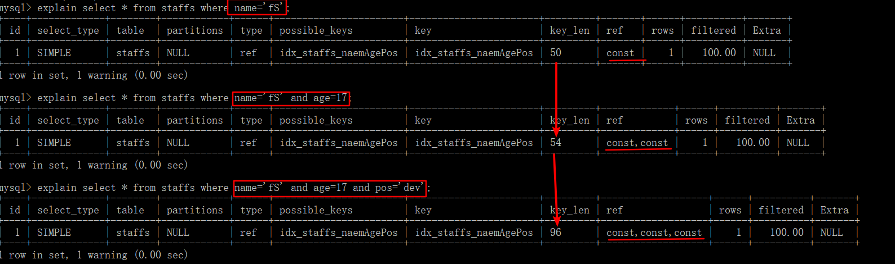

**索引（Index）是帮助 MySQL 高效获取数据的数据结构**。其目的在于提高查询效率。

索引的优势：

- 提高数据检索的效率，降低数据库的 IO 成本；
- 通过索引列对数据进行排序，降低数据排序的成本，降低了 CPU 的消耗

索引的劣势：

- 索引列也是要占用空间的，常以索引文件的形式存储在磁盘上；
- 索引会降低更新表（`INSERT`、`UPDATE`、`DELETE`）的速度。因为更新表时，MySQL 不仅要保存数据，还要保存索引文件每次更新所添加的索引列字段，调整因更新带来的键值变化后的索引信息。


# 索引语法

索引的命名格式是：`idx_表名_索引列`，如果是复合索引，索引列采用驼峰式命名。

```sql
-- 创建索引：
-- 唯一索引，加上 UNIQUE；如果写一个列名则为单值索引，多个则为复合索引
CREATE [UNIQUE] INDEX 索引名 ON 表名(列名);
ALTER TABLE 表名 ADD PRIMARY KEY (列名); -- 主键索引
ALTER TABLE 表名 ADD UNIQUE (列名); -- 唯一索引
ALTER TABLE 表名 ADD INDEX 索引名(列名); -- 普通索引(可以是复合索引)
ALTER TABLE 表名 ADD FULLTEXT (列名); -- 全文索引

-- 查看索引
SHOW INDEX FROM 表明

-- 删除索引
DROP INDEX 索引名 ON 表名;
ALTER TABLE 表名 DROP INDEX 索引名;
```

# InnoDB索引模型

常见的索引实现方式：哈希表、有序数组、搜索树。

- 哈希表适用于只有等值查询的场景；
  - 不能进行范围查询
  - 不支持 ORDER BY 排序，因为 Hash 索引指向的数据是无序的，因此无法起到排序优化的作用，
  - 无法用 Hash 索引进行模糊查询
- 有序数组在等值查询和范围查询场景中性能都很优秀，但是更新数据时由于需要挪动数据，成本较高，所以更适用于静态存储引擎；

MySQL 中索引是在存储引擎层实现的，不同存储引擎的索引实现可能不同。InnoDB 中的表都是根据主键顺序以索引的形式存放的（这种存储方式的表叫做索引组织表），而 InnoDB 又使用了 B+ 树索引模型，所以数据都存储在 B+ 树中。

每个索引在 InnoDB 中对应一棵 B+ 树。

根据索引树叶子节点的内容，索引分为：

- 主键索引（InnoDB 中也叫聚簇索引）：叶子节点存整行数据
- 非主键索引（InnoDB 中也叫二级索引）：叶子节点存储主键的值

Q：基于主键索引和普通索引的查询有什么区别？

A：主键字段作为查询条件，只需要搜索主键索引这棵 B+ 树；普通索引字段作为查询条件，需要先搜索这棵二级索引树，得到主键的值，再根据这个值在主键索引的 B+ 树中搜索一次，这个回到主键索引树搜索的过程叫做**回表**。

所以，在应用中应尽量使用主键查询。


## B-树&B+树

B-树、B+树都是多路平衡查找树。

- B+树中间节点不含有数据，相同大小的磁盘页可以保存更多的节点，查询时所需 IO 次数更少；
- B+树的查询必须最终查找到叶子节点，而 B-树找到元素即可，所以 B+树的查询性能更稳定；
- B-树如果要做范围查询需要依靠中序遍历，而 B+树在找到起始节点后，通过叶子节点间的链表进行遍历即可，所以 B+树的范围查询和排序很简便。

# 主键自增&逻辑删除

B+树为了维护索引有序性，插入值时需要做必要的维护，类似有序数组在中间插入数据一样，需要挪动其他数据。

- 如果之前索引所在数据页已满，再插入数据时根据 B+树算法，需要申请新的数据页再挪动数据，这就是**页分裂，会对性能产生影响**；同时，页分裂**还会影响数据页的利用率**。原本放在一个页的数据，现在分到两个页中，整体空间利用率降低大约 50%。
- 当相邻两个页由于删除了数据，利用率很低之后，会将**数据页合并**。

从性能和存储空间方面考虑，主键自增往往是更合理的选择：

- 性能方面，自增主键的数据插入模式中，每次插入新记录都是追加操作，而不涉及挪动其他记录，故**可以防止页分裂**
- 内存空间方面，自增主键的长度小，故普通索引的叶子节点（存储主键）更小，占用空间也就更小

**逻辑删除而非物理删除防止页合并**！！


# 覆盖索引

```sql
-- k 为普通索引列
SELECT * FROM T WHERE k BETWEEN 3 AND 5;
```

这个 SQL 会现在普通索引树找到起始位置的主键，然后回表得到第一个结果，再通过普通索引树叶子节点间的链表找到下一个位置的主键，再次回表得到第二个结果，依次得到所有结果。

```sql
SELECT id FROM T WHERE k BETWEEN 3 AND 5;
```

这个 SQL 只需要查 id 的值，而 id 的值已经记录在 k 这个普通索引树上了，不用回表就可以直接提供查询结果。这个查询中，索引 k 已覆盖了查询需求，这就是覆盖索引。

覆盖索引可以减少树的搜索次数，显著提升查询性能。

# 最左前缀原则

B+树这种索引结构，其**索引项是按照索引定义里面出现的字段顺序排序的**！可以利用索引的“最左前缀”定位记录。

如果索引了多列，查询条件要遵守最左前缀法则，这个**最左前缀可以是联合索引的最左 N 个字段**，也**可以是字符串索引的最左 M 个字符**。

如果是联合索引，假设包含了 name、role、birthday 三列：

```sql
-- 会利用到联合索引的一部份
-- 查询条件使用了联合索引的第一个字段 name，该字段类型为字符串，使用了右模糊查询
SELECT * FROM heros WHERE NAME LIKE '刘%';

-- 会利用到联合索引的一部份
-- 尽管查询条件跳过了联合索引的第二个字段，但使用了联合索引第一个字段
SELECT * FROM heros WHERE NAME like '刘%' AND birthdate='2016-04-26';
```

# 索引下推

以联合索引（name、age）为例：

```sql
select * from tuser where name like '张%' and age=10 and ismale=1;
```

在搜索索引树时，只能用“张”找到第一个满足条件的记录，然后：

MySQL 5.6 之前，通过叶子节点的链表按顺序找到第一个字为“张”的记录，然后一个个回表，去主键索引上找出数据行，再比对字段值；注意，这一过程中通过 name 字段找到主键后，InnoDB 并不会去看 age 的值。

MySQL 5.6 引入了索引下推优化（index condition pushdown)， 可以在索引遍历过程中，对索引中包含的字段先做判断，直接过滤掉不满足条件（如 age 不等于 10）的记录，减少回表次数。

# 索引失效

常见索引失效的情况：

- 被索引字段发生隐式类型转换。假设 phone 字段(为索引字段)为字符串类型
  - 查询时使用了数字类型，底层发生隐式类型转换所以可以查到结果，但索引失效
- 被索引字段使用了表达式计算。假如 age 字段为索引

```sql
select * from user where age - 2 = 18  -- 索引失效
select * from user where age = 18 + 2  -- 索引有效
```

- 被索引字段使用了函数

```sql
select * from user where left(phone,3) = '133'  -- 索引失效
select * from user where phone like '133%'  -- 索引有效
```

索引的使用依赖于底层 B+索引树的遍历，而索引树的遍历依赖于底层叶子节点的有序性，当被索引字段进行了隐式类型转换、表达式计算、或函数计算后有可能这个字段新的排列顺序与原本索引树叶子节点的排序不同了，这就会破坏索引树叶子节点的有序性，MySQL 的 SQL 语句执行器无法判断原来的索引树是否还能被检索使用，所以 SQL 语句执行器不使用该索引了。

- 在 `like` 条件中使用左模糊匹配或左右模糊匹配
- 被使用的索引字段不是联合索引的最左字段

以上五种索引失效的情况，如果发生了索引覆盖，索引树还是会被使用的！


# 索引

- 按功能逻辑分类：

  - 普通索引：没有任何约束，主要用于提高查询效率。
  - 唯一索引：在普通索引的基础上增加了数据唯一性的约束。
    - 一张数据表里可以有多个唯一索引
  - 主键索引：唯一索引的基础上增加了不为空的约束
    - 一张表里最多只有一个主键索引
  - 全文索引
    - MySQL 自带的全文索引只支持英文。通常可以采用专门的全文搜索引擎，如 ES(ElasticSearch) 和 Solr。

- 按物理实现分类：

  - 聚集索引：可以按照主键来排序存储数据
    - 表中数据行按索引的排序方式进行存储，对查找行很有效。
    - 每一个表只能有一个聚集索引，因为数据行本身只能按一个顺序存储。
  - 非聚集索引(二级索引或辅助索引)
    - 单独的存储空间存放，这些索引项是按照顺序存储的，但索引项指向的内容是随机存储的。也就是说系统会进行两次查找，第一次先找到索引，第二次找到索引对应的位置取出数据行
    - 非聚集索引不会把索引指向的内容像聚集索引一样直接放到索引的后面，而是维护单独的索引表（只维护索引，不维护索引指向的数据），为数据检索提供方便。
    - 每一个表只能有多个非聚集索引

以 B+ 树为例，在数据库的聚集索引(Clustered Index)中，叶子节点直接包含数据。在非聚集索引(NonClustered Index)中，叶子节点带有指向数据的指针！！

- 按索引字段数划分：

  - 单一索引：一个索引只包含单个列，一个表可以有多个单值索引；
  - 联合索引：一个索引包含多个列。
  


## 使用！

哪些情况需要创建索引？

- 主键自动建立唯一索引；
- 频繁作为查询条件的字段应该创建索引，即索引区分度要足够好
  - 索引区分度(选择性)=索引列中不重复值的数目/数据表中全部记录数的比值
    - 取值在 (0, 1] 之间，越接近 1，表示索引列的重复记录越少
    - 可通过 `select count(distinct(索引字段))/count(*) as selectivity;` 查看
- 需要 group by 或 order by 的列应创建索引；
- 查询中与其它表关联的字段，外键关系建立索引；
- 在高并发下倾向于创建复合索引而不是单值索引。

---

哪些情况不要创建索引？

- 表的数据行很少；
- 经常增删改的表或字段；
- `WHERE`条件里用不到的字段不创建索引；
- 过滤性不好的不适合建索引
  - 数据重复且分布平均的表字段，如果某个数据列包含许多重复的内容，为它建立索引没有太大的实际效果。

因此应该只为经常查询和最经常排序的数据列建立索引。

# 索引优化

## 索引分析

### 单表案例

表名：article

字段：`id`（`int`、无符号、非空、主键、自增）；`author_id`（`int`、无符号、非空）；`category_id`（`int`、无符号、非空）；`views`（`int`、无符号、非空）；`comments`（`int`、无符号、非空）；`title`（`varbinary`、非空）；`content`（`text`、非空）。

```sql
-- 查询 category_id=1 且 comments>1 的情况下，views 最多的 id
EXPLAIN SELECT id,author_id FROM article WHERE category_id=1 AND comments>1 ORDER BY views DESC LIMIT 1;
-- 显然type=ALL，即最坏的情况。Extra中出现Using filesort，也是最坏的情况，所以优化是必须的。
```

---

优化：

第一次尝试：

```sql
-- 新建索引，使用了三个字段来建立复合索引
#ALTER TABLE article ADD INDEX idx_article_ccv(category_id,comments,views);或使用下面的方法
CREATE INDEX idx_article_ccv ON article(category_id,comments,views);
-- 再次EXPLAIN，发现索引失效
EXPLAIN SELECT id,author_id FROM article WHERE category_id=1 AND comments>1 ORDER BY views DESC LIMIT 1;
```

上面的结论：

`type=range`，这是可以接受的，但`Extra`中`Using filesort`仍是无法接受的。我们已经建立了索引，为什么没有用呢？

这是由于 BTree 索引的工作原理，先排序`category_id`，如果遇到相同的`category_id`则再排序`comments`，遇到相同的`comments`后再排序`views`。当`comments`字段在联合索引里处于中间位置时，由于`comments>1`条件是一个范围值，MySQL 无法利用索引再对后面的`views`部分进行检索，即`range`类型查询字段后面的索引无效。

---

第二次尝试：

```sql
-- 删除第一次的索引
DROP INDEX idx_article_ccv ON article;
-- 建立新的索引，使用了两个字段来建立复合索引
CREATE INDEX idx_article_cv ON article(category_id,views);
-- 再次EXPLAIN，type=ref 且 Using filesort消失，结果理想
EXPLAIN SELECT id,author_id FROM article WHERE category_id=1 AND comments>1 ORDER BY views DESC LIMIT 1;
```

### 双表案例

表名：class（商品类别）

字段：`id`（`int`、无符号、非空、主键、自增）；`card`（`int`、无符号、非空）（类别卡号）。

表名：book

字段：`bookid`（`int`、无符号、非空、主键、自增）；`card`（`int`、无符号、非空）（类别卡号）。

```sql
EXPLAIN SELECT * FROM class LEFT JOIN book ON class.card = book.card;
-- table值为 book 、class的查询中 type 均为 ALL,需要优化
```

---

优化：

第一次尝试：

```sql
-- 左连接在右表（book）上添加索引
ALTER TABLE book ADD INDEX Y(card);
-- 再次EXPLAIN，发现 table=book 的 查询中 type=ref，且 rows 的优化也比较明显
EXPLAIN SELECT * FROM class LEFT JOIN book ON class.card = book.card;
```

第二次尝试：

```sql
-- 删除第一次创建的索引
DROP INDEX Y ON book;
-- 左连接在左表（class）上添加索引
ALTER TABLE class ADD INDEX Y(card);
-- 再次EXPLAIN，发现 table=class 的 查询中 type=index，而 rows 相比于无索引时没有变化
EXPLAIN SELECT * FROM class LEFT JOIN book ON class.card = book.card;
```

结论：

**左连接时，索引加在右表上**；

与上面的尝试类似，可得出：**右连接时，索引加在左表上**。

### 三表案例

在两表案例的两个表外添加一个新表。

表名：phone

字段：phoneid（int、无符号、非空、主键、自增）；card（int、无符号、非空）。

使用 InnoDB 存储引擎（直接在建表语句的`()`后面加上`ENGINE=INNODB`）。

```sql
EXPLAIN SELECT * FROM class INNER JOIN book ON class.card=book.card INNER JOIN phone ON book.card=phone.card;
-- Extra 中出现 Using join buffer
-- 在工作中，左连接和右连接使用较多
EXPLAIN SELECT * FROM class LEFT JOIN book ON class.card=book.card LEFT JOIN phone ON book.card=phone.card;
-- 所有的 type 均为 ALL
```

---

优化：

```sql
-- 对两次左连接的两个右表创建索引
ALTER TABLE phone ADD INDEX Z(card);
ALTER TABLE book ADD INDEX Y(card);
-- 再次EXPLAIN。后两行的 type 都是 ref，且总的 rows 优化很好，效果不错。
EXPLAIN SELECT * FROM class LEFT JOIN book ON class.card=book.card LEFT JOIN phone ON book.card=phone.card;
```

## 索引失效！


建议：

- InnoDB 存储引擎中，主键尽量避免使用很长的字段
  - MyISAM 存储引擎中，索引文件和数据文件是分开的，索引树的叶子节点存放的是数据表记录的物理地址
  - InnoDB 存储引擎中，普通索引的叶子节点的数据存放的是主键，而数据表的数据记录则保存在主键索引树的叶子节点中，主键越长，二级索引的叶子节点只能存储相对较少的主键
- 在保障索引区分度的情况下，被索引字段尽量不要太长
  - InnoDB 存储引擎中，索引树的每个节点都是一个磁盘页面(page)，可通过 `show variables like “innodb_page_size”;` 查看，默认为 16K，索引树检索过程中每读取一个节点就会进行一次磁盘 I/O。因此 B+树的高度就是通过索引进行检索的磁盘 I/O 次数，因而当被索引字段较短时，一次磁盘 I/O 可以读取更多索引，此时树的高度就可能会降低，从而减少磁盘 I/O 次数
  - 实际中可通过逐步缩短索引字段长度计算索引区分度的方式来找到既能保持好的索引区分度又相对较短的索引
  - `select count(distinct(left(name, 3)))/count(*) as selectivity;`
- 查询中可利用索引覆盖来避免不必要的回表
  - 回表：通过二级索引无法查到整条的数据记录，需要根据二级索引中查到的主键再去主键索引中查找
  - 如果查询所需信息在二级索引中就可得到，即可省去回表过程，减少回表的磁盘 I/O 次数
  - `select * from user where age=10;`其中 age 为索引字段，此时会发生回表，因为 age 索引树中叶子节点存储的是主键(id)，而没有 name 的信息，需要继续去主键索引树中查找
  - `select id,age feom user where age=10;`则不会发生回表，因为在 age 索引树中叶子节点同时存在 id 和 age
  - 这种不需要回表的现象就是索引覆盖，实际中可适当使用联合索引避免发生回表
- 不要建立太多索引
- 定值、范围还是排序，一般`order by`给个范围
- `group by`是分组，但分组之前基本上都会进行排序，会有临时表产生。
- 对于单值索引，尽量选择针对当前 query 过滤性更好的索引；
- 在选择复合索引时，当前 query 中过滤性最好的字段在索引字段顺序中，位置越靠前越好；
- 在选择复合索引时，尽量选择可以包含当前 query 中的 where 子句中更多字段的索引；
- 尽可能通过分析统计信息和调整 query 的写法来达到选择合适索引的目的。

示例：

```sql
CREATE TABLE staffs(
  id INT PRIMARY KEY AUTO_INCREMENT,
  name VARCHAR(24) NOT NULL DEFAULT '' COMMENT '姓名',
  age INT NOT NULL DEFAULT 0 COMMENT '年龄',
  pos VARCHAR(20) NOT NULL DEFAULT '' COMMENT '职位',
  add_time TIMESTAMP NOT NULL DEFAULT CURRENT_TIMESTAMP COMMENT '入职时间'
);
-- 创建复合索引
ALTER TABLE staffs ADD INDEX idx_staffs_naemAgePos(name,age,pos);
```


- 全值匹配



可以看出，随着精度的提高，所花费的代价（`key_len`）也越来越大。

---

- 最佳左前缀法则：如果索引了多列，要遵守最左前缀法则。指的**查询条件**从索引的最左列开始且**不跳过索引中的列**。

如：创建的索引为`name`、`age`、`pos`列，那么如果要想在查询中使用到索引，查询条件必须以`name`开始。


注意：如果是常量级别的查询，那么查询条件的顺序可以不遵守该法则。因为 MySQL 底层的优化器对语句进行了优化，不过建议查询条件的顺序仍遵守该法则，避免底层的优化。优化后的顺序必须遵守该法则！


---

- 不在索引列上做任何操作（计算、函数、自动/手动类型转换），否则会导致索引失效而转向全表扫描


---

- 存储引擎不能使索引中范围条件右边的列


从`key_len`可以看出尽管查询条件`age`是一个范围，但仍会用到索引。不过与`name`不同的是，`name`用于查询，而`age`则是用于排序

---

- 尽量使用覆盖索引（只访问索引的查询（索引列和查询列一致）），减少`select *`
- MySQL 在使用不等于（`!=`或`<>`）时无法使用索引会导致全表扫描
- `is null`、`is not null`也无法使用索引


---

- `like`以**通配符开头**（如:`%abc`），MySQL 索引失效会变成全表扫描的操作。
  - 使用覆盖索引。

`like`虽然也是范围，但是，当后面的字符为`字符串%`形式时，此时也算是一种特殊的常量，所以如果在`like`子句后面还有索引列的使用的话，该索引并不会失效。


---

- 字符串不加单引号索引失效（被索引字段发生了隐式类型转换）


---

- 少用`or`，用它来连接时会索引失效

---

一般情况下，如果`order by`后面的排序列的顺序与索引中这些列顺序不一致，在`Extra`中就会出现`Using filesort`，如：`select * from test where c1='a1' order by c3,c2`（复合索引：c1,c2,c3,c4）；但是，当排序列出现常量时，由于不必排序，所以不会出现`Using filesort`，如：`select * from test where c1='a1' c2='a2' order by c3,c2`
