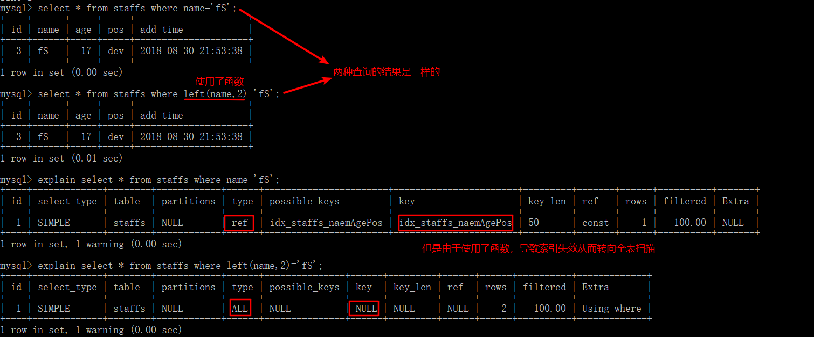

**索引（Index）是帮助 MySQL 高效获取数据的数据结构**。其目的在于提高查询效率。

索引的优势：

- 提高数据检索的效率，降低数据库的 IO 成本；
- 通过索引列对数据进行排序，降低数据排序的成本，降低了 CPU 的消耗

索引的劣势：

- 索引列也是要占用空间的，常以索引文件的形式存储在磁盘上；
- 索引会降低更新表（`INSERT`、`UPDATE`、`DELETE`）的速度。因为更新表时，MySQL 不仅要保存数据，还要保存索引文件每次更新所添加的索引列字段，调整因更新带来的键值变化后的索引信息。

假设不使用索引执行 `select * from user order by age desc;` 语句，MySQL 会扫描所有行，将其加载到内存后，再按 age 排序生成一张临时表，然后将相应行返回给客户端。而如果这张临时表 > tmp_table_size 的值（默认 16M），内存临时表会转为磁盘临时表，性能更差了。如果加了索引，由于索引本身有序，所以从磁盘中读取的数据本身就是按 age 排序好的，就不会生成临时表，也就不用再额外排序，这就显著提升了性能。

# 索引语法

索引的命名格式是：`idx_表名_索引列`，如果是复合索引，索引列采用驼峰式命名。

```sql
-- 创建索引：
-- 唯一索引，加上 UNIQUE；如果写一个列名则为单值索引，多个则为复合索引
CREATE [UNIQUE] INDEX 索引名 ON 表名(列名);
ALTER TABLE 表名 ADD PRIMARY KEY (列名); -- 主键索引
ALTER TABLE 表名 ADD UNIQUE (列名); -- 唯一索引
ALTER TABLE 表名 ADD INDEX 索引名(列名); -- 普通索引(可以是复合索引)
ALTER TABLE 表名 ADD FULLTEXT (列名); -- 全文索引

-- 查看索引
SHOW INDEX FROM 表明

-- 删除索引
DROP INDEX 索引名 ON 表名;
ALTER TABLE 表名 DROP INDEX 索引名;

-- 强制选择索引，有时优化器会出现索引选择异常，可以通过 force index 强行选择一个索引
-- 索引名修改的话，SQL 语句也需要修改；迁移到其他数据库时语法不一定兼容
select * from t force index(a) where a between 10000 and 20000;
```

# 索引模型

常见的索引实现方式：哈希表、有序数组、搜索树。

- 哈希表适用于只有等值查询的场景；
  - 不能进行范围查询
  - 不支持 ORDER BY 排序，因为 Hash 索引指向的数据是无序的，因此无法起到排序优化的作用，
  - 无法用 Hash 索引进行模糊查询
- 有序数组在等值查询和范围查询场景中性能都很优秀\
    - 更新数据时为了保持有序由于需要挪动数据，成本较高，所以更适用于静态存储引擎；

## InnoDB 索引

**MySQL 中索引是在存储引擎层实现的**，不同存储引擎的索引实现可能不同。InnoDB 中的表都是根据主键顺序以索引的形式存放的（这种存储方式的表叫做索引组织表），而 InnoDB 又使用了 B+ 树索引模型，所以数据都存储在 B+ 树中。

**每个索引在 InnoDB 中对应一棵 B+ 树**。**B+ 树叶子节点存储了 MySQL 的数据页 page（16KB），根据索引查询时，会先从 B+树的 root 节点开始，按层搜索找到叶子节点，然后在叶子节点的数据页内通过二分法来定位记录。**

为了向 B+树插入数据，必须遍历数据所属的叶子节点，然后再将数据放入叶子节点，每个叶子节点就是一次磁盘 IO 操作：

- 如果要插入的叶子节点在主内存中，顺序 IO，那么 B+ 树的性能是很快的，但性能会受限于 IO 瓶颈，假设硬盘每秒可以处理几百次 IO 操作，那么 B+树每秒最多也只能处理几百次 IO 操作；
- 而如果大部分叶子节点都不在主内存中，大部分插入操作都是随机磁盘 IO，此时的性能会受限于磁头的移动。

根据索引树叶子节点的内容，索引分为：

- 主键索引（InnoDB 中也叫聚簇索引）：叶子节点的 page 中存储整行数据（多行）
- 非主键索引（InnoDB 中也叫二级索引）：叶子节点的 page 中存储主键的值

Q：基于主键索引和普通索引的查询有什么区别？

A：主键字段作为查询条件，只需要搜索主键索引这棵 B+ 树；普通索引字段作为查询条件，需要先搜索这棵二级索引树，得到主键的值，再根据这个值在主键索引的 B+ 树中搜索一次，这个回到主键索引树搜索的过程叫做**回表**。

所以，在应用中应尽量使用主键查询。

---

- B-树&B+树：B-树、B+树都是多路平衡查找树。

    - B+树中间节点不含有数据，相同大小的磁盘页可以保存更多的节点，查询时所需 IO 次数更少；
    - B+树的查询必须最终查找到叶子节点，而 B-树找到元素即可，所以 B+树的查询性能更稳定；
    - B-树如果要做范围查询需要依靠中序遍历，而 B+树在找到起始节点后，通过叶子节点间的链表进行遍历即可，所以 B+树的范围查询和排序很简便；而且在查询连续数据时，B-树可以在非叶子节点中存储数据，会导致产生很多随机 IO，B+树所有叶子节点通过指针相互连接，可以减少顺序遍历时产生的额外随机 IO

---

N 叉树的 N 在 MySQL 中可以调整吗？

- 方法一：通过改变 key 值来调整

N 叉树中非叶子节点存放的是索引信息，索引包含 Key 和 Point 指针。Point 指针固定为 6 个字节，假如 Key 为10个字节，那么单个索引就是16个字节。如果 B+ 树中页大小为16K，那么一个页就可以存储1024个索引，此时 N 就等于1024。所以可以通过改变 Key 的大小，改变 N 的值

- 方法二：改变页的大小

页越大，一页存放的索引就越多，N就越大。

数据页调整后，如果数据页太小层数会太深，数据页太大，加载到内存的时间和单个数据页查询时间会提高，要注意平衡。

---

每个节点的大小就是一个数据页，叶子节点按索引顺序排序，也就是说根据索引查找或排序拿到的数据都是排序好了的，不会在内存中形成临时表。


## TokuDB 索引

阅读：[Fractal Tree Indexing](https://www.percona.com/doc/percona-tokudb/ft-index.html#fractal-tree-indexing)

背景：生产数据库的大小通常会超过可用的主内存，其后果就是，B-tree 的叶子节点存储在磁盘而非内存（RAM）中，而当向非主内存的叶子节点插入数据时需要磁盘 IO 操作，此时**，B-tree 的性能会受限于 IO 带宽（I/O bandwidth）**。与大数据存储需求的增长相比，增加 RAM 的成本太高，因此优化磁盘 IO 就很重要了。

> Although the B-tree data structure was invented for large blocks of data, performance today is limited by I/O bandwidth. This happens because the size of a production database generally exceeds available main memory. As a consequence, most leaves in a tree are stored on disk, not in RAM. And inserting into a leaf that is not in main memory requires a disk I/O operation.

与 B+树类似，Fractal Tree 也是 N 叉树，不同的是，Fractal Tree 索引树在每个内部节点中还会有一块 Buffer 区，这些缓冲区用于临时存储插入操作，当 buffer 填充满了，就会被刷新到子节点中。这就保证了当信息到达磁盘的剩余空间时，一次 IO 操作可以执行很多有效的工作，而不是每次 IO 操作仅执行一个很小的写入。

> Like a B-tree, a Fractal Tree index is a tree data structure. However, besides pivots, each internal node in a Fractal Tree index also contains buffers. These buffers are used to temporarily store insertions. When a buffer is full, it is flushed to children nodes. This ensures that an I/O operation performs a lot of useful work when messages reach leaves on disk, instead of just a small write per I/O.

就数据一致性而言，读数据是不受缓冲区影响的。分形树查询数据的算法复杂度与 B树相同。即使缓冲区的改变还没有传递到相关的叶子节点中，在查询时也不会发生数据丢失，因为从根节点到叶子节点的查询还会经过缓冲区（记录了所有的插入、删除、更新信息 message）。

> Reading data is not affected by buffers in terms of data consistency. Querying a database with the Fractal Tree index data structure involves the same algorithmic complexity as in the case of a B-tree. And there is no data loss, because queries follow the path from root to leaf passing through all messages (insertions, deletions, and updates) in buffers. So a query will know the current state of data even if changes have not yet been propagated to corresponding leaves.

当 message 存储在非叶子节点的缓冲区时，每个 message 都会带有唯一的消息序列号（MSN）。该序列号在每个分形树中是唯一的。MSN 维护了 message 的顺序，并确保当叶子节点使用其父节点的缓冲区 message 更新时，message 只会应用到叶子节点一次。

> Each message is stamped with a unique message sequence number (MSN) when it is stored in a non-leaf node message buffer. The MSN is unique within each fractal tree. The MSN maintains the order of messages and ensures that messages are only applied once to leaf nodes when the leaf node is updated by messages buffered by its parent nodes.

缓冲区也会被序列化到磁盘中，因此，发生崩溃（crash）或断电时，内部节点中的 message 并不会丢失。如果写入操作发生在 checkpoint 之后 crash 之前，可以从日志中恢复该操作。

> Buffers also get serialized to disk, so messages in internal nodes will not be lost in case of a crash or power outage. If a write happened after a checkpoint and before a crash, then recovery will replay the operation from the log.


阅读：[TokuMX Fractal Tree(R) indexes, what are they?](https://www.percona.com/blog/2013/07/02/tokumx-fractal-treer-indexes-what-are-they/)

TokuDB 存储引擎使用的是 Fractal Tree（分形树）的数据结构。不同于 B 树，分形树的每个非叶子节点不仅保存了指向其子节点的指针，同时针对每个子节点还保存了的一个对应的缓冲区 buffer （FIFO 的队列），这个缓冲区会缓存单个子节点（一个叶子节点就是一个数据页）的多行操作，最后通过一次 IO 操作全部写入磁盘。下图中黑色代表树的节点，灰色代表了 buffer


在根节点中找出向下遍历的子节点，将操作写入 buffer 中，如果与其子节点关联的 buffer 还有空间就返回；如果没有空间，就将 buffer 中缓存的所有操作刷新到下一级，从而为后续的写操作腾出空间。

根节点的 buffer 刷新可能会引起级联刷新：根节点的刷新可能会向子节点填充足够多的数据，使子节点的 buffer 满了，而子节点又会继续刷新，这种情况会一直持续到数据最终完全刷新到叶子节点为止。每一次插入操作都落到根节点就马上返回了，而不需要搜索到叶子节点。

那么这种算法为什么会有更好的性能呢？因为减少了 IO 操作！而 IO 操作成本是很高的。B 树中，一次 IO 操作插入一个简单的文档/行/键值对，而在分形树中，假设根节点总时在内存中，当在写操作中执行 IO 操作时就会刷新缓冲区中的数据，而这可能包含了很多很多的文档/行......以此消除 B树所具有的 IO 瓶颈。

注意：如果数据都在内存上，那么分形树索引在写性能上就不会比 B 树具有优势了，从算法的角度而言，此时两种算法都很快。

待阅读：https://www.biaodianfu.com/tokudb.html 及其参考资料

TokuDB 的分形树索引模型采用了更大的索引页和数据页（默认 4M，InnoDB 默认 16K）。

分形树其实是优化了 B+树随机写操作的性能。`insert into sbtest set x = uuid()` 假设索引字段为 x，由于 uuid() 的随机性，大量执行这种语句会导致插入表中的数据分散在不同叶子节点中，而这种随机写操作会导致大量的磁盘 IO 操作，从而造成了 B+树的随机写性能瓶颈。但 **B+树的顺序写操作很快**，因为顺序写操作充分利用了局部热点数据（此时插入的数据大部分会在同一个数据页上），磁盘 IO 次数会大大降低。

注：下面的索引相关内容，如不特殊说明，均是指 InnoDB 的索引。

# 主键自增&逻辑删除

B+树为了维护索引有序性，插入值时需要做必要的维护，类似有序数组在中间插入数据一样，需要挪动其他数据。

- 如果之前索引所在数据页已满，再插入数据时根据 B+树算法，需要申请新的数据页再挪动数据，这就是**页分裂，会对性能产生影响**；同时，页分裂**还会影响数据页的利用率**。原本放在一个页的数据，现在分到两个页中，整体空间利用率降低大约 50%。
- 当相邻两个页由于删除了数据，利用率很低之后，会将**数据页合并**。

从性能和存储空间方面考虑，主键自增往往是更合理的选择：

- 性能方面，自增主键的数据插入模式中，每次插入新记录都是追加操作，而不涉及挪动其他记录，故**可以防止页分裂**
    - 有业务逻辑的字段作主键时，通常不易保证有序插入，这样写数据成本相对较高
- 内存空间方面，自增主键的长度小，故普通索引的叶子节点（存储主键）更小，占用空间也就更小

**逻辑删除而非物理删除防止页合并**！！


# 覆盖索引

```sql
-- k 为普通索引列
SELECT * FROM T WHERE k BETWEEN 3 AND 5;
-- 1. 在普通索引树找到起始位置的主键，回表得到第一个结果
-- 2. 通过普通索引树叶子节点间的链表找到下一个位置的主键，再次回表得到第二个结果
-- 3. 重复上述步骤，得到所有结果
```

```sql
SELECT id FROM T WHERE k BETWEEN 3 AND 5;
```

这个 SQL 只需要查 id 的值，而 id 的值已经记录在 k 这个普通索引树上了，不用回表就可以直接提供查询结果。这个查询中，索引 k 已覆盖了查询需求，这就是覆盖索引。

覆盖索引可以减少树的搜索次数，显著提升查询性能。

# 最左前缀原则

B+树这种索引结构，其**索引项是按照索引定义里面出现的字段顺序排序（先根据第一个字段排序，只有在第一个字段相同时才根据第二个字段排序）的**！可以利用索引的“最左前缀”定位记录。

如果索引了多列，查询条件要遵守最左前缀法则，这个**最左前缀可以是联合索引的最左 N 个字段**，也**可以是字符串索引的最左 M 个字符**。

如果是联合索引，假设包含了 name、role、birthday 三列：

```sql
-- 会利用到联合索引的一部份
-- 查询条件使用了联合索引的第一个字段 name，该字段类型为字符串，使用了右模糊查询
SELECT * FROM heros WHERE NAME LIKE '刘%';

-- 会利用到联合索引的一部份
-- 尽管查询条件跳过了联合索引的第二个字段，但使用了联合索引第一个字段
SELECT * FROM heros WHERE NAME like '刘%' AND birthdate='2016-04-26';
```

# 索引下推

以联合索引（name、age）为例：

```sql
select * from tuser where name like '张%' and age=10 and ismale=1;
```

在搜索索引树时，只能用“张”找到第一个满足条件的记录，然后：

MySQL 5.6 之前，通过叶子节点的链表按顺序找到第一个字为“张”的记录，然后一个个回表，去主键索引上找出数据行，再比对字段值；注意，这一过程中通过 name 字段找到主键后，InnoDB 并不会去看 age 的值。

MySQL 5.6 引入了索引下推优化（index condition pushdown)， 可以在索引遍历过程中，对索引中包含的字段先做判断，直接过滤掉不满足条件（如 age 不等于 10）的记录，减少回表次数。

# 索引失效

常见索引失效的情况：

- 被索引字段发生隐式类型转换。假设 phone 字段(为索引字段)为字符串类型
  - 查询时使用了数字类型，底层发生隐式类型转换所以可以查到结果，但索引失效
- 被索引字段使用了表达式计算。假如 age 字段为索引

```sql
select * from user where age - 2 = 18  -- 索引失效
select * from user where age = 18 + 2  -- 索引有效
```

- 被索引字段使用了函数

```sql
select * from user where left(phone,3) = '133'  -- 索引失效
select * from user where phone like '133%'  -- 索引有效
```

索引的使用依赖于底层 B+索引树的遍历，而索引树的遍历依赖于底层叶子节点的有序性，当被索引字段进行了隐式类型转换、表达式计算、或函数计算后有可能这个字段新的排列顺序与原本索引树叶子节点的排序不同了，这就会破坏索引树叶子节点的有序性，MySQL 的 SQL 语句执行器无法判断原来的索引树是否还能被检索使用，所以 SQL 语句执行器不使用该索引了。

- 在 `like` 条件中使用左模糊匹配或左右模糊匹配
- 被使用的索引字段不是联合索引的最左字段

以上五种索引失效的情况，如果发生了索引覆盖，索引树还是会被使用的！


示例：MySQL 实战 45 讲 第 5 讲中评论的一个问题！

```sql
create table testIndex(
    id int(4) not null primary key auto_increment,
    uname varchar(25) default '',
    index idx_uname(uname)
) engine = InnoDB;
```


```sql
-- 以下四种情况都会使用到 idx_uname 索引（key 列为实际使用到的索引）
explain select * from testIndex where uname like 'z';
explain select * from testIndex where uname like 'z%';
explain select * from testIndex where uname like '%z';
explain select * from testIndex where uname like '%z%';
```

修改表结构（增加 age 列）：

```sql
alter table testIndex add column age int not null;
```


```sql

```


# 普通索引&唯一索引

**两者在查询性能上几乎没有差别，主要是对更新性能的影响。尽量选择普通索引。如果所有的更新后面都马上会对这个记录查询，应该关闭 change buffer（innodb_change_buffer_max_size 设置为 0）**，其他情况下 change buffer 都能提升更新性能。

注：业务正确性优先！所以，如果业务无法保证，必须通过数据库来约束唯一性，那就必须创建唯一索引了。

归档库的场景可以考虑使用普通索引。如线上数据仅保留半年，然后历史数据保存在归档库，此时归档数据已经是确保没有唯一冲突了，要提高归档效率，可以考虑把唯一索引改为普通索引。

## 查询过程

根据索引查询时，会先从 B+树的 root 节点开始，按层搜索找到叶子节点，然后在叶子节点的数据页内通过二分法来定位记录。

- 普通索引：查找到满足条件的第一条记录后需要查找下一个记录，知道碰到第一个不满足条件的记录；
- 唯一索引：由于索引定义了唯一性，所以查找到第一个满足条件的记录后就会停止继续检索。

尽管两种索引的查找方式有所不同，但带来的**性能差距几乎可以忽略**。

因为 InnoDB 的数据是按数据页为单位读写的，所以当找到满足条件的记录时，其所在数据页就都在内存中了，对于普通索引来说，多做的那一次“查找、判断下一条记录”的操作只需要一次指针寻找和一次计算。当然，如果满足条件的记录刚好是这个数据页的最后一个记录，那么取下一个记录就必须读取下一个数据页，此时会复杂一些。


## 更新过程

更新数据页时：

- 数据页在内存中就直接更新；
- 数据页不在内存中，在不影响数据一致性的前提下，InnoDB 会把这些更新操作缓存在 change buffer 中，在下次查询需要访问这个数据页时将数据页读入内存，然后执行 change buffer 中与这个页有关的操作
    - change buffer 是可以持久化的数据
    - 将 change buffer 的操作应用到原数据页，得到最新结果的过程叫做 merge，流程如下：
        - 1.从磁盘读入数据页（老版本）到内存
        - 2.从 change buffer 中找出这个数据页的相关记录，依次应用，得到新版本的数据页，这里还是在内存更新
        - 3.写 redo log
        - 数据页和内存中 change buffer 对应的磁盘位置还未修改，属于脏页，之后各自刷回自己的物理数据是另一个过程了
        - 除了访问数据页会触发 merge 外，系统有后台线程会定期 merge，数据库正常关闭的过程中也会执行 merge

将更新操作先记录在 change buffer 中，可以减少读磁盘，语句执行速度有明显提升。而且数据读入内存需要占用 buffer pool，这种方式还可以避免占用内存，提高内存利用率。

**只有普通索引可以使用 change buffer，唯一索引的更新是不使用 change buffer 的**。因为唯一索引的所有更新操作都要先判断这个操作是否违反唯一性约束，这就必须将数据页读入内存才能判断，而读入内存后，直接更新内存会更快，所以也就没必要使用 change buffer 了。

所以，**如果要更新的记录所在目标页不在内存中，使用唯一索引就会比普通索引多了读磁盘的操作**，而将数据从磁盘读入那日村涉及随机 IO 的访问，成本很高。

对于写多读少的业务来说，页面在写完后马上被访问到的概率比较小，此时 change buffer 的使用效果最好。常见的业务模型为账单类、日志类的系统。

而如果业务的更新模式是写入后马上会做查询，那么即使满足了条件将更新先记录在 change buffer 中，但之后马上要访问这个数据页，会立即触发 merge。这样随机访问 IO 的次数不会减少，反而增加了 change buffer 的维护代价。

Q：如果某次写入使用了 change buffer 机制，之后主机异常重启，是否会丢失 change buffer 和数据？

A：不会。虽然是只更新内存，但是在事务提交的时候，把 change buffer 的操作也记录到 redo log 里了，所以崩溃恢复的时候，change buffer 也能找回来。

# 索引

- 按功能逻辑分类：

  - 普通索引：没有任何约束，主要用于提高查询效率。
  - 唯一索引：在普通索引的基础上增加了数据唯一性的约束。
    - 一张数据表里可以有多个唯一索引
  - 主键索引：唯一索引的基础上增加了不为空的约束
    - 一张表里最多只有一个主键索引
  - 全文索引
    - MySQL 自带的全文索引只支持英文。通常可以采用专门的全文搜索引擎，如 ES(ElasticSearch) 和 Solr。

- 按物理实现分类：

  - 聚集索引：可以按照主键来排序存储数据
    - 表中数据行按索引的排序方式进行存储，对查找行很有效。
    - 每一个表只能有一个聚集索引，因为数据行本身只能按一个顺序存储。
  - 非聚集索引(二级索引或辅助索引)
    - 单独的存储空间存放，这些索引项是按照顺序存储的，但索引项指向的内容是随机存储的。也就是说系统会进行两次查找，第一次先找到索引，第二次找到索引对应的位置取出数据行
    - 非聚集索引不会把索引指向的内容像聚集索引一样直接放到索引的后面，而是维护单独的索引表（只维护索引，不维护索引指向的数据），为数据检索提供方便。
    - 每一个表只能有多个非聚集索引

以 B+ 树为例，在数据库的聚集索引(Clustered Index)中，叶子节点直接包含数据。在非聚集索引(NonClustered Index)中，叶子节点带有指向数据的指针！！

- 按索引字段数划分：

  - 单一索引：一个索引只包含单个列，一个表可以有多个单值索引；
  - 联合索引：一个索引包含多个列。
  


## 使用！

哪些情况需要创建索引？

- 主键自动建立唯一索引；
- 频繁作为查询条件的字段应该创建索引，即索引区分度要足够好
  - 索引区分度(选择性)=索引列中不重复值的数目/数据表中全部记录数的比值
    - 取值在 (0, 1] 之间，越接近 1，表示索引列的重复记录越少
    - 可通过 `select count(distinct(索引字段))/count(*) as selectivity;` 查看
- 需要 group by 或 order by 的列应创建索引；
- 查询中与其它表关联的字段，外键关系建立索引；
- 在高并发下倾向于创建复合索引而不是单值索引。

---

哪些情况不要创建索引？

- 表的数据行很少；
- 经常增删改的表或字段；
- `WHERE`条件里用不到的字段不创建索引；
- 过滤性不好的不适合建索引
  - 数据重复且分布平均的表字段，如果某个数据列包含许多重复的内容，为它建立索引没有太大的实际效果。

因此应该只为经常查询和最经常排序的数据列建立索引。

# 索引优化

## 索引分析

### 单表案例

表名：article

字段：`id`（`int`、无符号、非空、主键、自增）；`author_id`（`int`、无符号、非空）；`category_id`（`int`、无符号、非空）；`views`（`int`、无符号、非空）；`comments`（`int`、无符号、非空）；`title`（`varbinary`、非空）；`content`（`text`、非空）。

```sql
-- 查询 category_id=1 且 comments>1 的情况下，views 最多的 id
EXPLAIN SELECT id,author_id FROM article WHERE category_id=1 AND comments>1 ORDER BY views DESC LIMIT 1;
-- 显然type=ALL，即最坏的情况。Extra中出现Using filesort，也是最坏的情况，所以优化是必须的。
```

---

优化：

第一次尝试：

```sql
-- 新建索引，使用了三个字段来建立复合索引
#ALTER TABLE article ADD INDEX idx_article_ccv(category_id,comments,views);或使用下面的方法
CREATE INDEX idx_article_ccv ON article(category_id,comments,views);
-- 再次EXPLAIN，发现索引失效
EXPLAIN SELECT id,author_id FROM article WHERE category_id=1 AND comments>1 ORDER BY views DESC LIMIT 1;
```

上面的结论：

`type=range`，这是可以接受的，但`Extra`中`Using filesort`仍是无法接受的。我们已经建立了索引，为什么没有用呢？

这是由于 BTree 索引的工作原理，先排序`category_id`，如果遇到相同的`category_id`则再排序`comments`，遇到相同的`comments`后再排序`views`。当`comments`字段在联合索引里处于中间位置时，由于`comments>1`条件是一个范围值，MySQL 无法利用索引再对后面的`views`部分进行检索，即`range`类型查询字段后面的索引无效。

---

第二次尝试：

```sql
-- 删除第一次的索引
DROP INDEX idx_article_ccv ON article;
-- 建立新的索引，使用了两个字段来建立复合索引
CREATE INDEX idx_article_cv ON article(category_id,views);
-- 再次EXPLAIN，type=ref 且 Using filesort消失，结果理想
EXPLAIN SELECT id,author_id FROM article WHERE category_id=1 AND comments>1 ORDER BY views DESC LIMIT 1;
```

### 双表案例

表名：class（商品类别）

字段：`id`（`int`、无符号、非空、主键、自增）；`card`（`int`、无符号、非空）（类别卡号）。

表名：book

字段：`bookid`（`int`、无符号、非空、主键、自增）；`card`（`int`、无符号、非空）（类别卡号）。

```sql
EXPLAIN SELECT * FROM class LEFT JOIN book ON class.card = book.card;
-- table值为 book 、class的查询中 type 均为 ALL,需要优化
```

---

优化：

第一次尝试：

```sql
-- 左连接在右表（book）上添加索引
ALTER TABLE book ADD INDEX Y(card);
-- 再次EXPLAIN，发现 table=book 的 查询中 type=ref，且 rows 的优化也比较明显
EXPLAIN SELECT * FROM class LEFT JOIN book ON class.card = book.card;
```

第二次尝试：

```sql
-- 删除第一次创建的索引
DROP INDEX Y ON book;
-- 左连接在左表（class）上添加索引
ALTER TABLE class ADD INDEX Y(card);
-- 再次EXPLAIN，发现 table=class 的 查询中 type=index，而 rows 相比于无索引时没有变化
EXPLAIN SELECT * FROM class LEFT JOIN book ON class.card = book.card;
```

结论：

**左连接时，索引加在右表上**；

与上面的尝试类似，可得出：**右连接时，索引加在左表上**。

### 三表案例

在两表案例的两个表外添加一个新表。

表名：phone

字段：phoneid（int、无符号、非空、主键、自增）；card（int、无符号、非空）。

使用 InnoDB 存储引擎（直接在建表语句的`()`后面加上`ENGINE=INNODB`）。

```sql
EXPLAIN SELECT * FROM class INNER JOIN book ON class.card=book.card INNER JOIN phone ON book.card=phone.card;
-- Extra 中出现 Using join buffer
-- 在工作中，左连接和右连接使用较多
EXPLAIN SELECT * FROM class LEFT JOIN book ON class.card=book.card LEFT JOIN phone ON book.card=phone.card;
-- 所有的 type 均为 ALL
```

---

优化：

```sql
-- 对两次左连接的两个右表创建索引
ALTER TABLE phone ADD INDEX Z(card);
ALTER TABLE book ADD INDEX Y(card);
-- 再次EXPLAIN。后两行的 type 都是 ref，且总的 rows 优化很好，效果不错。
EXPLAIN SELECT * FROM class LEFT JOIN book ON class.card=book.card LEFT JOIN phone ON book.card=phone.card;
```

## 索引失效！


建议：

- InnoDB 存储引擎中，主键尽量避免使用很长的字段
  - MyISAM 存储引擎中，索引文件和数据文件是分开的，索引树的叶子节点存放的是数据表记录的物理地址
  - InnoDB 存储引擎中，普通索引的叶子节点的数据存放的是主键，而数据表的数据记录则保存在主键索引树的叶子节点中，主键越长，二级索引的叶子节点只能存储相对较少的主键
- 在保障索引区分度的情况下，被索引字段尽量不要太长
  - InnoDB 存储引擎中，索引树的每个节点都是一个磁盘页面(page)，可通过 `show variables like “innodb_page_size”;` 查看，默认为 16K，索引树检索过程中每读取一个节点就会进行一次磁盘 I/O。因此 B+树的高度就是通过索引进行检索的磁盘 I/O 次数，因而当被索引字段较短时，一次磁盘 I/O 可以读取更多索引，此时树的高度就可能会降低，从而减少磁盘 I/O 次数
  - 实际中可通过逐步缩短索引字段长度计算索引区分度的方式来找到既能保持好的索引区分度又相对较短的索引
  - `select count(distinct(left(name, 3)))/count(*) as selectivity;`
- 查询中可利用索引覆盖来避免不必要的回表
  - 回表：通过二级索引无法查到整条的数据记录，需要根据二级索引中查到的主键再去主键索引中查找
  - 如果查询所需信息在二级索引中就可得到，即可省去回表过程，减少回表的磁盘 I/O 次数
  - `select * from user where age=10;`其中 age 为索引字段，此时会发生回表，因为 age 索引树中叶子节点存储的是主键(id)，而没有 name 的信息，需要继续去主键索引树中查找
  - `select id,age feom user where age=10;`则不会发生回表，因为在 age 索引树中叶子节点同时存在 id 和 age
  - 这种不需要回表的现象就是索引覆盖，实际中可适当使用联合索引避免发生回表
- 不要建立太多索引
- 定值、范围还是排序，一般`order by`给个范围
- `group by`是分组，但分组之前基本上都会进行排序，会有临时表产生。
- 对于单值索引，尽量选择针对当前 query 过滤性更好的索引；
- 在选择复合索引时，当前 query 中过滤性最好的字段在索引字段顺序中，位置越靠前越好；
- 在选择复合索引时，尽量选择可以包含当前 query 中的 where 子句中更多字段的索引；
- 尽可能通过分析统计信息和调整 query 的写法来达到选择合适索引的目的。

示例：

```sql
CREATE TABLE staffs(
  id INT PRIMARY KEY AUTO_INCREMENT,
  name VARCHAR(24) NOT NULL DEFAULT '' COMMENT '姓名',
  age INT NOT NULL DEFAULT 0 COMMENT '年龄',
  pos VARCHAR(20) NOT NULL DEFAULT '' COMMENT '职位',
  add_time TIMESTAMP NOT NULL DEFAULT CURRENT_TIMESTAMP COMMENT '入职时间'
);
-- 创建复合索引
ALTER TABLE staffs ADD INDEX idx_staffs_naemAgePos(name,age,pos);
```


- 全值匹配


可以看出，随着精度的提高，所花费的代价（`key_len`）也越来越大。

---

- 最佳左前缀法则：如果索引了多列，要遵守最左前缀法则。指的**查询条件**从索引的最左列开始且**不跳过索引中的列**。

如：创建的索引为`name`、`age`、`pos`列，那么如果要想在查询中使用到索引，查询条件必须以`name`开始。


注意：如果是常量级别的查询，那么查询条件的顺序可以不遵守该法则。因为 MySQL 底层的优化器对语句进行了优化，不过建议查询条件的顺序仍遵守该法则，避免底层的优化。优化后的顺序必须遵守该法则！


---

- 不在索引列上做任何操作（计算、函数、自动/手动类型转换），否则会导致索引失效而转向全表扫描



---

- 存储引擎不能使索引中范围条件右边的列


从`key_len`可以看出尽管查询条件`age`是一个范围，但仍会用到索引。不过与`name`不同的是，`name`用于查询，而`age`则是用于排序

---

- 尽量使用覆盖索引（只访问索引的查询（索引列和查询列一致）），减少`select *`
- MySQL 在使用不等于（`!=`或`<>`）时无法使用索引会导致全表扫描
- `is null`、`is not null`也无法使用索引


---

- `like`以**通配符开头**（如:`%abc`），MySQL 索引失效会变成全表扫描的操作。
  - 使用覆盖索引。

`like`虽然也是范围，但是，当后面的字符为`字符串%`形式时，此时也算是一种特殊的常量，所以如果在`like`子句后面还有索引列的使用的话，该索引并不会失效。


---

- 字符串不加单引号索引失效（被索引字段发生了隐式类型转换）


---

- 少用`or`，用它来连接时会索引失效

---

一般情况下，如果`order by`后面的排序列的顺序与索引中这些列顺序不一致，在`Extra`中就会出现`Using filesort`，如：`select * from test where c1='a1' order by c3,c2`（复合索引：c1,c2,c3,c4）；但是，当排序列出现常量时，由于不必排序，所以不会出现`Using filesort`，如：`select * from test where c1='a1' c2='a2' order by c3,c2`
