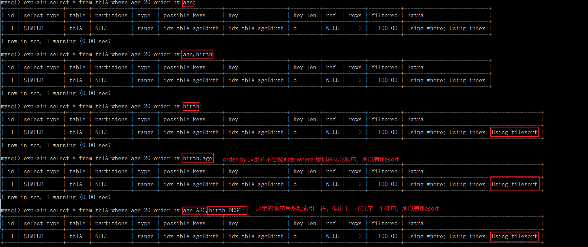

# 小表驱动大表

优化原则：小表驱动大表，即小的数据集驱动大的数据集。

```sql
select * from A where id in (select id from B);
-- 外层循环：select id from B
-- 内层循环：select * from A where A.id=B.id
```

**当 B 表的数据集必须小于 A 表的数据集时，用`in`优于`exists`**

```sql
select * from A where exits (select id from B where B.id=A.id);
-- 外层循环：select * from A
-- 内层循环：select * from B where B.id=A.id
```

**当 A 表的数据集小于 B 表的数据集时，用`exits`优于`in`**

原理：（注，A 表与 B 表的`id`应建立索引）

- IN 子查询，是**从表计算出来作为已知值**
- EXISTS 子查询是**主表作为已知值**传递给从表

基于小表驱动大表的原则，主表 A 小 就用 EXIST，从表 B 表小 就用 IN

这里主要看能否用到索引，假设主表 A 有 n 条数据，从表 B 有 m 条数据，表 A 和表 B 中的查询字段采用 B+树进行索引，那么两个子查询的执行效率：

使用 in ：log (n)\*m

使用 exists： n\*log (m)

对于 IN 子查询，计算出来的结果作为已知值，就可以使得表 A（n 条数据）可以使用到索引，从而提升检索效率

对于 EXISTS 子查询，外表 A 作为已知值，传递给从表，可以利用从表 B（m 条数据）中的索引，从而提升检索效率。

# order by 优化

在 MySQL 中，支持两种排序方式：FileSort 和 Index 排序，其中 Index 排序的效率更高

- Index 排序：索引可以保证数据的有序性，因此不需要再进行排序。
- FileSort 排序：一般在内存中进行排序，占用 CPU 较多。如果待排结果较大，会产生临时文件 I/O 到磁盘进行排序，效率较低。

SQL 中，可以在 WHERE 子句和 ORDER BY 子句中使用索引，目的是在 WHERE 子句中避免全表扫描，在 ORDER BY 子句避免使用 FileSort 排序。

尽量使用 Index 完成 ORDER BY 排序。如果 WHERE 和 ORDER BY 后面是相同的列就使用单索引列；如果不同就使用联合索引。

`order by` 子句尽量使用 Index 排序，避免使用 filesort 排序！示例：

- 表名：tblA
- 字段：`age`（`int`）、`birth`（TIMESTAMP，非空）
- 索引：`idx_tblA_ageBirth`



如果使用多个索引列来作为排序列，那么只有这些列的排序方式（升/降）相同才不会有`filesort`。

结论：**尽可能在索引列上完成排序，遵守索引键的最佳左前缀法则。**

---

如果排序列不在索引列上，`filesort`有两种算法：双路排序和单路排序。

- 双路排序：MySQL 4.1 之前是使用双路排序，即两次扫描磁盘最终得到数据。

读取行指针和`order by`列，对它们进行排序，然后扫描已排好序的列表，按照列表中的值重新从列表中读取对应的数据输出。也就是从磁盘读取排序字段，在 buffer 进行排序，再从磁盘取其他字段。每取一次数据，就要对磁盘进行两次扫描，由于 I/O 很耗时，所以在 MySQL 4.1 后出现了第二种改进算法。

- 单路排序：从磁盘读取查询需要的所有列，按`order by`列在 buffer 进行排序，然后扫描排列后的列表进行输出。

效率更快，避免了第二次读取数据，且把随机 I/O 变成了顺序 I/O，但是会使用更多的空间，因为它把每一行都保存在内存中了。

问题：在`sort_buffer`中，单路要比双路占用更多空间，因为它把所有字段都取出，所以有可能取出的数据总大小超出了`sort_buffer`的容量，导致每次只能取`sort_buffer`容量大小的数据，进行排序（创建 tmp 文件，多路合并），排序完成后再取`sort_buffer`容量大小，再排......从而多次 I/O。原本想省一次 I/O 操作，反而导致了大量的 I/O 操作，得不偿失。

---

- 提高`order by`的速度，有三点建议：
1. 不要用`select *`，只查询需要的字段

当查询的字段大小总和小于`max_length_for_sort_data`，且排序字段不是`TEXT`或`BLOB`类型时，会用单路排序，否则使用多路排序；

两种算法的数据都有可能超过`sort_buffer_size`容量，超过后，会创建 tmp 文件进行合并排序，导致多次 I/O，但使用单路排序的风险更大，所以要提高`sort_buffer_size`。

2. 尝试提高`sort_buffer_size`

不管使用那种算法，提高这个参数都会提高效率，当然，要根据系统的能力来提高，因为这个参数是针对每个线程的。

3. 尝试提高`max_length_for_sort_data`

提高这个参数，会增加用改进算法的概率，但是如果设的太高，数据总容量超出`sort_buffer_size`的概率就增大，明显症状是高的磁盘 I/O 活动和低的处理器使用率。

# group by 优化

`group by` 实质是先排序后进行分组，遵照索引建的最佳左前缀；

当无法使用索引列，增大`max_length_for_sort_data`参数的设置 + 增大`sort_buffer_size`参数的设置；

`where`高于`having`，能在`where`限定的条件就不要去`having`限定。

# join 语句优化

- 尽可能减少`join`语句中的 NestedLoop（嵌套循环）的循环总次数（不要`join`过多或嵌套），永远使用小结果集驱动大结果集；
- 优先优化 NestedLoop 的内层循环；
- 保证`join`语句中被驱动表上`join`条件字段已经被索引；
- 当无法保证被驱动表的`join`条件字段被索引且内存资源充足的前提下，不要太吝啬 joinBuffer 的设置。

# LIMIT

约束返回结果的数量可以减少数据表的网络传输量，也可以提升查询效率。

如果可以确定结果集只有一条，那么加上 `LIMIT 1` 的时候，当找到一条结果的时候就不会继续扫描了，这样也会加快查询速度。

这里指的查询优化针对的是会扫描全表的 SQL 语句，如果数据表已经对字段建立了唯一索引，那么可以通过索引进行查询，不会全表扫描的话，就不需要加上 `LIMIT 1` 了。
