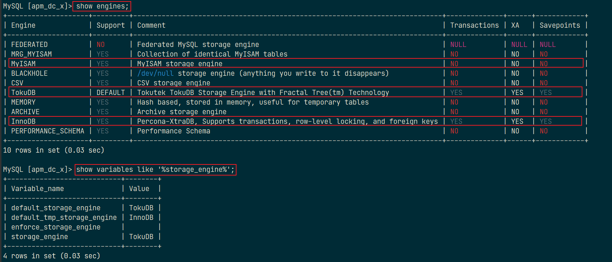

极客时间[《MySQL实战45讲》](https://time.geekbang.org/column/intro/139)笔记！

CentOS 7 下 MySQL 的 YUM 安装方式：可以查看：[官方文档](https://dev.mysql.com/doc/mysql-yum-repo-quick-guide/en/)

通过 `select version();` 查询 MySQL 的版本；`show variables like 'character%'`查看字符集

MySQL 是典型的 C/S（Client/Server）架构，服务端程序使用的 mysqld。基本架构示意图：


- Server 层：涵盖 MySQL 的大多数核心服务功能及所有内置函数，所有跨存储引擎的功能都在这一层实现，如存储过程、触发器、视图等；
- 存储引擎层：负责数据存储和提取。MySQL 的存储引擎采用插件形式！
  - InnoDB：MySQL 5.5 后默认的存储引擎，最大的特点是支持事务、行级锁定、外键约束等；
  - MyISAM：MySQL 5.5 之前的默认存储引擎，不支持事务，也不支持外键，最大的特点是速度快，占用资源少；
  - Memory：使用系统内存作为存储介质，以便得到更快的响应速度。
    - 如果 mysqld 进程崩溃，则会导致所有的数据丢失，因此只有当数据是临时的情况下才使用 Memory 存储引擎
  - NDB：也叫 NDB Cluster，主要用于 MySQL Cluster 分布式集群环境，类似于 Oracle 的 RAC 集群
  - Archive：有很好的压缩机制，用于文件归档，在请求写入时会进行压缩，所以经常用来做仓库

注意：数据库的设计在于表的设计，而 MySQL 中每个表的设计都可以采用不同的存储引擎！

# InnoDB 和 MyISAM

MySQL 中存储引擎的主要作用是负责数据的存储和提取，MySQL 的默认存储引擎 InnoDB 使用的是 B+ 树来存储数据。

MySQL 中用的最多的存储引擎：`innodb`、`myisam`、`memory` 等。其中`innodb`支持事务，而`myisam`、`memory`等不支持事务。

```sql
-- 查看MySQL所支持的的存储引擎
show engines;
-- 查看MySQL当前默认的存储引擎
show variables like '%storage_engine%';
```



主要的两种存储引擎的区别：

|        | MyISAM                                                       | InnoDB                                                       |
| ------ | ------------------------------------------------------------ | ------------------------------------------------------------ |
| 主外键 | 不支持                                                       | 支持                                                         |
| 事务   | 不支持                                                       | 支持                                                         |
| 行表锁 | 表锁<br>即使操作一条记录也会锁住整个表。<br>不适合高并发操作。 | 行锁。<br>操作时只锁住某一行，不对其它行有影响。<br/>**适合高并发操作**。 |
| 缓存   | 只缓存索引，不缓存真实数据                                   | 同时缓存索引、真实数据，对内存要求较高，<br>且内存大小对性能有决定性影响 |
| 表空间 | 小                                                           | 大                                                           |
| 关注点 | 性能                                                         | 事务                                                         |
| 日志   | redo log 和 binlog                                           | binlog                                                       |

InnoDB 存储引擎还有个“自适应 Hash 索引”的功能，就是当某个索引值使用非常频繁的时候，它会在 B+ 树索引的基础上再创建一个 Hash 索引，这样让 B+ 树也具备了 Hash 索引的优点。

InnoDB 三大关键特性：插入缓冲（Insert Buffer）、二次写(Double Write)、自适应 Hash。


在 MySQL 数据表设计中，一般有这么一个原则：如果存在大字段数据，而且它一般不变，应该将不变的字段单独放入另外一个表中。


MySQL 的配置文件：Windows 中是 my.ini；Linux 中是`/etc/my.cnf`，主要的配置：

- 二进制日志 log-bin：主要用于主从复制。
- 错误日志 log-error：默认关闭，记录严重的警告和错误信息，每次启动和关闭的详细信息等。
- 查询日志 log：默认关闭，记录查询的 sql 语句，如果开启会降低 mysql 的整体性能，因为记录日志也需要消耗系统资源。
- 数据文件：
  - .frm 文件：存放表结构
  - .myd 文件：存放表数据
  - .myi 文件：存放表索引

注意：mysqld 是服务端程序；mysql 是命令行客户端程序。

# 数据导入/出

## 导出

- into outfile 导出：

在 my.ini 文件中设置`secure-file-priv=""`，就可以将导出文件放置在任意位置。

```sql
select * from user
	into outfile '/tmp/user.csv' -- 指定导出目录和文件名(该文件必须是不存在的)
	fields terminated by ','  -- 定义字段间的分隔符
	optionally enclosed by '"'  -- 定义包围字段的字符（数值型字段无效）
	lines terminated by '\r\n'; -- 定义每行的分隔符
```

注意：输出不能是一个已存在的文件，防止文件数据被篡改。

---

- 导出表作为原始数据：

`mysqldump`是 MySQL 用于转存储数据库的实用程序。主要产生一个 SQL 脚本，其中包含从头重新创建数据库所必需的命令 `CREATE TABLE` `INSERT`等。

使用`mysqldump`导出数据需要使用`--tab`选项来指定导出文件指定的目录，该目标必须是可写的。

在 MySQL 的安装目录下的 bin 目录进入命令行（不要进入数据库终端），执行：

```sql
mysqldump -u用户名 -p 数据库 要导出的表 > 文件目录和文件名
-- 如：mysqldump -uroot -p ssm_crud tbl_emp > d:\s.sql
```

如果要导出整个数据库的数据：`mysqldump -u用户名 -p 数据库名 > data.txt`

如果要导出所有数据库：`mysqldump -u用户名 -p --all-databases > data.txt`

## 导入

- mysql 命令导入

```sql
mysql -u用户名 -p < 要导入的数据库数据
-- 如：mysql -uroot -p < s.sql
```

---

- source 命令导入

登录到数据库终端——>创建数据库——>使用该数据库——>输入：`source 文件`。

如：`source d:\s.sql`

---

- load data 命令导入

```sql
load data [local] infile '文件' into table 表名;
-- 使用了 local 关键字，则从客户主机上按路径读取文件
-- 不使用，则文件在服务器上按路径读取文件
```

也可以像`into outfile`命令那样指定分隔符，使用相同：

- `fields terminated by ‘字段间分隔符’`：定义字段间的分隔符
- `lines terminated by ‘行间分隔符’`：定义每行的分隔符

`LOAD DATA`默认情况下是按照数据文件中列的顺序插入数据的，如果数据文件中的列与插入表中的列不一致，则需要指定列的顺序。如，在数据文件中的列顺序是 a,b,c，但在插入表的列顺序为 b,c,a，则数据导入语法如下：

```sql
LOAD DATA LOCAL INFILE 'dump.txt' INTO TABLE mytbl (b, c, a);
```

---

- mysqlimport 命令导入

在 MySQL 的安装目录下的 bin 目录下进入命令行(不用进数据库终端)，执行：

```sql
mysqlimport -u用户名 -p --local 数据库名 文件
```

可使用`--column`选项设置列的顺序，如：

```shell
mysqlimport -u root -p --local --columns=b,c,a database_name dump.txt
```
