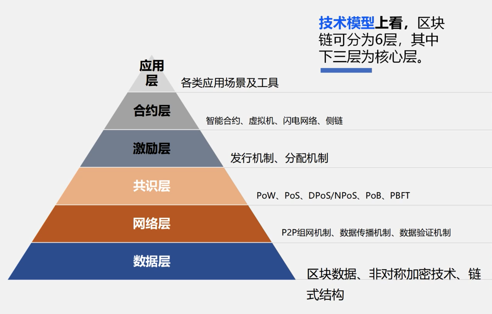

区块链的分层模型：

# 哈希

TODO 补充？

# Merkle tree

Merkle Tree 是一颗哈希树，树的每个节点存储的是 hash 值，可以是二叉树也可以是多叉树。

- 防篡改：树中任意节点发生改变，都会导致根节点的改变
- 存在性证明：可以使用少量数据快速证明一个节点的存在性
  - 如，证明 N1 存在，则只需提供 N0、N5，他人就可以通过计算快速验证 N1 的存在

Merkle Tree 常用于分布式系统，可用于验证计算机之间存储，处理和传输的任何类型数据，确保在 P2P 网络中收到的数据块没有被破坏或者篡改，甚至有没有发送假数据块。

如，在 P2P 网络传输中，文件被分割成大量小数据块，客户端会同时从其它 P2P 客户机下载数据块，由于网络中不稳定性和不可信的存在，需要对每个数据块进行完整性验证，当其中某块数据损坏时，只重传某块数据而不用重新下载整个文件。为了完成数据块的验证，在文件下载前先获取所有数据块的 Hash 列表，再将所有 Hash 列表进行 Hash 得到一个根 Hash，将客户端计算的根 Hash 与可信根 Hash 比较来验证 Hash 列表的完整性。

TODO https://zhuanlan.zhihu.com/p/62892887

# 区块链的结构

区块链中的每个区块包含两部分：

- 区块头，主要存储参数信息（上一个区块的区块 hash、版本号、时间戳、Merkle 根、难度值、nonce）
- 区块体，通过 Merkle 树的结构存储交易信息

# 共识

在区块链的 P2P 网络中的每个节点都可以产生区块，那哪个节点产生的区块可以被系统接受，也就是说如何分配记帐权或达成共识？拜占庭将军问题。

区块链系统是一个分布式系统，而分布式系统的首要问题就是一致性的保障！

> 一致性：指分布式系统中多个副本对外呈现的数据的状态。

- 强一致性（Strong Consistency）

线性一致性（Linearizability Consistency），通常需要依赖一个全局的时钟，要求特别高。

> 要求整个系统所有节点上所有线程的同一类操作必须保证进行全局唯一排序。

顺序一致性（Sequential Consistency）

> 请求在单个处理器（或线程）上的执行顺序与请求顺序相同，而在不同处理器上的执行顺序不要求。

- 弱一致性（Weak Consistency）

最终一致性（Eventual Consistency）

## CAP 理论

分布式系统通常要求：

- 一致性（Consistency），在分布式系统中的所有数据备份，在同一时刻是否同样的值（等同于所有节点访问同一份最新的数据副本）；
- 可用性（Availability），在集群中一部分节点故障后，集群整体是否还能响应客户端的读写请求（对数据更新具备高可用性）；
- 分区容错性（Partition tolerance），以实际效果而言，分区相当于对通信的时限要求。系统如果不能在时限内达成数据一致性，就意味着发生了分区的情况。

FLP 不可能原理：在**异步**环境中，不存在可以解决一致性问题的确定性算法。

> 同步的环境中是可以达成共识的。

CAP 理论：一个分布式系统不可能同时满足 Consistency、Availability、Partition tolerance 三个需求，最多只能同时较好的满足两个！

由于当前的网络硬件肯定会出现延迟丢包等问题，所以分区容错性是必须实现的！！

> DLS 理论
> - 在一个部分同步网络的模型（也就是说：网络延时有界限但是我们并不知道在哪里）下运行的协议可以容忍1/3任意（换句话说，拜占庭）错误；
> - 在一个异步模型中的确定性的协议（没有网络延时上限）不能容错（不过这个论文没有提起随机化算法可以容忍1/3的错误）；
> - 同步模型中的协议（网络延时可以保证小于已知d时间）可以，令人吃惊的，达到100%容错，虽然对1/2的节点出错可以发生的情况有所限制。

## 共识机制

- BFT 类共识（确定性算法），无法支持大规模节点，复杂度会很高，更适用于联盟链

PBFT(Practical Byzantine Fault Tolerance, 实用拜占庭容错)

- POX 类共识（概率性算法），更适用于公链

PoW(Proof of Work, 工作量证明)

PoS(Proof of Stake, 权益证明)

DPoS(Delegated Proof of Stake, 委托权益证明)

PoC/PoS(Proof of Capacity / Storage, 容量/存储证明)

### 无利害攻击

在 PoS 共识机制中存在一个较为普遍的问题——无利害攻击。

PoS 验证着可以选择同时在两条链上进行投票，不论最后哪条链成为“最长链”胜出，验证节点都可以获得区块奖励，而随着时间推移，这种无成本为多条链出块的投票行为会助长区块链分叉行为。

ETH 2.0 的基于 PoS 的 [Casper 共识机制](./02-ethereum.md#casper-共识)可以有效规避这一问题。
