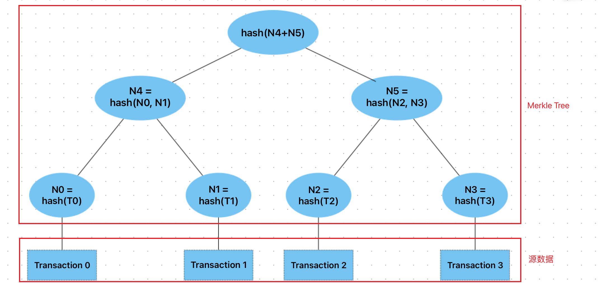

Blockchain 由四层（四部分）组成，从下往上：

- Consensus Layer 共识层
    - public append-only data struct

> Persistence: once added, data can never be removed。通过副本来实现的可持久性
> Consensus: all honest participants have the same data。网络中所有诚实的参与者对相同的数据持有一致的意见，即同意链上的数据
> Liveness: honest participants can add new transactions。总是可以向链上写入新的数据
> Open: anyone can add data

- Compute Layer (blockchain computer，指虚拟机，如 EVM)
    - Computer Layer 允许我们在共识层上运行应用程序
- Applications (DAPPs, smart contracts)
- User Facing Tools (cloud servers)

# 哈希

TODO 补充？

# Merkle tree

Merkle Tree 是一颗哈希树，树的每个节点存储的是 hash 值，可以是二叉树也可以是多叉树。

- 防篡改：树中任意节点发生改变，都会导致根节点的改变
- 存在性证明：可以使用少量数据快速证明一个节点的存在性
  - 如，证明 N1 存在，则只需提供 N0、N5，他人就可以通过计算快速验证 N1 的存在

Merkle Tree 常用于分布式系统，可用于验证计算机之间存储，处理和传输的任何类型数据，确保在 P2P 网络中收到的数据块没有被破坏或者篡改，甚至有没有发送假数据块。

如，在 P2P 网络传输中，文件被分割成大量小数据块，客户端会同时从其它 P2P 客户机下载数据块，由于网络中不稳定性和不可信的存在，需要对每个数据块进行完整性验证，当其中某块数据损坏时，只重传某块数据而不用重新下载整个文件。为了完成数据块的验证，在文件下载前先获取所有数据块的 Hash 列表，再将所有 Hash 列表进行 Hash 得到一个根 Hash，将客户端计算的根 Hash 与可信根 Hash 比较来验证 Hash 列表的完整性。

TODO https://zhuanlan.zhihu.com/p/62892887
